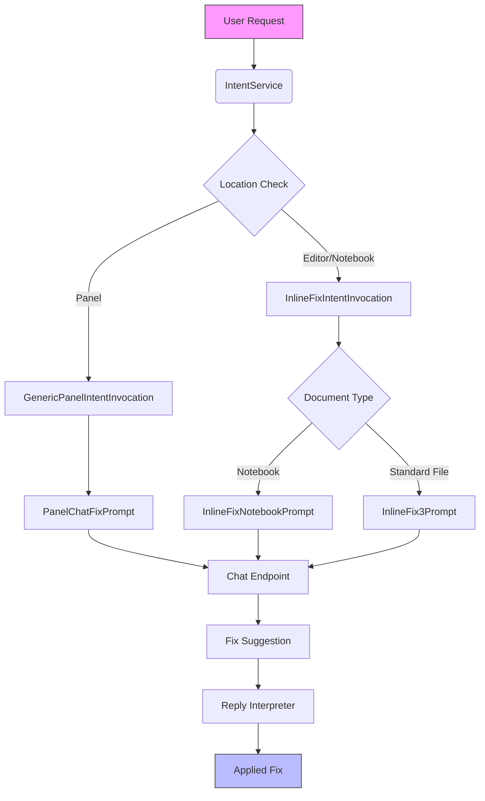
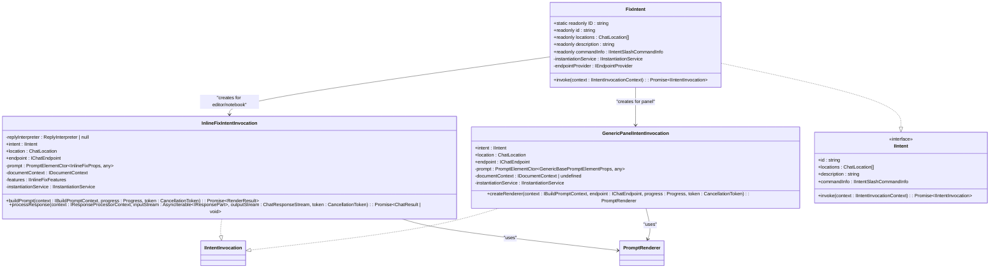
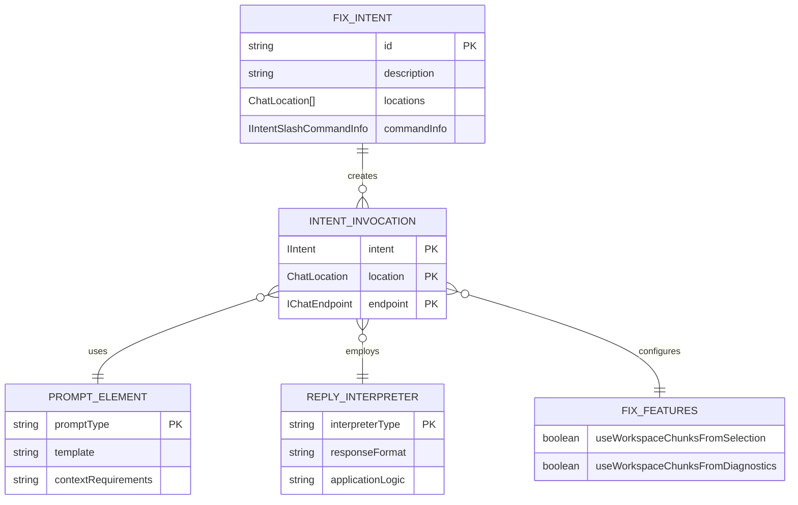
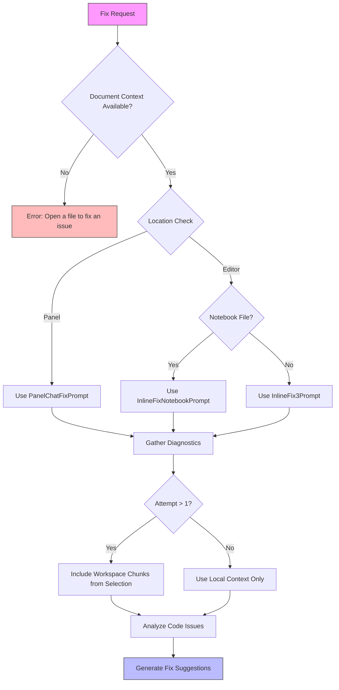
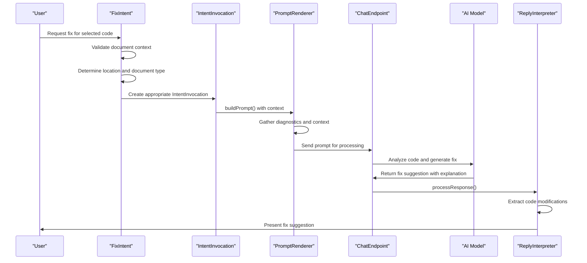
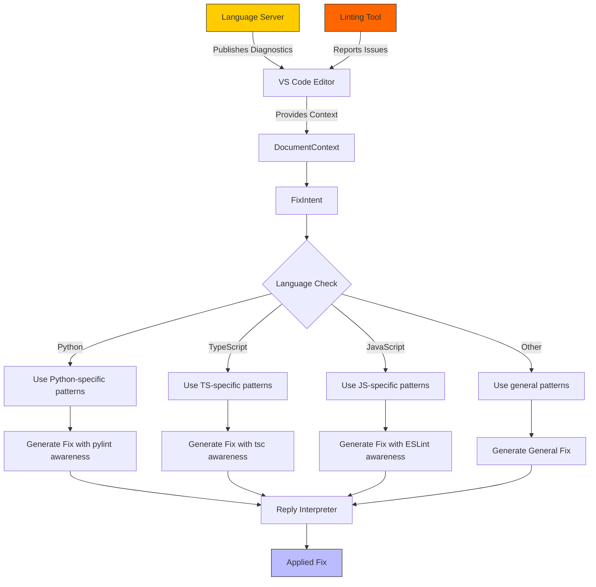
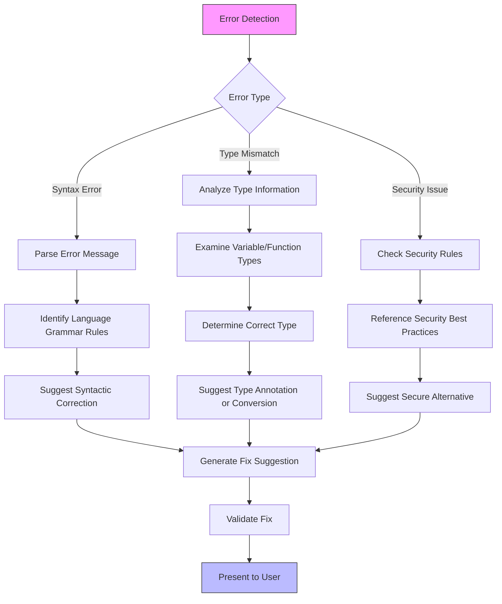
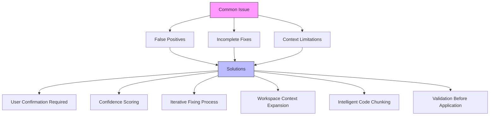

# Fix Code Intent

<cite>
**Referenced Files in This Document**   
- [fixIntent.ts](file://src/extension/intents/node/fixIntent.ts)
- [intentService.ts](file://src/extension/intents/node/intentService.ts)
- [inlineFixIntentInvocation.ts](file://src/extension/context/node/resolvers/inlineFixIntentInvocation.ts)
- [genericPanelIntentInvocation.ts](file://src/extension/context/node/resolvers/genericPanelIntentInvocation.ts)
- [inlineChatFix3Prompt.tsx](file://src/extension/prompts/node/inline/inlineChatFix3Prompt.tsx)
- [inlineChatNotebookFixPrompt.tsx](file://src/extension/prompts/node/inline/inlineChatNotebookFixPrompt.tsx)
- [panelChatFixPrompt.tsx](file://src/extension/prompts/node/panel/panelChatFixPrompt.tsx)
- [test-scenario-fix-python](file://test/scenarios/test-scenario-fix-python)
- [test-scenario-fix-typescript](file://test/scenarios/test-scenario-fix-typescript)
</cite>

## Table of Contents
1. [Introduction](#introduction)
2. [Architecture Overview](#architecture-overview)
3. [Core Components](#core-components)
4. [Domain Model for Fix Operations](#domain-model-for-fix-operations)
5. [Diagnostic Information Collection and Analysis](#diagnostic-information-collection-and-analysis)
6. [Fix Suggestion Generation Process](#fix-suggestion-generation-process)
7. [Invocation Relationship Between Intent Service and FixIntent Module](#invocation-relationship-between-intent-service-and-fixintent-module)
8. [Integration with Language Servers and Linting Tools](#integration-with-language-servers-and-linting-tools)
9. [Error Type Handling Examples](#error-type-handling-examples)
10. [Common Issues and Solutions](#common-issues-and-solutions)
11. [Conclusion](#conclusion)

## Introduction

The Fix Code Intent in GitHub Copilot Chat provides intelligent code correction capabilities by analyzing code issues and generating appropriate fixes. This system integrates with various development tools to detect problems such as syntax errors, type mismatches, and security vulnerabilities, then transforms diagnostic information into actionable fix suggestions. The implementation follows a modular architecture that separates intent handling, context resolution, and prompt generation to provide a flexible and extensible code repair system.

**Section sources**
- [fixIntent.ts](file://src/extension/intents/node/fixIntent.ts#L1-L64)
- [intentService.ts](file://src/extension/intents/node/intentService.ts#L1-L58)

## Architecture Overview

The Fix Code Intent architecture consists of several interconnected components that work together to provide code correction capabilities. The system follows a service-oriented design pattern where the IntentService manages available intents, including the FixIntent, and routes requests based on context and location.



**Diagram sources**
- [fixIntent.ts](file://src/extension/intents/node/fixIntent.ts#L22-L64)
- [intentService.ts](file://src/extension/intents/node/intentService.ts#L24-L57)
- [inlineFixIntentInvocation.ts](file://src/extension/context/node/resolvers/inlineFixIntentInvocation.ts#L19-L54)

## Core Components

The Fix Code Intent system comprises several core components that work together to provide code correction functionality. The FixIntent class serves as the main entry point, implementing the IIntent interface and defining the behavior for code fixing operations. This component determines the appropriate invocation strategy based on the chat location (editor, panel, or notebook) and creates the corresponding intent invocation object.

The InlineFixIntentInvocation and GenericPanelIntentInvocation classes handle the specific requirements for inline and panel-based fix operations respectively. These invocation classes manage the prompt rendering process and response interpretation, ensuring that fix suggestions are properly formatted and can be applied to the codebase.



**Diagram sources**
- [fixIntent.ts](file://src/extension/intents/node/fixIntent.ts#L22-L64)
- [inlineFixIntentInvocation.ts](file://src/extension/context/node/resolvers/inlineFixIntentInvocation.ts#L19-L54)
- [genericPanelIntentInvocation.ts](file://src/extension/context/node/resolvers/genericPanelIntentInvocation.ts#L24-L49)

**Section sources**
- [fixIntent.ts](file://src/extension/intents/node/fixIntent.ts#L22-L64)
- [inlineFixIntentInvocation.ts](file://src/extension/context/node/resolvers/inlineFixIntentInvocation.ts#L19-L66)
- [genericPanelIntentInvocation.ts](file://src/extension/context/node/resolvers/genericPanelIntentInvocation.ts#L24-L49)

## Domain Model for Fix Operations

The domain model for fix operations defines the structure and relationships between key entities involved in the code correction process. This model includes problem patterns, solution templates, and verification steps that guide the fix generation process.



**Diagram sources**
- [fixIntent.ts](file://src/extension/intents/node/fixIntent.ts#L22-L64)
- [inlineFixIntentInvocation.ts](file://src/extension/context/node/resolvers/inlineFixIntentInvocation.ts#L56-L65)
- [genericPanelIntentInvocation.ts](file://src/extension/context/node/resolvers/genericPanelIntentInvocation.ts#L19-L49)

## Diagnostic Information Collection and Analysis

The Fix Code Intent system collects diagnostic information from multiple sources to identify code issues. When a user requests a fix, the system first validates that a document context exists, ensuring there is code to analyze. The diagnostic collection process varies based on the chat location and document type.

For editor-based fixes, the system leverages the document context to extract relevant code segments and associated diagnostics. The InlineFix3Prompt and InlineFixNotebookPrompt components are responsible for gathering syntax, type, and linting information from the current file and surrounding context. These prompts can access language server diagnostics, compiler errors, and linter warnings to build a comprehensive understanding of the code issues.

The system also considers workspace-level context when generating fixes, particularly on retry attempts. The useWorkspaceChunksFromSelection flag enables the system to incorporate related code from the same file or workspace when attempting to resolve complex issues that span multiple code sections.



**Diagram sources**
- [fixIntent.ts](file://src/extension/intents/node/fixIntent.ts#L36-L63)
- [inlineFixIntentInvocation.ts](file://src/extension/context/node/resolvers/inlineFixIntentInvocation.ts#L33-L45)

## Fix Suggestion Generation Process

The fix suggestion generation process follows a structured workflow that transforms diagnostic information into actionable code corrections. This process begins with prompt construction, where the system creates a context-rich prompt containing the problematic code, relevant diagnostics, and surrounding context.

The prompt renderer processes this information and sends it to the chat endpoint for analysis. The AI model then generates a response that includes both natural language explanations and code modifications. The reply interpreter component parses this response and extracts the fix suggestions in a format that can be applied to the codebase.

For inline fixes, the system prioritizes minimal, targeted changes that address the specific issue while maintaining code style consistency. For panel-based fixes, the system can provide more comprehensive solutions that may involve multiple file changes or architectural improvements.



**Diagram sources**
- [fixIntent.ts](file://src/extension/intents/node/fixIntent.ts#L36-L63)
- [inlineFixIntentInvocation.ts](file://src/extension/context/node/resolvers/inlineFixIntentInvocation.ts#L33-L53)
- [genericPanelIntentInvocation.ts](file://src/extension/context/node/resolvers/genericPanelIntentInvocation.ts#L37-L47)

## Invocation Relationship Between Intent Service and FixIntent Module

The IntentService acts as a registry and factory for all available intents, including the FixIntent. When the system initializes, the IntentService discovers all registered intents through the IntentRegistry and creates instances using the dependency injection framework.

The relationship between IntentService and FixIntent follows a command pattern, where IntentService provides a uniform interface for intent discovery and invocation, while each intent implementation (like FixIntent) encapsulates the specific logic for its functionality.

```mermaid
classDiagram
class IntentService {
-_intents : IIntent[] | null
-_instantiationService : IInstantiationService
+unknownIntent : IIntent
+getIntents(location : ChatLocation) : IIntent[]
+getIntent(id : string, location : ChatLocation) : IIntent | undefined
-_getOrCreateIntents() : IIntent[]
}
class IntentRegistry {
+getIntents() : any[]
}
class IIntent {
<<interface>>
+id : string
+locations : ChatLocation[]
+description : string
+commandInfo : IIntentSlashCommandInfo
+invoke(context : IIntentInvocationContext) : Promise~IIntentInvocation~
}
class FixIntent {
+static readonly ID : string
+id : string
+locations : ChatLocation[]
+description : string
+commandInfo : IIntentSlashCommandInfo
-instantiationService : IInstantiationService
-endpointProvider : IEndpointProvider
+invoke(context : IIntentInvocationContext) : Promise~IIntentInvocation~
}
IntentService --> IntentRegistry : "retrieves intent constructors"
IntentService --> IIntent : "creates instances"
IntentService --> FixIntent : "creates instance"
IntentRegistry ..> FixIntent : "contains reference"
FixIntent ..|> IIntent : "implements"
note right of IntentService
Manages lifecycle of all intents
Provides uniform access interface
Handles dependency injection
end
note right of FixIntent
Specific implementation for code fixing
Determines appropriate invocation strategy
Creates context-specific prompt
end
```

**Diagram sources**
- [intentService.ts](file://src/extension/intents/node/intentService.ts#L24-L57)
- [fixIntent.ts](file://src/extension/intents/node/fixIntent.ts#L22-L64)

**Section sources**
- [intentService.ts](file://src/extension/intents/node/intentService.ts#L24-L57)
- [fixIntent.ts](file://src/extension/intents/node/fixIntent.ts#L22-L64)

## Integration with Language Servers and Linting Tools

The Fix Code Intent system integrates with language servers and linting tools through the document context and diagnostic providers. When a fix request is made, the system accesses the current document's diagnostic information, which includes errors and warnings reported by language servers (such as TypeScript's tsc, Python's pyright, or ESLint for JavaScript).

The integration works by leveraging VS Code's existing language server protocol (LSP) infrastructure. The document context contains information about diagnostics in the current file, including their severity, message, and location. This information is incorporated into the prompt sent to the AI model, allowing it to understand the specific issues that need to be addressed.

For different languages, the system uses specialized prompts that are aware of the common error patterns and idiomatic solutions for that language. For example, when fixing Python code with pylint errors, the prompt includes context about Python-specific best practices and common pylint rule violations.



**Diagram sources**
- [fixIntent.ts](file://src/extension/intents/node/fixIntent.ts#L38-L40)
- [inlineFixIntentInvocation.ts](file://src/extension/context/node/resolvers/inlineFixIntentInvocation.ts#L28-L29)

## Error Type Handling Examples

The Fix Code Intent system handles various types of code issues, each requiring different approaches for detection and resolution. The implementation includes specific handling for syntax errors, type mismatches, and security vulnerabilities.

### Syntax Errors
For syntax errors, the system identifies the problematic code segment and generates corrections that adhere to the language's grammar rules. The fix suggestions focus on correcting missing punctuation, improper keyword usage, or incorrect statement structure.

### Type Mismatches
When addressing type mismatches, the system analyzes the type information from the language server and suggests corrections that maintain type safety. This may involve adding type annotations, modifying function signatures, or adjusting variable declarations.

### Security Vulnerabilities
For security issues, the system leverages security linter rules (such as those from ESLint security plugins) to identify potential vulnerabilities and suggests secure coding practices to mitigate them.



**Diagram sources**
- [test/scenarios/test-scenario-fix-python](file://test/scenarios/test-scenario-fix-python)
- [test/scenarios/test-scenario-fix-typescript](file://test/scenarios/test-scenario-fix-typescript)

**Section sources**
- [fixIntent.ts](file://src/extension/intents/node/fixIntent.ts#L49-L54)
- [inlineFixIntentInvocation.ts](file://src/extension/context/node/resolvers/inlineFixIntentInvocation.ts#L38-L44)

## Common Issues and Solutions

The Fix Code Intent system addresses several common challenges in automated code repair, including false positives, incomplete fixes, and context limitations.

### False Positives
To minimize false positives, the system incorporates confidence scoring and requires explicit user confirmation before applying fixes. The reply interpreter validates that suggested changes are semantically appropriate before presenting them to the user.

### Incomplete Fixes
For complex issues that cannot be fully resolved in a single attempt, the system supports iterative fixing. On subsequent attempts, it can incorporate additional context from the workspace (controlled by the useWorkspaceChunksFromSelection flag) to provide more comprehensive solutions.

### Context Limitations
The system manages context limitations by prioritizing relevant code segments and using intelligent chunking strategies. When workspace context is enabled, it can include related files and functions that may be necessary for a complete fix.



**Diagram sources**
- [fixIntent.ts](file://src/extension/intents/node/fixIntent.ts#L56-L60)
- [inlineFixIntentInvocation.ts](file://src/extension/context/node/resolvers/inlineFixIntentInvocation.ts#L57-L59)

**Section sources**
- [fixIntent.ts](file://src/extension/intents/node/fixIntent.ts#L56-L60)
- [inlineFixIntentInvocation.ts](file://src/extension/context/node/resolvers/inlineFixIntentInvocation.ts#L57-L59)

## Conclusion

The Fix Code Intent implementation in GitHub Copilot Chat provides a sophisticated system for automated code correction that integrates seamlessly with the development environment. By leveraging diagnostic information from language servers and linting tools, the system can identify various types of code issues and generate appropriate fixes.

The architecture follows a modular design with clear separation of concerns between intent handling, context resolution, and prompt generation. The integration with the IntentService allows for flexible extension and management of different intent types, while the specialized invocation classes handle the specific requirements of inline and panel-based fixes.

The system effectively addresses common challenges in automated code repair through iterative fixing, context expansion, and user confirmation mechanisms. By providing both targeted inline fixes and comprehensive panel-based solutions, it supports a wide range of code correction scenarios while maintaining code quality and developer control.