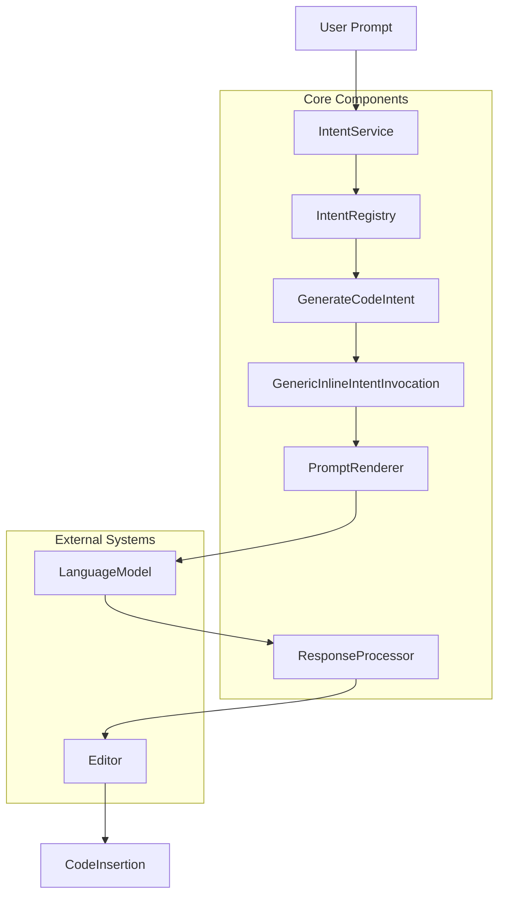
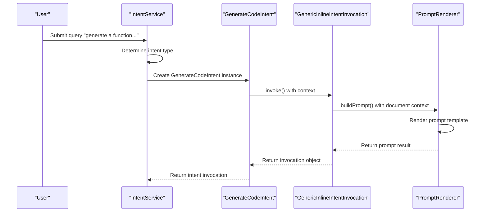
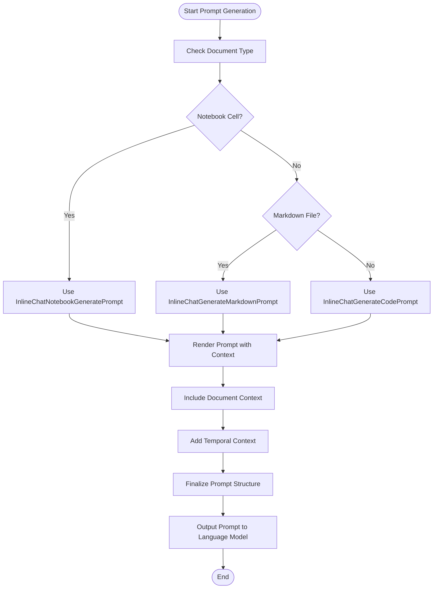
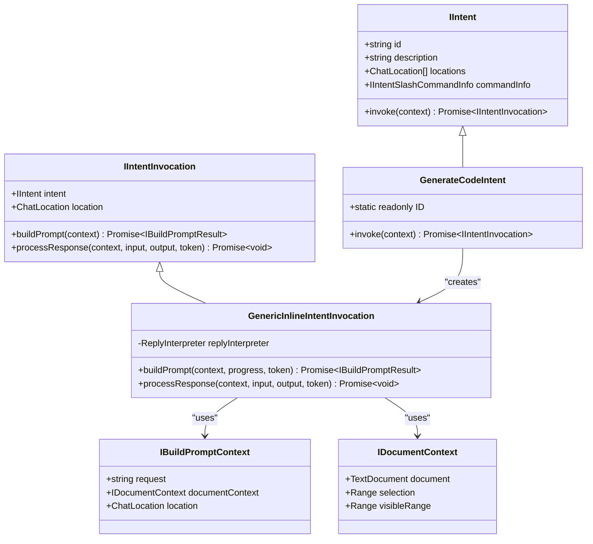

# Generate Code Intent

<cite>
**Referenced Files in This Document**   
- [generateCodeIntent.ts](file://src/extension/intents/node/generateCodeIntent.ts)
- [intentService.ts](file://src/extension/intents/node/intentService.ts)
- [allIntents.ts](file://src/extension/intents/node/allIntents.ts)
- [genericInlineIntentInvocation.ts](file://src/extension/context/node/resolvers/genericInlineIntentInvocation.ts)
- [inlineGenerateCode.stest.ts](file://test/inline/inlineGenerateCode.stest.ts)
- [inlineChatIntent.stest.ts](file://test/intent/inlineChatIntent.stest.ts)
</cite>

## Table of Contents
1. [Introduction](#introduction)
2. [Architecture Overview](#architecture-overview)
3. [Core Components](#core-components)
4. [Intent Invocation Flow](#intent-invocation-flow)
5. [Context Gathering and Prompt Generation](#context-gathering-and-prompt-generation)
6. [Response Processing and Code Insertion](#response-processing-and-code-insertion)
7. [Domain Model for Generation Operations](#domain-model-for-generation-operations)
8. [Common Issues and Solutions](#common-issues-and-solutions)
9. [Conclusion](#conclusion)

## Introduction

The Generate Code Intent in GitHub Copilot Chat enables users to create new code through natural language descriptions. This functionality allows developers to generate functions, classes, and entire code blocks by simply describing what they want to accomplish. The system analyzes user prompts, gathers relevant contextual information from the codebase, and interfaces with language models to produce syntactically correct and contextually appropriate code. This document explains the implementation details of the code generation system, focusing on how user requests are processed, how contextual information is gathered, and how generated code is formatted and inserted into documents. The documentation is designed to be accessible to beginners while providing sufficient technical depth for experienced developers interested in the implementation of context-aware code generation.

## Architecture Overview

The Generate Code Intent system follows a modular architecture that separates concerns between intent detection, context gathering, prompt generation, and response processing. The system is built around a service-oriented design where the IntentService coordinates between various components to fulfill code generation requests.

**Diagram sources**
- [generateCodeIntent.ts](file://src/extension/intents/node/generateCodeIntent.ts)
- [intentService.ts](file://src/extension/intents/node/intentService.ts)
- [genericInlineIntentInvocation.ts](file://src/extension/context/node/resolvers/genericInlineIntentInvocation.ts)

**Section sources**
- [generateCodeIntent.ts](file://src/extension/intents/node/generateCodeIntent.ts)
- [intentService.ts](file://src/extension/intents/node/intentService.ts)

## Core Components

The Generate Code Intent system consists of several core components that work together to process user requests and generate code. The GenerateCodeIntent class is the primary entry point for code generation requests, implementing the IIntent interface and defining the behavior for code generation operations. The IntentService acts as a central coordinator, managing the lifecycle of intents and providing access to registered intent handlers. The GenericInlineIntentInvocation class handles the execution of intent invocations, including prompt generation and response processing. These components work together to create a cohesive system for generating code from natural language descriptions.

The system uses a registry pattern to manage available intents, with the IntentRegistry maintaining a collection of all available intent handlers. This design allows for extensibility and easy addition of new intent types. The GenerateCodeIntent is registered alongside other intents such as EditCodeIntent, FixIntent, and ExplainIntent, creating a comprehensive set of AI-powered coding assistance features.

**Section sources**
- [generateCodeIntent.ts](file://src/extension/intents/node/generateCodeIntent.ts)
- [intentService.ts](file://src/extension/intents/node/intentService.ts)
- [allIntents.ts](file://src/extension/intents/node/allIntents.ts)

## Intent Invocation Flow

The invocation flow for the Generate Code Intent begins when a user submits a natural language request through the chat interface. The IntentService receives the request and determines the appropriate intent handler based on the user's query. For code generation requests, the GenerateCodeIntent handler is selected and instantiated.

The GenerateCodeIntent's invoke method validates that a document context is available and then creates a GenericInlineIntentInvocation instance. This invocation object encapsulates the execution context for the code generation operation, including references to the target document, the selected language model endpoint, and the edit strategy to be used. The invocation flow is designed to be asynchronous, allowing the system to handle long-running operations without blocking the user interface.

**Diagram sources**
- [generateCodeIntent.ts](file://src/extension/intents/node/generateCodeIntent.ts)
- [genericInlineIntentInvocation.ts](file://src/extension/context/node/resolvers/genericInlineIntentInvocation.ts)

**Section sources**
- [generateCodeIntent.ts](file://src/extension/intents/node/generateCodeIntent.ts)
- [genericInlineIntentInvocation.ts](file://src/extension/context/node/resolvers/genericInlineIntentInvocation.ts)

## Context Gathering and Prompt Generation

The context gathering process is a critical component of the code generation system, ensuring that generated code is contextually appropriate and syntactically correct. When a code generation request is initiated, the system collects relevant information from the current document and surrounding codebase. This includes the document's language ID, file path, current selection, and nearby code elements that provide context for the generation operation.

The prompt generation process uses specialized prompt templates that are selected based on the document type and edit strategy. For code files, the InlineChatGenerateCodePrompt template is used, while markdown files use the InlineChatGenerateMarkdownPrompt template. Notebook cells have their own specialized template, InlineChatNotebookGeneratePrompt. These templates structure the information sent to the language model, including system instructions, contextual code snippets, and the user's natural language request.

**Diagram sources**
- [genericInlineIntentInvocation.ts](file://src/extension/context/node/resolvers/genericInlineIntentInvocation.ts)
- [inlineChatGenerateCodePrompt](file://src/prompts/node/inline/inlineChatGenerateCodePrompt)

**Section sources**
- [genericInlineIntentInvocation.ts](file://src/extension/context/node/resolvers/genericInlineIntentInvocation.ts)

## Response Processing and Code Insertion

Once the language model generates a response, the system processes the output and inserts the generated code into the appropriate location in the document. The response processing is handled by a ReplyInterpreter, which is determined during the prompt generation phase and attached to the response metadata. This interpreter is responsible for parsing the model's output, extracting the generated code, and applying it to the document.

The code insertion process follows a specific strategy to ensure that generated code is placed correctly without disrupting existing code. For the GenerateCodeIntent, the EditStrategy.ForceInsertion strategy is used, which ensures that new code is inserted at the specified location rather than replacing existing content. The system carefully handles edge cases such as empty files, ensuring that generated code does not include placeholder markers like "FILEPATH" or "BEGIN"/"END" delimiters.

The insertion process also maintains proper code formatting and indentation, preserving the style of the surrounding code. This is particularly important when generating code in languages with significant whitespace like Python. The system analyzes the surrounding code's indentation pattern and applies it to the generated code to ensure consistency.

**Section sources**
- [genericInlineIntentInvocation.ts](file://src/extension/context/node/resolvers/genericInlineIntentInvocation.ts)
- [inlineGenerateCode.stest.ts](file://test/inline/inlineGenerateCode.stest.ts)

## Domain Model for Generation Operations

The domain model for code generation operations includes several key concepts that define how generation requests are structured and processed. At the core is the IIntent interface, which defines the contract for all intent handlers, including the GenerateCodeIntent. Each intent has an ID, description, and supported locations (such as editor or chat panel).

The generation process uses templates and placeholders to structure the information sent to the language model. These templates include system instructions, contextual code snippets, and the user's natural language request. The system supports multi-file generation through the use of document context, allowing the model to reference code from multiple files when generating new code.

The domain model also includes the concept of temporal context, which tracks the sequence of operations and maintains conversation state. This allows the system to remember previous interactions and generate code that is consistent with earlier requests. For example, if a user first asks to "create a Person class" and then asks to "add a method to calculate age," the system can generate code that properly extends the previously created class.

**Diagram sources**
- [generateCodeIntent.ts](file://src/extension/intents/node/generateCodeIntent.ts)
- [genericInlineIntentInvocation.ts](file://src/extension/context/node/resolvers/genericInlineIntentInvocation.ts)
- [intents.ts](file://src/extension/prompt/node/intents)

**Section sources**
- [generateCodeIntent.ts](file://src/extension/intents/node/generateCodeIntent.ts)
- [genericInlineIntentInvocation.ts](file://src/extension/context/node/resolvers/genericInlineIntentInvocation.ts)
- [intents.ts](file://src/extension/prompt/node/intents)

## Common Issues and Solutions

The Generate Code Intent system addresses several common issues that can arise during code generation. One common problem is irrelevant suggestions, where the language model generates code that doesn't match the user's intent. This is mitigated through careful prompt engineering and context filtering, ensuring that only relevant information is sent to the model.

Context limitations are another challenge, particularly when working with large codebases. The system addresses this by using intelligent context selection algorithms that prioritize the most relevant code snippets based on proximity, usage patterns, and semantic similarity. This ensures that the model receives the most pertinent information without exceeding token limits.

Other issues include:
- **Code duplication**: The system prevents generated code from duplicating existing code by analyzing the surrounding context and ensuring new code is inserted rather than replacing existing content.
- **Syntax errors**: The system validates generated code against the target language's syntax rules and can request corrections from the model if errors are detected.
- **Inconsistent formatting**: The system preserves the formatting style of the surrounding code, including indentation, spacing, and naming conventions.
- **Security vulnerabilities**: The system includes safeguards to prevent the generation of code with known security vulnerabilities.

The test suite includes specific cases to verify that these issues are properly handled, such as tests that confirm generated code doesn't include placeholder markers like "FILEPATH" or "BEGIN"/"END" delimiters.

**Section sources**
- [inlineGenerateCode.stest.ts](file://test/inline/inlineGenerateCode.stest.ts)
- [inlineChatIntent.stest.ts](file://test/intent/inlineChatIntent.stest.ts)

## Conclusion

The Generate Code Intent in GitHub Copilot Chat provides a powerful mechanism for creating new code through natural language descriptions. The system's architecture is designed to be modular and extensible, with clear separation between intent detection, context gathering, prompt generation, and response processing. By leveraging sophisticated context analysis and prompt engineering techniques, the system is able to generate code that is both syntactically correct and contextually appropriate.

The implementation demonstrates several best practices in AI-powered development tools, including careful context management, robust error handling, and user-friendly interaction patterns. The system's ability to maintain conversation state and remember previous interactions enables more sophisticated code generation scenarios, such as building upon previously generated code or maintaining consistency across multiple generation requests.

For developers looking to extend or customize the code generation functionality, the modular design provides clear extension points through the intent registry and prompt template system. This allows for the addition of new intent types, custom prompt templates, and specialized response processors without modifying the core system.