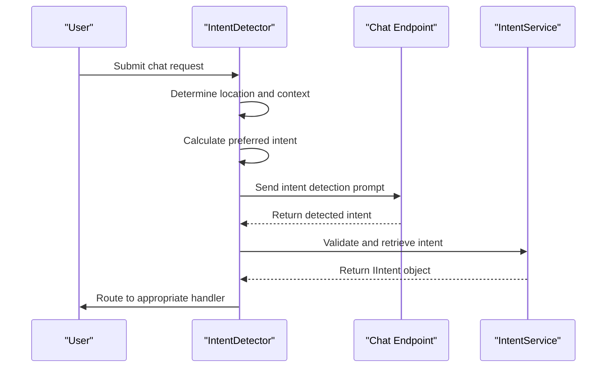
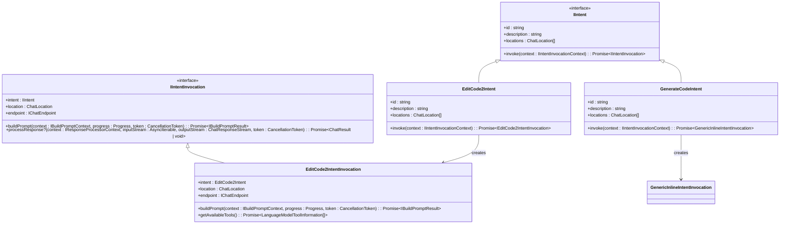
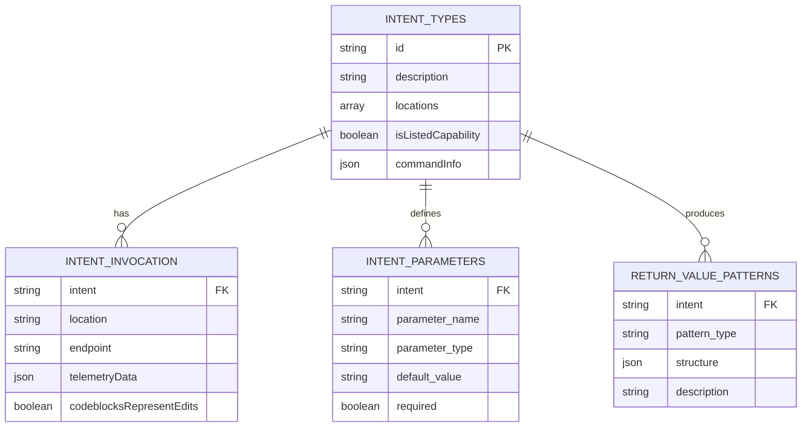
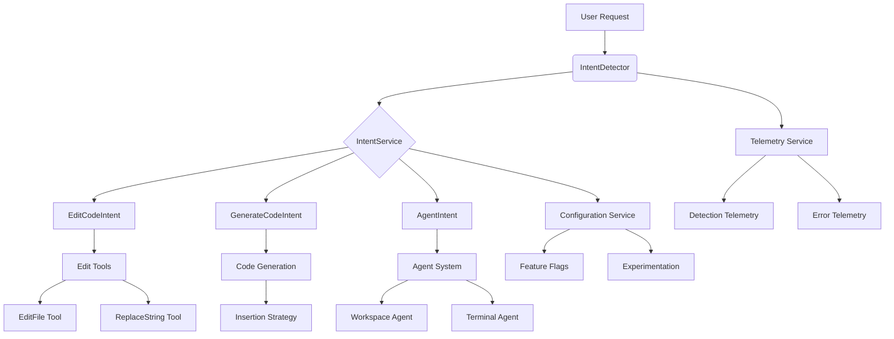

# Intent Handling

<cite>
**Referenced Files in This Document**   
- [intentDetector.tsx](file://src/extension/prompt/node/intentDetector.tsx)
- [intentService.ts](file://src/extension/intents/node/intentService.ts)
- [intentRegistry.ts](file://src/extension/prompt/node/intentRegistry.ts)
- [intents.ts](file://src/extension/prompt/node/intents.ts)
- [constants.ts](file://src/extension/common/constants.ts)
- [editCodeIntent2.ts](file://src/extension/intents/node/editCodeIntent2.ts)
- [generateCodeIntent.ts](file://src/extension/intents/node/generateCodeIntent.ts)
- [agentIntent.ts](file://src/extension/intents/node/agentIntent.ts)
- [toolCallingLoop.ts](file://src/extension/intents/node/toolCallingLoop.ts)
</cite>

## Table of Contents
1. [Introduction](#introduction)
2. [Intent Recognition System](#intent-recognition-system)
3. [Intent Routing and Execution](#intent-routing-and-execution)
4. [Domain Model for Intents](#domain-model-for-intents)
5. [Configuration and Parameters](#configuration-and-parameters)
6. [Component Relationships](#component-relationships)
7. [Common Issues and Solutions](#common-issues-and-solutions)
8. [Conclusion](#conclusion)

## Introduction
The Intent Handling system in GitHub Copilot Chat is responsible for understanding user requests, classifying them into specific intent types, and routing them to appropriate handlers for execution. This system enables natural language understanding capabilities that allow users to interact with code through conversational interfaces. The implementation combines machine learning models with rule-based systems to accurately detect user intentions across various contexts including inline chat, panel chat, and terminal interactions.

**Section sources**
- [intentDetector.tsx](file://src/extension/prompt/node/intentDetector.tsx#L40-L471)
- [constants.ts](file://src/extension/common/constants.ts#L8-L35)

## Intent Recognition System

The Intent Recognition system in GitHub Copilot Chat employs a multi-layered approach to accurately classify user requests. At its core is the IntentDetector class, which implements the ChatParticipantDetectionProvider interface to integrate with Visual Studio Code's chat system. The detection process begins when a user submits a request through the chat interface, triggering the provideParticipantDetection method.

The system uses different detection strategies based on context. For inline chat (editor location) and panel chat locations, it employs specialized prompts to guide the language model's classification. The detection process considers several factors including the current document context, selection state, conversation history, and available chat participants. A key feature is the preferred intent mechanism, which provides hints to the model based on heuristics such as empty selections indicating code generation requests or multi-line selections suggesting edit operations.

The actual intent detection occurs through a structured prompt that presents the model with available functions and their descriptions, along with examples of matching questions. This approach ensures consistent classification by constraining the model's response to predefined intent categories. The system also handles special cases like legacy commands (e.g., /fixTestFailure redirecting to /fix) and dynamically adjusts available intents based on context such as notebook environments.

**Diagram sources **
- [intentDetector.tsx](file://src/extension/prompt/node/intentDetector.tsx#L53-L247)
- [intentService.ts](file://src/extension/intents/node/intentService.ts#L24-L57)

**Section sources**
- [intentDetector.tsx](file://src/extension/prompt/node/intentDetector.tsx#L53-L247)
- [intentService.ts](file://src/extension/intents/node/intentService.ts#L24-L57)

## Intent Routing and Execution

Once an intent is recognized, the system routes it to the appropriate execution handler through a well-defined invocation chain. Each intent type implements the IIntent interface, which defines the contract for intent execution through the invoke method. This method returns an IIntentInvocation object that encapsulates the execution context, including the buildPrompt and processResponse methods for handling the full request lifecycle.

For code modification requests, the editCodeIntent2.ts implementation demonstrates the execution pattern. When a user requests code edits, the EditCode2Intent class creates an EditCode2IntentInvocation that configures the appropriate tools (EditFile, ReplaceString, MultiReplaceString) based on model capabilities. The system evaluates the endpoint's supported features and enables the most efficient editing tools available, ensuring optimal performance across different language models.

The generateCodeIntent.ts implementation shows a simpler execution pattern for code generation requests. This intent is restricted to the editor location and uses the GenericInlineIntentInvocation with ForceInsertion edit strategy. The execution flow validates that a document context exists before proceeding, ensuring that code generation requests are only processed when a valid file is open.

**Diagram sources **
- [editCodeIntent2.ts](file://src/extension/intents/node/editCodeIntent2.ts#L63-L124)
- [generateCodeIntent.ts](file://src/extension/intents/node/generateCodeIntent.ts#L16-L39)
- [intents.ts](file://src/extension/prompt/node/intents.ts#L54-L209)

**Section sources**
- [editCodeIntent2.ts](file://src/extension/intents/node/editCodeIntent2.ts#L63-L124)
- [generateCodeIntent.ts](file://src/extension/intents/node/generateCodeIntent.ts#L16-L39)

## Domain Model for Intents

The domain model for intents in GitHub Copilot Chat is built around several key components that define the structure and behavior of intent handling. The core is the IIntent interface, which represents a user intention and defines its properties and execution contract. Each intent has a unique identifier, description, supported locations (panel, editor, or both), and optional command information for slash command integration.

The Intent enum in constants.ts defines all available intent types, including Explain, Review, Tests, Fix, New, Edit, Generate, and others. These intents are organized hierarchically through the agentsToCommands mapping, which associates higher-level agents (like Workspace or Editor) with their available commands. This structure enables context-aware routing where certain intents are only available in specific locations.

The IIntentInvocation interface extends the execution model by defining the prompt building and response processing lifecycle. It includes methods for building the prompt context, processing streaming responses, and handling tool availability. The invocation model supports advanced features like streaming edits through the StreamingEditsController, which processes code blocks incrementally and applies edits in real-time.

Configuration options are exposed through the IIntentSlashCommandInfo interface, allowing intents to specify whether they should be hidden from users, allow empty arguments, or have default enablement states. This flexibility enables fine-grained control over intent availability and behavior based on user preferences and experimental features.

**Diagram sources **
- [constants.ts](file://src/extension/common/constants.ts#L8-L35)
- [intents.ts](file://src/extension/prompt/node/intents.ts#L54-L209)
- [intentRegistry.ts](file://src/extension/prompt/node/intentRegistry.ts#L11-L17)

**Section sources**
- [constants.ts](file://src/extension/common/constants.ts#L8-L35)
- [intents.ts](file://src/extension/prompt/node/intents.ts#L54-L209)

## Configuration and Parameters

The Intent Handling system provides extensive configuration options to control intent availability and behavior. Configuration is managed through the IConfigurationService and accessed via ConfigKey constants. Key configuration options include chat.detectParticipant.enabled to enable or disable intent detection globally, and chat.agent.maxRequests to limit the maximum number of tool call iterations.

Each intent type supports specific parameters that modify its behavior. For example, the Edit2 intent supports processCodeblocks configuration to control whether code blocks should be processed as edits, while agent intents support temperature settings through ConfigKey.Internal.AgentTemperature. The system also supports experimental features through experimentationService, allowing controlled rollout of new intent behaviors.

Return value patterns vary by intent type but generally follow a consistent structure. Most intents return either a ChatResult object or void, with streaming intents using the ChatResponseStream to progressively deliver content. The system handles errors through the IntentError class, which wraps standard error objects with additional errorDetails for proper UI presentation.

Parameters for different intent types are validated and processed according to their specific requirements. For instance, code modification intents validate document context before execution, while generation intents check for empty selections. The system also supports confirmation workflows through acceptedConfirmationData and rejectedConfirmationData parameters, enabling multi-step interactions with user verification.

**Section sources**
- [intentDetector.tsx](file://src/extension/prompt/node/intentDetector.tsx#L46-L47)
- [editCodeIntent2.ts](file://src/extension/intents/node/editCodeIntent2.ts#L72-L85)
- [agentIntent.ts](file://src/extension/intents/node/agentIntent.ts#L185-L194)

## Component Relationships

The Intent Handling system integrates closely with several other components in the GitHub Copilot architecture. The most significant relationship is with the agent system, where intents trigger specific agents based on the detected intention. For example, the Edit intent triggers the editor agent, while workspace-related intents activate the workspace agent. This agent-intent mapping is defined in the agentsToCommands object and enables context-specific functionality.

The system heavily utilizes tools for implementation, particularly through the IToolsService interface. Different intents enable specific tool sets based on their requirements. Code modification intents use editing tools like EditFile, ReplaceString, and ApplyPatch, while testing intents leverage RunTests and related tools. The tool selection process considers model capabilities, with advanced models enabling more sophisticated editing tools.

The IntentService acts as a central registry and factory for all intents, working with the IntentRegistry to manage intent lifecycle. The registry uses SyncDescriptor objects to lazily instantiate intents, improving startup performance. This service-oriented architecture allows for dependency injection through the IInstantiationService, enabling proper initialization of intent dependencies like endpoint providers and configuration services.

Integration with telemetry systems provides comprehensive monitoring of intent detection and execution. The system sends detailed telemetry events for both successful detections and errors, including internal telemetry with conversation context for debugging ambiguous cases. This telemetry helps improve the machine learning models used for intent classification over time.

**Diagram sources **
- [agentIntent.ts](file://src/extension/intents/node/agentIntent.ts#L128-L386)
- [intentService.ts](file://src/extension/intents/node/intentService.ts#L24-L57)
- [intentRegistry.ts](file://src/extension/prompt/node/intentRegistry.ts#L19-L28)

**Section sources**
- [agentIntent.ts](file://src/extension/intents/node/agentIntent.ts#L128-L386)
- [intentService.ts](file://src/extension/intents/node/intentService.ts#L24-L57)

## Common Issues and Solutions

The Intent Handling system addresses several common challenges in natural language understanding and intent classification. One major issue is intent ambiguity, where user requests could match multiple intent types. The system mitigates this through context-aware detection, using document context, selection state, and conversation history to disambiguate requests. For example, an empty selection on a whitespace line triggers code generation rather than editing, even if the user says "edit this."

Context switching between different chat locations (panel vs. editor) is handled through location-specific intent filtering. The system maintains separate intent registries for different locations and applies location constraints during intent retrieval. This ensures that editor-specific intents like code generation are not available in the panel chat, while maintaining consistency in core functionality.

The system handles edge cases through comprehensive validation and fallback mechanisms. When intent detection fails or returns an unknown intent, the system falls back to the default participant or applies heuristics based on command prefixes. Error handling is standardized through the IntentError class, which provides structured error details for proper UI presentation.

Performance considerations include budget management for prompt token limits, with the system implementing truncation and summarization strategies when conversation history exceeds token thresholds. The detection process is optimized through caching and lazy initialization of intent services, ensuring responsive user interactions even with complex intent registries.

**Section sources**
- [intentDetector.tsx](file://src/extension/prompt/node/intentDetector.tsx#L330-L342)
- [intentService.ts](file://src/extension/intents/node/intentService.ts#L54-L56)
- [toolCallingLoop.ts](file://src/extension/intents/node/toolCallingLoop.ts)

## Conclusion

The Intent Handling system in GitHub Copilot Chat provides a robust framework for natural language understanding and intent classification. By combining machine learning models with rule-based systems and context-aware heuristics, it delivers accurate intent detection across various usage scenarios. The modular architecture with clear separation between intent recognition, routing, and execution enables extensibility while maintaining reliability.

Key strengths of the system include its context-aware detection, comprehensive configuration options, and tight integration with agents and tools. The domain model provides a flexible foundation for defining new intents and extending existing functionality. Through detailed telemetry and error handling, the system supports continuous improvement and reliable user experiences.

For developers, the system offers a well-documented interface for creating custom intents and integrating with the broader Copilot ecosystem. The combination of TypeScript interfaces, dependency injection, and service-oriented design makes it accessible to both beginners and experienced developers looking to extend the platform's capabilities.