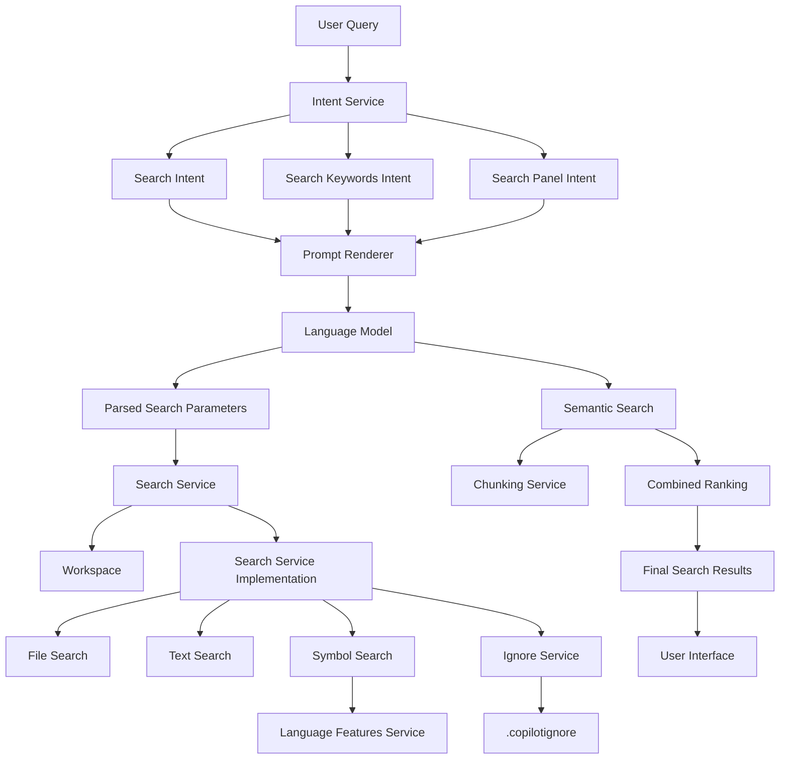
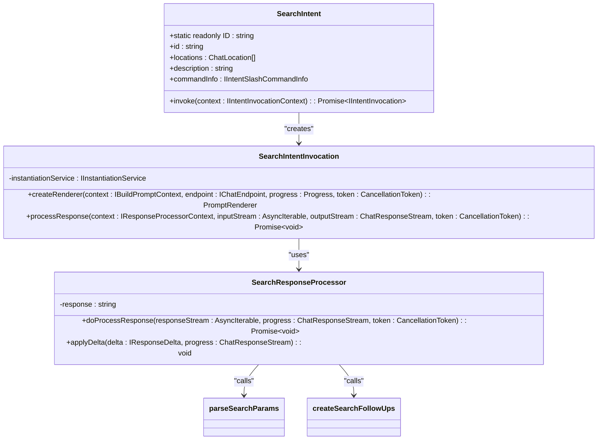
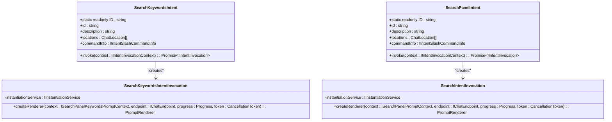
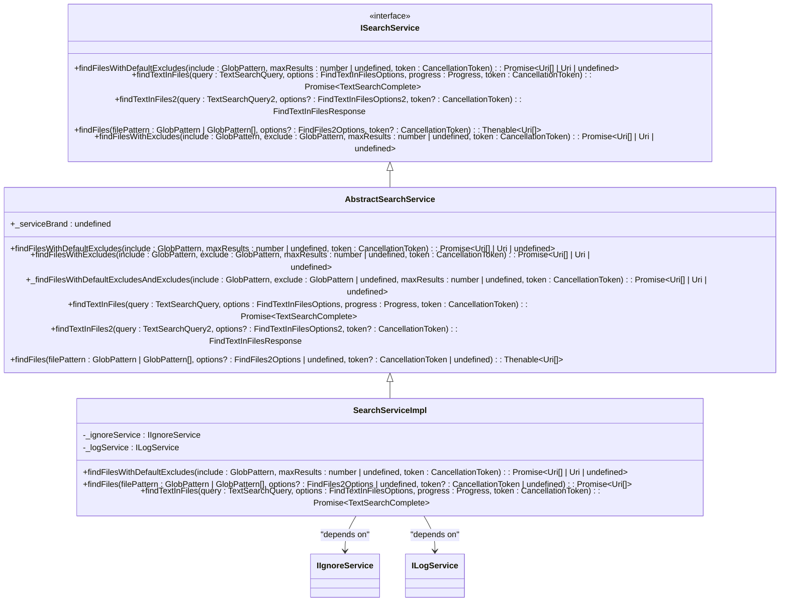
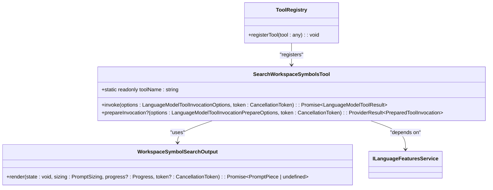
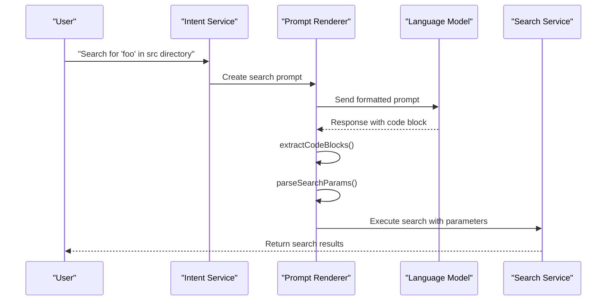
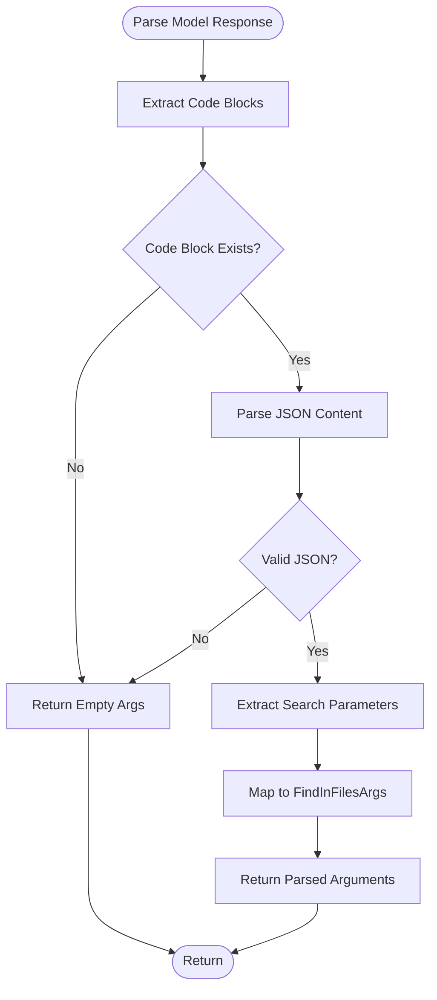
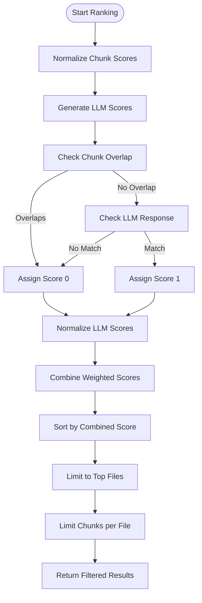

# Search Intent

<cite>
**Referenced Files in This Document**   
- [searchIntent.ts](file://src/extension/intents/node/searchIntent.ts)
- [searchKeywordsIntent.ts](file://src/extension/intents/node/searchKeywordsIntent.ts)
- [searchPanelIntent.ts](file://src/extension/intents/node/searchPanelIntent.ts)
- [searchService.ts](file://src/platform/search/common/searchService.ts)
- [searchServiceImpl.ts](file://src/platform/search/vscode-node/searchServiceImpl.ts)
- [searchWorkspaceSymbolsTool.tsx](file://src/extension/tools/node/searchWorkspaceSymbolsTool.tsx)
- [combinedRank.ts](file://src/extension/workspaceSemanticSearch/node/combinedRank.ts)
- [semanticSearchTextSearchProvider.ts](file://src/extension/workspaceSemanticSearch/node/semanticSearchTextSearchProvider.ts)
</cite>

## Table of Contents
1. [Introduction](#introduction)
2. [Core Components](#core-components)
3. [Architecture Overview](#architecture-overview)
4. [Detailed Component Analysis](#detailed-component-analysis)
5. [Search Query Processing](#search-query-processing)
6. [Result Ranking and Presentation](#result-ranking-and-presentation)
7. [Performance Considerations](#performance-considerations)
8. [Troubleshooting Guide](#troubleshooting-guide)
9. [Conclusion](#conclusion)

## Introduction
This document provides a comprehensive analysis of the Search Intent functionality in GitHub Copilot Chat, focusing on how natural language queries are transformed into search operations across the workspace. The system enables developers to search code through conversational interfaces by parsing user queries, invoking appropriate search services, and presenting results in an accessible format. The implementation integrates with VS Code's search infrastructure while adding intelligent processing through language models and semantic analysis.

## Core Components
The Search Intent system consists of multiple interconnected components that handle different aspects of the search functionality. These include intent handlers for different search types, search services that interface with the workspace, and tools that provide symbol-based search capabilities. The architecture follows a modular design where each component has a specific responsibility in the search pipeline.

**Section sources**
- [searchIntent.ts](file://src/extension/intents/node/searchIntent.ts#L1-L168)
- [searchKeywordsIntent.ts](file://src/extension/intents/node/searchKeywordsIntent.ts#L1-L62)
- [searchPanelIntent.ts](file://src/extension/intents/node/searchPanelIntent.ts#L1-L62)

## Architecture Overview



**Diagram sources **
- [searchIntent.ts](file://src/extension/intents/node/searchIntent.ts#L1-L168)
- [searchService.ts](file://src/platform/search/common/searchService.ts#L1-L57)
- [searchServiceImpl.ts](file://src/platform/search/vscode-node/searchServiceImpl.ts#L1-L70)
- [combinedRank.ts](file://src/extension/workspaceSemanticSearch/node/combinedRank.ts#L1-L103)

## Detailed Component Analysis

### Search Intent Implementation
The Search Intent component handles workspace search queries by parsing natural language input and generating appropriate search parameters. It uses a structured approach where user queries are transformed into JSON parameters that can be consumed by the search service.



**Diagram sources **
- [searchIntent.ts](file://src/extension/intents/node/searchIntent.ts#L1-L168)

**Section sources**
- [searchIntent.ts](file://src/extension/intents/node/searchIntent.ts#L1-L168)

### Search Keywords and Panel Intents
The search functionality is divided into specialized intent types that handle different search scenarios. The SearchKeywordsIntent focuses on keyword-based code search, while the SearchPanelIntent provides broader workspace search capabilities.



**Diagram sources **
- [searchKeywordsIntent.ts](file://src/extension/intents/node/searchKeywordsIntent.ts#L1-L62)
- [searchPanelIntent.ts](file://src/extension/intents/node/searchPanelIntent.ts#L1-L62)

**Section sources**
- [searchKeywordsIntent.ts](file://src/extension/intents/node/searchKeywordsIntent.ts#L1-L62)
- [searchPanelIntent.ts](file://src/extension/intents/node/searchPanelIntent.ts#L1-L62)

### Search Service Architecture
The search service provides a unified interface for performing various types of searches across the workspace. It abstracts the underlying VS Code search capabilities while adding additional filtering and processing logic.



**Diagram sources **
- [searchService.ts](file://src/platform/search/common/searchService.ts#L1-L57)
- [searchServiceImpl.ts](file://src/platform/search/vscode-node/searchServiceImpl.ts#L1-L70)

**Section sources**
- [searchService.ts](file://src/platform/search/common/searchService.ts#L1-L57)
- [searchServiceImpl.ts](file://src/platform/search/vscode-node/searchServiceImpl.ts#L1-L70)

### Workspace Symbols Search Tool
The workspace symbols search tool enables semantic search for code symbols across the entire workspace. It integrates with the language features service to provide accurate symbol information.



**Diagram sources **
- [searchWorkspaceSymbolsTool.tsx](file://src/extension/tools/node/searchWorkspaceSymbolsTool.tsx#L1-L95)

**Section sources**
- [searchWorkspaceSymbolsTool.tsx](file://src/extension/tools/node/searchWorkspaceSymbolsTool.tsx#L1-L95)

## Search Query Processing

### Query Parsing and Transformation
The search system processes natural language queries by extracting structured parameters from the language model response. The parsing mechanism uses JSON extraction from code blocks in the model output.



**Diagram sources **
- [searchIntent.ts](file://src/extension/intents/node/searchIntent.ts#L57-L73)
- [searchIntent.ts](file://src/extension/intents/node/searchIntent.ts#L114-L137)

**Section sources**
- [searchIntent.ts](file://src/extension/intents/node/searchIntent.ts#L57-L73)

### Search Parameter Handling
The system handles various search parameters including query text, file inclusion/exclusion patterns, and search options like case sensitivity and regular expressions.



**Diagram sources **
- [searchIntent.ts](file://src/extension/intents/node/searchIntent.ts#L57-L73)

## Result Ranking and Presentation

### Combined Ranking Algorithm
The semantic search results are ranked using a combination of vector similarity scores and language model relevance assessments. The combined ranking algorithm normalizes and weights different scoring factors.

```mermaid
classDiagram
class combinedRanking {
+combinedRanking(chunks : FileChunkAndScore[], llmResponse : IRankResult[], topFiles : number, topChunks : number) : FileChunkAndScore[]
+combineRankingInsights(chunks : FileChunkAndScore[], llmResponse : IRankResult[]) : { llmBestRank : number; llmWorstRank : number }
}
class normalizeScores {
+normalizeScores(scores : number[]) : number[]
}
class combineScores {
+combineScores(chunkScores : number[], llmScores : number[], chunkWeight : number, llmWeight : number) : number[]
}
combinedRanking --> normalizeScores : "uses"
combinedRanking --> combineScores : "uses"
```

**Diagram sources **
- [combinedRank.ts](file://src/extension/workspaceSemanticSearch/node/combinedRank.ts#L1-L103)

**Section sources**
- [combinedRank.ts](file://src/extension/workspaceSemanticSearch/node/combinedRank.ts#L1-L103)

### Result Filtering and Deduplication
The ranking system includes sophisticated filtering to prevent duplicate results and ensure diversity across files.



**Diagram sources **
- [combinedRank.ts](file://src/extension/workspaceSemanticSearch/node/combinedRank.ts#L1-L103)

## Performance Considerations
The search implementation includes several performance optimizations to ensure responsive user experience. The system uses asynchronous operations throughout the search pipeline to prevent blocking the UI thread. The search service implementation includes execution time logging to monitor performance characteristics. The ignore service integration prevents unnecessary processing of excluded files, reducing search overhead. For symbol searches, the system limits results to 20 items with appropriate messaging about omitted results to maintain performance while providing useful information.

**Section sources**
- [searchServiceImpl.ts](file://src/platform/search/vscode-node/searchServiceImpl.ts#L36-L37)
- [searchWorkspaceSymbolsTool.tsx](file://src/extension/tools/node/searchWorkspaceSymbolsTool.tsx#L81-L82)

## Troubleshooting Guide
Common issues with search functionality typically relate to configuration, performance, or result relevance. For slow searches, verify that appropriate exclude patterns are configured in .copilotignore files. If search results are irrelevant, check that the query is specific enough and includes relevant context. For missing results, ensure that the search scope includes the appropriate directories and that files are not excluded by pattern matching. The system logs search execution times which can help identify performance bottlenecks. When debugging search issues, examine the parsed search parameters to verify they match the intended query.

**Section sources**
- [searchServiceImpl.ts](file://src/platform/search/vscode-node/searchServiceImpl.ts#L25-L33)
- [searchIntent.ts](file://src/extension/intents/node/searchIntent.ts#L57-L73)

## Conclusion
The Search Intent implementation in GitHub Copilot Chat provides a sophisticated natural language interface to workspace search capabilities. By combining traditional text and symbol search with semantic understanding through language models, the system offers developers an intuitive way to explore codebases. The modular architecture separates concerns between intent handling, query parsing, search execution, and result presentation, enabling maintainable and extensible code. The ranking system intelligently combines multiple relevance signals to deliver high-quality results, while performance optimizations ensure responsive interactions. This implementation demonstrates how AI-powered features can enhance developer productivity by bridging the gap between natural language queries and precise code search operations.