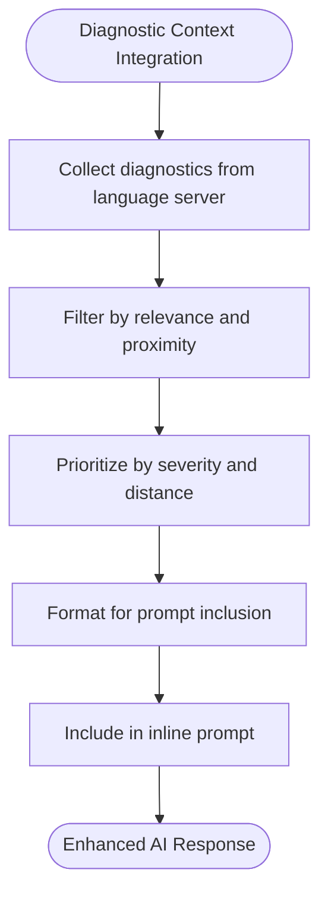
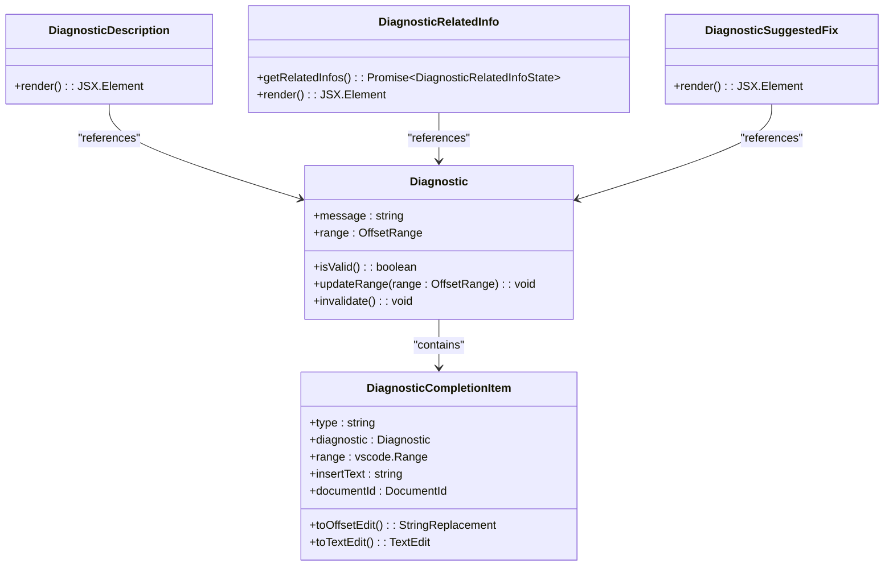
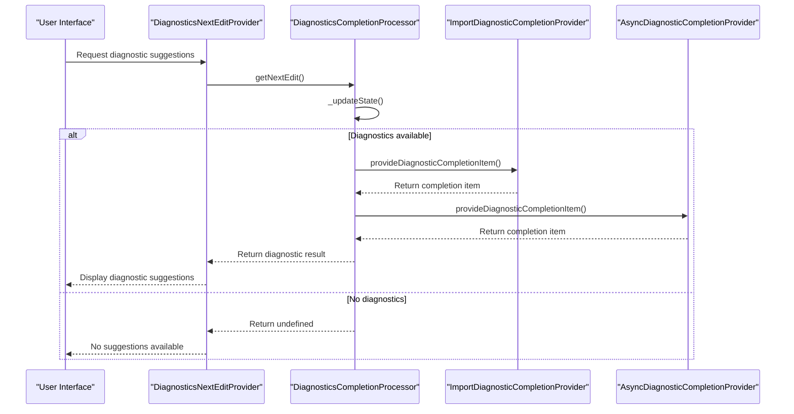
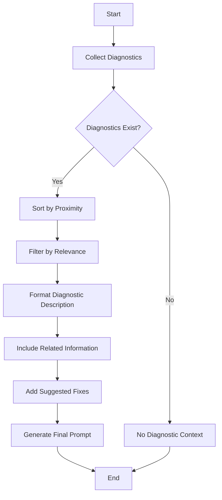
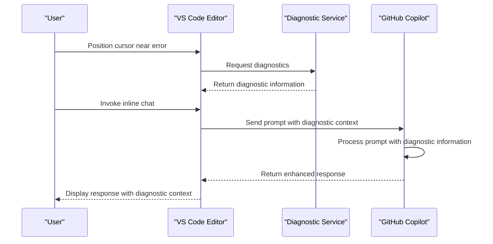

# Diagnostics Context Integration

<cite>
**Referenced Files in This Document**   
- [diagnosticsContext.tsx](file://src/extension/prompts/node/inline/diagnosticsContext.tsx)
- [diagnostics.ts](file://src/extension/completions-core/vscode-node/lib/src/diagnostics.ts)
- [diagnosticsTelemetry.ts](file://src/extension/inlineChat/node/diagnosticsTelemetry.ts)
- [diagnosticsInlineEditProvider.ts](file://src/extension/inlineEdits/vscode-node/features/diagnosticsInlineEditProvider.ts)
- [diagnosticsCompletionProcessor.ts](file://src/extension/inlineEdits/vscode-node/features/diagnosticsCompletionProcessor.ts)
- [diagnosticsCompletions.ts](file://src/extension/inlineEdits/vscode-node/features/diagnosticsBasedCompletions/diagnosticsCompletions.ts)
- [importDiagnosticsCompletionProvider.ts](file://src/extension/inlineEdits/vscode-node/features/diagnosticsBasedCompletions/importDiagnosticsCompletionProvider.ts)
- [fixCookbookService.ts](file://src/extension/prompts/node/inline/fixCookbookService.ts)
</cite>

## Table of Contents
1. [Introduction](#introduction)
2. [Diagnostic Context Implementation](#diagnostic-context-implementation)
3. [Domain Model for Diagnostic Context](#domain-model-for-diagnostic-context)
4. [Diagnostic Services Invocation Relationship](#diagnostic-services-invocation-relationship)
5. [Prompt Enhancement with Diagnostic Information](#prompt-enhancement-with-diagnostic-information)
6. [Error Severity and Conflict Resolution](#error-severity-and-conflict-resolution)
7. [Configuration Options and Parameters](#configuration-options-and-parameters)
8. [Integration with Inline Chat Workflows](#integration-with-inline-chat-workflows)
9. [Common Issues and Solutions](#common-issues-and-solutions)
10. [Conclusion](#conclusion)

## Introduction
The Diagnostics Context Integration in GitHub Copilot Chat enables intelligent incorporation of diagnostic information into inline prompts, enhancing the AI's ability to provide contextually relevant suggestions. This system integrates error context, warning information, and potential conflict awareness directly into the prompt generation process, allowing Copilot to offer more accurate and helpful responses. The implementation leverages language server diagnostics and other diagnostic providers to enrich prompts with relevant error information, prioritizing diagnostic data based on proximity to the cursor and relevance to the current context. This documentation provides a comprehensive overview of the diagnostic context integration architecture, implementation details, and configuration options.

## Diagnostic Context Implementation

The diagnostic context integration is primarily implemented through the `Diagnostics` component in `diagnosticsContext.tsx`, which serves as the core mechanism for incorporating diagnostic information into prompts. This component processes diagnostic data from various sources and formats it for inclusion in AI prompts. The implementation follows a structured approach to diagnostic context enrichment, with specific components handling different aspects of diagnostic information.

The system processes diagnostics through a multi-step pipeline that begins with diagnostic collection, followed by filtering and prioritization, and finally formatting for prompt inclusion. Diagnostics are collected from the language server and other diagnostic providers, then filtered based on relevance and proximity to the cursor position. The implementation includes specific handling for different types of diagnostic information, including error descriptions, related code information, and suggested fixes.

**Diagram sources**
- [diagnosticsContext.tsx](file://src/extension/prompts/node/inline/diagnosticsContext.tsx#L20-L238)

**Section sources**
- [diagnosticsContext.tsx](file://src/extension/prompts/node/inline/diagnosticsContext.tsx#L20-L238)

## Domain Model for Diagnostic Context

The domain model for diagnostic context representation is centered around several key classes and interfaces that define the structure and behavior of diagnostic information. The `Diagnostic` class encapsulates diagnostic data with properties for message, range, and validity status, while the `DiagnosticCompletionItem` class represents actionable diagnostic suggestions that can be applied to code.

The model includes specialized components for different types of diagnostic information. The `DiagnosticDescription` component formats the diagnostic message and affected code for display, while `DiagnosticRelatedInfo` handles related code references and definitions. The `DiagnosticSuggestedFix` component provides suggested fixes based on cookbook patterns, enabling Copilot to offer specific remediation suggestions.

**Diagram sources**
- [diagnosticsContext.tsx](file://src/extension/prompts/node/inline/diagnosticsContext.tsx#L20-L238)
- [diagnosticsCompletions.ts](file://src/extension/inlineEdits/vscode-node/features/diagnosticsBasedCompletions/diagnosticsCompletions.ts#L165-L211)

**Section sources**
- [diagnosticsContext.tsx](file://src/extension/prompts/node/inline/diagnosticsContext.tsx#L20-L238)
- [diagnosticsCompletions.ts](file://src/extension/inlineEdits/vscode-node/features/diagnosticsBasedCompletions/diagnosticsCompletions.ts#L30-L108)

## Diagnostic Services Invocation Relationship

The diagnostic services follow a well-defined invocation relationship that coordinates diagnostic collection, processing, and integration with the prompt system. The `DiagnosticsCompletionProcessor` acts as the central coordinator, managing the lifecycle of diagnostic processing and integrating with various diagnostic providers. This processor subscribes to document changes, selection changes, and diagnostic updates to maintain an up-to-date view of relevant diagnostics.

The invocation flow begins with the `DiagnosticsNextEditProvider`, which requests diagnostic information through the `DiagnosticsCompletionProcessor`. This processor then delegates to specific diagnostic providers based on the language and diagnostic type. The `ImportDiagnosticCompletionProvider` and `AsyncDiagnosticCompletionProvider` handle language-specific diagnostics, while the `AnyDiagnosticCompletionProvider` provides fallback handling for other diagnostic types.

**Diagram sources**
- [diagnosticsInlineEditProvider.ts](file://src/extension/inlineEdits/vscode-node/features/diagnosticsInlineEditProvider.ts#L69-L83)
- [diagnosticsCompletionProcessor.ts](file://src/extension/inlineEdits/vscode-node/features/diagnosticsCompletionProcessor.ts#L261-L287)

**Section sources**
- [diagnosticsInlineEditProvider.ts](file://src/extension/inlineEdits/vscode-node/features/diagnosticsInlineEditProvider.ts#L41-L203)
- [diagnosticsCompletionProcessor.ts](file://src/extension/inlineEdits/vscode-node/features/diagnosticsCompletionProcessor.ts#L148-L704)

## Prompt Enhancement with Diagnostic Information

The prompt enhancement system enriches inline prompts with diagnostic information through the `Diagnostics` component in `diagnosticsContext.tsx`. This component processes diagnostic data and formats it for inclusion in AI prompts, providing context about errors, warnings, and potential fixes. The enhancement process includes several key aspects: diagnostic description, related information, and suggested fixes.

Diagnostic descriptions include the affected code snippet and error message, formatted with appropriate markup for clarity. Related information identifies and includes code that is contextually relevant to the diagnostic, such as definitions or related functions. Suggested fixes are derived from cookbook patterns and provide specific remediation suggestions that Copilot can offer to the user.

The system prioritizes diagnostic information based on proximity to the cursor and relevance to the current context. Diagnostics closer to the cursor position are given higher priority, ensuring that the most relevant information is included in the prompt. The implementation also includes filtering to prevent diagnostic overload, limiting the amount of diagnostic information included in the prompt to maintain clarity and focus.

**Diagram sources**
- [diagnosticsContext.tsx](file://src/extension/prompts/node/inline/diagnosticsContext.tsx#L33-L65)
- [diagnosticsCompletions.ts](file://src/extension/inlineEdits/vscode-node/features/diagnosticsBasedCompletions/diagnosticsCompletions.ts#L251-L276)

**Section sources**
- [diagnosticsContext.tsx](file://src/extension/prompts/node/inline/diagnosticsContext.tsx#L33-L65)
- [diagnosticsCompletions.ts](file://src/extension/inlineEdits/vscode-node/features/diagnosticsBasedCompletions/diagnosticsCompletions.ts#L231-L287)

## Error Severity and Conflict Resolution

The diagnostic context integration handles error severity through a prioritization system that considers both the severity level and proximity to the cursor. While explicit severity levels are not directly exposed in the code, the system implicitly prioritizes more critical diagnostics by processing them first and giving them prominence in the prompt context. The implementation includes specific handling for different types of diagnostics, with import-related diagnostics receiving special treatment due to their common occurrence and straightforward resolution patterns.

Conflict resolution is addressed through the diagnostic rejection system, which tracks previously rejected diagnostic suggestions to prevent repeated recommendations. The `RejectionCollector` maintains a record of rejected diagnostics, ensuring that Copilot does not repeatedly suggest fixes that the user has already dismissed. This system helps prevent suggestion fatigue and improves the overall user experience by learning from user preferences.

The implementation also includes mechanisms to detect and handle merge conflicts through diagnostic analysis. When multiple conflicting changes are detected, the system can identify the conflicting code regions and provide context about the nature of the conflict. This information is then incorporated into the prompt, allowing Copilot to offer more informed suggestions for resolving the conflict.

**Section sources**
- [diagnosticsCompletionProcessor.ts](file://src/extension/inlineEdits/vscode-node/features/diagnosticsCompletionProcessor.ts#L434-L438)
- [importDiagnosticsCompletionProvider.ts](file://src/extension/inlineEdits/vscode-node/features/diagnosticsBasedCompletions/importDiagnosticsCompletionProvider.ts#L276-L285)

## Configuration Options and Parameters

The diagnostic context integration provides several configuration options and parameters that control its behavior and sensitivity. These options allow users to customize how diagnostic information is collected, processed, and presented in prompts. The configuration system is accessed through the `IConfigurationService` interface, which provides observable configuration values that can be monitored for changes.

Key configuration parameters include diagnostic sensitivity settings, which control how aggressively diagnostics are suggested, and context inclusion thresholds, which determine how much diagnostic information is included in prompts. The implementation includes a configuration key `Internal.InlineEditsDiagnosticsExplorationEnabled` that enables or disables diagnostic exploration features.

The system also includes parameters for controlling the display and behavior of diagnostic suggestions. These include settings for diagnostic run telemetry, which collects data about diagnostic suggestion performance, and parameters for controlling the delay before diagnostic suggestions are shown. The configuration options are designed to balance the need for helpful diagnostic information with the potential for distraction or information overload.

**Section sources**
- [diagnosticsCompletionProcessor.ts](file://src/extension/inlineEdits/vscode-node/features/diagnosticsCompletionProcessor.ts#L184-L185)
- [diagnosticsTelemetry.ts](file://src/extension/inlineChat/node/diagnosticsTelemetry.ts#L9-L55)

## Integration with Inline Chat Workflows

The diagnostic context integration is tightly coupled with the inline chat workflows, providing diagnostic information that enhances the AI's understanding of code issues. The integration occurs at multiple levels, from diagnostic collection to prompt generation and suggestion presentation. When a user invokes inline chat, the system automatically includes relevant diagnostic information in the prompt context, allowing Copilot to provide more targeted assistance.

The integration leverages language server diagnostics through the VS Code API, accessing diagnostic information for the current document and selection. This information is then processed and formatted for inclusion in the chat prompt, providing context about errors, warnings, and potential fixes. The system also integrates with the inline edit provider, allowing diagnostic suggestions to be presented as inline completions that can be easily accepted or rejected.

The workflow begins when the user invokes inline chat or positions the cursor near a diagnostic. The system collects relevant diagnostics, processes them for relevance and proximity, and incorporates them into the prompt context. This enriched context enables Copilot to provide more accurate and helpful responses, particularly for error resolution and code improvement suggestions.

**Diagram sources**
- [diagnosticsContext.tsx](file://src/extension/prompts/node/inline/diagnosticsContext.tsx#L43-L65)
- [diagnosticsInlineEditProvider.ts](file://src/extension/inlineEdits/vscode-node/features/diagnosticsInlineEditProvider.ts#L69-L83)

**Section sources**
- [diagnosticsContext.tsx](file://src/extension/prompts/node/inline/diagnosticsContext.tsx#L20-L238)
- [diagnosticsInlineEditProvider.ts](file://src/extension/inlineEdits/vscode-node/features/diagnosticsInlineEditProvider.ts#L41-L203)

## Common Issues and Solutions

The diagnostic context integration addresses several common issues that arise in AI-assisted development environments. One primary challenge is diagnostic overload, where too many diagnostic suggestions can overwhelm the user. The system mitigates this through relevance filtering and prioritization, showing only the most relevant diagnostics based on proximity to the cursor and recent user interactions.

Another common issue is suggestion fatigue, where users become desensitized to repeated diagnostic suggestions. The implementation addresses this through the rejection tracking system, which learns from user behavior and avoids repeating suggestions that have been previously rejected. This system helps maintain the usefulness and relevance of diagnostic suggestions over time.

The system also handles the challenge of diagnostic staleness, where diagnostic information becomes outdated due to code changes. The implementation includes mechanisms to validate diagnostic relevance after code edits, ensuring that suggestions are based on current code state. The `DiagnosticsCollection` class includes methods to apply edits to diagnostic ranges and invalidate diagnostics that are no longer valid.

Performance considerations are addressed through asynchronous processing and throttling. The diagnostic processing is performed in the background with appropriate delays to avoid impacting editor responsiveness. The system uses throttled delayers to batch diagnostic updates, reducing the frequency of expensive operations while maintaining timely feedback.

**Section sources**
- [diagnosticsCompletionProcessor.ts](file://src/extension/inlineEdits/vscode-node/features/diagnosticsCompletionProcessor.ts#L442-L487)
- [diagnosticsCollection.ts](file://src/extension/inlineEdits/vscode-node/features/diagnosticsCompletionProcessor.ts#L57-L140)

## Conclusion
The Diagnostics Context Integration in GitHub Copilot Chat provides a sophisticated system for incorporating diagnostic information into AI-assisted development workflows. By enriching prompts with relevant error context, warning information, and conflict awareness, the system enables Copilot to provide more accurate and helpful suggestions. The implementation leverages a well-structured domain model, coordinated service invocation, and intelligent prompt enhancement to deliver a seamless user experience.

The system's design balances comprehensive diagnostic coverage with user experience considerations, avoiding information overload through relevance filtering and prioritization. Configuration options allow users to customize the behavior to their preferences, while integration with inline chat workflows ensures that diagnostic context is available when needed. The solution to common issues like diagnostic overload and suggestion fatigue demonstrates thoughtful consideration of real-world usage patterns.

Overall, the diagnostic context integration represents a significant advancement in AI-assisted development, bridging the gap between static code analysis and intelligent code assistance. By providing contextually relevant diagnostic information directly in the prompt stream, the system enhances Copilot's ability to understand and address code issues, ultimately improving developer productivity and code quality.