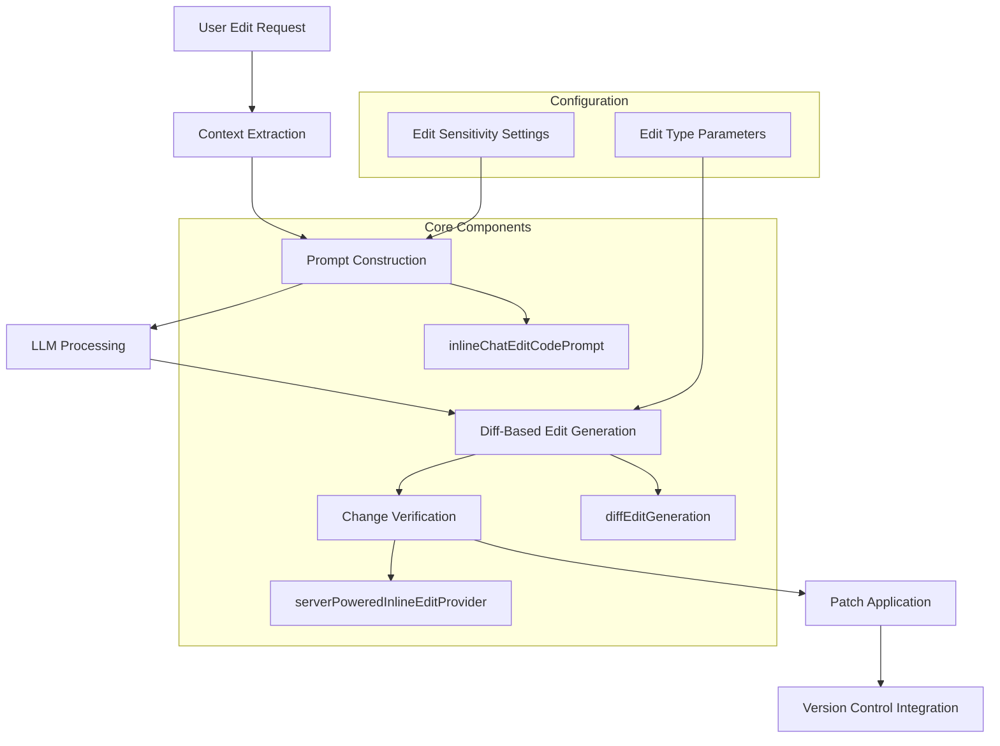
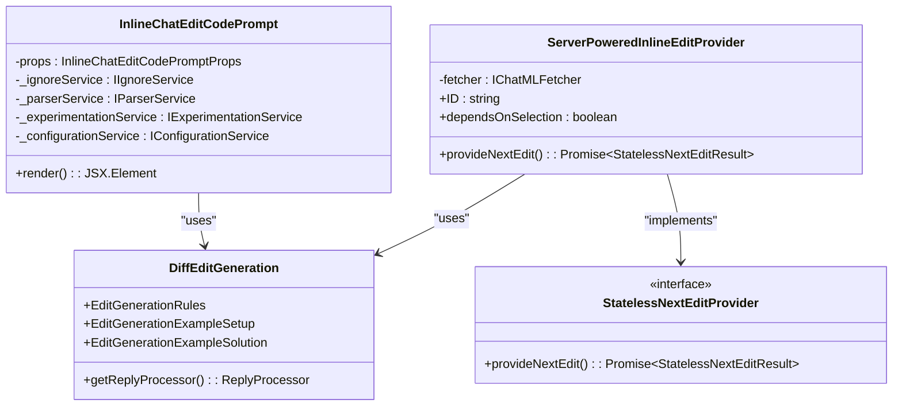
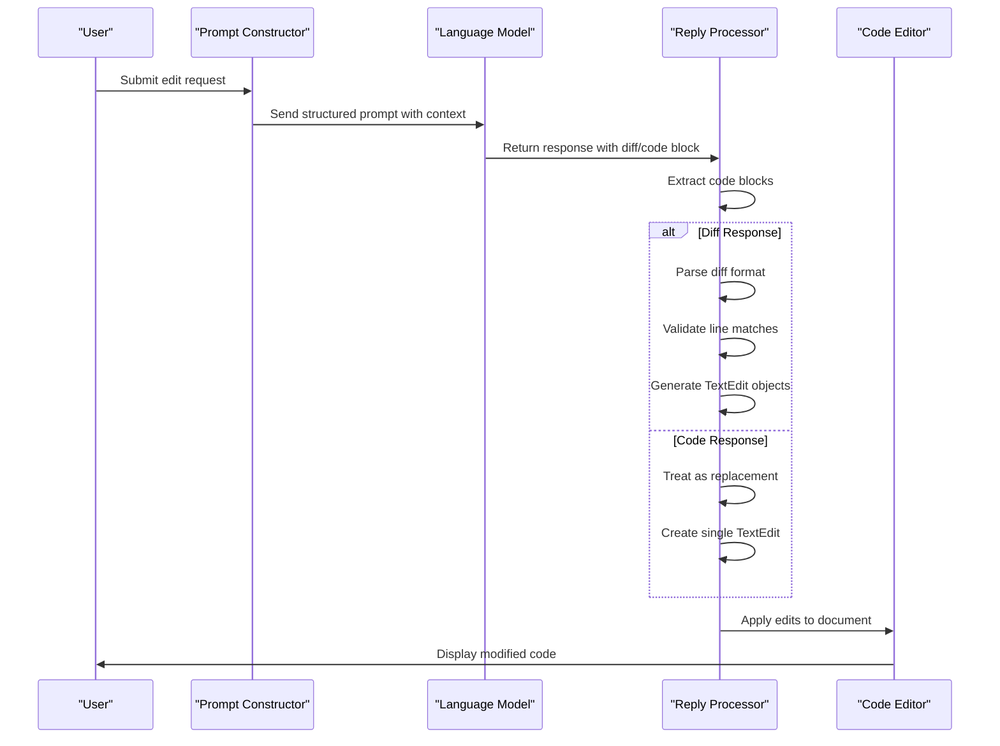
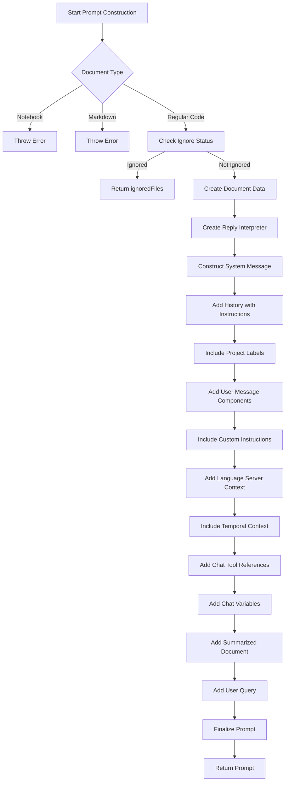
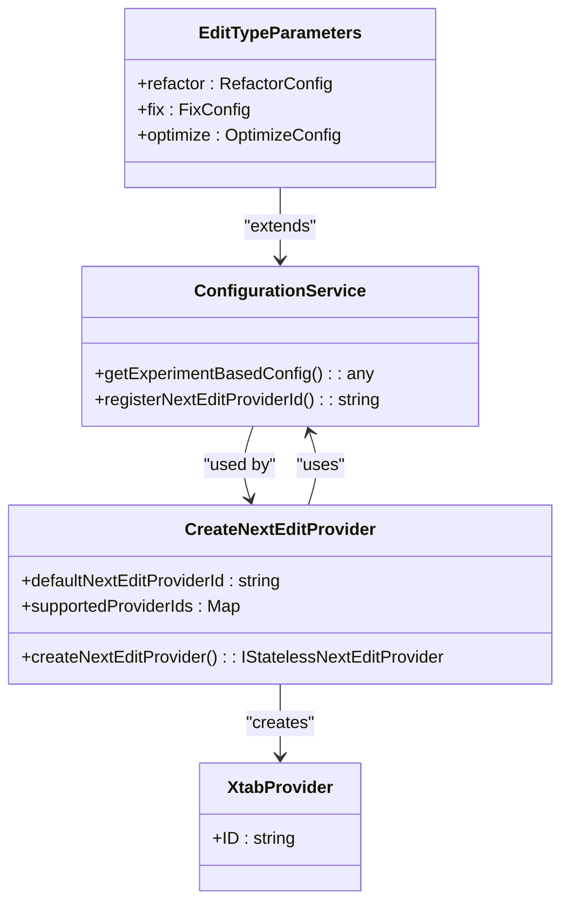
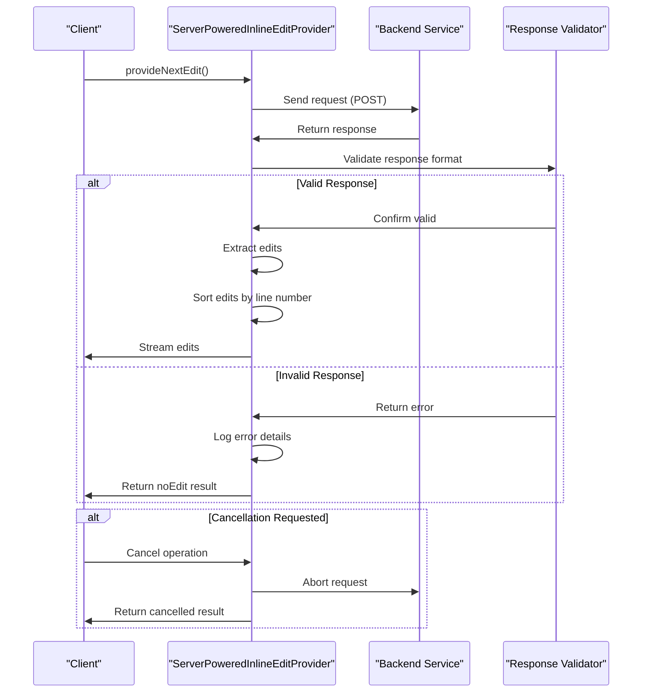
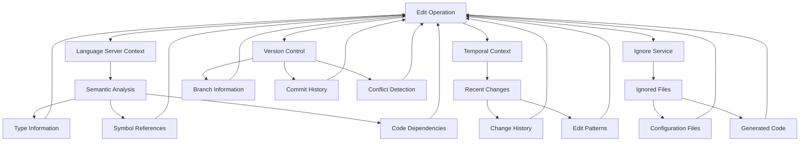

# Edit Code Operations

<cite>
**Referenced Files in This Document**   
- [inlineChatEditCodePrompt.tsx](file://src/extension/prompts/node/inline/inlineChatEditCodePrompt.tsx)
- [diffEditGeneration.tsx](file://src/extension/prompts/node/inline/diffEditGeneration.tsx)
- [edit.ts](file://src/platform/inlineEdits/common/dataTypes/edit.ts)
- [editUtils.ts](file://src/platform/inlineEdits/common/dataTypes/editUtils.ts)
- [serverPoweredInlineEditProvider.ts](file://src/extension/inlineEdits/node/serverPoweredInlineEditProvider.ts)
- [createNextEditProvider.ts](file://src/extension/inlineEdits/node/createNextEditProvider.ts)
- [statelessNextEditProvider.ts](file://src/platform/inlineEdits/common/statelessNextEditProvider.ts)
</cite>

## Table of Contents
1. [Introduction](#introduction)
2. [Architecture Overview](#architecture-overview)
3. [Core Components](#core-components)
4. [Domain Model for Edit Operations](#domain-model-for-edit-operations)
5. [Diff-Based Edit Generation](#diff-based-edit-generation)
6. [Prompt Construction for Code Modifications](#prompt-construction-for-code-modifications)
7. [Configuration Options and Edit Parameters](#configuration-options-and-edit-parameters)
8. [Change Verification and Validation](#change-verification-and-validation)
9. [Integration with Version Control and Code Analysis](#integration-with-version-control-and-code-analysis)
10. [Common Issues and Solutions](#common-issues-and-solutions)
11. [Conclusion](#conclusion)

## Introduction
GitHub Copilot Chat's Edit Code Operations enable developers to perform inline code modifications through natural language requests. This system implements a sophisticated architecture for handling code refactoring, bug fixes, and optimizations directly within the editor context. The implementation combines prompt engineering, diff-based edit generation, and structured response processing to deliver reliable code modifications. This document provides a comprehensive analysis of the edit operations system, explaining how user requests are transformed into precise code changes while maintaining code integrity and context awareness.

## Architecture Overview
The Edit Code Operations architecture follows a modular design with clear separation of concerns between prompt construction, edit generation, and change application. The system processes user edit requests through a pipeline that extracts context, constructs structured prompts, generates diff-based edits, and verifies changes before application.



**Diagram sources**
- [inlineChatEditCodePrompt.tsx](file://src/extension/prompts/node/inline/inlineChatEditCodePrompt.tsx)
- [diffEditGeneration.tsx](file://src/extension/prompts/node/inline/diffEditGeneration.tsx)
- [serverPoweredInlineEditProvider.ts](file://src/extension/inlineEdits/node/serverPoweredInlineEditProvider.ts)

**Section sources**
- [inlineChatEditCodePrompt.tsx](file://src/extension/prompts/node/inline/inlineChatEditCodePrompt.tsx)
- [diffEditGeneration.tsx](file://src/extension/prompts/node/inline/diffEditGeneration.tsx)
- [serverPoweredInlineEditProvider.ts](file://src/extension/inlineEdits/node/serverPoweredInlineEditProvider.ts)

## Core Components

The Edit Code Operations system comprises several core components that work together to process and apply code modifications. The `inlineChatEditCodePrompt.tsx` component is responsible for constructing structured prompts that guide the LLM in generating appropriate code changes. This component integrates context from the current document, selection, and user query to create a comprehensive prompt that includes system instructions, custom instructions, and relevant code context.

The `diffEditGeneration.tsx` component handles the processing of LLM responses and extraction of code changes. It implements rules for diff-based edit generation and provides utilities for parsing and validating the generated diffs. The `serverPoweredInlineEditProvider.ts` component acts as the main entry point for edit operations, coordinating between the frontend and backend services to generate and apply code changes.



**Diagram sources**
- [inlineChatEditCodePrompt.tsx](file://src/extension/prompts/node/inline/inlineChatEditCodePrompt.tsx)
- [diffEditGeneration.tsx](file://src/extension/prompts/node/inline/diffEditGeneration.tsx)
- [serverPoweredInlineEditProvider.ts](file://src/extension/inlineEdits/node/serverPoweredInlineEditProvider.ts)

**Section sources**
- [inlineChatEditCodePrompt.tsx](file://src/extension/prompts/node/inline/inlineChatEditCodePrompt.tsx)
- [diffEditGeneration.tsx](file://src/extension/prompts/node/inline/diffEditGeneration.tsx)
- [serverPoweredInlineEditProvider.ts](file://src/extension/inlineEdits/node/serverPoweredInlineEditProvider.ts)

## Domain Model for Edit Operations

The domain model for edit operations is built around several key concepts that represent code changes and their application. The `RootedEdit` class represents an edit operation with a base state and the edit to be applied, ensuring that changes are always contextualized against a specific code state. This model enables reliable rebase operations when multiple edits are applied sequentially.

The `SingleEdits` and `Edits` classes provide abstractions for sequences of edit operations, allowing for composition and transformation of multiple changes. These classes support operations like composition, swapping, and serialization, which are essential for managing complex edit scenarios. The edit model also includes utilities for calculating edit lengths and normalizing edits to ensure consistency across different representations.

```mermaid
classDiagram
class RootedEdit {
+base : StringText
+edit : TEdit
+getEditedState() : StringText
+rebase(onto : StringEdit) : RootedEdit
+normalize() : RootedEdit
+equals(other : RootedEdit) : boolean
}
class SingleEdits {
+edits : readonly TReplacement[]
+compose() : StringEdit
+apply(value : string) : string
+isEmpty() : boolean
+toEdits() : Edits
}
class Edits {
+edits : readonly T[]
+compose() : T
+add(edit : T) : Edits
+apply(value : string) : string
+isEmpty() : boolean
+swap(editFirst : StringEdit) : { edits : Edits; editLast : StringEdit }
+serialize() : SerializedEdit[]
+deserialize(v : SerializedEdit[]) : Edits
+toHumanReadablePatch(base : StringText) : string
}
class StringEdit {
+replacements : readonly StringReplacement[]
+apply(value : string) : string
+compose(other : StringEdit) : StringEdit
+equals(other : StringEdit) : boolean
}
class StringReplacement {
+replaceRange : OffsetRange
+newText : string
+delta(offset : number) : StringReplacement
}
RootedEdit --> StringEdit : "contains"
SingleEdits --> StringReplacement : "contains"
Edits --> StringEdit : "contains"
StringEdit --> StringReplacement : "contains"
```

**Diagram sources**
- [edit.ts](file://src/platform/inlineEdits/common/dataTypes/edit.ts)
- [editUtils.ts](file://src/platform/inlineEdits/common/dataTypes/editUtils.ts)

**Section sources**
- [edit.ts](file://src/platform/inlineEdits/common/dataTypes/edit.ts)
- [editUtils.ts](file://src/platform/inlineEdits/common/dataTypes/editUtils.ts)

## Diff-Based Edit Generation

The diff-based edit generation system is a critical component of the Edit Code Operations architecture, responsible for translating LLM responses into actionable code changes. The system enforces strict rules for diff format and content, ensuring that generated changes are valid and can be safely applied to the codebase. The `EditGenerationRules` class defines the formatting requirements for diff responses, including the use of tab indentation and exact matching of unchanged lines.

The reply processing pipeline extracts code blocks from the LLM response and parses them according to their language type. For diff responses, the system uses the `createEditsFromPseudoDiff` function to convert the textual diff into structured edit operations. This process includes validation to ensure that the diff accurately represents the changes and that removed lines exactly match the original code. The system also handles non-diff responses by treating them as complete replacements of the selected code.



**Diagram sources**
- [diffEditGeneration.tsx](file://src/extension/prompts/node/inline/diffEditGeneration.tsx)
- [serverPoweredInlineEditProvider.ts](file://src/extension/inlineEdits/node/serverPoweredInlineEditProvider.ts)

**Section sources**
- [diffEditGeneration.tsx](file://src/extension/prompts/node/inline/diffEditGeneration.tsx)
- [serverPoweredInlineEditProvider.ts](file://src/extension/inlineEdits/node/serverPoweredInlineEditProvider.ts)

## Prompt Construction for Code Modifications

The prompt construction system for code modifications is designed to provide the LLM with comprehensive context while guiding it toward generating appropriate responses. The `InlineChatEditCodePrompt` class constructs prompts that include system messages, instruction messages, and user context to ensure consistent and reliable code generation. The system message establishes the AI's identity and expertise, while the instruction message provides specific guidelines for handling code modifications.

The prompt construction process incorporates several contextual elements, including custom instructions, language server context, and temporal context. Custom instructions allow users to personalize the AI's behavior, while language server context provides semantic information about the code. Temporal context helps the AI understand the current state of the codebase and any recent changes. The system also handles special cases, such as ignoring files marked for exclusion and preventing use with notebook documents.



**Diagram sources**
- [inlineChatEditCodePrompt.tsx](file://src/extension/prompts/node/inline/inlineChatEditCodePrompt.tsx)

**Section sources**
- [inlineChatEditCodePrompt.tsx](file://src/extension/prompts/node/inline/inlineChatEditCodePrompt.tsx)

## Configuration Options and Edit Parameters

The Edit Code Operations system provides several configuration options that allow users to customize the behavior of code modifications. These options are managed through the configuration service and can be adjusted based on experimentation and user preferences. The `createNextEditProvider.ts` file defines the supported provider IDs and the default provider, allowing for extensibility and customization of the edit generation process.

Edit sensitivity settings control how aggressively the system proposes changes, with options to balance between conservative and aggressive modifications. Parameters for different edit types (refactor, fix, optimize) allow the system to tailor its approach based on the specific type of modification requested. These parameters influence the prompt construction, diff generation rules, and validation criteria to ensure appropriate behavior for each edit type.

The system also supports experiment-based configuration, allowing new features and behaviors to be tested with specific user groups before wider rollout. This approach enables continuous improvement of the edit operations while minimizing the impact of potential issues on the broader user base.



**Diagram sources**
- [createNextEditProvider.ts](file://src/extension/inlineEdits/node/createNextEditProvider.ts)
- [configurationService.ts](file://src/platform/configuration/common/configurationService.ts)

**Section sources**
- [createNextEditProvider.ts](file://src/extension/inlineEdits/node/createNextEditProvider.ts)

## Change Verification and Validation

The change verification and validation system ensures that generated code modifications are safe and accurate before they are applied to the codebase. The `serverPoweredInlineEditProvider.ts` component implements a comprehensive validation process that includes error handling, response format checking, and edit verification. When receiving a response from the backend service, the system validates that the response matches the expected format before processing the edits.

The verification process includes several key steps: checking the HTTP status code, parsing the JSON response, and validating the structure of the returned data. The system uses assertion functions to ensure that the response contains the expected fields and that the edit data is properly formatted. If any validation step fails, the system returns an appropriate error result and logs the issue for debugging and improvement.

The system also implements cancellation handling, allowing users to abort long-running edit operations if needed. This ensures that the editor remains responsive and that users have control over the edit process. The verification system works in conjunction with the diff generation rules to ensure that only valid and safe changes are applied to the code.



**Diagram sources**
- [serverPoweredInlineEditProvider.ts](file://src/extension/inlineEdits/node/serverPoweredInlineEditProvider.ts)

**Section sources**
- [serverPoweredInlineEditProvider.ts](file://src/extension/inlineEdits/node/serverPoweredInlineEditProvider.ts)

## Integration with Version Control and Code Analysis

The Edit Code Operations system integrates with version control and code analysis services to provide context-aware code modifications. The system leverages language server context to understand the semantic structure of the code, enabling more intelligent and accurate edits. This integration allows the system to consider factors like variable scope, type information, and code dependencies when generating modifications.

The temporal context component tracks recent changes to the codebase, helping the system understand the evolution of the code and make more informed edit decisions. This context is particularly valuable when working with code that has undergone recent refactoring or when multiple developers are collaborating on the same codebase.

The system also integrates with ignore services to respect user preferences and project conventions. Files marked as ignored are excluded from edit operations, preventing unwanted modifications to configuration files, generated code, or other sensitive areas. This integration ensures that the system respects project boundaries and user intentions.



**Diagram sources**
- [inlineChatEditCodePrompt.tsx](file://src/extension/prompts/node/inline/inlineChatEditCodePrompt.tsx)
- [serverPoweredInlineEditProvider.ts](file://src/extension/inlineEdits/node/serverPoweredInlineEditProvider.ts)

**Section sources**
- [inlineChatEditCodePrompt.tsx](file://src/extension/prompts/node/inline/inlineChatEditCodePrompt.tsx)
- [serverPoweredInlineEditProvider.ts](file://src/extension/inlineEdits/node/serverPoweredInlineEditProvider.ts)

## Common Issues and Solutions

The Edit Code Operations system addresses several common issues that can arise during inline code editing. One frequent issue is edit accuracy, where the generated changes do not fully address the user's request or introduce unintended modifications. The system mitigates this through strict diff validation and context-aware prompt construction, ensuring that changes are precise and relevant to the requested modification.

Another common issue is unintended changes, where the edit operation affects code outside the intended scope. The system prevents this by using precise line ranges and validating that removed lines exactly match the original code. The diff-based approach also helps minimize the scope of changes, focusing only on the necessary modifications.

Performance issues can occur with complex edit operations or large codebases. The system addresses this through streaming edit delivery and cancellation support, allowing users to receive partial results quickly and abort operations if needed. The system also implements caching and reuse of previous edit results to improve performance for repeated operations.

Error handling is comprehensive, with specific error types for different failure modes such as network issues, invalid responses, and cancellation. The system provides detailed error messages and logging to aid in debugging and improvement. The telemetry system collects data on edit success rates and performance, enabling continuous optimization of the edit operations.

**Section sources**
- [diffEditGeneration.tsx](file://src/extension/prompts/node/inline/diffEditGeneration.tsx)
- [serverPoweredInlineEditProvider.ts](file://src/extension/inlineEdits/node/serverPoweredInlineEditProvider.ts)
- [edit.ts](file://src/platform/inlineEdits/common/dataTypes/edit.ts)

## Conclusion

The Edit Code Operations system in GitHub Copilot Chat provides a robust and reliable framework for inline code modifications. By combining structured prompt construction, diff-based edit generation, and comprehensive validation, the system delivers accurate and context-aware code changes that enhance developer productivity. The modular architecture allows for extensibility and customization, while the integration with code analysis and version control services ensures that edits are semantically correct and contextually appropriate.

The system's focus on safety and accuracy, through strict diff validation and comprehensive error handling, makes it suitable for use in production environments. The configuration options and experiment-based rollout enable continuous improvement while minimizing risk. As the system evolves, it will likely incorporate additional context sources and more sophisticated edit patterns, further enhancing its ability to assist developers with code modifications.