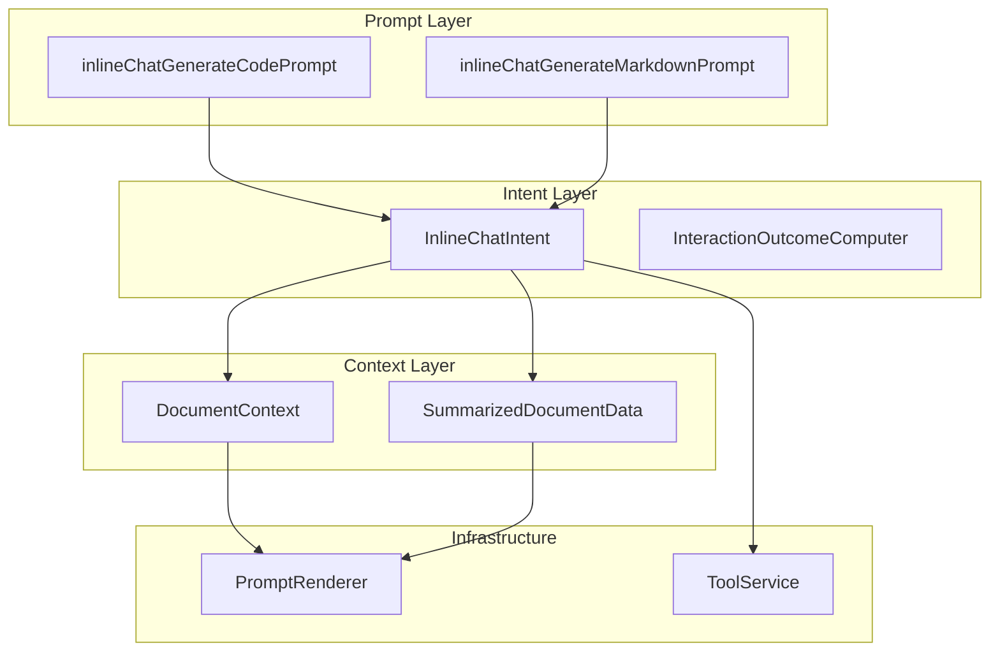
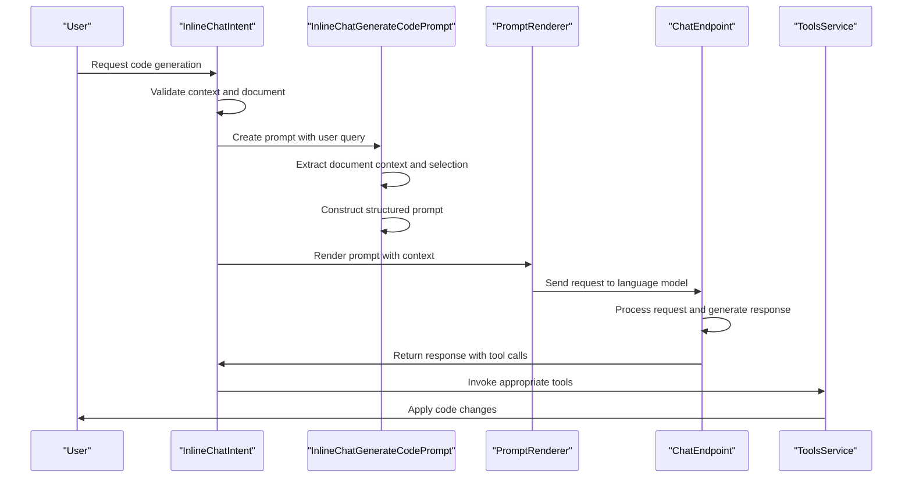
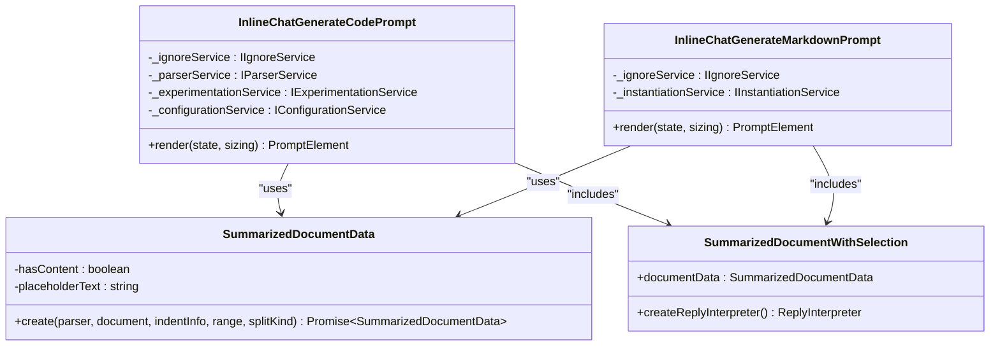
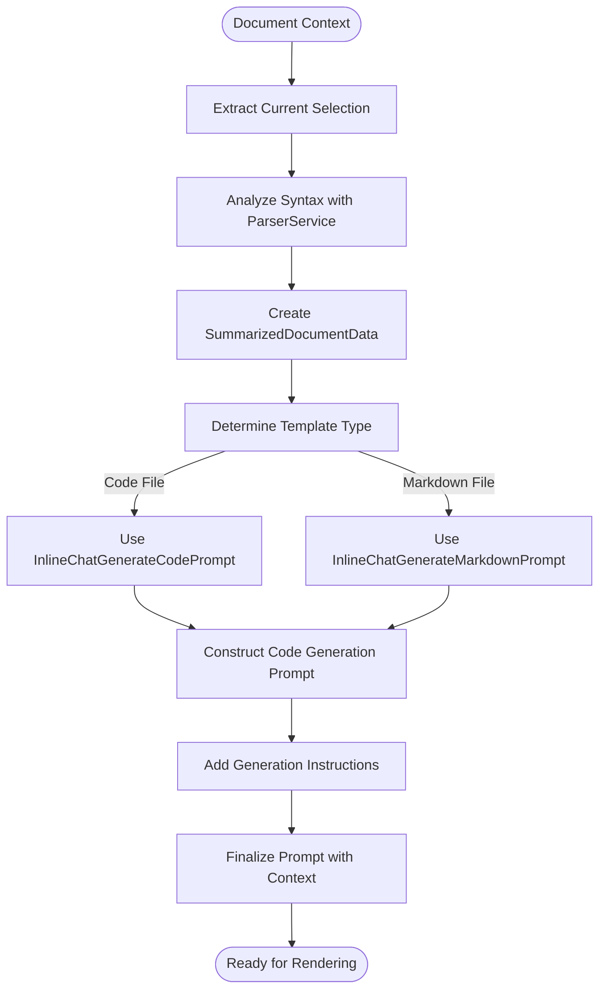

# Generate Code Operations

<cite>
**Referenced Files in This Document**   
- [inlineChatGenerateCodePrompt.tsx](file://src/extension/prompts/node/inline/inlineChatGenerateCodePrompt.tsx)
- [inlineChatGenerateMarkdownPrompt.tsx](file://src/extension/prompts/node/inline/inlineChatGenerateMarkdownPrompt.tsx)
- [inlineChatIntent.ts](file://src/extension/inlineChat/node/inlineChatIntent.ts)
- [promptCraftingTypes.ts](file://src/extension/inlineChat/node/promptCraftingTypes.ts)
- [documentContext.ts](file://src/extension/prompt/node/documentContext.ts)
- [summarizedDocumentWithSelection.ts](file://src/extension/intents/node/testIntent/summarizedDocumentWithSelection.ts)
- [promptRenderer.ts](file://src/extension/prompts/node/base/promptRenderer.ts)
</cite>

## Table of Contents
1. [Introduction](#introduction)
2. [Project Structure and Core Components](#project-structure-and-core-components)
3. [Core Components](#core-components)
4. [Architecture Overview](#architecture-overview)
5. [Detailed Component Analysis](#detailed-component-analysis)
6. [Dependency Analysis](#dependency-analysis)
7. [Performance Considerations](#performance-considerations)
8. [Troubleshooting Guide](#troubleshooting-guide)
9. [Conclusion](#conclusion)

## Introduction
This document provides a comprehensive analysis of the Generate Code Operations in GitHub Copilot Chat, focusing on the implementation of inline code generation capabilities. The system enables developers to generate new code directly within their editor context through intelligent prompts that understand both the immediate code surroundings and broader project structure. The implementation leverages a sophisticated prompt engineering approach that combines template-based generation with context-aware synthesis to produce high-quality, relevant code suggestions. This documentation will explore the domain model for generation operations, the invocation relationships between user requests and context extraction, and the structured prompt construction process that enables effective code creation.

## Project Structure and Core Components

The Generate Code Operations are primarily implemented within the `src/extension` directory of the GitHub Copilot Chat codebase, with key components organized in a modular architecture that separates concerns between prompt construction, context management, and execution logic. The core functionality is distributed across several specialized directories:

- `prompts/node/inline/` - Contains the prompt templates for code generation operations
- `inlineChat/node/` - Houses the intent handlers and supporting utilities for inline chat operations
- `prompt/node/` - Provides foundational components for prompt construction and rendering
- `intents/node/` - Contains logic for intent recognition and processing

The architecture follows a clean separation between the presentation layer (prompt templates), business logic (intent handlers), and infrastructure services (context extraction, tool invocation). This modular design enables independent evolution of each component while maintaining a cohesive user experience for code generation.

**Diagram sources**
- [inlineChatGenerateCodePrompt.tsx](file://src/extension/prompts/node/inline/inlineChatGenerateCodePrompt.tsx)
- [inlineChatIntent.ts](file://src/extension/inlineChat/node/inlineChatIntent.ts)
- [documentContext.ts](file://src/extension/prompt/node/documentContext.ts)
- [summarizedDocumentWithSelection.ts](file://src/extension/intents/node/testIntent/summarizedDocumentWithSelection.ts)
- [promptRenderer.ts](file://src/extension/prompts/node/base/promptRenderer.ts)

**Section sources**
- [inlineChatGenerateCodePrompt.tsx](file://src/extension/prompts/node/inline/inlineChatGenerateCodePrompt.tsx)
- [inlineChatIntent.ts](file://src/extension/inlineChat/node/inlineChatIntent.ts)

## Core Components

The Generate Code Operations in GitHub Copilot Chat are built around several core components that work together to deliver intelligent code suggestions. The primary component is the `InlineChatGenerateCodePrompt` class, which serves as the template for constructing code generation requests. This component works in conjunction with the `InlineChatIntent` handler that manages the overall flow of the generation operation. The system also includes specialized components for context extraction, such as `SummarizedDocumentData`, which analyzes the current document state to provide relevant context for code generation. These components work together to create a seamless experience where users can request new code generation through natural language prompts, with the system intelligently incorporating surrounding code context and project structure awareness into the generated suggestions.

**Section sources**
- [inlineChatGenerateCodePrompt.tsx](file://src/extension/prompts/node/inline/inlineChatGenerateCodePrompt.tsx)
- [inlineChatIntent.ts](file://src/extension/inlineChat/node/inlineChatIntent.ts)
- [summarizedDocumentWithSelection.ts](file://src/extension/intents/node/testIntent/summarizedDocumentWithSelection.ts)

## Architecture Overview

The architecture for Generate Code Operations follows a request-response pattern where user input triggers a series of coordinated actions across multiple components. When a user initiates a code generation request, the system first validates the context and extracts relevant document information. It then constructs a structured prompt using template components that incorporate both the user's request and the surrounding code context. This prompt is processed by the prompt renderer and sent to the language model endpoint, with the response being interpreted and potentially triggering tool invocations for code modifications. The architecture is designed to be extensible, allowing for different types of generation operations (code, markdown, etc.) while maintaining a consistent interface and flow.

**Diagram sources**
- [inlineChatIntent.ts](file://src/extension/inlineChat/node/inlineChatIntent.ts)
- [inlineChatGenerateCodePrompt.tsx](file://src/extension/prompts/node/inline/inlineChatGenerateCodePrompt.tsx)
- [promptRenderer.ts](file://src/extension/prompts/node/base/promptRenderer.ts)

## Detailed Component Analysis

### Inline Code Generation Prompt Implementation

The inline code generation functionality is implemented through specialized prompt components that construct structured requests for the language model. These prompts incorporate various contextual elements to ensure generated code is relevant and properly formatted.

#### Code Generation Prompt Structure

**Diagram sources**
- [inlineChatGenerateCodePrompt.tsx](file://src/extension/prompts/node/inline/inlineChatGenerateCodePrompt.tsx)
- [inlineChatGenerateMarkdownPrompt.tsx](file://src/extension/prompts/node/inline/inlineChatGenerateMarkdownPrompt.tsx)
- [summarizedDocumentWithSelection.ts](file://src/extension/intents/node/testIntent/summarizedDocumentWithSelection.ts)

**Section sources**
- [inlineChatGenerateCodePrompt.tsx](file://src/extension/prompts/node/inline/inlineChatGenerateCodePrompt.tsx)
- [inlineChatGenerateMarkdownPrompt.tsx](file://src/extension/prompts/node/inline/inlineChatGenerateMarkdownPrompt.tsx)

### Context-Aware Synthesis and Template Selection

The system implements context-aware synthesis through a sophisticated document context analysis process that extracts relevant information from the current code file. This context is then used to select appropriate templates and guide the code generation process.

#### Document Context Processing Flow

**Diagram sources**
- [inlineChatGenerateCodePrompt.tsx](file://src/extension/prompts/node/inline/inlineChatGenerateCodePrompt.tsx)
- [inlineChatGenerateMarkdownPrompt.tsx](file://src/extension/prompts/node/inline/inlineChatGenerateMarkdownPrompt.tsx)
- [summarizedDocumentWithSelection.ts](file://src/extension/intents/node/testIntent/summarizedDocumentWithSelection.ts)

**Section sources**
- [inlineChatGenerateCodePrompt.tsx](file://src/extension/prompts/node/inline/inlineChatGenerateCodePrompt.tsx)
- [inlineChatGenerateMarkdownPrompt.tsx](file://src/extension/prompts/node/inline/inlineChatGenerateMarkdownPrompt.tsx)

### Multi-File Creation and Project Structure Awareness

While the current implementation focuses primarily on inline code generation within a single file, the architecture supports potential expansion to multi-file creation through the tool invocation system. The system demonstrates project structure awareness through components like `ProjectLabels` that can be conditionally included in prompts based on configuration settings.

## Dependency Analysis

The Generate Code Operations depend on several key components and services within the GitHub Copilot Chat system. These dependencies enable the rich functionality and context awareness that characterize the code generation capabilities.

```mermaid
graph TD
A[InlineChatGenerateCodePrompt] --> B[IIgnoreService]
A --> C[IParserService]
A --> D[IExperimentationService]
A --> E[IConfigurationService]
A --> F[SummarizedDocumentData]
A --> G[LanguageServerContextPrompt]
A --> H[TemporalContext]
A --> I[CustomInstructions]
A --> J[ChatToolReferences]
A --> K[ChatVariables]
L[InlineChatIntent] --> M[IEndpointProvider]
L --> N[IAuthenticationService]
L --> O[ILogService]
L --> P[IToolsService]
L --> Q[IIgnoreService]
L --> R[PromptRenderer]
L --> S[Conversation]
L --> T[ChatTelemetryBuilder]
```

**Diagram sources**
- [inlineChatGenerateCodePrompt.tsx](file://src/extension/prompts/node/inline/inlineChatGenerateCodePrompt.tsx)
- [inlineChatIntent.ts](file://src/extension/inlineChat/node/inlineChatIntent.ts)

**Section sources**
- [inlineChatGenerateCodePrompt.tsx](file://src/extension/prompts/node/inline/inlineChatGenerateCodePrompt.tsx)
- [inlineChatIntent.ts](file://src/extension/inlineChat/node/inlineChatIntent.ts)

## Performance Considerations

The Generate Code Operations are designed with performance in mind, particularly in terms of prompt construction efficiency and context extraction. The system uses asynchronous operations for context analysis to prevent blocking the UI, and implements token budgeting through the `tokenBudget` parameter in the `SummarizedDocumentWithSelection` component. The prompt rendering process is optimized to minimize unnecessary computations, and the system includes mechanisms for early stopping when appropriate (such as `EarlyStopping.StopAfterFirstCodeBlock` in code generation scenarios). Configuration options like `useProjectLabels` allow for conditional inclusion of potentially expensive context elements based on experimentation settings.

## Troubleshooting Guide

Common issues with code generation operations typically relate to context extraction, prompt construction, or tool invocation. The system includes several safeguards and validation mechanisms to handle these scenarios:

**Section sources**
- [inlineChatGenerateCodePrompt.tsx](file://src/extension/prompts/node/inline/inlineChatGenerateCodePrompt.tsx)
- [inlineChatIntent.ts](file://src/extension/inlineChat/node/inlineChatIntent.ts)
- [promptCraftingTypes.ts](file://src/extension/inlineChat/node/promptCraftingTypes.ts)

## Conclusion

The Generate Code Operations in GitHub Copilot Chat represent a sophisticated implementation of AI-assisted development that combines template-based generation with deep context awareness. The system's architecture effectively separates concerns between prompt construction, context extraction, and execution logic, enabling a flexible and extensible approach to code generation. By leveraging structured prompts, document context analysis, and tool invocation patterns, the implementation delivers a seamless experience for generating new code within the development environment. The design demonstrates careful consideration of performance, error handling, and user experience, providing a robust foundation for AI-powered code assistance.