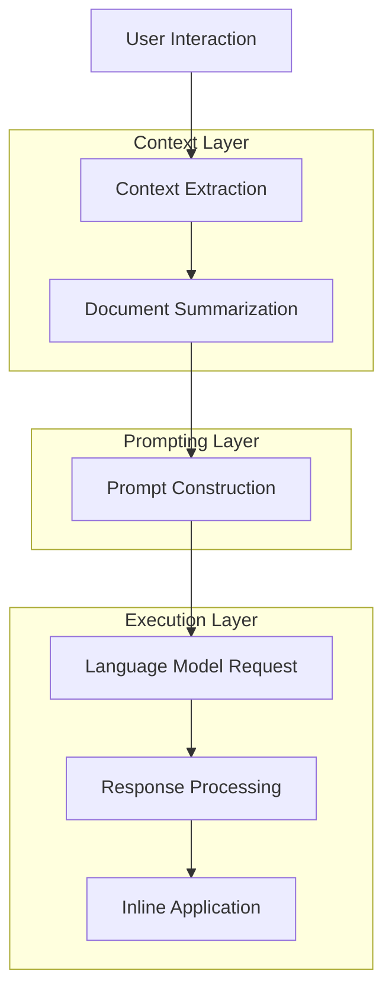
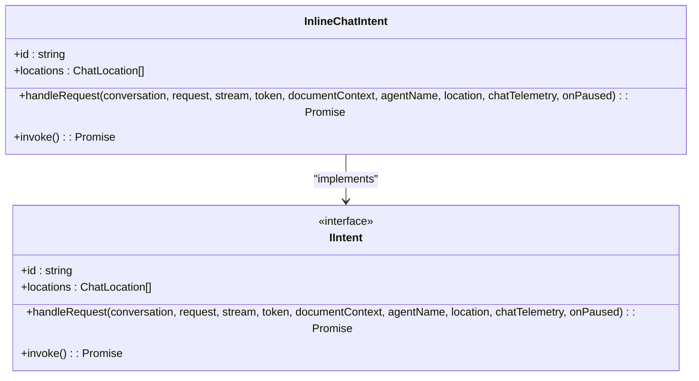
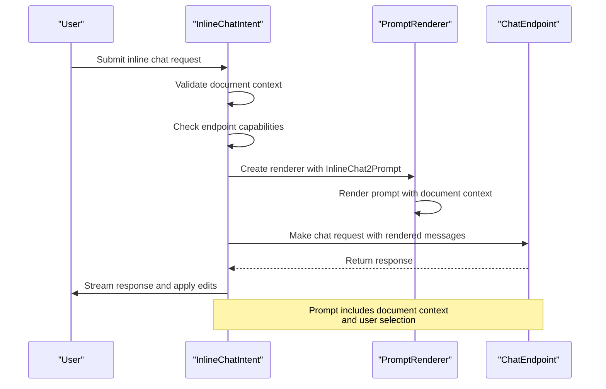
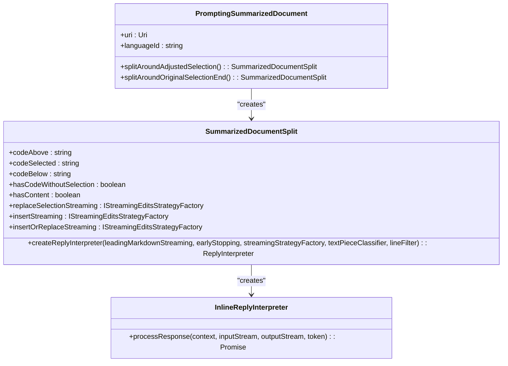
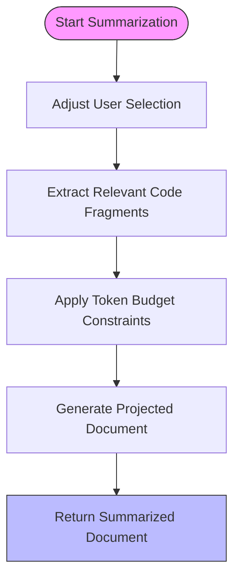
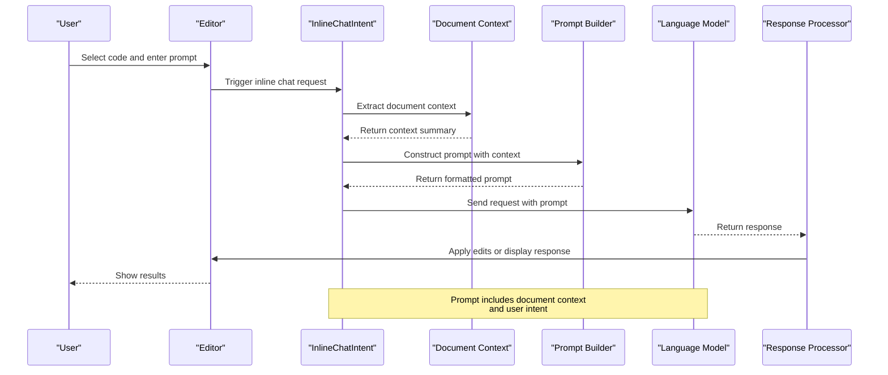
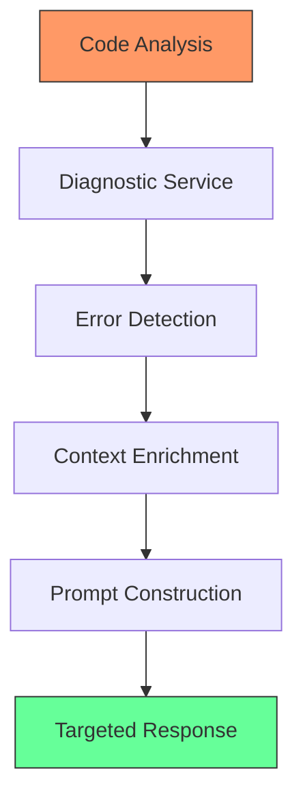

# Inline Prompting

<cite>
**Referenced Files in This Document**   
- [inlineChatIntent.ts](file://src/extension/inlineChat/node/inlineChatIntent.ts)
- [promptingSummarizedDocument.ts](file://src/extension/prompts/node/inline/promptingSummarizedDocument.ts)
- [summarizeDocumentHelpers.ts](file://src/extension/prompts/node/inline/summarizedDocument/summarizeDocumentHelpers.ts)
- [summarizeDocument.ts](file://src/extension/prompts/node/inline/summarizedDocument/summarizeDocument.ts)
- [inlineChat2Prompt.ts](file://src/extension/prompts/node/inline/inlineChat2Prompt.ts)
- [workingCopies.ts](file://src/extension/prompts/node/inline/workingCopies.ts)
- [promptCraftingTypes.ts](file://src/extension/inlineChat/node/promptCraftingTypes.ts)
</cite>

## Table of Contents
1. [Introduction](#introduction)
2. [Core Components](#core-components)
3. [Architecture Overview](#architecture-overview)
4. [Detailed Component Analysis](#detailed-component-analysis)
5. [Context Summarization Process](#context-summarization-process)
6. [Document-Aware Prompting](#document-aware-prompting)
7. [Inline Prompt Generation Flow](#inline-prompt-generation-flow)
8. [Configuration and Parameters](#configuration-and-parameters)
9. [Integration with Diagnostic Services](#integration-with-diagnostic-services)
10. [Common Issues and Solutions](#common-issues-and-solutions)
11. [Conclusion](#conclusion)

## Introduction

The Inline Prompting system in GitHub Copilot Chat enables context-aware code assistance directly within the editor. This system analyzes the current document state, extracts relevant code fragments, and constructs intelligent prompts that incorporate document context, user selection, and diagnostic information. The implementation focuses on providing accurate, relevant suggestions while maintaining performance and respecting context window limitations.

**Section sources**
- [inlineChatIntent.ts](file://src/extension/inlineChat/node/inlineChatIntent.ts#L1-L224)
- [promptingSummarizedDocument.ts](file://src/extension/prompts/node/inline/promptingSummarizedDocument.ts#L1-L280)

## Core Components

The Inline Prompting system consists of several key components that work together to provide context-aware assistance:

- **InlineChatIntent**: Handles the intent processing for inline chat operations
- **PromptingSummarizedDocument**: Manages document context summarization and splitting
- **SummarizedDocument**: Extracts and processes relevant code fragments from documents
- **InlineChat2Prompt**: Constructs multi-turn conversation prompts with document context
- **WorkingCopies**: Manages document snapshots and derived working copies
- **PromptCraftingTypes**: Defines types for interaction outcomes and session storage

These components work in concert to extract context, summarize document content, and generate appropriate prompts for the language model.

**Section sources**
- [inlineChatIntent.ts](file://src/extension/inlineChat/node/inlineChatIntent.ts#L1-L224)
- [promptingSummarizedDocument.ts](file://src/extension/prompts/node/inline/promptingSummarizedDocument.ts#L1-L280)
- [summarizeDocumentHelpers.ts](file://src/extension/prompts/node/inline/summarizedDocument/summarizeDocumentHelpers.ts#L1-L200)
- [summarizeDocument.ts](file://src/extension/prompts/node/inline/summarizedDocument/summarizeDocument.ts#L1-L300)

## Architecture Overview

The Inline Prompting system follows a layered architecture that processes user interactions through several stages:

**Diagram sources**
- [inlineChatIntent.ts](file://src/extension/inlineChat/node/inlineChatIntent.ts#L65-L206)
- [promptingSummarizedDocument.ts](file://src/extension/prompts/node/inline/promptingSummarizedDocument.ts#L23-L38)

## Detailed Component Analysis

### InlineChatIntent Analysis

The InlineChatIntent class is responsible for handling inline chat requests and managing the interaction flow between the user and the language model.

**Diagram sources**
- [inlineChatIntent.ts](file://src/extension/inlineChat/node/inlineChatIntent.ts#L39-L224)

#### Prompt Construction Flow

The prompt construction process follows a specific sequence when handling inline chat requests:

**Diagram sources**
- [inlineChatIntent.ts](file://src/extension/inlineChat/node/inlineChatIntent.ts#L65-L206)

### PromptingSummarizedDocument Analysis

The PromptingSummarizedDocument class manages the creation and manipulation of summarized document representations for inline prompting.

**Diagram sources**
- [promptingSummarizedDocument.ts](file://src/extension/prompts/node/inline/promptingSummarizedDocument.ts#L40-L280)

## Context Summarization Process

The context summarization process extracts relevant code fragments from the current document while respecting token budget constraints. This process ensures that the most relevant context is provided to the language model without exceeding context window limitations.

### Summarization Workflow

The process begins with the user's selection and expands to include surrounding context, imports, and related code elements while staying within the specified token budget.

**Section sources**
- [summarizeDocumentHelpers.ts](file://src/extension/prompts/node/inline/summarizedDocument/summarizeDocumentHelpers.ts#L1-L200)
- [summarizeDocument.ts](file://src/extension/prompts/node/inline/summarizedDocument/summarizeDocument.ts#L1-L300)

## Document-Aware Prompting

Document-aware prompting ensures that the generated prompts include relevant context from the current document, including code structure, imports, and surrounding code.

### Context Integration

The system integrates multiple types of document context into the prompting process:

- **Code Structure**: Syntax tree analysis to understand code organization
- **Imports**: Relevant import statements are preserved
- **Surrounding Code**: Context above and below the selection
- **Language Features**: Language-specific patterns and conventions
- **Formatting**: Document formatting options are respected

This comprehensive context integration enables the language model to generate responses that are consistent with the existing codebase.

**Section sources**
- [promptingSummarizedDocument.ts](file://src/extension/prompts/node/inline/promptingSummarizedDocument.ts#L23-L38)
- [workingCopies.ts](file://src/extension/prompts/node/inline/workingCopies.ts#L1-L100)

## Inline Prompt Generation Flow

The inline prompt generation flow orchestrates the entire process from user interaction to response application.

**Diagram sources**
- [inlineChatIntent.ts](file://src/extension/inlineChat/node/inlineChatIntent.ts#L65-L206)
- [promptingSummarizedDocument.ts](file://src/extension/prompts/node/inline/promptingSummarizedDocument.ts#L23-L38)

## Configuration and Parameters

The Inline Prompting system supports various configuration options and parameters for different inline operations.

### Configuration Options

| Parameter | Description | Default Value | Scope |
|---------|-------------|---------------|-------|
| tokensBudget | Maximum tokens for context | 4096 | Global |
| contextSensitivity | Level of context inclusion | medium | Per operation |
| editStrategy | Strategy for code edits | FallbackToInsertBelowRange | Edit operations |
| leadingMarkdownStreaming | Handle leading markdown | true | All operations |
| earlyStopping | Enable early response stopping | true | All operations |

### Operation Parameters

Different inline operations have specific parameters:

- **Edit Operations**: Include edit strategy, conflict resolution, and diff sensitivity
- **Generate Operations**: Include code style, pattern matching, and template usage
- **Explain Operations**: Include detail level, technical depth, and audience targeting

**Section sources**
- [inlineChatIntent.ts](file://src/extension/inlineChat/node/inlineChatIntent.ts#L65-L206)
- [promptingSummarizedDocument.ts](file://src/extension/prompts/node/inline/promptingSummarizedDocument.ts#L23-L38)

## Integration with Diagnostic Services

The Inline Prompting system integrates with diagnostic services to provide context-aware assistance based on code issues and errors.

### Diagnostic Context Flow

When errors are detected in the code, the system enriches the prompt context with diagnostic information, enabling the language model to provide targeted fixes and suggestions.

**Section sources**
- [inlineChatIntent.ts](file://src/extension/inlineChat/node/inlineChatIntent.ts#L65-L206)
- [promptCraftingTypes.ts](file://src/extension/inlineChat/node/promptCraftingTypes.ts#L1-L50)

## Common Issues and Solutions

### Context Window Limitations

**Issue**: Large files or complex contexts may exceed token limits.

**Solution**: The system implements intelligent summarization that:
- Prioritizes relevant code fragments
- Removes redundant or less important code
- Preserves essential context like imports and function signatures
- Uses token budgeting to stay within limits

### Relevance Filtering

**Issue**: Including irrelevant code can reduce response quality.

**Solution**: The system applies relevance filtering based on:
- Proximity to user selection
- Code dependencies and references
- Semantic relationships
- Language-specific patterns

### Performance Optimization

**Issue**: Context extraction and summarization can impact performance.

**Solution**: The system implements:
- Caching of document summaries
- Incremental updates when possible
- Background processing for non-critical operations
- Efficient data structures for code representation

**Section sources**
- [summarizeDocumentHelpers.ts](file://src/extension/prompts/node/inline/summarizedDocument/summarizeDocumentHelpers.ts#L1-L200)
- [summarizeDocument.ts](file://src/extension/prompts/node/inline/summarizedDocument/summarizeDocument.ts#L1-L300)

## Conclusion

The Inline Prompting system in GitHub Copilot Chat provides a sophisticated framework for context-aware code assistance. By combining document context summarization, intelligent prompt construction, and seamless integration with the editor environment, the system delivers relevant, accurate suggestions that enhance developer productivity. The architecture balances comprehensive context inclusion with performance considerations, ensuring responsive interactions while maintaining high-quality output. Through its modular design and extensible interfaces, the system can adapt to various use cases and continue to evolve with new capabilities.