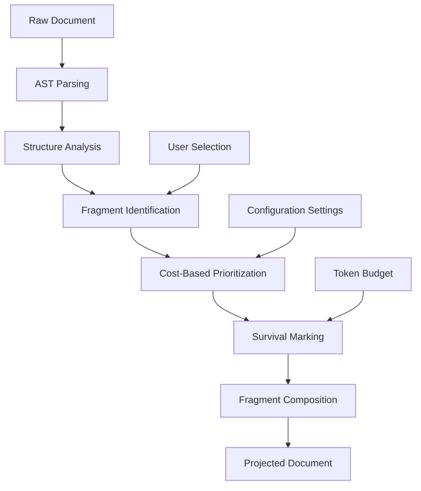
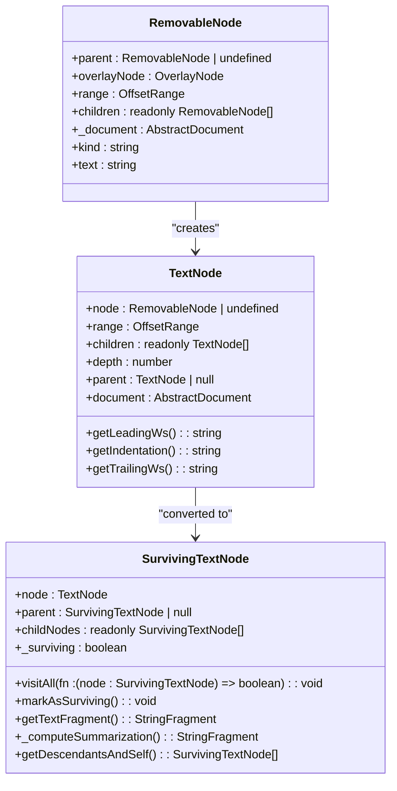
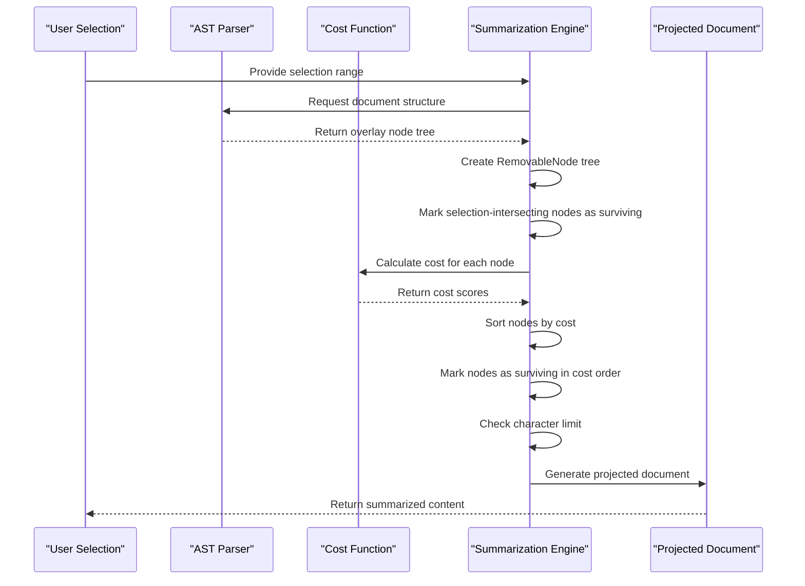

# Summarized Document Context

<cite>
**Referenced Files in This Document**   
- [summarizeDocument.ts](file://src/extension/prompts/node/inline/summarizedDocument/summarizeDocument.ts)
- [fragments.ts](file://src/extension/prompts/node/inline/summarizedDocument/fragments.ts)
- [implementation.ts](file://src/extension/prompts/node/inline/summarizedDocument/implementation.ts)
- [summarizeDocumentHelpers.ts](file://src/extension/prompts/node/inline/summarizedDocument/summarizeDocumentHelpers.ts)
- [promptingSummarizedDocument.ts](file://src/extension/prompts/node/inline/promptingSummarizedDocument.ts)
- [selectionContextHelpers.ts](file://src/extension/context/node/resolvers/selectionContextHelpers.ts)
- [projectedText.ts](file://src/extension/prompts/node/inline/summarizedDocument/projectedText.ts)
</cite>

## Table of Contents
1. [Introduction](#introduction)
2. [Core Components](#core-components)
3. [Architecture Overview](#architecture-overview)
4. [Detailed Component Analysis](#detailed-component-analysis)
5. [Fragment Selection and Prioritization](#fragment-selection-and-prioritization)
6. [Context Window Management](#context-window-management)
7. [Integration with Language Server and Document Structure](#integration-with-language-server-and-document-structure)
8. [Configuration Options and Parameters](#configuration-options-and-parameters)
9. [Common Issues and Solutions](#common-issues-and-solutions)
10. [Conclusion](#conclusion)

## Introduction

The Summarized Document Context system in GitHub Copilot Chat enables intelligent document summarization for inline prompting by extracting and contextualizing relevant code fragments. This system analyzes document structure, identifies important code sections based on cursor position and selection, and creates a summarized representation that preserves essential context while reducing token usage. The implementation leverages abstract syntax tree (AST) parsing, cost-based prioritization, and fragment composition to deliver relevant code context to language models efficiently.

**Section sources**
- [summarizeDocument.ts](file://src/extension/prompts/node/inline/summarizedDocument/summarizeDocument.ts#L1-L49)
- [implementation.ts](file://src/extension/prompts/node/inline/summarizedDocument/implementation.ts#L1-L528)

## Core Components

The Summarized Document Context system consists of several key components that work together to extract, prioritize, and project relevant code fragments. The core functionality is implemented across multiple TypeScript files that handle document analysis, fragment selection, and text projection.

The system begins with document structure analysis using Tree-sitter parsers to create AST representations of code files. It then identifies relevant fragments based on user selection and cursor position, applying cost functions to determine which code sections should be preserved in the summary. The final projected document is constructed by combining surviving fragments while eliding less relevant sections.

**Section sources**
- [summarizeDocument.ts](file://src/extension/prompts/node/inline/summarizedDocument/summarizeDocument.ts#L1-L49)
- [fragments.ts](file://src/extension/prompts/node/inline/summarizedDocument/fragments.ts#L1-L147)
- [implementation.ts](file://src/extension/prompts/node/inline/summarizedDocument/implementation.ts#L1-L528)

## Architecture Overview

The Summarized Document Context system follows a layered architecture that transforms raw document content into a contextually relevant, token-efficient representation for language model processing.

**Diagram sources **
- [summarizeDocument.ts](file://src/extension/prompts/node/inline/summarizedDocument/summarizeDocument.ts#L32-L48)
- [implementation.ts](file://src/extension/prompts/node/inline/summarizedDocument/implementation.ts#L91-L277)

## Detailed Component Analysis

### Document Summarization Process

The document summarization process begins with the `summarizeDocumentsSync` function, which serves as the primary entry point for creating summarized document representations. This function takes a character limit, settings, and document items as input, then delegates to the core implementation in `summarizeDocumentsSyncImpl`.

The process starts by creating a `RemovableNode` tree from the overlay node structure, which represents the document's AST. Each node in this tree corresponds to a syntactic element in the code and contains information about its range, children, and parent relationships. The system then creates a `TextNode` representation that includes gaps between AST nodes, ensuring complete coverage of the document.

**Diagram sources **
- [implementation.ts](file://src/extension/prompts/node/inline/summarizedDocument/implementation.ts#L56-L85)
- [implementation.ts](file://src/extension/prompts/node/inline/summarizedDocument/implementation.ts#L296-L368)
- [implementation.ts](file://src/extension/prompts/node/inline/summarizedDocument/implementation.ts#L390-L527)

### Fragment Selection and Prioritization

The fragment selection process uses a sophisticated cost-based approach to determine which code sections should be preserved in the summarized document. The system first marks nodes that intersect with the user's selection as "surviving" to ensure they are included in the final output.

The cost function evaluates each node based on multiple factors:
- Distance to the user's selection (nodes closer to selection have lower cost)
- Depth in the AST hierarchy (shallower nodes have lower cost)
- Scope relationship to the selection (nodes in the same scope have lower cost)
- Special preservation rules for import statements when type checking preservation is enabled

**Diagram sources **
- [implementation.ts](file://src/extension/prompts/node/inline/summarizedDocument/implementation.ts#L111-L122)
- [implementation.ts](file://src/extension/prompts/node/inline/summarizedDocument/implementation.ts#L127-L183)
- [implementation.ts](file://src/extension/prompts/node/inline/summarizedDocument/implementation.ts#L206-L226)

## Fragment Selection and Prioritization

The fragment selection system uses the `StringFragment` hierarchy to represent different types of text segments in the summarized document. There are three main fragment types:

1. **LiteralStringFragment**: Represents text that is explicitly included in the summary (like ellipsis indicators)
2. **OriginalStringFragment**: Represents text preserved from the original document
3. **ConcatenatedStringFragment**: Represents a sequence of fragments joined together

The `pushFragment` utility function optimizes fragment composition by joining adjacent `OriginalStringFragment` instances when possible, reducing the number of discrete fragments and improving efficiency.

When computing the final summarization, the system groups adjacent fragments by their emptiness and applies special handling for elisions between non-empty fragments. This includes preserving brace alignment when eliding code between opening and closing braces, and using appropriate ellipsis styles based on configuration.

**Section sources**
- [fragments.ts](file://src/extension/prompts/node/inline/summarizedDocument/fragments.ts#L11-L147)
- [implementation.ts](file://src/extension/prompts/node/inline/summarizedDocument/implementation.ts#L458-L512)

## Context Window Management

The system manages context window constraints through a token-to-character conversion that assumes roughly 4 characters per token. The `getCharLimit` function in `summarizeDocumentHelpers.ts` implements this conversion, allowing the summarization process to work with character limits that correspond to the language model's token budget.

The summarization algorithm processes nodes in order of increasing cost, marking them as surviving until the character limit would be exceeded. This greedy approach ensures that the most relevant code sections are included in the summary while respecting the context window constraints.

Line number handling is configurable through the `SummarizedDocumentLineNumberStyle` enum, which supports three options:
- None: No line numbers included
- OmittedRanges: Line numbers shown only for omitted ranges
- Full: Line numbers included for all lines

When full line numbers are enabled, the system calculates the maximum line number to determine the width needed for line number display and adds line number prefixes to each line in the summarized output.

**Section sources**
- [summarizeDocumentHelpers.ts](file://src/extension/prompts/node/inline/summarizedDocument/summarizeDocumentHelpers.ts#L18-L20)
- [implementation.ts](file://src/extension/prompts/node/inline/summarizedDocument/implementation.ts#L206-L226)
- [implementation.ts](file://src/extension/prompts/node/inline/summarizedDocument/implementation.ts#L384-L388)

## Integration with Language Server and Document Structure

The Summarized Document Context system integrates with language server features through the `getStructure` function in `selectionContextHelpers.ts`. This function first attempts to retrieve document structure using Tree-sitter parsing, falling back to indentation-based structure analysis when AST parsing is not available.

The system leverages language server capabilities to enhance context relevance by:
- Using AST structure to identify syntactic boundaries
- Preserving import statements when type checking preservation is enabled
- Maintaining proper code formatting and indentation
- Understanding language-specific syntax patterns

The `adjustSelectionAndSummarizeDocument` function coordinates between selection adjustment and document summarization, ensuring that the user's intent is preserved while creating a contextually relevant summary. This function uses the `getAdjustedSelection` utility to refine the selection before summarization, improving the quality of the extracted context.

**Section sources**
- [selectionContextHelpers.ts](file://src/extension/context/node/resolvers/selectionContextHelpers.ts#L341-L348)
- [summarizeDocumentHelpers.ts](file://src/extension/prompts/node/inline/summarizedDocument/summarizeDocumentHelpers.ts#L25-L41)

## Configuration Options and Parameters

The summarization system provides several configuration options through the `ISummarizedDocumentSettings` interface:

- **costFnOverride**: Allows custom cost functions to override the default prioritization logic
- **tryPreserveTypeChecking**: When enabled, preserves import statements and other elements important for type checking
- **alwaysUseEllipsisForElisions**: Forces the use of ellipsis for all elisions between sibling AST nodes
- **lineNumberStyle**: Controls the display of line numbers in the summarized document

These settings can be passed to the summarization functions to customize behavior based on specific use cases or user preferences. The system also supports token budget configuration through the `tokensBudget` parameter, which is converted to a character limit for the summarization process.

The `DocumentSummarizer` and `NotebookDocumentSummarizer` classes provide higher-level interfaces for summarizing different document types, with the notebook summarizer currently returning the full document text as a placeholder implementation.

**Section sources**
- [summarizeDocument.ts](file://src/extension/prompts/node/inline/summarizedDocument/summarizeDocument.ts#L29-L50)
- [summarizeDocumentHelpers.ts](file://src/extension/prompts/node/inline/summarizedDocument/summarizeDocumentHelpers.ts#L43-L56)

## Common Issues and Solutions

### Context Relevance

One common challenge is ensuring that the summarized context remains relevant to the user's task. The system addresses this through several mechanisms:

1. **Selection-based prioritization**: Nodes intersecting with the user's selection are automatically marked as surviving
2. **Distance scoring**: Nodes closer to the selection receive lower cost scores, making them more likely to be included
3. **Scope awareness**: The system considers scope relationships when calculating costs, favoring nodes in the same scope as the selection

### Information Loss

To minimize information loss during summarization, the system employs several strategies:

1. **Preservation of structural elements**: When eliding code between braces, the system preserves the opening and closing braces to maintain code structure
2. **Configurable ellipsis styles**: Different ellipsis styles provide varying levels of detail about omitted content
3. **Import statement preservation**: When type checking preservation is enabled, import statements are preserved to maintain code validity

### Performance Optimization

The system includes several performance optimizations:

1. **Lazy evaluation**: Text length calculations are cached using the `Lazy` class to avoid redundant computations
2. **Batch processing**: Multiple documents can be summarized simultaneously within a shared token budget
3. **Efficient fragment composition**: Adjacent original fragments are joined to reduce the number of discrete fragments

**Section sources**
- [implementation.ts](file://src/extension/prompts/node/inline/summarizedDocument/implementation.ts#L111-L122)
- [implementation.ts](file://src/extension/prompts/node/inline/summarizedDocument/implementation.ts#L481-L492)
- [fragments.ts](file://src/extension/prompts/node/inline/summarizedDocument/fragments.ts#L129-L133)

## Conclusion

The Summarized Document Context system in GitHub Copilot Chat provides a sophisticated solution for extracting and contextualizing relevant code fragments for inline prompting. By leveraging AST parsing, cost-based prioritization, and intelligent fragment composition, the system delivers contextually relevant code summaries that respect token budget constraints while preserving essential information.

The architecture balances multiple competing requirements: maximizing relevance to the user's current task, minimizing token usage, preserving code structure and validity, and maintaining performance. Through configurable settings and extensible design, the system can be adapted to various use cases and programming languages.

Future enhancements could include more sophisticated cost functions that consider semantic importance beyond syntactic proximity, integration with additional language server features for deeper code understanding, and adaptive summarization strategies that learn from user feedback and interaction patterns.

**Section sources**
- [summarizeDocument.ts](file://src/extension/prompts/node/inline/summarizedDocument/summarizeDocument.ts#L1-L49)
- [implementation.ts](file://src/extension/prompts/node/inline/summarizedDocument/implementation.ts#L1-L528)
- [fragments.ts](file://src/extension/prompts/node/inline/summarizedDocument/fragments.ts#L1-L147)