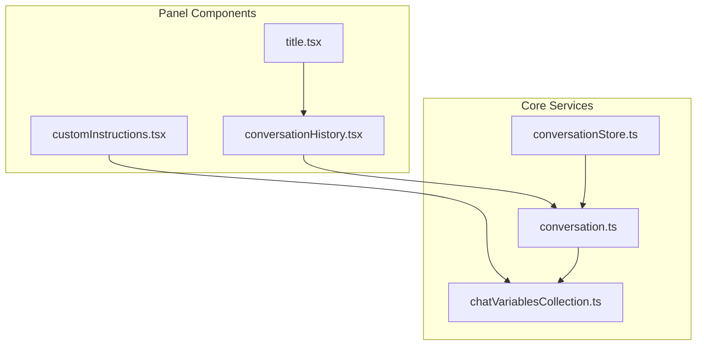
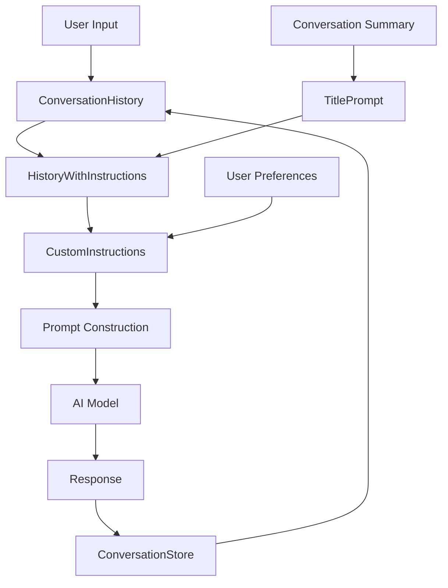
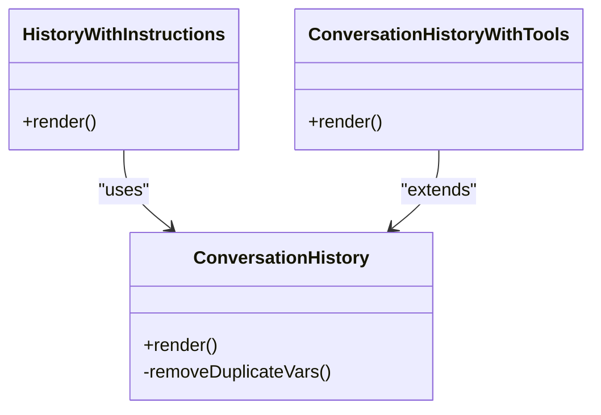
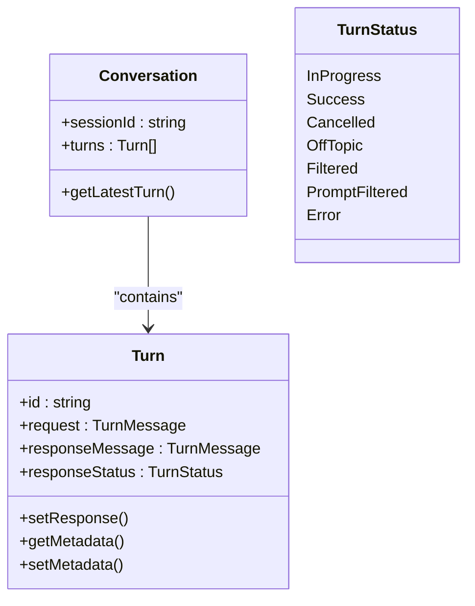
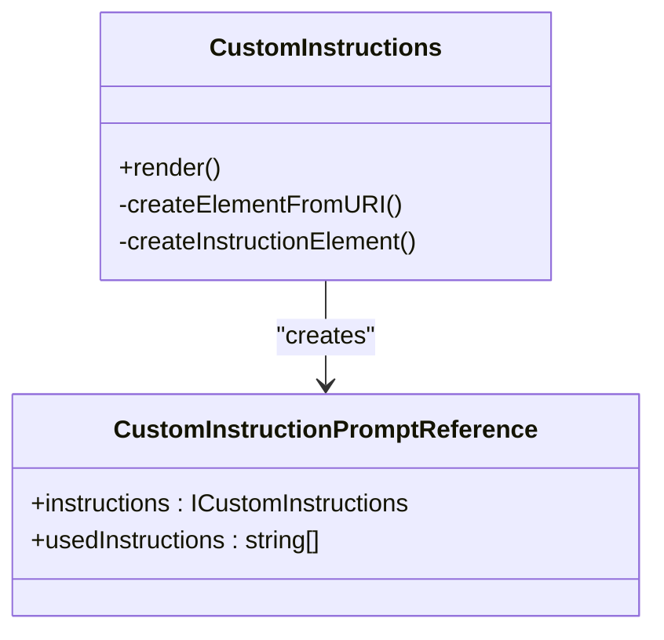
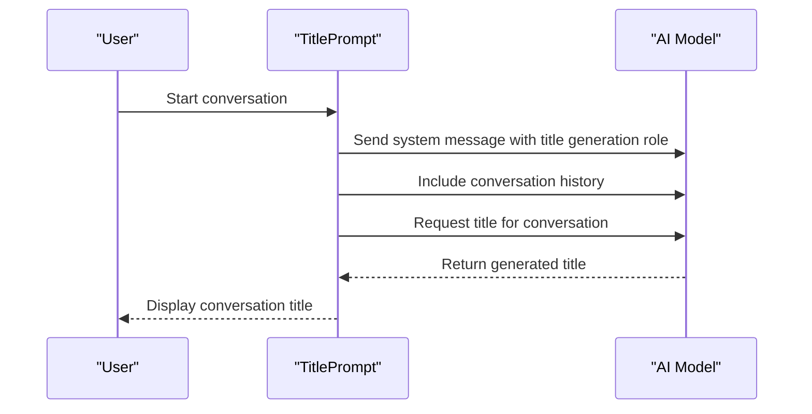

# Conversation Context Prompting

<cite>
**Referenced Files in This Document**   
- [conversationHistory.tsx](file://src/extension/prompts/node/panel/conversationHistory.tsx)
- [title.tsx](file://src/extension/prompts/node/panel/title.tsx)
- [customInstructions.tsx](file://src/extension/prompts/node/panel/customInstructions.tsx)
- [conversationStore.ts](file://src/extension/conversationStore/node/conversationStore.ts)
- [conversation.ts](file://src/extension/prompt/common/conversation.ts)
- [chatVariablesCollection.ts](file://src/extension/prompt/common/chatVariablesCollection.ts)
</cite>

## Table of Contents
1. [Introduction](#introduction)
2. [Project Structure](#project-structure)
3. [Core Components](#core-components)
4. [Architecture Overview](#architecture-overview)
5. [Detailed Component Analysis](#detailed-component-analysis)
6. [Dependency Analysis](#dependency-analysis)
7. [Performance Considerations](#performance-considerations)
8. [Troubleshooting Guide](#troubleshooting-guide)
9. [Conclusion](#conclusion)

## Introduction
The Conversation Context Prompting system in GitHub Copilot Chat provides a sophisticated framework for maintaining coherent and context-aware conversations between users and AI assistants. This system manages conversation history, preserves dialogue state across turns, and integrates user preferences to deliver personalized responses. The architecture is built around a panel-based interaction model that enables rich, multi-turn conversations with persistent context. The system handles complex scenarios including conversation summarization, custom instruction integration, and history serialization for prompt construction. This documentation provides a comprehensive analysis of the implementation details, focusing on the core components that enable effective conversation context management.

## Project Structure
The Conversation Context Prompting system is organized within the src/extension directory with a clear separation of concerns. The core functionality is distributed across several key directories: prompts/node/panel contains the primary components for conversation history management, title generation, and custom instructions; conversationStore/node manages conversation persistence; and prompt/common contains shared types and utilities. The architecture follows a modular design with distinct components for history management, state preservation, and preference integration, all working together to maintain coherent conversation context.



**Diagram sources**
- [conversationHistory.tsx](file://src/extension/prompts/node/panel/conversationHistory.tsx)
- [title.tsx](file://src/extension/prompts/node/panel/title.tsx)
- [customInstructions.tsx](file://src/extension/prompts/node/panel/customInstructions.tsx)
- [conversationStore.ts](file://src/extension/conversationStore/node/conversationStore.ts)
- [conversation.ts](file://src/extension/prompt/common/conversation.ts)
- [chatVariablesCollection.ts](file://src/extension/prompt/common/chatVariablesCollection.ts)

**Section sources**
- [conversationHistory.tsx](file://src/extension/prompts/node/panel/conversationHistory.tsx)
- [title.tsx](file://src/extension/prompts/node/panel/title.tsx)
- [customInstructions.tsx](file://src/extension/prompts/node/panel/customInstructions.tsx)

## Core Components
The Conversation Context Prompting system consists of three primary components: conversation history management, dialogue state preservation, and user preference integration. The conversationHistory.tsx component handles the serialization and formatting of message sequences, maintaining context across turns with a 32k token limit to optimize performance. The title.tsx component generates conversation summaries by analyzing the dialogue history and extracting the main topic of discussion. The customInstructions.tsx component incorporates user preferences into the conversation flow, allowing personalized coding instructions to influence response behavior. These components work together with the conversationStore to maintain persistent state and ensure coherent interactions.

**Section sources**
- [conversationHistory.tsx](file://src/extension/prompts/node/panel/conversationHistory.tsx#L1-L182)
- [title.tsx](file://src/extension/prompts/node/panel/title.tsx#L1-L43)
- [customInstructions.tsx](file://src/extension/prompts/node/panel/customInstructions.tsx#L1-L189)

## Architecture Overview
The Conversation Context Prompting system follows a layered architecture with clear separation between presentation, business logic, and data storage. The system is built on top of the @vscode/prompt-tsx framework, which provides the foundation for structured prompt rendering. Conversation state is maintained through the Turn and Conversation classes, which track message sequences, metadata, and response status. The HistoryWithInstructions component orchestrates the integration of conversation history with model-specific instructions, while the CustomInstructions component manages user preferences. The architecture supports both inline and full conversation modes, with configurable history length and token limits.



**Diagram sources**
- [conversationHistory.tsx](file://src/extension/prompts/node/panel/conversationHistory.tsx#L45-L182)
- [customInstructions.tsx](file://src/extension/prompts/node/panel/customInstructions.tsx#L49-L159)
- [title.tsx](file://src/extension/prompts/node/panel/title.tsx#L17-L42)

## Detailed Component Analysis

### Conversation History Management
The conversation history management system in conversationHistory.tsx implements a sophisticated approach to maintaining dialogue context across turns. The HistoryWithInstructions class serves as the primary orchestrator, determining whether instructions should be placed before or after the conversation history based on the model's capabilities. The system handles both standard conversation history and specialized cases like inline history, where previous requests are summarized into a single message. The implementation includes token limiting to 32k tokens, preventing performance degradation from excessive context. The removeDuplicateVars method ensures that prompt variables are not redundantly included in the history, optimizing both token usage and clarity.



**Diagram sources**
- [conversationHistory.tsx](file://src/extension/prompts/node/panel/conversationHistory.tsx#L45-L182)

**Section sources**
- [conversationHistory.tsx](file://src/extension/prompts/node/panel/conversationHistory.tsx#L1-L182)

### Dialogue State Preservation
The dialogue state preservation system maintains conversation context through the Turn and Conversation classes in conversation.ts. Each Turn represents a single exchange in the conversation, containing both request and response messages along with metadata. The Conversation class manages a collection of turns, providing methods to access the latest turn and maintain session state. The system supports various turn statuses including InProgress, Success, Cancelled, OffTopic, Filtered, and Error, allowing for comprehensive state tracking. Metadata is stored in a Map structure, enabling flexible extension with additional information such as tool call rounds, code blocks, and filtering reasons. The normalizeSummariesOnRounds function ensures that summaries are properly associated with their corresponding tool call rounds, even when generated in different turns.



**Diagram sources**
- [conversation.ts](file://src/extension/prompt/common/conversation.ts#L57-L226)

**Section sources**
- [conversation.ts](file://src/extension/prompt/common/conversation.ts#L1-L376)

### User Preference Integration
The user preference integration system in customInstructions.tsx enables personalized conversation behavior through custom coding instructions. The CustomInstructions class retrieves user preferences from both file-based and settings-based sources, merging them into a cohesive set of guidelines for the AI model. The system supports different instruction types including code generation, test generation, code feedback, commit message generation, and pull request description generation. Instructions can be language-specific, allowing different guidelines for different programming languages. The implementation includes telemetry collection through the getCustomInstructionTelemetry function, which tracks instruction usage metrics. The system also handles potential conflicts between custom instructions and system messages, providing a warning mechanism when instructions might contradict system directives.



**Diagram sources**
- [customInstructions.tsx](file://src/extension/prompts/node/panel/customInstructions.tsx#L49-L159)

**Section sources**
- [customInstructions.tsx](file://src/extension/prompts/node/panel/customInstructions.tsx#L1-L189)

### Conversation Summarization
The conversation summarization system in title.tsx generates concise titles that capture the main topic of a conversation. The TitlePrompt class implements a specialized prompt that analyzes the conversation history and produces a brief, descriptive title. The system uses a multi-step approach: first establishing a system message that defines the role of creating pithy titles, then including the conversation history through HistoryWithInstructions, and finally requesting a title from the user. The implementation includes examples of good titles to guide the AI model's response format. The system prioritizes the most recent conversation topics when multiple subjects are present, ensuring relevance to the current discussion.



**Diagram sources**
- [title.tsx](file://src/extension/prompts/node/panel/title.tsx#L17-L42)

**Section sources**
- [title.tsx](file://src/extension/prompts/node/panel/title.tsx#L1-L43)

## Dependency Analysis
The Conversation Context Prompting system has a well-defined dependency structure that enables modular development and testing. The core components depend on the @vscode/prompt-tsx framework for structured prompt rendering, with specific dependencies on PromptElement, PromptPiece, and related types. The conversationStore component depends on the LRUCache from the base common library for efficient conversation storage. The customInstructions component has dependencies on configuration services for retrieving user preferences and path representation services for handling file references. The system also depends on the Turn and Conversation classes for maintaining dialogue state, creating a clear separation between state management and presentation logic.

```mermaid
graph TD
A[@vscode/prompt-tsx] --> B[conversationHistory.tsx]
A --> C[title.tsx]
A --> D[customInstructions.tsx]
E[LRUCache] --> F[conversationStore.ts]
G[ConfigurationService] --> D
H[PromptPathRepresentationService] --> D
I[conversation.ts] --> B
I --> D
J[chatVariablesCollection.ts] --> B
J --> D
```

**Diagram sources**
- [conversationHistory.tsx](file://src/extension/prompts/node/panel/conversationHistory.tsx#L6-L18)
- [title.tsx](file://src/extension/prompts/node/panel/title.tsx#L6-L8)
- [customInstructions.tsx](file://src/extension/prompts/node/panel/customInstructions.tsx#L7-L9)
- [conversationStore.ts](file://src/extension/conversationStore/node/conversationStore.ts#L7)
- [conversation.ts](file://src/extension/prompt/common/conversation.ts#L16)
- [chatVariablesCollection.ts](file://src/extension/prompt/common/chatVariablesCollection.ts#L16)

**Section sources**
- [conversationHistory.tsx](file://src/extension/prompts/node/panel/conversationHistory.tsx#L1-L182)
- [title.tsx](file://src/extension/prompts/node/panel/title.tsx#L1-L43)
- [customInstructions.tsx](file://src/extension/prompts/node/panel/customInstructions.tsx#L1-L189)
- [conversationStore.ts](file://src/extension/conversationStore/node/conversationStore.ts#L1-L40)
- [conversation.ts](file://src/extension/prompt/common/conversation.ts#L1-L376)
- [chatVariablesCollection.ts](file://src/extension/prompt/common/chatVariablesCollection.ts#L1-L118)

## Performance Considerations
The Conversation Context Prompting system incorporates several performance optimizations to ensure responsive interactions. The most significant optimization is the 32k token limit imposed on conversation history, which prevents excessive context from slowing down model processing. The system uses an LRU cache in the conversationStore to efficiently manage memory usage while maintaining access to recent conversations. The removeDuplicateVars method in conversationHistory.tsx reduces redundant information in the prompt, minimizing token consumption. The architecture supports incremental rendering through the PromptElement framework, allowing components to be rendered as data becomes available. For large conversations, the inline history mode summarizes previous requests into a single message, significantly reducing context size while preserving essential information.

## Troubleshooting Guide
Common issues in the Conversation Context Prompting system typically relate to context management and preference integration. Conversation drift can occur when the context becomes too broad or unfocused, which can be mitigated by using the inline history mode to reset context. Context window limitations are addressed through the 32k token limit and duplicate variable removal, but may still require manual context pruning in extreme cases. Issues with custom instructions not being applied can stem from incorrect file paths or conflicting settings, which can be diagnosed through the telemetry data collected by getCustomInstructionTelemetry. Problems with conversation summarization may indicate issues with the title generation prompt, which can be debugged by examining the system message and examples provided in the TitlePrompt component.

**Section sources**
- [conversationHistory.tsx](file://src/extension/prompts/node/panel/conversationHistory.tsx#L70-L117)
- [customInstructions.tsx](file://src/extension/prompts/node/panel/customInstructions.tsx#L167-L188)
- [title.tsx](file://src/extension/prompts/node/panel/title.tsx#L17-L42)

## Conclusion
The Conversation Context Prompting system in GitHub Copilot Chat provides a robust framework for maintaining coherent and context-aware conversations. Through its sophisticated implementation of conversation history management, dialogue state preservation, and user preference integration, the system enables rich, multi-turn interactions that feel natural and responsive. The architecture balances performance considerations with functional requirements, using token limits, caching, and optimization techniques to ensure efficient operation. The modular design allows for easy extension and maintenance, while the clear separation of concerns makes the system accessible to both beginners and experienced developers. By understanding the relationships between the core components and their implementation details, developers can effectively leverage and extend the system to create even more powerful conversational AI experiences.