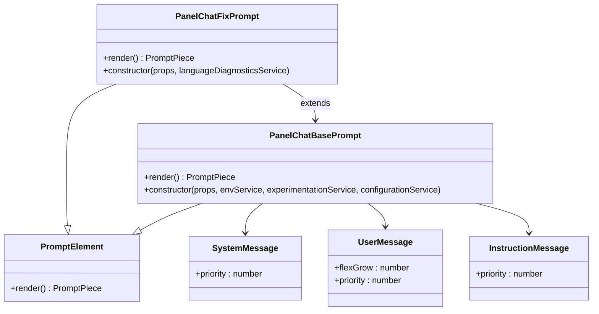
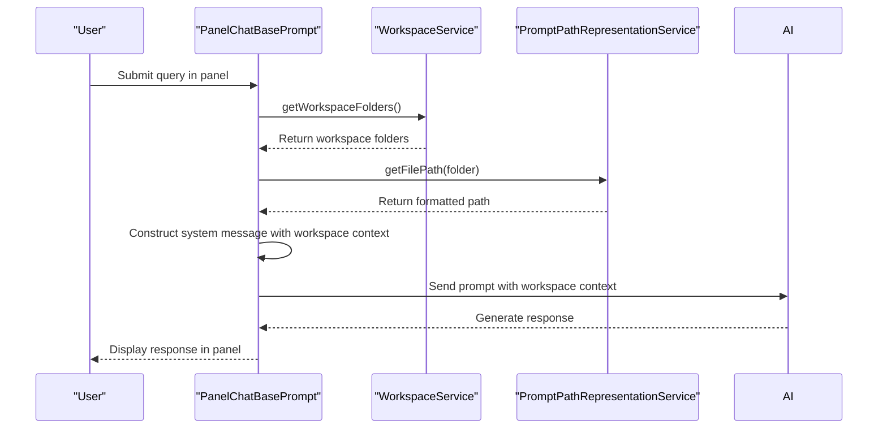
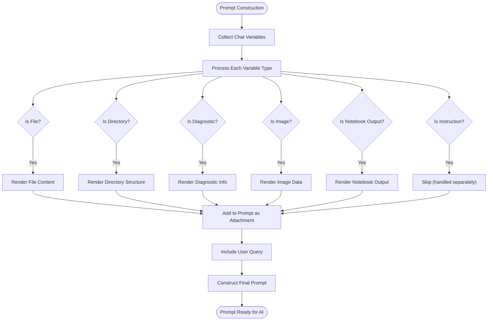
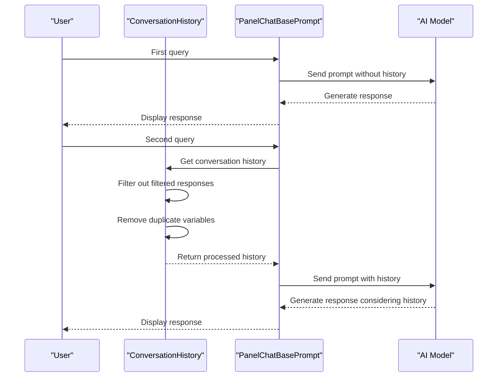
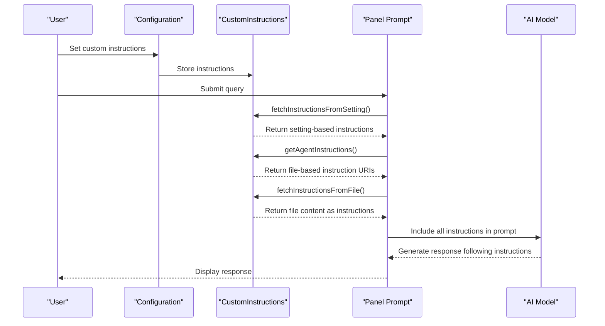
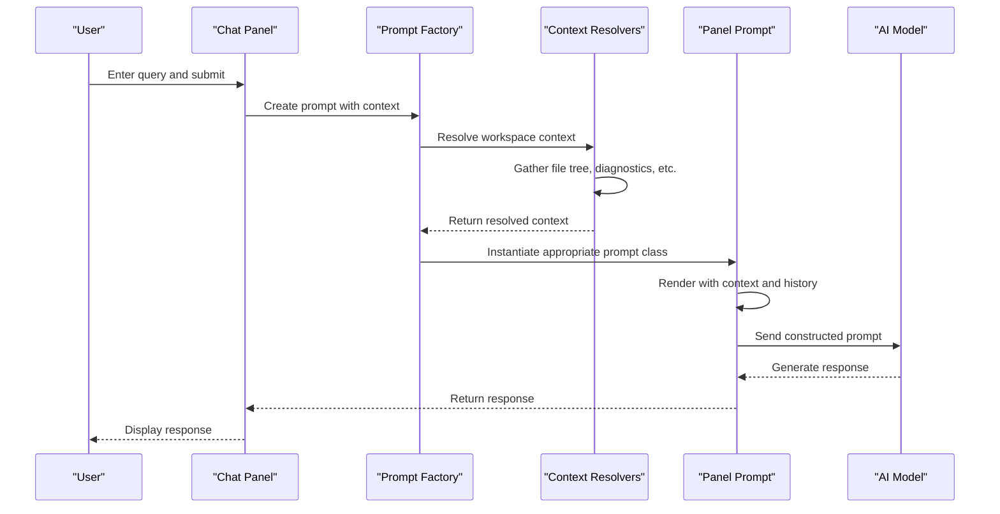
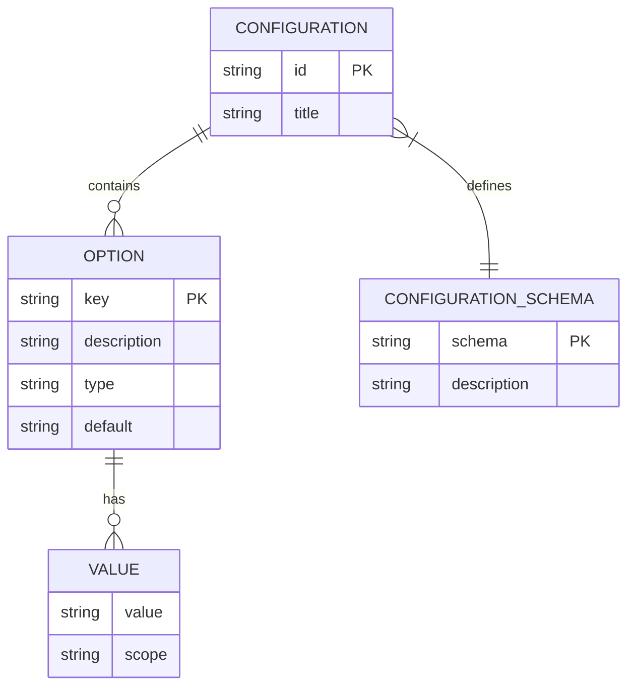

# Panel Prompting

<cite>
**Referenced Files in This Document**   
- [panelChatBasePrompt.tsx](file://src/extension/prompts/node/panel/panelChatBasePrompt.tsx)
- [panelChatFixPrompt.tsx](file://src/extension/prompts/node/panel/panelChatFixPrompt.tsx)
- [conversationHistory.tsx](file://src/extension/prompts/node/panel/conversationHistory.tsx)
- [customInstructions.tsx](file://src/extension/prompts/node/panel/customInstructions.tsx)
- [chatVariables.tsx](file://src/extension/prompts/node/panel/chatVariables.tsx)
- [workspaceFoldersHint.tsx](file://src/extension/prompts/node/panel/workspace/workspaceFoldersHint.tsx)
- [workspacePrompt.tsx](file://src/extension/prompts/node/panel/workspace/workspacePrompt.tsx)
- [customInstructionsService.ts](file://src/platform/customInstructions/common/customInstructionsService.ts)
- [promptPathRepresentationService.ts](file://src/platform/prompts/common/promptPathRepresentationService.ts)
- [workspaceService.ts](file://src/platform/workspace/common/workspaceService.ts)
</cite>

## Table of Contents
1. [Introduction](#introduction)
2. [Panel Prompt Architecture](#panel-prompt-architecture)
3. [Workspace Context Integration](#workspace-context-integration)
4. [Multi-Modal Context Aggregation](#multi-modal-context-aggregation)
5. [Conversation History Management](#conversation-history-management)
6. [Custom Instructions System](#custom-instructions-system)
7. [Panel Interaction Invocation](#panel-interaction-invocation)
8. [Configuration Options](#configuration-options)
9. [Common Issues and Solutions](#common-issues-and-solutions)
10. [Conclusion](#conclusion)

## Introduction

The Panel Prompting system in GitHub Copilot Chat is a sophisticated framework designed to generate rich, context-aware prompts for AI-assisted programming. This system integrates workspace context, conversation history, and custom instructions to provide personalized and accurate responses to user queries. The architecture is built around a component-based approach using the prompt-tsx framework, enabling modular construction of prompts with various contextual elements.

The system operates within the VS Code panel interface, where users can interact with GitHub Copilot through natural language queries. When a user submits a query, the Panel Prompting system orchestrates the collection of relevant context from multiple sources, constructs a comprehensive prompt, and sends it to the AI model for processing. The response is then presented back to the user in the chat panel.

This documentation provides a detailed explanation of the implementation of panel-based prompt generation, workspace context integration, and multi-modal context aggregation. It covers the domain model for workspace structure representation, conversation history management, and custom instruction integration, with concrete examples from the actual codebase.

## Panel Prompt Architecture

The Panel Prompting system follows a component-based architecture built on the prompt-tsx framework, which allows for the composition of prompts using React-like syntax. The core of this architecture is the `PanelChatBasePrompt` class, which serves as the foundation for all panel-based prompts.

**Diagram sources**
- [panelChatBasePrompt.tsx](file://src/extension/prompts/node/panel/panelChatBasePrompt.tsx#L26-L84)
- [panelChatFixPrompt.tsx](file://src/extension/prompts/node/panel/panelChatFixPrompt.tsx#L23-L88)

**Section sources**
- [panelChatBasePrompt.tsx](file://src/extension/prompts/node/panel/panelChatBasePrompt.tsx#L6-L84)
- [panelChatFixPrompt.tsx](file://src/extension/prompts/node/panel/panelChatFixPrompt.tsx#L6-L88)

The `PanelChatBasePrompt` class is responsible for constructing the basic structure of panel prompts. It includes system messages with identity rules, safety rules, and capabilities, as well as user messages containing the actual query and context. The prompt is organized with a priority-based system that determines the order of elements in the final prompt.

Specialized prompt classes like `PanelChatFixPrompt` extend the base class to provide specific functionality for different use cases. For example, the fix prompt includes additional instructions for code generation and diagnostic context when addressing code issues.

## Workspace Context Integration

The Panel Prompting system integrates workspace context through several components that gather and represent the structure of the user's workspace. The `WorkspaceFoldersHint` component provides information about the folders open in the user's workspace, while the `workspaceVisualFileTree` function generates a visual representation of the file structure.

**Diagram sources**
- [workspaceFoldersHint.tsx](file://src/extension/prompts/node/panel/workspace/workspaceFoldersHint.tsx#L10-L27)
- [promptPathRepresentationService.ts](file://src/platform/prompts/common/promptPathRepresentationService.ts)
- [workspaceService.ts](file://src/platform/workspace/common/workspaceService.ts)

**Section sources**
- [workspaceFoldersHint.tsx](file://src/extension/prompts/node/panel/workspace/workspaceFoldersHint.tsx#L1-L27)
- [panelChatBasePrompt.tsx](file://src/extension/prompts/node/panel/panelChatBasePrompt.tsx#L50-L54)

The workspace context integration follows a clear invocation relationship. When a panel prompt is rendered, the `WorkspaceFoldersHint` component retrieves the workspace folders from the `IWorkspaceService` and formats their paths using the `IPromptPathRepresentationService`. This information is then included in the system message of the prompt, informing the AI model about the user's current workspace structure.

The `workspacePrompt.tsx` file contains additional functionality for representing the workspace structure in prompts. It uses the `workspaceVisualFileTree` function to generate a tree representation of the files in a directory, which can be included in prompts when a folder is attached as context. This allows the AI model to understand the organization of files in the workspace, which is particularly useful for navigation and code understanding tasks.

## Multi-Modal Context Aggregation

The Panel Prompting system aggregates context from multiple sources through the `ChatVariablesAndQuery` component, which combines various types of context into a unified prompt structure. This component handles file references, diagnostic information, notebook cell outputs, and other contextual elements.

**Diagram sources**
- [chatVariables.tsx](file://src/extension/prompts/node/panel/chatVariables.tsx#L149-L215)
- [panelChatBasePrompt.tsx](file://src/extension/prompts/node/panel/panelChatBasePrompt.tsx#L75-L79)

**Section sources**
- [chatVariables.tsx](file://src/extension/prompts/node/panel/chatVariables.tsx#L149-L215)
- [panelChatBasePrompt.tsx](file://src/extension/prompts/node/panel/panelChatBasePrompt.tsx#L75-L79)

The multi-modal context aggregation process begins with the `renderChatVariables` function, which iterates through all the variables in the chat context and renders them appropriately based on their type. File variables are rendered with their content and path information, directory variables are rendered with their file tree structure, and diagnostic variables are rendered with error information and suggested fixes.

The system uses a tagging system to categorize different types of context in the prompt. Attachments are wrapped in `<Tag name='attachment'>` elements, instructions in `<Tag name='instructions'>`, and codebase tool instructions in `<Tag name='codebaseToolInstructions'>`. This tagging system helps the AI model understand the nature of each piece of context and how to use it appropriately.

## Conversation History Management

The Panel Prompting system manages conversation history through the `HistoryWithInstructions` and `ConversationHistory` components, which handle the inclusion of previous interactions in the current prompt. This allows the AI model to maintain context across multiple turns of a conversation.

**Diagram sources**
- [conversationHistory.tsx](file://src/extension/prompts/node/panel/conversationHistory.tsx#L45-L101)
- [panelChatBasePrompt.tsx](file://src/extension/prompts/node/panel/panelChatBasePrompt.tsx#L55-L56)

**Section sources**
- [conversationHistory.tsx](file://src/extension/prompts/node/panel/conversationHistory.tsx#L45-L101)
- [panelChatBasePrompt.tsx](file://src/extension/prompts/node/panel/panelChatBasePrompt.tsx#L55-L56)

The conversation history management system uses a token limit of 32,768 to prevent excessive context from being included in the prompt. This limit helps maintain performance while still allowing for substantial conversation history. The system also filters out turns that were filtered due to prompt filtration, ensuring that only relevant history is included.

A key feature of the conversation history system is the removal of duplicate variables. The `removeDuplicateVars` function compares variables in the history with those in the current turn and following messages, removing any duplicates. This prevents redundant information from being included in the prompt and helps maintain clarity.

The `HistoryWithInstructions` component is designed to handle the placement of instructions relative to the history, depending on the model's preferences. Some models perform better when instructions come after the history, while others prefer them before. The component uses the `modelPrefersInstructionsAfterHistory` function to determine the correct order.

## Custom Instructions System

The custom instructions system allows users to personalize GitHub Copilot's behavior by providing specific guidance on how the AI should respond to requests. This system is implemented through the `CustomInstructions` component, which collects instructions from various sources and includes them in the prompt.

**Diagram sources**
- [customInstructions.tsx](file://src/extension/prompts/node/panel/customInstructions.tsx#L49-L122)
- [customInstructionsService.ts](file://src/platform/customInstructions/common/customInstructionsService.ts#L46-L247)

**Section sources**
- [customInstructions.tsx](file://src/extension/prompts/node/panel/customInstructions.tsx#L49-L122)
- [customInstructionsService.ts](file://src/platform/customInstructions/common/customInstructionsService.ts#L1-L247)

The custom instructions system supports multiple methods for defining instructions, including direct configuration settings and external files. Instructions can be defined in the user's settings with keys like `chat.codeGeneration.instructions` for general code generation instructions, or `chat.testGeneration.instructions` for test generation instructions.

The system also supports loading instructions from external files, which is enabled by default through the `chat.codeGeneration.useInstructionFiles` setting. When enabled, Copilot automatically looks for instruction files in the workspace, with the default location being `.github/copilot-instructions.md` in the workspace root. Users can also define custom locations through the `chat.instructionsFilesLocations` setting.

When processing a request, the custom instructions system collects instructions from all available sources and combines them into a unified context for the AI. The collection process follows a specific order: workspace folder level instructions, workspace level instructions, and then global level instructions. This ensures that more specific (local) instructions take precedence over general ones.

## Panel Interaction Invocation

The invocation relationship between chat panel interactions, workspace context gathering, and comprehensive prompt construction follows a well-defined flow. When a user interacts with the chat panel, a series of components are invoked to gather context and construct the final prompt.

**Diagram sources**
- [panelChatBasePrompt.tsx](file://src/extension/prompts/node/panel/panelChatBasePrompt.tsx#L29-L84)
- [conversationHistory.tsx](file://src/extension/prompts/node/panel/conversationHistory.tsx#L45-L101)
- [customInstructions.tsx](file://src/extension/prompts/node/panel/customInstructions.tsx#L49-L122)

**Section sources**
- [panelChatBasePrompt.tsx](file://src/extension/prompts/node/panel/panelChatBasePrompt.tsx#L29-L84)
- [conversationHistory.tsx](file://src/extension/prompts/node/panel/conversationHistory.tsx#L45-L101)

The invocation begins when a user submits a query in the chat panel. The prompt factory system determines the appropriate prompt class to use based on the context and intent of the query. For example, a query about fixing code issues would use the `PanelChatFixPrompt` class, while a general query would use the `PanelChatBasePrompt` class.

Once the prompt class is determined, the context resolvers are invoked to gather relevant information from the workspace. This includes the current file, selected code, diagnostics, and other contextual elements. The resolved context is then passed to the prompt constructor, which uses it to render the final prompt.

The rendering process follows a specific order, with system messages and instructions rendered first, followed by the conversation history, and finally the user message with the current query and context. This order ensures that the AI model receives the necessary context before processing the user's query.

## Configuration Options

The Panel Prompting system provides several configuration options that control the behavior of workspace context integration and panel interactions. These options are exposed through the extension's configuration system and can be customized by users to suit their preferences.

**Diagram sources**
- [configurationService.ts](file://src/platform/configuration/common/configurationService.ts)
- [customInstructionsService.ts](file://src/platform/customInstructions/common/customInstructionsService.ts#L46-L247)

**Section sources**
- [customInstructionsService.ts](file://src/platform/customInstructions/common/customInstructionsService.ts#L46-L247)

Key configuration options for workspace context include:

- `chat.codeGeneration.useInstructionFiles`: Enables or disables loading custom instructions from files
- `chat.instructionsFilesLocations`: Specifies custom locations for instruction files
- `chat.codeGeneration.instructions`: Defines inline custom instructions for code generation
- `chat.testGeneration.instructions`: Defines inline custom instructions for test generation
- `chat.commitMessageGeneration.instructions`: Defines inline custom instructions for commit message generation
- `chat.pullRequestDescriptionGeneration.instructions`: Defines inline custom instructions for pull request description generation

These configuration options allow users to customize the behavior of GitHub Copilot to match their coding standards and project conventions. For example, a team might create a `.github/copilot-instructions.md` file with guidelines for code style, naming conventions, and documentation standards, which would then be applied to all Copilot suggestions in that workspace.

## Common Issues and Solutions

The Panel Prompting system addresses several common issues that can arise in AI-assisted programming, including context overload, conversation drift, and instruction conflicts.

### Context Overload

Context overload occurs when too much information is included in a prompt, potentially overwhelming the AI model or exceeding token limits. The system addresses this through several mechanisms:

- Token limiting: The `ConversationHistory` component limits the history to 32,768 tokens to prevent excessive context from being included
- Duplicate removal: The `removeDuplicateVars` function eliminates redundant variables from the history
- Priority-based rendering: Elements are rendered with priorities that determine their inclusion in the final prompt

### Conversation Drift

Conversation drift occurs when a conversation loses focus or context over multiple turns. The system mitigates this through:

- History summarization: Long conversations are summarized to maintain the most important information while keeping the prompt prefix stable
- Variable substitution: The `UserQuery` component substitutes variables with references, maintaining consistency across turns
- Context preservation: The system preserves the most relevant context from previous turns while filtering out less relevant information

### Instruction Conflicts

Instruction conflicts can occur when custom instructions contradict system messages or when multiple instructions provide conflicting guidance. The system handles this through:

- Precedence rules: More specific (local) instructions take precedence over general ones
- Conflict warnings: The `CustomInstructions` component includes a warning that instructions can be ignored if they contradict system messages
- Deduplication: The system removes duplicate instructions to prevent conflicting guidance from being applied multiple times

These solutions ensure that the Panel Prompting system provides reliable and consistent responses while maintaining the flexibility to adapt to different coding contexts and user preferences.

## Conclusion

The Panel Prompting system in GitHub Copilot Chat represents a sophisticated approach to AI-assisted programming, integrating workspace context, conversation history, and custom instructions to provide personalized and accurate responses. Through its component-based architecture built on the prompt-tsx framework, the system is able to construct rich, context-aware prompts that enable the AI model to understand the user's coding environment and intentions.

The system's design emphasizes modularity and extensibility, allowing for the addition of new context types and prompt variations without disrupting existing functionality. By carefully managing the inclusion of context and conversation history, the system avoids common issues like context overload and conversation drift while providing users with the ability to customize the AI's behavior through custom instructions.

For developers looking to understand or extend the Panel Prompting system, the key components to focus on are the prompt classes (`PanelChatBasePrompt`, `PanelChatFixPrompt`), the context aggregation components (`ChatVariablesAndQuery`, `CustomInstructions`), and the conversation history management components (`ConversationHistory`, `HistoryWithInstructions`). These components work together to create a seamless experience that helps developers write better code more efficiently.