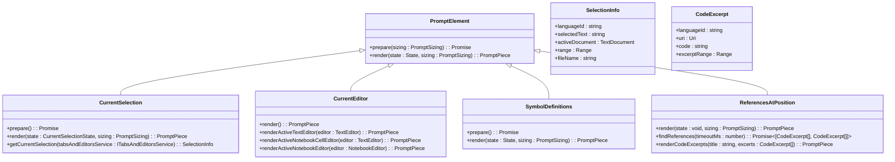

# Selection Context Prompting

<cite>
**Referenced Files in This Document**   
- [currentSelection.tsx](file://src/extension/prompts/node/panel/currentSelection.tsx)
- [currentEditor.tsx](file://src/extension/prompts/node/panel/currentEditor.tsx)
- [symbolDefinitions.tsx](file://src/extension/prompts/node/panel/symbolDefinitions.tsx)
- [referencesAtPosition.tsx](file://src/extension/prompts/node/panel/referencesAtPosition.tsx)
- [selectionContextHelpers.ts](file://src/extension/context/node/resolvers/selectionContextHelpers.ts)
- [panelChatBasePrompt.tsx](file://src/extension/prompts/node/panel/panelChatBasePrompt.tsx)
</cite>

## Table of Contents
1. [Introduction](#introduction)
2. [Domain Model for Selection Context](#domain-model-for-selection-context)
3. [Code Selection Context Extraction](#code-selection-context-extraction)
4. [Editor State Capture](#editor-state-capture)
5. [Symbol Reference Aggregation](#symbol-reference-aggregation)
6. [Prompt Construction Workflow](#prompt-construction-workflow)
7. [Configuration Options and Parameters](#configuration-options-and-parameters)
8. [Component Relationships and Integration](#component-relationships-and-integration)
9. [Common Issues and Solutions](#common-issues-and-solutions)
10. [Conclusion](#conclusion)

## Introduction

The Selection Context Prompting system in GitHub Copilot Chat is a sophisticated mechanism designed to provide AI assistants with precise contextual information about the user's current code selection, editor state, and related symbols. This system enables Copilot to generate more accurate and relevant responses by understanding exactly what code the user is interacting with and its surrounding context. The implementation leverages a combination of editor integration, language server capabilities, and advanced parsing techniques to extract and aggregate contextual information for panel-based interactions.

The system is particularly important for maintaining context awareness during chat interactions, ensuring that the AI assistant understands not just the user's query but also the specific code elements being referenced. This documentation provides a comprehensive analysis of the implementation, focusing on the core components that handle selection context extraction, editor state capture, and symbol reference aggregation.

**Section sources**
- [currentSelection.tsx](file://src/extension/prompts/node/panel/currentSelection.tsx#L1-L109)
- [currentEditor.tsx](file://src/extension/prompts/node/panel/currentEditor.tsx#L1-L187)

## Domain Model for Selection Context

The Selection Context Prompting system implements a well-defined domain model that represents the various aspects of code context that can be captured and provided to the AI assistant. This model consists of three primary components: current selection, active editor state, and symbol references. Each component serves a specific purpose in building a comprehensive understanding of the user's current coding context.

The domain model is implemented through a series of TypeScript classes that extend the `PromptElement` base class from the `@vscode/prompt-tsx` library. These classes follow a consistent pattern of having a `prepare` method for asynchronous state preparation and a `render` method for generating the final prompt representation. The model captures not only the raw code content but also metadata such as file paths, language identifiers, and reference locations, which are crucial for maintaining context in the AI's responses.

The system distinguishes between different types of context: direct selection context (the code actively selected by the user), ambient editor context (the visible portion of the currently active file), and semantic context (related symbols and their definitions). This multi-layered approach allows the system to provide varying levels of detail based on the user's interaction and the AI's requirements.



**Diagram sources **
- [currentSelection.tsx](file://src/extension/prompts/node/panel/currentSelection.tsx#L29-L108)
- [currentEditor.tsx](file://src/extension/prompts/node/panel/currentEditor.tsx#L24-L186)
- [symbolDefinitions.tsx](file://src/extension/prompts/node/panel/symbolDefinitions.tsx#L46-L148)
- [referencesAtPosition.tsx](file://src/extension/prompts/node/panel/referencesAtPosition.tsx#L47-L168)

**Section sources**
- [currentSelection.tsx](file://src/extension/prompts/node/panel/currentSelection.tsx#L1-L109)
- [currentEditor.tsx](file://src/extension/prompts/node/panel/currentEditor.tsx#L1-L187)
- [symbolDefinitions.tsx](file://src/extension/prompts/node/panel/symbolDefinitions.tsx#L1-L171)
- [referencesAtPosition.tsx](file://src/extension/prompts/node/panel/referencesAtPosition.tsx#L1-L169)

## Code Selection Context Extraction

The code selection context extraction mechanism is implemented in the `CurrentSelection` class, which captures the user's current code selection and incorporates it into the prompt context. This component is responsible for extracting the selected code, validating its size against token budget constraints, and formatting it appropriately for inclusion in AI prompts.

The extraction process begins with the `getCurrentSelection` static method, which retrieves the active text editor from the `ITabsAndEditorsService` and extracts the current selection range. It then obtains the selected text using the `getText` method of the document object, along with metadata such as the language identifier and file name. This information is packaged into a `SelectionInfo` object that contains all the necessary context for the selected code.

A critical aspect of the selection context extraction is the token budget validation performed in the `prepare` method. Before rendering the selection, the system calculates the token count of the selected text and compares it against the available token budget. If the selection exceeds the budget (multiplied by a 1.1 safety factor), the system sets the `exceedsTokenBudget` flag in the state, which triggers a warning message instead of including the full selection in the prompt. This prevents the prompt from exceeding the model's maximum context size, which could lead to truncation or failure.

When rendering the selection context, the system includes the file path in a human-readable format using `path.basename()` and wraps the code in a `CodeBlock` component that preserves syntax highlighting information and establishes reference links. The reference is created using the `PromptReference` class with the document URI and selection range, enabling the AI to understand the exact location of the code within the project structure.


**Diagram sources **
- [currentSelection.tsx](file://src/extension/prompts/node/panel/currentSelection.tsx#L40-L87)

**Section sources**
- [currentSelection.tsx](file://src/extension/prompts/node/panel/currentSelection.tsx#L1-L109)

## Editor State Capture

The editor state capture functionality is implemented in the `CurrentEditor` class, which provides context about the currently active editor when no explicit selection is made. This component serves as a fallback mechanism when the user hasn't selected any code, ensuring that the AI assistant still has relevant context about the user's current focus.

The `CurrentEditor` class handles three distinct scenarios: active text editors, active notebook cell editors, and active notebook editors. The primary method, `render`, first checks for an active text editor through the `ITabsAndEditorsService`. If found, it delegates to `renderActiveTextEditor`, which extracts the visible ranges of the editor and renders excerpts from those ranges. For notebook scenarios, it provides specialized rendering through `renderActiveNotebookCellEditor` and `renderActiveNotebookEditor` methods.

A key feature of the editor state capture is its handling of visible ranges. Instead of including the entire file content, which could quickly exceed token limits, the system only includes code from the currently visible portions of the editor. This is achieved by iterating through the `visibleRanges` property of the text editor and extracting text for each range. This approach ensures that the most relevant code—the code currently in the user's view—is prioritized in the context.

The system also implements several validation checks to handle edge cases. It first checks if the document is ignored via the `IIgnoreService`, in which case it returns an `ignoredFiles` marker instead of the content. It also checks if the document is empty or contains only whitespace, in which case it renders a special message indicating that the file is empty. These checks prevent the system from including irrelevant or problematic content in the prompt context.


**Diagram sources **
- [currentEditor.tsx](file://src/extension/prompts/node/panel/currentEditor.tsx#L36-L186)

**Section sources**
- [currentEditor.tsx](file://src/extension/prompts/node/panel/currentEditor.tsx#L1-L187)

## Symbol Reference Aggregation

The symbol reference aggregation system is implemented across multiple components, with the `SymbolDefinitions` and `ReferencesAtPosition` classes providing complementary approaches to gathering related code elements. This system enhances the selection context by including not just the selected code but also relevant definitions, implementations, and usages of symbols within the selection.

The `SymbolDefinitions` class implements a comprehensive approach to finding related symbols by searching for function implementations, class declarations, and type declarations referenced in the current selection. It uses a timeout mechanism (default 200ms) to ensure responsiveness, with different behavior in test mode. The aggregation process involves three main steps: parsing the selection for relevant expressions using Tree-sitter, querying the language features service for definitions and implementations, and expanding the results to include full function or class bodies using Tree-sitter analysis.

A key implementation detail is the use of `asyncComputeWithTimeBudget` from the `selectionContextHelpers` module, which ensures that each computation stays within the specified timeout. This function combines timeout handling with document version validation, retrying computations if the document changes during processing. This prevents race conditions when the user is actively editing code while interacting with Copilot.

The `ReferencesAtPosition` class provides a more focused approach, finding references at a specific cursor position rather than across a selection range. It queries the language features service for references and then uses Tree-sitter to expand identifier references to full code blocks (function calls or definitions). This implementation includes a special feature where file paths are embedded as comments in the code excerpts using the `FilePathCodeMarker` class, making it easier for the AI to understand the origin of each code snippet.


**Diagram sources **
- [symbolDefinitions.tsx](file://src/extension/prompts/node/panel/symbolDefinitions.tsx#L46-L148)
- [referencesAtPosition.tsx](file://src/extension/prompts/node/panel/referencesAtPosition.tsx#L47-L168)
- [selectionContextHelpers.ts](file://src/extension/context/node/resolvers/selectionContextHelpers.ts#L1-L349)

**Section sources**
- [symbolDefinitions.tsx](file://src/extension/prompts/node/panel/symbolDefinitions.tsx#L1-L171)
- [referencesAtPosition.tsx](file://src/extension/prompts/node/panel/referencesAtPosition.tsx#L1-L169)
- [selectionContextHelpers.ts](file://src/extension/context/node/resolvers/selectionContextHelpers.ts#L1-L349)

## Prompt Construction Workflow

The prompt construction workflow in the Selection Context Prompting system follows a well-defined sequence of operations that begins with user interaction and culminates in the generation of a comprehensive AI prompt. This workflow integrates the various context components to create a rich, multi-layered context that enables the AI assistant to provide highly relevant responses.

The workflow begins when the user initiates a chat interaction, typically by selecting code and invoking Copilot. The system first determines whether there is an active selection by calling `getCurrentSelection` on the `CurrentSelection` class. If a selection exists and is within the token budget, it becomes the primary context. If no selection exists or the selection is too large, the system falls back to the active editor context via the `CurrentEditor` class.

Once the primary code context is established, the system enriches it with semantic information by invoking the symbol reference aggregation components. The `SymbolDefinitions` class analyzes the selection to find related function implementations, class declarations, and type declarations, while the `ReferencesAtPosition` class can provide additional context about symbol usages at specific positions. These components work in parallel to maximize efficiency and minimize latency.

The final prompt construction occurs in the `PanelChatBasePrompt` class, which orchestrates the inclusion of all context elements. It combines the code context with system instructions, conversation history, custom instructions, and workspace information to create a comprehensive prompt. The `ChatVariablesAndQuery` component specifically handles the inclusion of the selection context with the `includeFilepath` parameter set to true, ensuring that file paths are preserved in the prompt.


**Diagram sources **
- [currentSelection.tsx](file://src/extension/prompts/node/panel/currentSelection.tsx#L40-L87)
- [currentEditor.tsx](file://src/extension/prompts/node/panel/currentEditor.tsx#L36-L186)
- [symbolDefinitions.tsx](file://src/extension/prompts/node/panel/symbolDefinitions.tsx#L64-L102)
- [referencesAtPosition.tsx](file://src/extension/prompts/node/panel/referencesAtPosition.tsx#L63-L87)
- [panelChatBasePrompt.tsx](file://src/extension/prompts/node/panel/panelChatBasePrompt.tsx#L39-L84)

**Section sources**
- [currentSelection.tsx](file://src/extension/prompts/node/panel/currentSelection.tsx#L1-L109)
- [currentEditor.tsx](file://src/extension/prompts/node/panel/currentEditor.tsx#L1-L187)
- [symbolDefinitions.tsx](file://src/extension/prompts/node/panel/symbolDefinitions.tsx#L1-L171)
- [referencesAtPosition.tsx](file://src/extension/prompts/node/panel/referencesAtPosition.tsx#L1-L169)
- [panelChatBasePrompt.tsx](file://src/extension/prompts/node/panel/panelChatBasePrompt.tsx#L1-L85)

## Configuration Options and Parameters

The Selection Context Prompting system provides several configuration options and parameters that control its behavior and sensitivity to different selection types. These options allow the system to adapt to various use cases and performance requirements while maintaining a consistent user experience.

One of the primary configuration parameters is the token budget sensitivity, which determines how aggressively the system handles large selections. This is implemented through the `tokenBudget` property in the `PromptSizing` object, which is compared against the estimated token count of the selection (multiplied by a 1.1 safety factor). When a selection exceeds this budget, the system provides a user-friendly message suggesting they reduce the selection size rather than silently truncating the content.

For different selection types, the system applies varying processing logic. Single-line selections are handled efficiently with minimal overhead, while multi-line and block selections trigger more comprehensive analysis including symbol reference aggregation. The system distinguishes between these types through the `Range` object properties, particularly the difference between start and end line numbers and character positions.

The timeout configuration for symbol analysis is another important parameter, with a default value of 200ms defined in both `SymbolDefinitions` and `ReferencesAtPosition` classes. This timeout can be overridden via the `timeoutMs` property in the component props, allowing specific use cases to request longer or shorter analysis periods. In test mode, the timeout is effectively disabled when running automated scenarios to ensure reliable test execution.

Additional parameters include the `includeFilepath` boolean flag, which controls whether file paths are included in the rendered context, and the `embeddedInsideUserMessage` setting that determines how symbol definitions are formatted within the prompt. These parameters provide flexibility in how the context is presented to the AI assistant, allowing for optimization based on the specific requirements of different chat scenarios.

**Section sources**
- [currentSelection.tsx](file://src/extension/prompts/node/panel/currentSelection.tsx#L48-L50)
- [symbolDefinitions.tsx](file://src/extension/prompts/node/panel/symbolDefinitions.tsx#L48-L49)
- [referencesAtPosition.tsx](file://src/extension/prompts/node/panel/referencesAtPosition.tsx#L48-L49)
- [selectionContextHelpers.ts](file://src/extension/context/node/resolvers/selectionContextHelpers.ts#L22-L230)

## Component Relationships and Integration

The Selection Context Prompting system demonstrates a well-architected integration of multiple components that work together to provide comprehensive context for AI assistance. The relationships between these components follow a clear hierarchy and dependency structure that enables modular design while maintaining cohesive functionality.

At the core of the integration is the dependency injection pattern used throughout the components, with services like `IIgnoreService`, `ILogService`, `ITabsAndEditorsService`, `IParserService`, and `ILanguageFeaturesService` being injected into the constructors of the context components. This pattern promotes loose coupling and makes the components easier to test and maintain. The services provide access to essential functionality such as editor state, parsing capabilities, and language server features.

The integration with the language server is particularly important for semantic context gathering. The `ILanguageFeaturesService` interface provides access to language server capabilities like definition finding, reference searching, and implementation location. This integration allows the system to go beyond simple text-based analysis and understand the semantic relationships between code elements, which is crucial for providing meaningful context to the AI assistant.

The system also integrates with the editor's real-time state through the `ITabsAndEditorsService`, which provides access to the active text editor, selection state, and visible ranges. This integration enables the system to capture the user's current focus accurately and respond to changes in the editor state immediately. The use of `TextDocumentSnapshot` objects ensures that the context is captured at a specific point in time, preventing issues that could arise from concurrent edits during the context gathering process.

```mermaid
graph TD
subgraph "Context Components"
CS[CurrentSelection]
CE[CurrentEditor]
SD[SymbolDefinitions]
RP[ReferencesAtPosition]
end
subgraph "Core Services"
TES[ITabsAndEditorsService]
LS[ILanguageFeaturesService]
PS[IParserService]
IS[IIgnoreService]
LOG[ILogService]
WS[IWorkspaceService]
end
subgraph "External Systems"
LSVC[Language Server]
EDITOR[VS Code Editor]
WORKSPACE[Workspace]
end
CS --> TES : "Gets active editor and selection"
CE --> TES : "Gets active editor and visible ranges"
SD --> TES : "Gets active editor if needed"
RP --> TES : "Not directly dependent"
SD --> LS : "Finds definitions and implementations"
RP --> LS : "Finds references at position"
LS --> LSVC : "Delegates to language server"
SD --> PS : "Parses code with Tree-sitter"
RP --> PS : "Parses code with Tree-sitter"
PS --> TES : "Gets document content"
CS --> IS : "Checks if file is ignored"
CE --> IS : "Checks if file is ignored"
SD --> IS : "Checks if file is ignored"
RP --> IS : "Checks if file is ignored"
CS --> LOG : "Logs large selection warnings"
SD --> LOG : "Logs analysis progress"
RP --> LOG : "Logs reference findings"
SD --> WS : "Opens documents for analysis"
RP --> WS : "Opens documents for analysis"
TES --> EDITOR : "Reflects editor state"
WS --> WORKSPACE : "Accesses workspace files"
```

**Diagram sources **
- [currentSelection.tsx](file://src/extension/prompts/node/panel/currentSelection.tsx#L33-L35)
- [currentEditor.tsx](file://src/extension/prompts/node/panel/currentEditor.tsx#L27-L31)
- [symbolDefinitions.tsx](file://src/extension/prompts/node/panel/symbolDefinitions.tsx#L52-L59)
- [referencesAtPosition.tsx](file://src/extension/prompts/node/panel/referencesAtPosition.tsx#L52-L58)

**Section sources**
- [currentSelection.tsx](file://src/extension/prompts/node/panel/currentSelection.tsx#L1-L109)
- [currentEditor.tsx](file://src/extension/prompts/node/panel/currentEditor.tsx#L1-L187)
- [symbolDefinitions.tsx](file://src/extension/prompts/node/panel/symbolDefinitions.tsx#L1-L171)
- [referencesAtPosition.tsx](file://src/extension/prompts/node/panel/referencesAtPosition.tsx#L1-L169)

## Common Issues and Solutions

The Selection Context Prompting system addresses several common issues that arise in AI-assisted coding environments, implementing robust solutions to ensure reliable and effective context provision. These issues range from technical limitations like token budget constraints to usability concerns like context boundary definition.

One of the most common issues is handling large selections that exceed the AI model's context window. The system addresses this through a multi-faceted approach: first, it detects when a selection exceeds the token budget during the `prepare` phase; second, it provides a clear user message explaining the issue and suggesting they reduce the selection size; and third, it falls back to the active editor context when appropriate. This approach prevents silent failures while educating users about optimal selection practices.

Another common issue is maintaining context consistency when the user is actively editing code. The system mitigates this through the `asyncComputeWithValidDocumentVersion` function, which checks if the document has changed during context processing. If a change is detected, the system retries the computation up to three times before returning a default value. This ensures that the context reflects the code state at a consistent point in time, even when the user is making rapid edits.

For handling ignored files, the system implements a comprehensive check using the `IIgnoreService` to determine if a file should be excluded from context. When an ignored file is detected, the system renders an `ignoredFiles` marker instead of the content, preserving the fact that a file was considered while respecting user preferences. This prevents sensitive or irrelevant code from being included in AI prompts while maintaining transparency about what was excluded.

The system also addresses performance concerns through timeout mechanisms and efficient parsing strategies. By limiting symbol analysis to 200ms by default and using Tree-sitter for fast, incremental parsing, the system provides responsive feedback without blocking the UI. For languages without Tree-sitter support, it falls back to indentation-based structure analysis, ensuring basic functionality is maintained across all language types.

**Section sources**
- [currentSelection.tsx](file://src/extension/prompts/node/panel/currentSelection.tsx#L44-L53)
- [selectionContextHelpers.ts](file://src/extension/context/node/resolvers/selectionContextHelpers.ts#L295-L312)
- [currentEditor.tsx](file://src/extension/prompts/node/panel/currentEditor.tsx#L58-L60)
- [selectionContextHelpers.ts](file://src/extension/context/node/resolvers/selectionContextHelpers.ts#L270-L280)

## Conclusion

The Selection Context Prompting system in GitHub Copilot Chat represents a sophisticated implementation of context-aware AI assistance, combining editor integration, language server capabilities, and advanced code analysis to provide rich, relevant context for AI responses. The system's architecture demonstrates careful consideration of both technical requirements and user experience, balancing comprehensive context gathering with performance constraints and usability concerns.

Key strengths of the implementation include its modular design with well-defined components for different aspects of context (selection, editor state, symbol references), its robust handling of edge cases like large selections and ignored files, and its efficient use of resources through timeout mechanisms and document version validation. The system successfully addresses the fundamental challenge of providing AI assistants with sufficient context to generate helpful responses while operating within the constraints of token limits and real-time performance requirements.

For developers looking to understand or extend this system, the codebase provides clear entry points and well-documented patterns. The use of dependency injection makes components easy to test and modify, while the consistent pattern of `prepare` and `render` methods creates a predictable interface across different context types. The integration with both the editor's real-time state and the language server's semantic understanding creates a powerful foundation for intelligent code assistance that goes beyond simple text-based analysis.