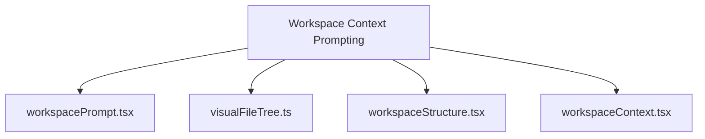
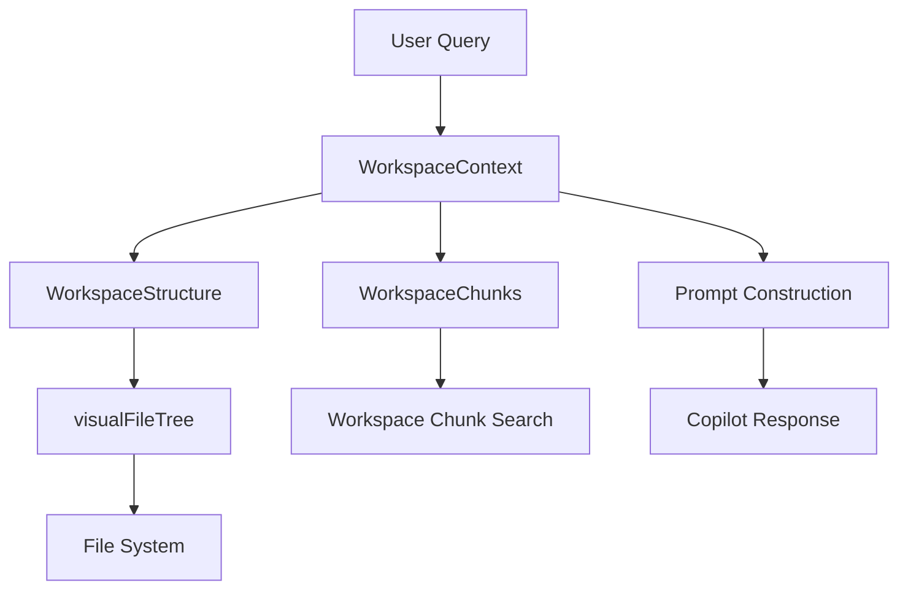
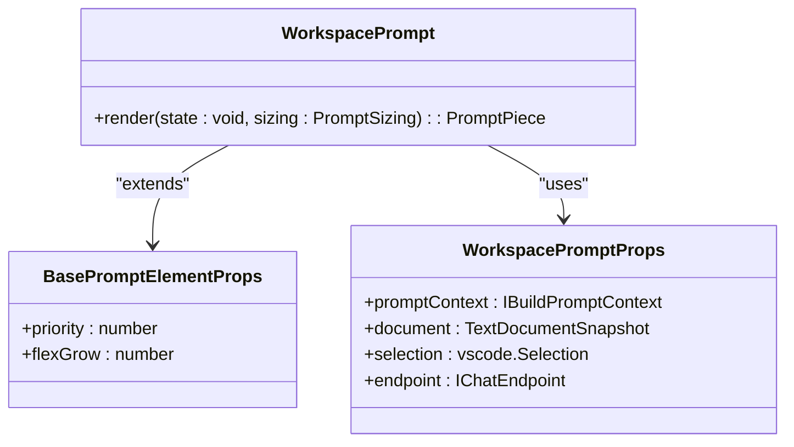
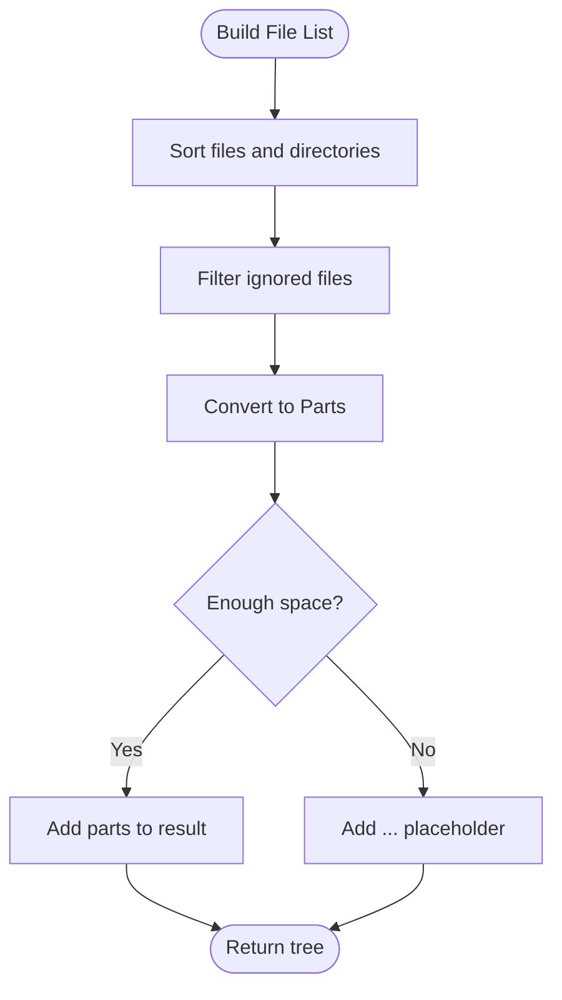
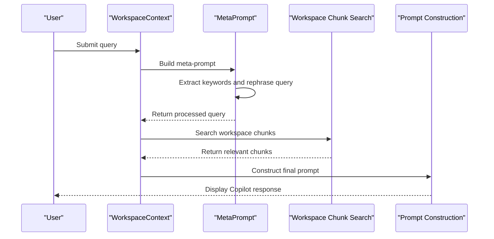
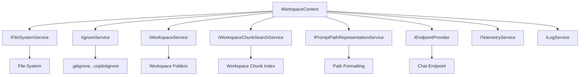

# Workspace Context Prompting

<cite>
**Referenced Files in This Document**   
- [workspacePrompt.tsx](file://src/extension/prompts/node/panel/workspace/workspacePrompt.tsx)
- [visualFileTree.ts](file://src/extension/prompts/node/panel/workspace/visualFileTree.ts)
- [workspaceStructure.tsx](file://src/extension/prompts/node/panel/workspace/workspaceStructure.tsx)
- [workspaceContext.tsx](file://src/extension/prompts/node/panel/workspace/workspaceContext.tsx)
</cite>

## Table of Contents
1. [Introduction](#introduction)
2. [Project Structure](#project-structure)
3. [Core Components](#core-components)
4. [Architecture Overview](#architecture-overview)
5. [Detailed Component Analysis](#detailed-component-analysis)
6. [Dependency Analysis](#dependency-analysis)
7. [Performance Considerations](#performance-considerations)
8. [Troubleshooting Guide](#troubleshooting-guide)
9. [Conclusion](#conclusion)

## Introduction
The Workspace Context Prompting system in GitHub Copilot Chat provides intelligent code assistance by representing workspace structure, serializing file trees, and aggregating project context for panel-based interactions. This system enables Copilot to understand the user's workspace and provide relevant, context-aware responses. The implementation involves a sophisticated domain model for workspace structure representation, file system traversal, and prompt construction that allows Copilot to answer questions about specific files, functions, and classes within the user's project.

**Section sources**
- [workspacePrompt.tsx](file://src/extension/prompts/node/panel/workspace/workspacePrompt.tsx#L1-L100)

## Project Structure
The workspace context prompting functionality is organized within the `src/extension/prompts/node/panel/workspace/` directory. This structure contains the core components responsible for workspace representation and context aggregation. The key files include `workspacePrompt.tsx` (the main entry point), `visualFileTree.ts` (responsible for file tree serialization), `workspaceStructure.tsx` (managing project topology), and `workspaceContext.tsx` (handling context gathering and prompt construction).



**Diagram sources**
- [workspacePrompt.tsx](file://src/extension/prompts/node/panel/workspace/workspacePrompt.tsx)
- [visualFileTree.ts](file://src/extension/prompts/node/panel/workspace/visualFileTree.ts)
- [workspaceStructure.tsx](file://src/extension/prompts/node/panel/workspace/workspaceStructure.tsx)
- [workspaceContext.tsx](file://src/extension/prompts/node/panel/workspace/workspaceContext.tsx)

**Section sources**
- [workspacePrompt.tsx](file://src/extension/prompts/node/panel/workspace/workspacePrompt.tsx)
- [visualFileTree.ts](file://src/extension/prompts/node/panel/workspace/visualFileTree.ts)
- [workspaceStructure.tsx](file://src/extension/prompts/node/panel/workspace/workspaceStructure.tsx)
- [workspaceContext.tsx](file://src/extension/prompts/node/panel/workspace/workspaceContext.tsx)

## Core Components
The Workspace Context Prompting system consists of four main components that work together to provide rich context to Copilot. The `WorkspacePrompt` class serves as the top-level component that orchestrates the entire process. The `visualFileTree` function creates hierarchical file tree contexts, while `WorkspaceStructure` manages the project topology. Finally, `WorkspaceContext` handles the aggregation of workspace metadata and the construction of prompts.

**Section sources**
- [workspacePrompt.tsx](file://src/extension/prompts/node/panel/workspace/workspacePrompt.tsx#L23-L100)
- [visualFileTree.ts](file://src/extension/prompts/node/panel/workspace/visualFileTree.ts#L1-L182)
- [workspaceStructure.tsx](file://src/extension/prompts/node/panel/workspace/workspaceStructure.tsx#L1-L168)
- [workspaceContext.tsx](file://src/extension/prompts/node/panel/workspace/workspaceContext.tsx#L1-L445)

## Architecture Overview
The Workspace Context Prompting system follows a layered architecture where each component has a specific responsibility. The system begins with workspace metadata extraction, proceeds through file system traversal, and culminates in prompt construction. This architecture enables Copilot to understand the user's workspace and provide contextually relevant responses.



**Diagram sources**
- [workspaceContext.tsx](file://src/extension/prompts/node/panel/workspace/workspaceContext.tsx#L245-L445)
- [workspaceStructure.tsx](file://src/extension/prompts/node/panel/workspace/workspaceStructure.tsx#L20-L168)
- [visualFileTree.ts](file://src/extension/prompts/node/panel/workspace/visualFileTree.ts#L43-L182)

## Detailed Component Analysis

### Workspace Prompt Analysis
The `WorkspacePrompt` component serves as the entry point for workspace context prompting. It combines system messages, conversation history, custom instructions, and workspace context to create a comprehensive prompt for Copilot. The component includes specific rules for Copilot's behavior, such as always assuming the user is asking about code in their workspace and preferring workspace symbols over standard library ones.



**Diagram sources**
- [workspacePrompt.tsx](file://src/extension/prompts/node/panel/workspace/workspacePrompt.tsx#L23-L100)

**Section sources**
- [workspacePrompt.tsx](file://src/extension/prompts/node/panel/workspace/workspacePrompt.tsx#L23-L100)

### Visual File Tree Analysis
The `visualFileTree` component is responsible for creating hierarchical file tree contexts. It converts a file tree into a formatted multi-line string representation while intelligently truncating to fit within character limits. The implementation uses breadth-first expansion of file nodes and adds "..." placeholders when space is limited.



**Diagram sources**
- [visualFileTree.ts](file://src/extension/prompts/node/panel/workspace/visualFileTree.ts#L43-L182)

**Section sources**
- [visualFileTree.ts](file://src/extension/prompts/node/panel/workspace/visualFileTree.ts#L43-L182)

### Workspace Structure Analysis
The `WorkspaceStructure` component manages project topology and provides workspace structure information to Copilot. It handles both single-root and multi-root workspaces, with the `MultirootWorkspaceStructure` class specifically designed for workspaces with multiple root folders. The component uses the `visualFileTree` function to generate the actual file tree representation.

```mermaid
classDiagram
class WorkspaceStructure {
+prepare(sizing : PromptSizing, progress : Progress, token : CancellationToken) : IFileTreeData
+render(state : IFileTreeData, sizing : PromptSizing) : PromptPiece
}
class MultirootWorkspaceStructure {
+toURIs(workspaceService : IWorkspaceService, files : string[]) : URI[]
+prepare(sizing : PromptSizing, progress : Progress, token : CancellationToken) : {label : string, tree : IFileTreeData}[]
+render(state : {label : string, tree : IFileTreeData}[], sizing : PromptSizing) : PromptPiece
}
class DirectoryStructure {
+prepare(sizing : PromptSizing, progress : Progress, token : CancellationToken) : IFileTreeData
+render(state : IFileTreeData, sizing : PromptSizing) : PromptPiece
}
class IFileTreeData {
+files : URI[]
+tree : string
}
WorkspaceStructure --> IFileTreeData : "returns"
MultirootWorkspaceStructure --> IFileTreeData : "contains"
DirectoryStructure --> IFileTreeData : "returns"
```

**Diagram sources**
- [workspaceStructure.tsx](file://src/extension/prompts/node/panel/workspace/workspaceStructure.tsx#L20-L168)

**Section sources**
- [workspaceStructure.tsx](file://src/extension/prompts/node/panel/workspace/workspaceStructure.tsx#L20-L168)

### Workspace Context Analysis
The `WorkspaceContext` component is the central piece of the workspace context prompting system. It orchestrates the gathering of workspace metadata, file system traversal, and prompt construction. The component uses a meta-prompting approach to rephrase user queries and extract keywords for more effective workspace chunk search.



**Diagram sources**
- [workspaceContext.tsx](file://src/extension/prompts/node/panel/workspace/workspaceContext.tsx#L245-L445)

**Section sources**
- [workspaceContext.tsx](file://src/extension/prompts/node/panel/workspace/workspaceContext.tsx#L245-L445)

## Dependency Analysis
The Workspace Context Prompting system has several key dependencies that enable its functionality. These include file system providers for workspace scanning, workspace chunk search for semantic context retrieval, and various services for path representation and workspace management.



**Diagram sources**
- [workspaceContext.tsx](file://src/extension/prompts/node/panel/workspace/workspaceContext.tsx#L247-L253)
- [visualFileTree.ts](file://src/extension/prompts/node/panel/workspace/visualFileTree.ts#L7-L9)
- [workspaceStructure.tsx](file://src/extension/prompts/node/panel/workspace/workspaceStructure.tsx#L7-L8)

**Section sources**
- [workspaceContext.tsx](file://src/extension/prompts/node/panel/workspace/workspaceContext.tsx#L247-L253)
- [visualFileTree.ts](file://src/extension/prompts/node/panel/workspace/visualFileTree.ts#L7-L9)
- [workspaceStructure.tsx](file://src/extension/prompts/node/panel/workspace/workspaceStructure.tsx#L7-L8)

## Performance Considerations
The Workspace Context Prompting system includes several performance optimizations to handle large repositories and deep directory structures efficiently. The system uses cancellation tokens to allow operations to be cancelled when no longer needed, and implements intelligent truncation to prevent excessive context from being sent to Copilot. The `visualFileTree` function uses breadth-first expansion with intelligent truncation to ensure the file tree representation fits within character limits while preserving the most important structural information.

The system also implements caching and lazy evaluation through the `Lazy` class to avoid unnecessary computations. For large repositories, the system can skip the query resolution step when the query doesn't contain ambiguous words like "it", "that", or "this", reducing the computational overhead.

**Section sources**
- [visualFileTree.ts](file://src/extension/prompts/node/panel/workspace/visualFileTree.ts#L43-L182)
- [workspaceContext.tsx](file://src/extension/prompts/node/panel/workspace/workspaceContext.tsx#L380-L392)

## Troubleshooting Guide
Common issues with the Workspace Context Prompting system typically relate to large repository context management and performance with deep directory structures. When the workspace index is not available, the system displays a message indicating this status. For repositories with many files, the system may truncate the file tree representation with "..." placeholders to stay within character limits.

To address performance issues with large repositories, the system implements several strategies:
1. Using cancellation tokens to terminate long-running operations
2. Implementing intelligent truncation of file tree representations
3. Skipping query resolution for unambiguous queries
4. Using token budgets to limit the amount of context sent to Copilot

When troubleshooting issues, check the telemetry events `workspaceContext.perf.prepare` and `workspaceContext.perf.prepareWorkspaceChunks` which provide detailed performance metrics for the workspace context preparation process.

**Section sources**
- [workspaceContext.tsx](file://src/extension/prompts/node/panel/workspace/workspaceContext.tsx#L76-L115)
- [visualFileTree.ts](file://src/extension/prompts/node/panel/workspace/visualFileTree.ts#L91-L105)

## Conclusion
The Workspace Context Prompting system in GitHub Copilot Chat provides a sophisticated mechanism for representing workspace structure, serializing file trees, and aggregating project context for panel-based interactions. By combining file system traversal, semantic search, and intelligent prompt construction, the system enables Copilot to provide contextually relevant responses that are deeply integrated with the user's workspace. The modular architecture, with clear separation of concerns between components, allows for efficient performance even with large repositories and complex project structures.