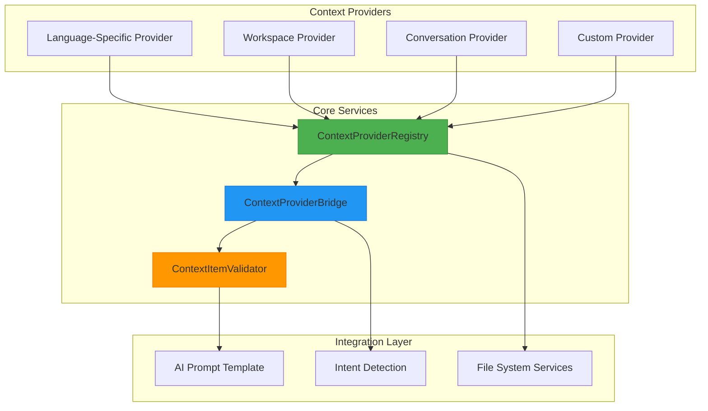
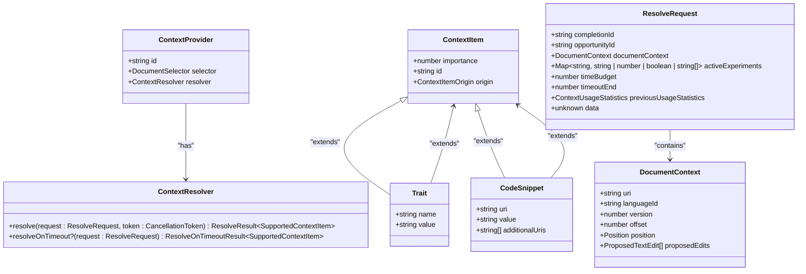
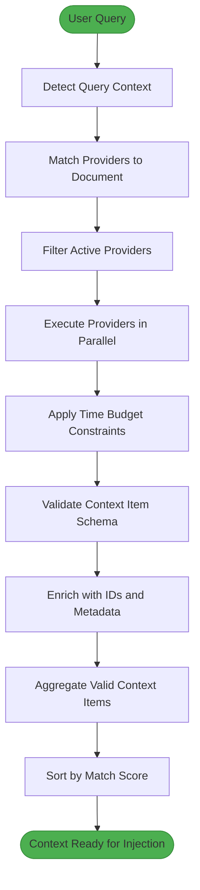
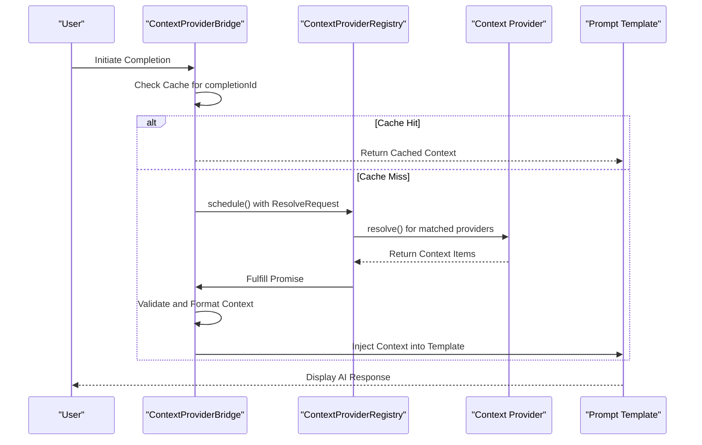

# Prompt Context Providers

<cite>
**Referenced Files in This Document**   
- [contextProviderApiV1.ts](file://src/extension/completions-core/vscode-node/types/src/contextProviderApiV1.ts)
- [contextProviderRegistry.ts](file://src/extension/completions-core/vscode-node/lib/src/prompt/contextProviderRegistry.ts)
- [contextProviderBridge.ts](file://src/extension/completions-core/vscode-node/lib/src/prompt/components/contextProviderBridge.ts)
- [contextProviderMatch.ts](file://src/extension/completions-core/vscode-node/extension/src/contextProviderMatch.ts)
- [contextItemSchemas.ts](file://src/extension/completions-core/vscode-node/lib/src/prompt/contextProviders/contextItemSchemas.ts)
- [conversation.ts](file://src/extension/prompt/node/conversation.ts)
- [fileTreeParser.ts](file://src/extension/prompt/common/fileTreeParser.ts)
- [context.ts](file://src/extension/completions-core/vscode-node/lib/src/context.ts)
</cite>

## Table of Contents
1. [Introduction](#introduction)
2. [Core Architecture](#core-architecture)
3. [Context Provider Domain Model](#context-provider-domain-model)
4. [Context Gathering and Aggregation](#context-gathering-and-aggregation)
5. [Context Injection into Prompts](#context-injection-into-prompts)
6. [Conversation State Management](#conversation-state-management)
7. [File Tree Parsing and Workspace Structure](#file-tree-parsing-and-workspace-structure)
8. [Configuration and Priority Management](#configuration-and-priority-management)
9. [Integration with Other Components](#integration-with-other-components)
10. [Performance Considerations](#performance-considerations)
11. [Common Issues and Solutions](#common-issues-and-solutions)
12. [Conclusion](#conclusion)

## Introduction

Prompt Context Providers in GitHub Copilot Chat form a sophisticated system for gathering, aggregating, and injecting contextual information into AI prompts. This architecture enables Copilot to provide intelligent, context-aware suggestions by collecting relevant information from various sources within the development environment. The system is designed to be modular, extensible, and efficient, balancing comprehensive context collection with performance constraints. This document provides a comprehensive analysis of the implementation, covering the domain model, invocation relationships, configuration options, and integration points that make up the context provisioning system.

## Core Architecture

The Prompt Context Providers architecture follows a modular, registry-based design pattern that enables extensibility while maintaining performance and reliability. At its core, the system consists of a context provider registry that manages the lifecycle of context providers, a bridge component that coordinates context gathering with prompt generation, and a validation layer that ensures data integrity. The architecture is built around dependency injection principles, with the `ICompletionsContextService` serving as the central service container that manages instances of various components.

The system employs a layered approach with clear separation of concerns: the registry handles provider management and resolution, the bridge coordinates timing and execution, and specialized utilities handle data validation and transformation. This design allows for independent evolution of each component while maintaining a cohesive system. The architecture also incorporates caching mechanisms to optimize performance, particularly for repeated requests within the same completion session.

**Diagram sources**
- [contextProviderRegistry.ts](file://src/extension/completions-core/vscode-node/lib/src/prompt/contextProviderRegistry.ts)
- [contextProviderBridge.ts](file://src/extension/completions-core/vscode-node/lib/src/prompt/components/contextProviderBridge.ts)

**Section sources**
- [contextProviderRegistry.ts](file://src/extension/completions-core/vscode-node/lib/src/prompt/contextProviderRegistry.ts)
- [contextProviderBridge.ts](file://src/extension/completions-core/vscode-node/lib/src/prompt/components/contextProviderBridge.ts)
- [context.ts](file://src/extension/completions-core/vscode-node/lib/src/context.ts)

## Context Provider Domain Model

The domain model for Prompt Context Providers is centered around the `ContextProvider` interface, which defines the contract for all context providers in the system. Each provider is uniquely identified by an ID and associated with a document selector that determines when it should be activated based on the current file type. The core of the provider is the resolver function, which asynchronously returns context items when invoked.

Context items themselves are strongly typed, with two primary types: `Trait` for key-value pairs representing metadata or configuration information, and `CodeSnippet` for actual code content extracted from files. Both types extend the base `ContextItem` interface, which includes properties for importance (0-100 scale), unique ID, and origin. The importance value allows for prioritization of context items, while the ID enables detailed telemetry and usage tracking.

The system enforces strict schema validation through TypeBox, ensuring that all context items conform to the expected structure before being included in prompts. This validation layer prevents malformed data from affecting prompt quality and provides clear error reporting when providers return invalid content. The domain model also includes support for fallback mechanisms through the optional `resolveOnTimeout` method, allowing providers to return minimal context when time-limited operations cannot complete.

**Diagram sources**
- [contextProviderApiV1.ts](file://src/extension/completions-core/vscode-node/types/src/contextProviderApiV1.ts)
- [contextItemSchemas.ts](file://src/extension/completions-core/vscode-node/lib/src/prompt/contextProviders/contextItemSchemas.ts)

**Section sources**
- [contextProviderApiV1.ts](file://src/extension/completions-core/vscode-node/types/src/contextProviderApiV1.ts)
- [contextItemSchemas.ts](file://src/extension/completions-core/vscode-node/lib/src/prompt/contextProviders/contextItemSchemas.ts)

## Context Gathering and Aggregation

The context gathering and aggregation process in GitHub Copilot Chat follows a systematic workflow that begins with user query detection and ends with structured context ready for prompt injection. When a user initiates a chat interaction, the system first determines which context providers should be activated based on the current document's language and type, using the document selector pattern defined in each provider.

The aggregation process is orchestrated by the `ContextProviderRegistry`, which coordinates the parallel execution of multiple context providers. Each provider receives a `ResolveRequest` containing metadata about the current completion context, including the completion ID, document information, and time budget constraints. Providers have a limited time window to return context items, after which their execution is cancelled to prevent delays in the overall response.

The registry employs a sophisticated matching algorithm that evaluates providers based on their document selector compatibility with the current file. Only providers that match the current context are activated, optimizing performance by avoiding unnecessary context gathering. For matched providers, the system collects their context items and applies validation to ensure schema compliance. Invalid items are filtered out and logged for diagnostic purposes, while valid items are enriched with unique IDs if not already provided.

Aggregation also incorporates telemetry and usage statistics from previous requests, allowing providers to make informed decisions about what context to provide. This feedback loop enables adaptive context provisioning, where providers can prioritize information that has been most useful in similar past scenarios. The aggregated context is then sorted by provider match score, ensuring that the most relevant context appears first in the final prompt.

**Diagram sources**
- [contextProviderRegistry.ts](file://src/extension/completions-core/vscode-node/lib/src/prompt/contextProviderRegistry.ts)
- [contextProviderMatch.ts](file://src/extension/completions-core/vscode-node/extension/src/contextProviderMatch.ts)

**Section sources**
- [contextProviderRegistry.ts](file://src/extension/completions-core/vscode-node/lib/src/prompt/contextProviderRegistry.ts)
- [contextProviderMatch.ts](file://src/extension/completions-core/vscode-node/extension/src/contextProviderMatch.ts)

## Context Injection into Prompts

Context injection into prompts is a critical phase that transforms aggregated context items into a format suitable for AI processing. This process is managed by the `ContextProviderBridge`, which acts as an intermediary between the context gathering system and the prompt templating engine. The bridge maintains a cache of resolved context items, keyed by completion ID, to support efficient retrieval when constructing prompts.

The injection process follows a structured workflow that begins with retrieving the aggregated context from the registry. The bridge first checks its LRU cache for previously resolved context, avoiding redundant processing for repeated requests within the same completion session. When context needs to be gathered, the bridge schedules the resolution process and returns a promise that will be fulfilled when context is available.

Once context items are available, they are organized according to their type and importance for injection into the prompt template. The system preserves the sorted order from the aggregation phase, ensuring that higher-priority context appears earlier in the prompt where it has maximum impact. Each context item is formatted according to its type, with traits rendered as key-value pairs and code snippets presented with appropriate syntax highlighting and file references.

The injection process also handles special cases such as partial results when providers exceed their time budget. In these scenarios, the system can fall back to minimal context provided by the `resolveOnTimeout` method, ensuring that some relevant information is still available even when comprehensive context gathering is not possible. This graceful degradation maintains prompt quality while respecting performance constraints.

**Diagram sources**
- [contextProviderBridge.ts](file://src/extension/completions-core/vscode-node/lib/src/prompt/components/contextProviderBridge.ts)
- [contextProviderRegistry.ts](file://src/extension/completions-core/vscode-node/lib/src/prompt/contextProviderRegistry.ts)

**Section sources**
- [contextProviderBridge.ts](file://src/extension/completions-core/vscode-node/lib/src/prompt/components/contextProviderBridge.ts)

## Conversation State Management

Conversation state management in GitHub Copilot Chat is implemented through the `conversation.ts` module, which maintains the context of ongoing dialogues between the user and the AI assistant. This system captures the complete history of interactions, including both user queries and AI responses, enabling contextual understanding across multiple turns of conversation.

The conversation state is structured as a sequence of messages, each containing metadata such as timestamps, message types, and associated context. This structure allows the system to maintain coherence across extended interactions, where understanding often depends on information from earlier in the conversation. The state management system also supports message editing and deletion, enabling users to refine their queries and maintain a clean conversation history.

A key aspect of conversation state management is the integration with context providers. The conversation history itself serves as a context provider, contributing relevant portions of the dialogue to subsequent prompts. This creates a feedback loop where the AI can reference previous exchanges, maintain topic continuity, and build upon established context. The system intelligently selects which parts of the conversation history to include based on relevance and token constraints.

The implementation also handles versioning and synchronization, ensuring that conversation state remains consistent across different components and potential concurrent modifications. This is particularly important in collaborative scenarios or when multiple context providers access the conversation state simultaneously. The system employs immutable data patterns where possible, creating new state objects rather than modifying existing ones to prevent race conditions and ensure predictable behavior.

**Section sources**
- [conversation.ts](file://src/extension/prompt/node/conversation.ts)

## File Tree Parsing and Workspace Structure

File tree parsing and workspace structure extraction are handled by the `fileTreeParser.ts` component, which provides a comprehensive representation of the project's directory structure for context provisioning. This system analyzes the workspace to identify relevant files and directories, creating a hierarchical representation that can be included in prompts to provide structural context.

The parser operates by traversing the file system and applying configurable filters to determine which files should be included in the context. These filters can be based on file extensions, directory patterns, or other criteria, allowing the system to focus on relevant portions of the codebase while excluding noise from generated files, dependencies, or build artifacts. The resulting file tree representation includes metadata such as file paths, sizes, and modification times, providing a rich structural context for the AI.

A key feature of the file tree parser is its ability to handle large codebases efficiently. Rather than including the complete contents of all files, it provides a structural overview that helps the AI understand the organization of the project. This approach balances comprehensiveness with token efficiency, ensuring that valuable structural information is available without overwhelming the prompt with excessive content.

The parsed file tree can be customized through configuration options that control the depth of traversal, the level of detail included, and the formatting of the output. This flexibility allows the system to adapt to different project sizes and user preferences, providing an optimal balance of context and performance. The file tree context is particularly valuable for tasks that require understanding of project architecture, such as code generation, refactoring suggestions, or navigation assistance.

**Section sources**
- [fileTreeParser.ts](file://src/extension/prompt/common/fileTreeParser.ts)
- [util/common/fileTree.ts](file://src/util/common/fileTree.ts)

## Configuration and Priority Management

Configuration and priority management for context providers is implemented through a multi-layered system that combines static configuration, experimental features, and dynamic telemetry. The system allows fine-grained control over which providers are active, their relative importance, and their operational parameters.

Configuration is managed through multiple sources that are merged to determine the final active set of providers. These sources include user settings, experimental feature flags, and default configurations. The merging process follows a specific precedence order, with user settings taking priority over experimental features, which in turn override defaults. This hierarchy allows users to customize their experience while still benefiting from system-level optimizations and experimental enhancements.

Priority management operates on two levels: provider-level and item-level. Provider priority is determined by the match score calculated during the provider selection phase, which considers document selector compatibility and other factors. Item-level priority is controlled by the importance property in the `ContextItem` interface, which accepts integer values from 0 to 100. This two-tiered approach allows for sophisticated context ranking that considers both the relevance of the provider and the significance of individual context items.

The system also supports time-based configuration through the `timeBudget` parameter in the `ResolveRequest`. This allows providers to adjust their behavior based on available processing time, potentially returning more comprehensive context when time permits or falling back to minimal essential information when under time pressure. This adaptive approach ensures consistent performance while maximizing context quality.

Configuration options are exposed through both programmatic APIs and user-facing settings, allowing for both developer customization and end-user control. The system validates all configuration inputs to prevent invalid settings that could degrade performance or compromise security.

**Section sources**
- [contextProviderRegistry.ts](file://src/extension/completions-core/vscode-node/lib/src/prompt/contextProviderRegistry.ts)
- [contextProviderApiV1.ts](file://src/extension/completions-core/vscode-node/types/src/contextProviderApiV1.ts)

## Integration with Other Components

Prompt Context Providers integrate with several key components in the GitHub Copilot Chat system, creating a cohesive ecosystem for intelligent code assistance. The most critical integration is with intent detection, which analyzes user queries to determine the appropriate context providers to activate. This relationship is bidirectional, as the context gathered by providers can also inform intent classification by providing additional signals about the user's coding context.

Integration with file system services enables context providers to access workspace information, including file contents, directory structures, and version control metadata. This connection is abstracted through service interfaces that provide a consistent API for file operations while allowing for different implementations across platforms. The integration includes caching mechanisms to minimize redundant file system access and improve performance.

The system also integrates with telemetry and analytics components, providing detailed usage statistics for each context provider and item. This data is used for both immediate decision-making (such as adjusting context selection based on past effectiveness) and long-term system improvement (such as identifying underperforming providers). The telemetry integration is designed to be privacy-preserving, with appropriate data anonymization and user consent mechanisms.

Authentication and authorization components are integrated to ensure that context providers can securely access protected resources, such as private repositories or organizational data. This integration includes token management, permission checking, and secure storage of credentials, ensuring that context gathering respects user privacy and security requirements.

Finally, the system integrates with the AI model serving infrastructure, providing context in the specific format required by the underlying language models. This includes token counting, text formatting, and prompt templating to ensure optimal model performance and response quality.

**Section sources**
- [contextProviderRegistry.ts](file://src/extension/completions-core/vscode-node/lib/src/prompt/contextProviderRegistry.ts)
- [contextProviderBridge.ts](file://src/extension/completions-core/vscode-node/lib/src/prompt/components/contextProviderBridge.ts)

## Performance Considerations

Performance considerations are central to the design of Prompt Context Providers, with multiple mechanisms in place to ensure responsive user experiences while gathering comprehensive context. The primary performance safeguard is the time budget system, which limits the execution time of each context provider to prevent delays in AI response generation. Providers are given a specific time window (configurable through settings) to return context, after which their execution is cancelled.

The system employs parallel execution of context providers, allowing multiple sources to gather information simultaneously rather than sequentially. This approach maximizes the use of available processing time and reduces overall latency. For providers that cannot complete within the time budget, the system supports fallback mechanisms through the `resolveOnTimeout` method, allowing them to return minimal essential context rather than nothing at all.

Caching is extensively used throughout the system to avoid redundant operations. The `ContextProviderBridge` maintains an LRU cache of resolved context items, preventing repeated processing for the same completion ID. Additionally, individual providers may implement their own caching strategies for expensive operations, such as file system scans or complex analyses.

Memory usage is carefully managed through streaming and incremental processing where appropriate. Rather than loading entire codebases into memory, the system processes context in chunks and releases resources as soon as they are no longer needed. This approach allows the system to handle large projects without excessive memory consumption.

The system also includes sophisticated telemetry and monitoring to identify performance bottlenecks. Usage statistics track the execution time and effectiveness of each provider, enabling both automated optimization and manual tuning. This data-driven approach allows the system to adapt to different usage patterns and hardware configurations.

**Section sources**
- [contextProviderRegistry.ts](file://src/extension/completions-core/vscode-node/lib/src/prompt/contextProviderRegistry.ts)
- [contextProviderBridge.ts](file://src/extension/completions-core/vscode-node/lib/src/prompt/components/contextProviderBridge.ts)

## Common Issues and Solutions

Several common issues arise in the implementation and operation of Prompt Context Providers, each with corresponding solutions designed into the system architecture. One frequent issue is context relevance, where providers may return information that is technically correct but not actually helpful for the current task. The system addresses this through the importance scoring system and usage-based feedback loops that prioritize context items proven to be effective in similar scenarios.

Performance impact is another common concern, particularly with providers that perform expensive operations like code analysis or network requests. The time budget system and parallel execution model mitigate this by preventing any single provider from blocking the overall response. The fallback mechanism through `resolveOnTimeout` ensures that even when comprehensive context cannot be gathered, some relevant information is still available.

Context conflicts can occur when multiple providers return information about the same code element or concept. The system handles this through deterministic ordering based on provider match scores and importance values, ensuring consistent behavior. The unique ID system also helps track which specific context items are used in prompts, enabling better diagnostics when conflicts arise.

Data consistency issues are addressed through the validation layer that ensures all context items conform to the expected schema. This prevents malformed data from affecting prompt quality and provides clear error reporting for debugging. The system also handles version mismatches between the context and the current document state by including document version information in the `ResolveRequest`.

Configuration complexity is managed through the multi-layered configuration system that combines defaults, experimental features, and user settings in a predictable hierarchy. This approach provides flexibility without overwhelming users with too many options. The system validates all configuration inputs to prevent invalid settings that could degrade performance or compromise security.

**Section sources**
- [contextProviderRegistry.ts](file://src/extension/completions-core/vscode-node/lib/src/prompt/contextProviderRegistry.ts)
- [contextItemSchemas.ts](file://src/extension/completions-core/vscode-node/lib/src/prompt/contextProviders/contextItemSchemas.ts)

## Conclusion

The Prompt Context Providers system in GitHub Copilot Chat represents a sophisticated architecture for gathering, aggregating, and injecting contextual information into AI prompts. Through a modular design centered around the `ContextProvider` interface, the system enables extensible context provisioning while maintaining performance and reliability. The implementation demonstrates careful attention to both technical excellence and user experience, balancing comprehensive context collection with responsive interaction.

Key strengths of the system include its adaptive time budgeting, parallel execution model, and sophisticated priority management. These features ensure that users receive relevant context quickly, even in complex development environments. The integration with conversation state, file structure analysis, and other components creates a cohesive ecosystem that enhances the AI's understanding of the development context.

The system's design reflects a deep understanding of the challenges in AI-assisted development, with thoughtful solutions for common issues like performance impact, context relevance, and data consistency. By providing a flexible yet structured framework for context provisioning, the system enables both current functionality and future extensibility, positioning GitHub Copilot Chat as a powerful tool for modern software development.