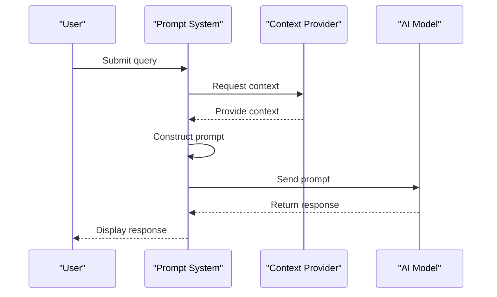

# Prompt System

<cite>
**Referenced Files in This Document**   
- [promptElement.ts](file://src/extension/prompts/node/base/promptElement.ts)
- [promptRenderer.ts](file://src/extension/prompts/node/base/promptRenderer.ts)
- [promptFile.tsx](file://src/extension/prompts/node/panel/promptFile.tsx)
- [promptVariablesService.ts](file://src/extension/prompt/vscode-node/promptVariablesService.ts)
- [promptCraftingTypes.ts](file://src/extension/inlineChat/node/promptCraftingTypes.ts)
- [promptCrafting.ts](file://src/extension/xtab/common/promptCrafting.ts)
- [promptPathRepresentationService.ts](file://src/platform/prompts/common/promptPathRepresentationService.ts)
</cite>

## Table of Contents
1. [Introduction](#introduction)
2. [Core Components](#core-components)
3. [Prompt Generation and Templating](#prompt-generation-and-templating)
4. [Context Injection and Management](#context-injection-and-management)
5. [Domain Model for Prompt Elements](#domain-model-for-prompt-elements)
6. [Configuration and Customization](#configuration-and-customization)
7. [Integration with Agents and Context Providers](#integration-with-agents-and-context-providers)
8. [Common Issues and Solutions](#common-issues-and-solutions)
9. [Conclusion](#conclusion)

## Introduction
The Prompt System in GitHub Copilot Chat is a sophisticated framework designed to generate, template, and inject context into prompts for AI-driven code assistance. This system enables developers to interact with AI models through natural language queries, receiving relevant and context-aware responses. The architecture is built around several core components that handle prompt creation, context gathering, and response formatting. This document provides a comprehensive overview of the implementation, focusing on the mechanisms of prompt generation, templating, and context injection, as well as the relationships between user queries, context providers, and prompt construction.

## Core Components

The Prompt System is composed of several key components that work together to create effective prompts for AI models. These components include the `PromptElement`, `PromptRenderer`, `PromptVariablesService`, and various context providers. Each component plays a crucial role in the overall functionality of the system, from defining the structure of prompts to managing the injection of contextual information.

**Section sources**
- [promptElement.ts](file://src/extension/prompts/node/base/promptElement.ts)
- [promptRenderer.ts](file://src/extension/prompts/node/base/promptRenderer.ts)
- [promptVariablesService.ts](file://src/extension/prompt/vscode-node/promptVariablesService.ts)

## Prompt Generation and Templating

### Prompt Element and Renderer
The foundation of the Prompt System lies in the `PromptElement` and `PromptRenderer` classes. The `PromptElement` class defines the basic structure of a prompt element, which can be extended to create specific types of prompts. The `PromptRenderer` class is responsible for rendering these elements into a format that can be consumed by AI models. It uses dependency injection to pass the necessary services, such as the `IChatEndpoint`, to the prompt elements being rendered.

The `PromptRenderer` class also includes methods for counting tokens and validating references, ensuring that the generated prompts are within the token limits and contain valid references. The `renderPromptElement` function is a convenience method that creates a `PromptRenderer` instance and renders the prompt element, returning the messages, token count, metadata, and references.

### Inline Chat Prompts
In the context of inline chat, the `inlineChat2Prompt.tsx` file demonstrates how prompts are constructed for inline interactions. The `PromptFile` class, defined in `promptFile.tsx`, is used to create prompts that include file content and references. This class takes a `PromptVariable` as input, which contains the URI of the file to be included in the prompt. The `PromptFile` class reads the file content, resolves any tool references, and formats the content with appropriate tags and attributes.

```mermaid
classDiagram
class PromptElement {
+props : BasePromptElementProps
+render(state : void, sizing : PromptSizing) : Promise<string | undefined>
}
class PromptRenderer {
+create(instantiationService : IInstantiationService, endpoint : IChatEndpoint, ctor : PromptElementCtor<P, any>, props : P) : PromptRenderer
+render(progress? : Progress<ChatResponsePart>, token? : CancellationToken, opts? : Partial<{ trace : boolean }>) : Promise<RenderPromptResult>
+countTokens(token? : CancellationToken) : Promise<number>
}
class PromptFile {
+variable : PromptVariable
+omitReferences? : boolean
+filePathMode : FilePathMode
+render(state : void, sizing : PromptSizing) : Promise<string | undefined>
}
PromptElement <|-- PromptFile
PromptRenderer --> PromptElement
```

**Diagram sources**
- [promptElement.ts](file://src/extension/prompts/node/base/promptElement.ts)
- [promptRenderer.ts](file://src/extension/prompts/node/base/promptRenderer.ts)
- [promptFile.tsx](file://src/extension/prompts/node/panel/promptFile.tsx)

**Section sources**
- [promptElement.ts](file://src/extension/prompts/node/base/promptElement.ts)
- [promptRenderer.ts](file://src/extension/prompts/node/base/promptRenderer.ts)
- [promptFile.tsx](file://src/extension/prompts/node/panel/promptFile.tsx)

## Context Injection and Management

### Context Providers
Context injection is a critical aspect of the Prompt System, as it ensures that the AI models receive relevant and up-to-date information. The system uses various context providers to gather information from different sources, such as the workspace, file system, and language context. The `IFileSystemService`, `IIgnoreService`, and `IPromptPathRepresentationService` are examples of services that provide context for file-related information.

The `PromptVariablesService` is responsible for resolving variables and tool references in the prompt. It takes a message string and a list of variables or tool references, and returns a modified message with the variables and references resolved. The `resolveVariablesInPrompt` method replaces variable references with their corresponding values, while the `resolveToolReferencesInPrompt` method replaces tool references with their names.

### Workspace Context
The `workspacePrompt.tsx` file demonstrates how workspace context is incorporated into prompts. The `PromptFile` class reads the file content and includes it in the prompt, along with any relevant metadata. The `promptPathRepresentationService` is used to get the file path in a format that is suitable for inclusion in the prompt. The `ignoreService` is used to check if the file should be ignored, and if so, the file is marked as ignored in the prompt.



**Diagram sources**
- [promptVariablesService.ts](file://src/extension/prompt/vscode-node/promptVariablesService.ts)
- [promptPathRepresentationService.ts](file://src/platform/prompts/common/promptPathRepresentationService.ts)

**Section sources**
- [promptVariablesService.ts](file://src/extension/prompt/vscode-node/promptVariablesService.ts)
- [promptPathRepresentationService.ts](file://src/platform/prompts/common/promptPathRepresentationService.ts)

## Domain Model for Prompt Elements

### Prompt Element Hierarchy
The domain model for prompt elements is based on a hierarchical structure, where the `PromptElement` class serves as the base class for all prompt elements. This class defines the common properties and methods that are shared by all prompt elements, such as the `props` property and the `render` method. Specific prompt elements, such as `PromptFile`, extend the `PromptElement` class and add their own properties and methods.

The `PromptElementCtor` interface defines the constructor for prompt elements, allowing for dependency injection of services. The `PromptRenderer` class uses this interface to create instances of prompt elements, passing the necessary services to the constructor.

### Metadata and References
Each prompt element can have metadata and references associated with it. The metadata is used to store additional information about the prompt, such as the token count and the rendering mode. The references are used to link the prompt to other resources, such as files or variables. The `PromptReference` class is used to represent these references, and the `getUniqueReferences` function is used to ensure that each reference is unique.

```mermaid
classDiagram
class PromptElement {
+props : BasePromptElementProps
+render(state : void, sizing : PromptSizing) : Promise<string | undefined>
}
class PromptFile {
+variable : PromptVariable
+omitReferences? : boolean
+filePathMode : FilePathMode
+render(state : void, sizing : PromptSizing) : Promise<string | undefined>
}
class PromptReference {
+anchor : Uri | Location | { variableName : string; value : Uri | Location }
+provider? : string
}
class MetadataMap {
+[key : string] : any
}
PromptElement <|-- PromptFile
PromptFile --> PromptReference
PromptElement --> MetadataMap
```

**Diagram sources**
- [promptElement.ts](file://src/extension/prompts/node/base/promptElement.ts)
- [promptFile.tsx](file://src/extension/prompts/node/panel/promptFile.tsx)

**Section sources**
- [promptElement.ts](file://src/extension/prompts/node/base/promptElement.ts)
- [promptFile.tsx](file://src/extension/prompts/node/panel/promptFile.tsx)

## Configuration and Customization

### Configuration Options
The Prompt System provides several configuration options for customizing the behavior of prompts. These options include the `filePathMode`, which determines how file paths are represented in the prompt, and the `omitReferences` flag, which controls whether references are included in the prompt. The `PromptVariablesService` also provides options for resolving variables and tool references, such as the `resolveVariablesInPrompt` and `resolveToolReferencesInPrompt` methods.

### Parameters for Different Prompt Types
Different types of prompts may require different parameters. For example, the `PromptFile` class requires a `PromptVariable` parameter, which contains the URI of the file to be included in the prompt. The `PromptRenderer` class requires a `PromptElementCtor` parameter, which defines the constructor for the prompt element to be rendered. The `renderPromptElement` function also accepts optional parameters for progress and cancellation tokens.

## Integration with Agents and Context Providers

### Agents
The Prompt System integrates with agents to provide AI-driven code assistance. The `RendererIntentInvocation` class is used to invoke intents, which are actions that can be performed by the AI model. The `createRenderer` method is used to create a `PromptRenderer` instance for the intent, and the `buildPrompt` method is used to construct the prompt and send it to the AI model.

### Context Providers
The Prompt System uses context providers to gather information from different sources. The `IFileSystemService` provides access to the file system, the `IIgnoreService` checks if files should be ignored, and the `IPromptPathRepresentationService` provides a way to represent file paths in the prompt. The `PromptVariablesService` resolves variables and tool references in the prompt, ensuring that the AI model receives the correct information.

```mermaid
classDiagram
class RendererIntentInvocation {
+intent : IIntent
+location : ChatLocation
+endpoint : IChatEndpoint
+buildPrompt(promptParams : IBuildPromptContext, progress : Progress<ChatResponseReferencePart | ChatResponseProgressPart>, token : CancellationToken) : Promise<RenderPromptResult<OutputMode.Raw> & { references : PromptReference[] }>
+createRenderer(promptParams : IBuildPromptContext, endpoint : IChatEndpoint, progress : Progress<ChatResponseReferencePart | ChatResponseProgressPart>, token : CancellationToken) : BasePromptRenderer<any, OutputMode.Raw> | Promise<BasePromptRenderer<any, OutputMode.Raw>>
}
class PromptVariablesService {
+resolveVariablesInPrompt(message : string, variables : ChatPromptReference[]) : Promise<{ message : string }>
+resolveToolReferencesInPrompt(message : string, toolReferences : ChatLanguageModelToolReference[]) : Promise<string>
}
class IFileSystemService {
+readFile(uri : URI) : Promise<Uint8Array>
}
class IIgnoreService {
+isCopilotIgnored(uri : URI) : Promise<boolean>
}
class IPromptPathRepresentationService {
+getFilePath(uri : URI) : string
}
RendererIntentInvocation --> PromptRenderer
PromptVariablesService --> PromptElement
IFileSystemService --> PromptFile
IIgnoreService --> PromptFile
IPromptPathRepresentationService --> PromptFile
```

**Diagram sources**
- [promptRenderer.ts](file://src/extension/prompts/node/base/promptRenderer.ts)
- [promptVariablesService.ts](file://src/extension/prompt/vscode-node/promptVariablesService.ts)
- [promptFile.tsx](file://src/extension/prompts/node/panel/promptFile.tsx)

**Section sources**
- [promptRenderer.ts](file://src/extension/prompts/node/base/promptRenderer.ts)
- [promptVariablesService.ts](file://src/extension/prompt/vscode-node/promptVariablesService.ts)
- [promptFile.tsx](file://src/extension/prompts/node/panel/promptFile.tsx)

## Common Issues and Solutions

### Prompt Injection
Prompt injection is a security concern where malicious input can be used to manipulate the AI model's behavior. To mitigate this risk, the Prompt System uses strict validation of references and ensures that all file paths and variables are properly resolved. The `validateReference` method in the `PromptRenderer` class checks that all references are valid and belong to the correct URI.

### Context Relevance
Ensuring that the context provided to the AI model is relevant and up-to-date is crucial for generating accurate responses. The Prompt System uses context providers to gather information from different sources, and the `PromptVariablesService` ensures that variables and tool references are resolved correctly. The `PromptRenderer` class also includes methods for counting tokens and validating references, ensuring that the generated prompts are within the token limits and contain valid references.

## Conclusion
The Prompt System in GitHub Copilot Chat is a robust and flexible framework for generating, templating, and injecting context into prompts for AI-driven code assistance. By leveraging a hierarchical domain model, context providers, and configuration options, the system ensures that AI models receive relevant and accurate information. The integration with agents and context providers enables seamless interaction between the user and the AI model, providing a powerful tool for code development and debugging.