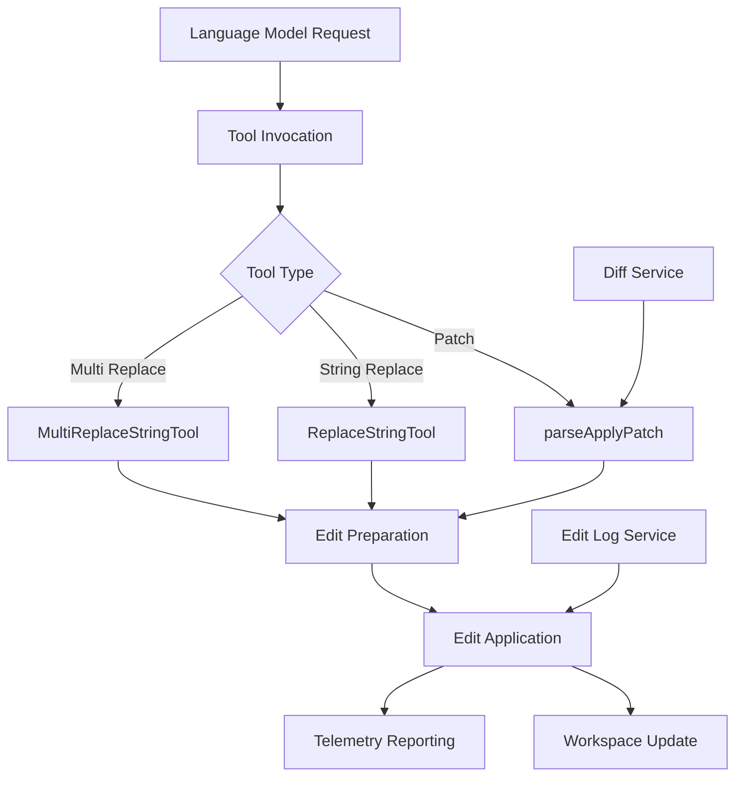
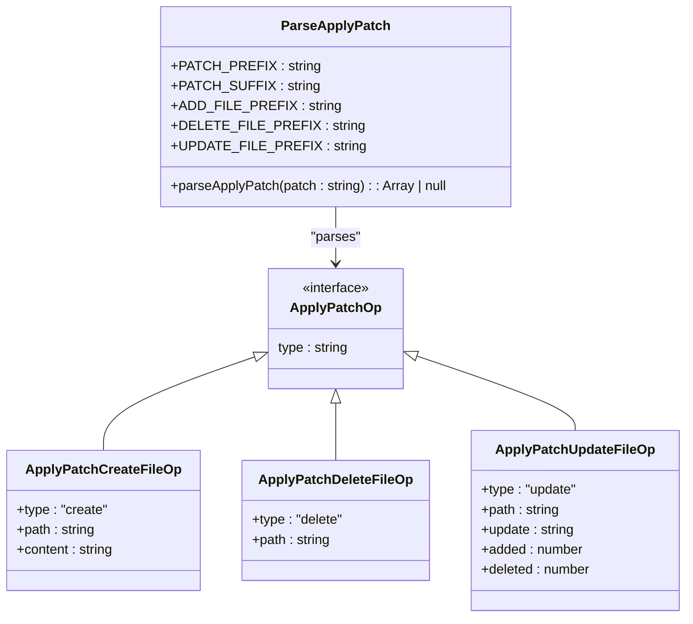
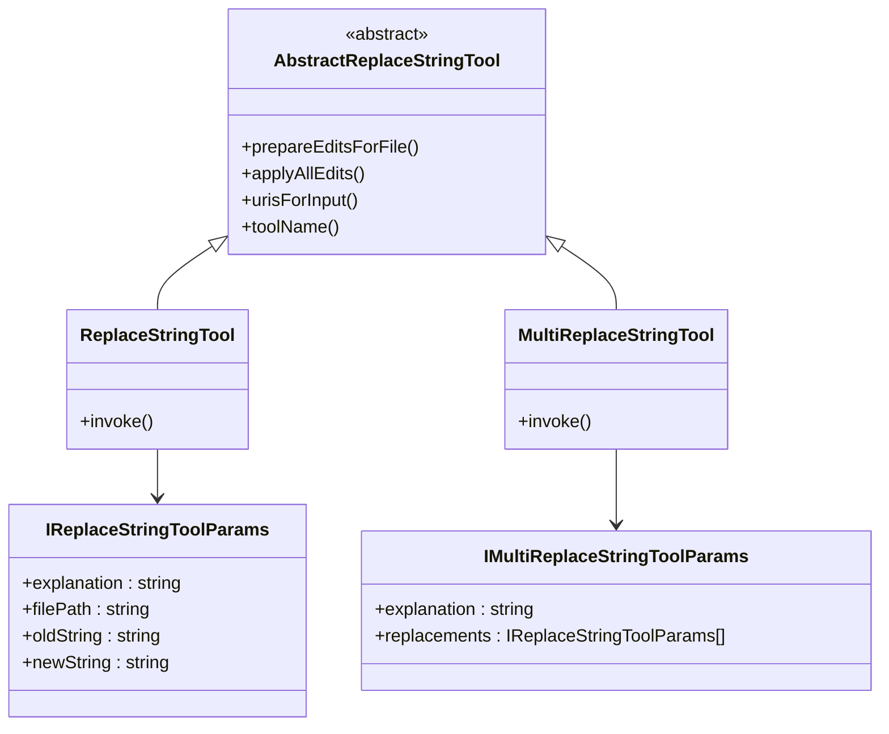
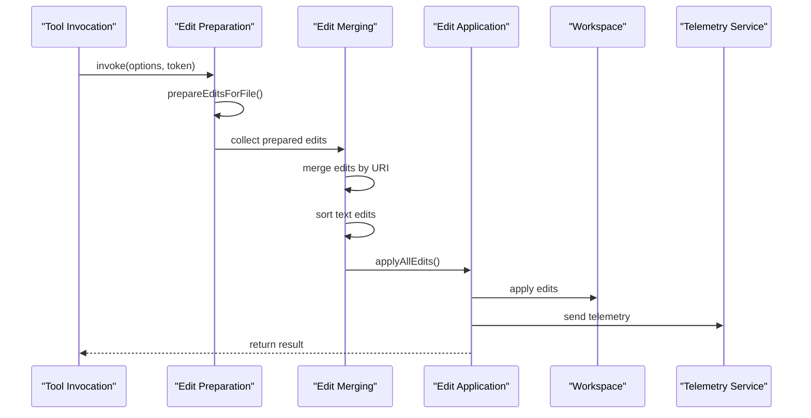
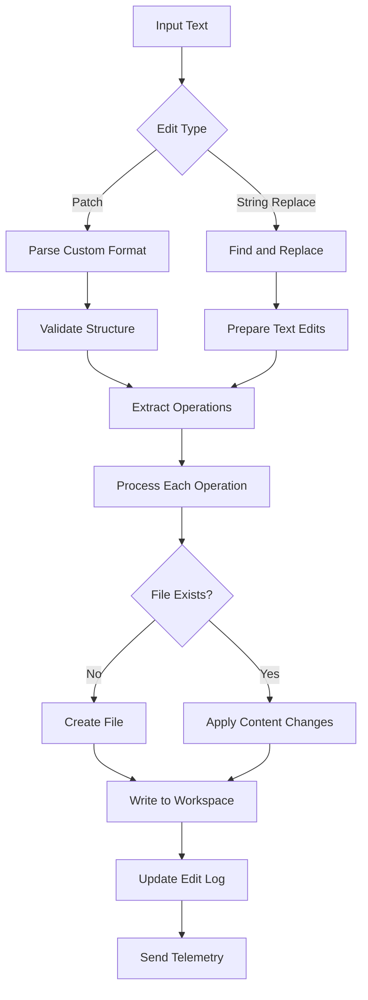
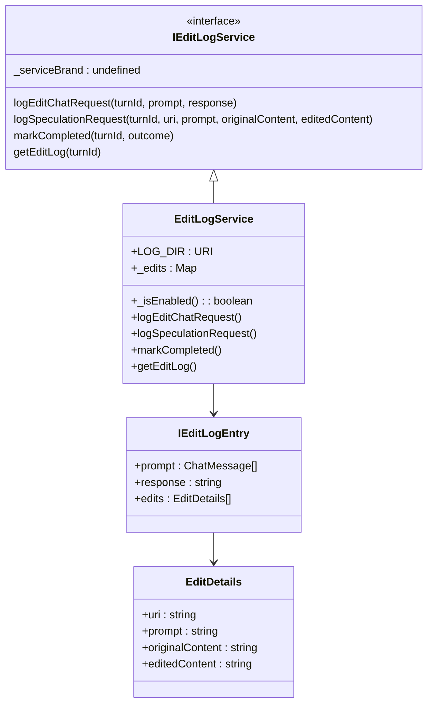
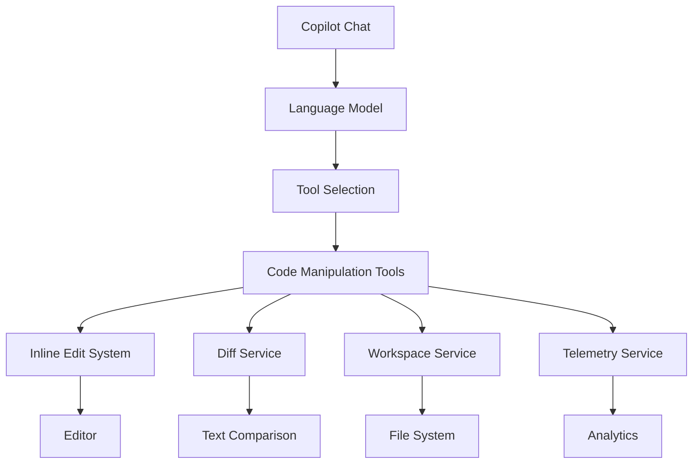
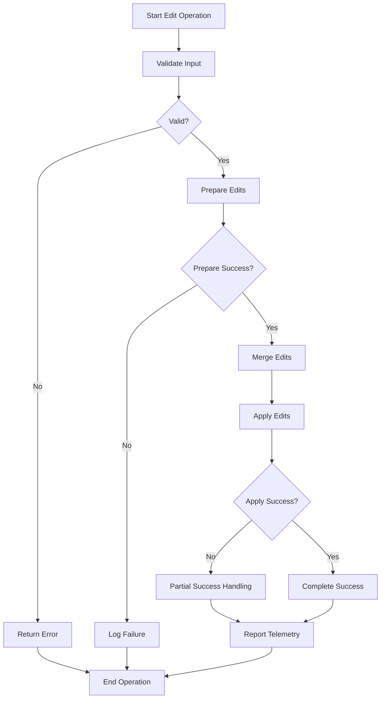

# Code Manipulation Tools

<cite>
**Referenced Files in This Document**   
- [parseApplyPatch.ts](file://src/extension/tools/node/applyPatch/parseApplyPatch.ts)
- [multiReplaceStringTool.tsx](file://src/extension/tools/node/multiReplaceStringTool.tsx)
- [replaceStringTool.tsx](file://src/extension/tools/node/replaceStringTool.tsx)
- [editLogService.ts](file://src/platform/multiFileEdit/common/editLogService.ts)
- [edit.ts](file://src/platform/inlineEdits/common/dataTypes/edit.ts)
- [diffService.ts](file://src/platform/diff/common/diffService.ts)
- [abstractReplaceStringTool.tsx](file://src/extension/tools/node/abstractReplaceStringTool.tsx)
</cite>

## Table of Contents
1. [Introduction](#introduction)
2. [Core Components](#core-components)
3. [Architecture Overview](#architecture-overview)
4. [Detailed Component Analysis](#detailed-component-analysis)
5. [Domain Model for Code Edits](#domain-model-for-code-edits)
6. [Diff Operations and Text Replacement Strategies](#diff-operations-and-text-replacement-strategies)
7. [Configuration and Safety Parameters](#configuration-and-safety-parameters)
8. [Integration with Other Systems](#integration-with-other-systems)
9. [Common Issues and Solutions](#common-issues-and-solutions)
10. [Conclusion](#conclusion)

## Introduction
GitHub Copilot Chat provides sophisticated code manipulation tools that enable reliable code transformation operations through structured editing interfaces. These tools support various editing operations including patch application, string replacement, and multi-file edits, designed to work seamlessly within the VS Code environment. The system is built with safety, reliability, and developer experience in mind, incorporating comprehensive error handling, telemetry, and integration with the editor's workspace management system. This documentation provides a comprehensive overview of the code manipulation infrastructure, explaining implementation details, domain models, and integration patterns.

## Core Components
The code manipulation system in GitHub Copilot Chat consists of several key components that work together to enable reliable code transformations. The primary components include the patch application system, string replacement tools, multi-file edit handlers, and supporting services for edit logging and diff computation. These components are organized in a modular architecture that separates concerns between tool invocation, edit preparation, and application logic. The system leverages TypeScript interfaces and classes to define clear contracts between components, ensuring type safety and maintainable code organization.

**Section sources**
- [parseApplyPatch.ts](file://src/extension/tools/node/applyPatch/parseApplyPatch.ts#L1-L132)
- [multiReplaceStringTool.tsx](file://src/extension/tools/node/multiReplaceStringTool.tsx#L1-L149)
- [replaceStringTool.tsx](file://src/extension/tools/node/replaceStringTool.tsx#L1-L38)

## Architecture Overview
The code manipulation tools follow a layered architecture that separates the tool interface from the implementation details. At the highest level, tools are registered with a central registry and exposed through the language model interface. When a tool is invoked, it processes the input parameters, prepares the necessary edits, and applies them to the workspace. The architecture includes specialized components for different types of edits, with shared utilities for common operations like path resolution and edit merging.



**Diagram sources **
- [parseApplyPatch.ts](file://src/extension/tools/node/applyPatch/parseApplyPatch.ts#L1-L132)
- [multiReplaceStringTool.tsx](file://src/extension/tools/node/multiReplaceStringTool.tsx#L1-L149)
- [editLogService.ts](file://src/platform/multiFileEdit/common/editLogService.ts#L1-L130)

## Detailed Component Analysis

### Patch Application System
The patch application system is responsible for processing diff-based code changes in a custom format. It parses patch strings that follow a specific syntax with markers for different operations. The system supports three main operations: file creation, file deletion, and file updates. Each operation is represented by a specific prefix in the patch format, and the parser validates the structure before processing.



**Diagram sources **
- [parseApplyPatch.ts](file://src/extension/tools/node/applyPatch/parseApplyPatch.ts#L1-L132)

**Section sources**
- [parseApplyPatch.ts](file://src/extension/tools/node/applyPatch/parseApplyPatch.ts#L1-L132)

### String Replacement Tools
The string replacement tools provide functionality for replacing text content within files. The system includes both single and multi-file replacement capabilities, with shared base functionality implemented in an abstract class. The tools handle various parameters including the explanation for the change, file path, old string, and new string. They also include comprehensive error handling and telemetry reporting.



**Diagram sources **
- [replaceStringTool.tsx](file://src/extension/tools/node/replaceStringTool.tsx#L1-L38)
- [multiReplaceStringTool.tsx](file://src/extension/tools/node/multiReplaceStringTool.tsx#L1-L149)
- [abstractReplaceStringTool.tsx](file://src/extension/tools/node/abstractReplaceStringTool.tsx#L1-L200)

**Section sources**
- [replaceStringTool.tsx](file://src/extension/tools/node/replaceStringTool.tsx#L1-L38)
- [multiReplaceStringTool.tsx](file://src/extension/tools/node/multiReplaceStringTool.tsx#L1-L149)
- [abstractReplaceStringTool.tsx](file://src/extension/tools/node/abstractReplaceStringTool.tsx#L1-L200)

### Edit Processing Pipeline
The edit processing pipeline handles the sequence of operations from tool invocation to workspace update. It includes steps for preparing edits, validating them, merging overlapping edits, and applying them to the workspace. The pipeline also handles telemetry reporting and error recovery, ensuring that edits are applied reliably and user actions can be tracked for quality improvement.



**Diagram sources **
- [multiReplaceStringTool.tsx](file://src/extension/tools/node/multiReplaceStringTool.tsx#L1-L149)
- [abstractReplaceStringTool.tsx](file://src/extension/tools/node/abstractReplaceStringTool.tsx#L1-L200)

## Domain Model for Code Edits
The domain model for code edits in GitHub Copilot Chat is designed to represent various types of changes that can be made to source code. The model includes representations for file-level operations (create, delete, update) and text-level operations (string replacement, line edits). Each edit type has a specific structure that captures the necessary information for applying the change, including file paths, content, and metadata about the change.

The model also includes utility classes for working with edits, such as the `RootedEdit` class which represents an edit with a base text state, allowing for more reliable application of changes. The `Edits` class provides functionality for working with sequences of edits, including composition, application, and serialization.

```mermaid
classDiagram
class RootedEdit {
+base : StringText
+edit : TEdit
+getEditedState() : StringText
+rebase(onto : StringEdit) : RootedEdit
+normalize() : RootedEdit
+equals(other : RootedEdit) : boolean
}
class SingleEdits {
+edits : readonly TReplacement[]
+compose() : StringEdit
+apply(value : string) : string
+isEmpty() : boolean
+toEdits() : Edits<StringEdit>
}
class Edits {
+edits : readonly T[]
+compose() : T
+add(edit : T) : Edits<T>
+apply(value : string) : string
+isEmpty() : boolean
+swap(editFirst : StringEdit) : { edits : Edits; editLast : StringEdit } | undefined
+serialize() : SerializedEdit[]
+deserialize(v : SerializedEdit[]) : Edits
+toHumanReadablePatch(base : StringText) : string
}
class StringEdit {
+applyOnText(text : StringText) : StringText
+compose(other : StringEdit) : StringEdit
+equals(other : StringEdit) : boolean
+normalizeOnSource(source : string) : StringEdit
}
RootedEdit --> StringEdit : "uses"
SingleEdits --> StringEdit : "composes"
Edits --> StringEdit : "composes"
```

**Diagram sources **
- [edit.ts](file://src/platform/inlineEdits/common/dataTypes/edit.ts#L1-L166)

**Section sources**
- [edit.ts](file://src/platform/inlineEdits/common/dataTypes/edit.ts#L1-L166)

## Diff Operations and Text Replacement Strategies
The system uses a combination of custom diff parsing and standard diff computation to handle code changes. For patch-based edits, the system parses a custom format that includes specific markers for different operations. For inline edits and other text replacements, the system uses the VS Code diff service to compute changes between original and modified content.

The text replacement strategy focuses on accuracy and reliability, with careful handling of edge cases like overlapping edits and whitespace differences. When multiple edits are made to the same file, they are merged and sorted to ensure they are applied in the correct order. The system also handles different line ending formats (CR/LF) to ensure compatibility across platforms.



**Diagram sources **
- [parseApplyPatch.ts](file://src/extension/tools/node/applyPatch/parseApplyPatch.ts#L1-L132)
- [multiReplaceStringTool.tsx](file://src/extension/tools/node/multiReplaceStringTool.tsx#L1-L149)

## Configuration and Safety Parameters
The code manipulation tools include several configuration options and safety mechanisms to prevent unintended changes. The edit logging service can be enabled or disabled through configuration, allowing for recording of edit sessions for quality analysis. The system also includes validation at multiple levels, from input parameter checking to workspace state verification.

Telemetry is an important aspect of the safety system, with detailed metrics collected for each edit operation. This includes success and failure counts, the number of individual edits, and the number of unique files affected. These metrics help identify patterns in edit reliability and inform improvements to the system.



**Diagram sources **
- [editLogService.ts](file://src/platform/multiFileEdit/common/editLogService.ts#L1-L130)

**Section sources**
- [editLogService.ts](file://src/platform/multiFileEdit/common/editLogService.ts#L1-L130)

## Integration with Other Systems
The code manipulation tools integrate with several other components in the GitHub Copilot Chat system. They work closely with the inline edit system to provide seamless code modifications within the editor. The tools also interact with the diff service for computing changes between code versions and with the workspace management system for applying changes to files.

The integration with the language model system allows the tools to be invoked through natural language requests, with parameters extracted from the model's response. The tools also integrate with the telemetry system to report usage and performance metrics, which are used to improve the quality of suggestions over time.



**Diagram sources **
- [multiReplaceStringTool.tsx](file://src/extension/tools/node/multiReplaceStringTool.tsx#L1-L149)
- [diffService.ts](file://src/platform/diff/common/diffService.ts#L1-L42)

## Common Issues and Solutions

### CR/LF Line Ending Handling
One common issue in code manipulation is handling different line ending formats (CR/LF) across platforms. The system addresses this by normalizing line endings during patch processing and using the editor's native line ending format when applying changes. The `parseApplyPatch` function processes line endings consistently, ensuring that patches are applied correctly regardless of the source platform.

### Merge Conflict Prevention
To prevent merge conflicts, the system uses several strategies. When multiple edits are made to the same file, they are merged and sorted in reverse file order (descending by start position). This ensures that earlier edits don't invalidate the positions of later edits. The system also checks for overlapping edits and handles them appropriately, either by merging them or reporting conflicts.

### Error Recovery and Validation
The system includes comprehensive error handling at multiple levels. Input parameters are validated before processing, and operations are checked for validity. If an operation fails, the system attempts to recover gracefully, often by skipping the failed operation while continuing with others. Detailed error information is logged for debugging and quality improvement.



**Diagram sources **
- [parseApplyPatch.ts](file://src/extension/tools/node/applyPatch/parseApplyPatch.ts#L1-L132)
- [multiReplaceStringTool.tsx](file://src/extension/tools/node/multiReplaceStringTool.tsx#L1-L149)

**Section sources**
- [parseApplyPatch.ts](file://src/extension/tools/node/applyPatch/parseApplyPatch.ts#L1-L132)
- [multiReplaceStringTool.tsx](file://src/extension/tools/node/multiReplaceStringTool.tsx#L1-L149)

## Conclusion
The code manipulation tools in GitHub Copilot Chat provide a robust and reliable system for transforming code through natural language interactions. The architecture is designed with safety, accuracy, and developer experience in mind, incorporating multiple layers of validation, error handling, and telemetry. The system supports various edit types including patch application, string replacement, and multi-file edits, with a consistent interface and shared utilities. Integration with other components like the diff service and inline edit system enables seamless code modifications within the editor environment. The comprehensive domain model for code edits and sophisticated text replacement strategies ensure that changes are applied accurately and reliably, making the tools a powerful addition to the developer workflow.