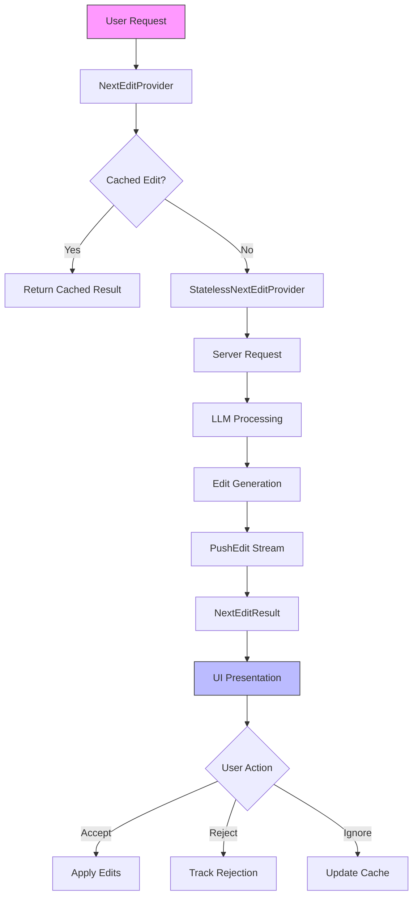
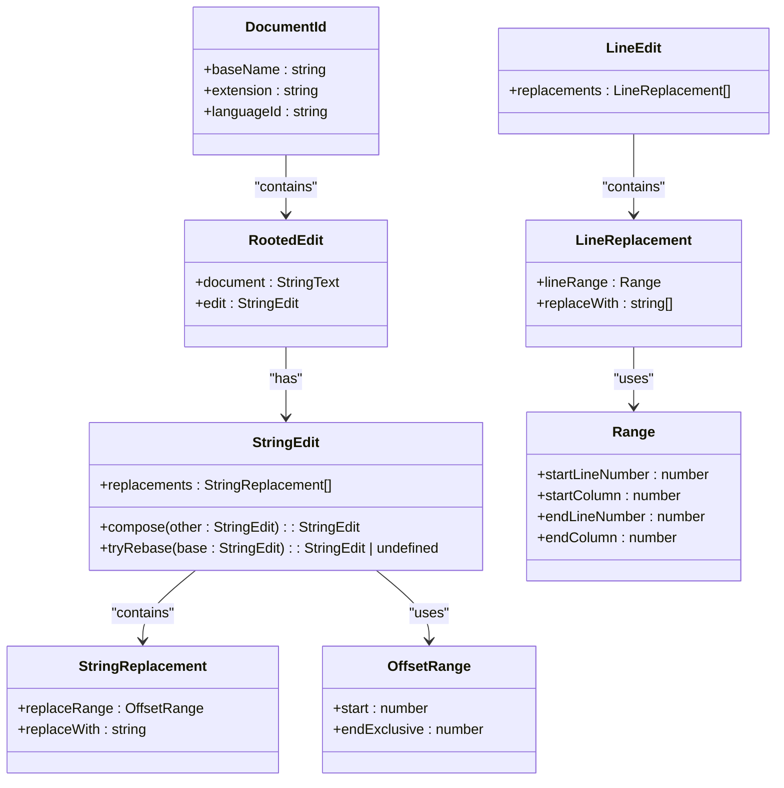
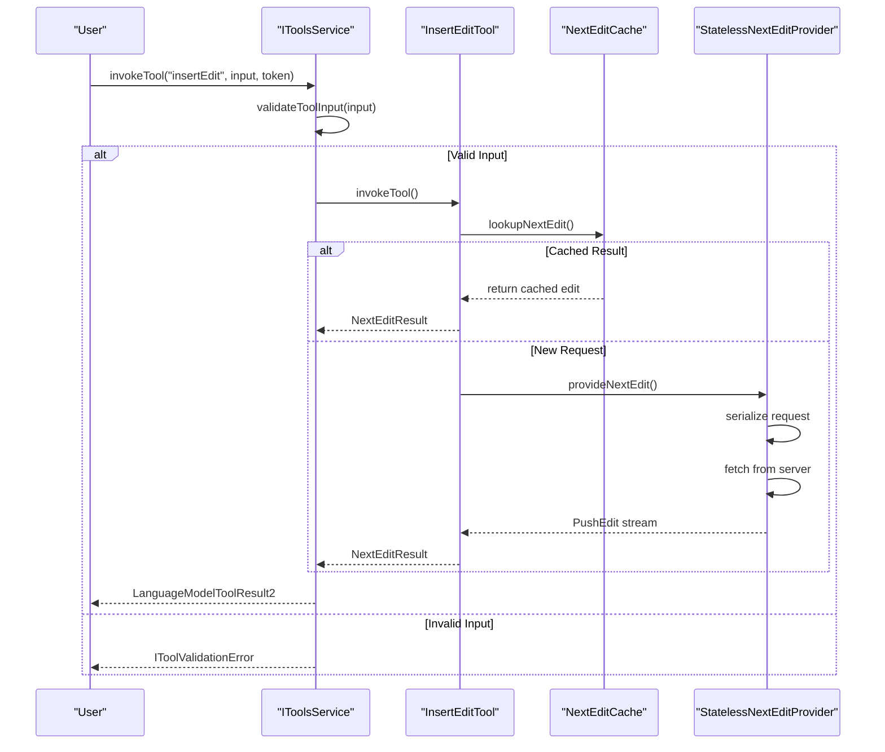
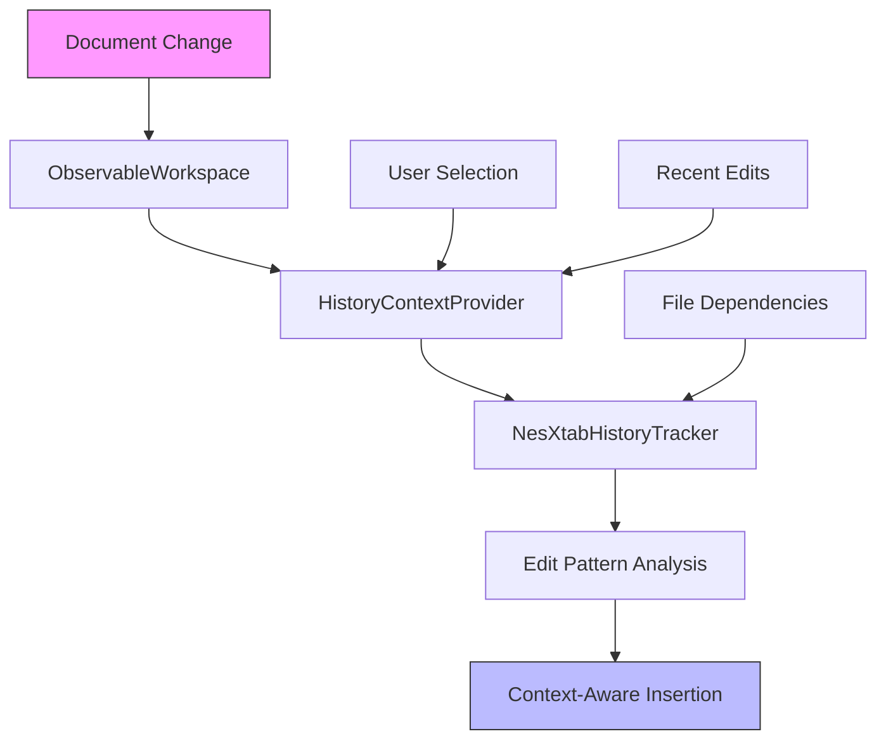
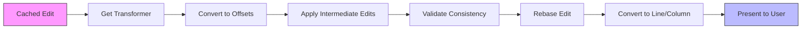
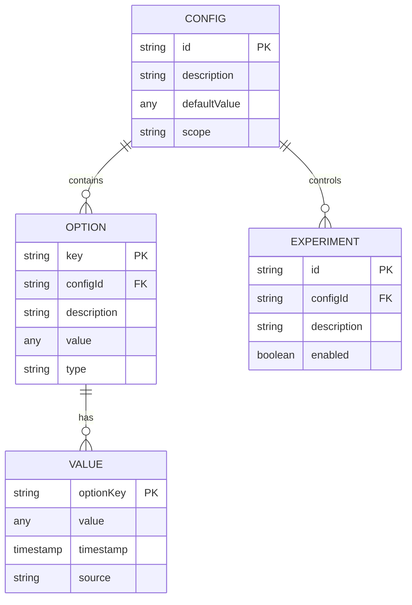
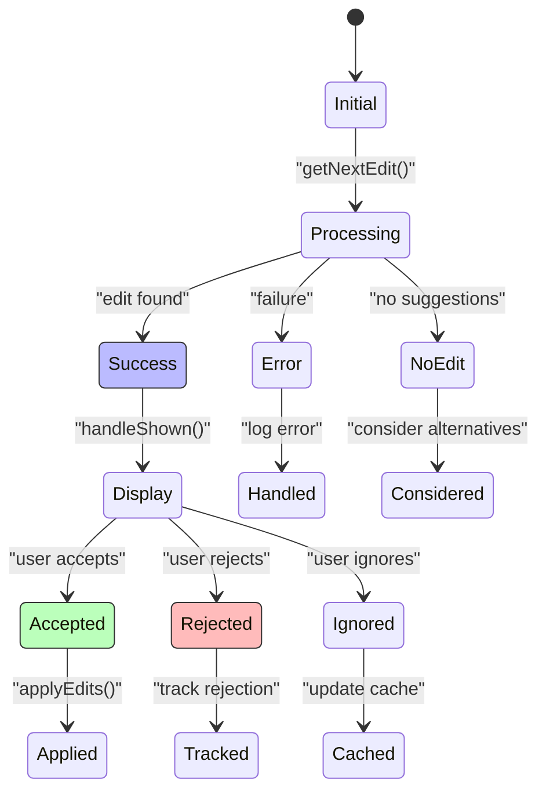
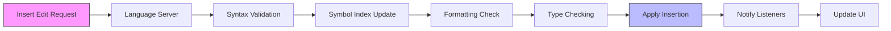
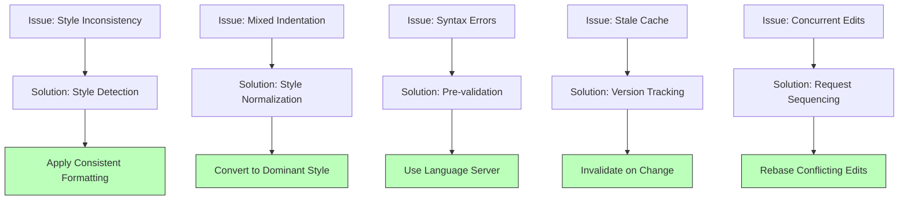

# Insert Edit Operations

<cite>
**Referenced Files in This Document**   
- [nextEditProvider.ts](file://src/extension/inlineEdits/node/nextEditProvider.ts)
- [serverPoweredInlineEditProvider.ts](file://src/extension/inlineEdits/node/serverPoweredInlineEditProvider.ts)
- [toolsService.ts](file://src/extension/tools/common/toolsService.ts)
- [toolsRegistry.ts](file://src/extension/tools/common/toolsRegistry.ts)
- [common.ts](file://src/extension/inlineEdits/common/common.ts)
- [jumpToCursorPosition.ts](file://src/extension/inlineEdits/common/jumpToCursorPosition.ts)
</cite>

## Table of Contents
1. [Introduction](#introduction)
2. [Insert Edit Architecture](#insert-edit-architecture)
3. [Domain Model for Insertion Operations](#domain-model-for-insertion-operations)
4. [Insert Edit Tool Invocation](#insert-edit-tool-invocation)
5. [Codebase Analysis Integration](#codebase-analysis-integration)
6. [Position Offset Transformer](#position-offset-transformer)
7. [Configuration Options](#configuration-options)
8. [Return Value Patterns](#return-value-patterns)
9. [Language Server Integration](#language-server-integration)
10. [Common Issues and Solutions](#common-issues-and-solutions)
11. [Conclusion](#conclusion)

## Introduction

Insert Edit Operations in GitHub Copilot Chat enable intelligent code insertion that respects existing formatting and structural consistency. These operations allow developers to add new content at specific locations within their codebase through AI-powered suggestions. The implementation focuses on maintaining code style consistency, preserving indentation, and ensuring context-aware placement of inserted code. This document provides a comprehensive analysis of the insertion-based code modification system, detailing the architecture, domain model, and integration points that make reliable code insertion possible.

**Section sources**
- [nextEditProvider.ts](file://src/extension/inlineEdits/node/nextEditProvider.ts#L1-L844)
- [serverPoweredInlineEditProvider.ts](file://src/extension/inlineEdits/node/serverPoweredInlineEditProvider.ts#L1-L134)

## Insert Edit Architecture

The insert edit architecture in GitHub Copilot Chat follows a layered approach with clear separation of concerns between stateless and stateful components. The core architecture consists of the NextEditProvider, which manages the lifecycle of edit suggestions, and the StatelessNextEditProvider, which generates the actual edit content without maintaining internal state.

**Diagram sources**
- [nextEditProvider.ts](file://src/extension/inlineEdits/node/nextEditProvider.ts#L63-L844)
- [serverPoweredInlineEditProvider.ts](file://src/extension/inlineEdits/node/serverPoweredInlineEditProvider.ts#L40-L134)

**Section sources**
- [nextEditProvider.ts](file://src/extension/inlineEdits/node/nextEditProvider.ts#L63-L844)
- [serverPoweredInlineEditProvider.ts](file://src/extension/inlineEdits/node/serverPoweredInlineEditProvider.ts#L40-L134)

## Domain Model for Insertion Operations

The domain model for insertion operations centers around several key concepts that ensure reliable and context-aware code insertion. The model includes cursor positioning, indentation preservation, and context-aware placement mechanisms that work together to maintain code quality and consistency.

The core data structures include:
- **DocumentId**: Uniquely identifies a document in the workspace
- **RootedEdit**: Represents an edit operation with a reference to the document state
- **StringEdit/StringReplacement**: Handles string-level edits with offset ranges
- **LineEdit/LineReplacement**: Manages line-level edits with proper positioning
- **OffsetRange**: Defines ranges using character offsets for precise positioning

**Diagram sources**
- [nextEditProvider.ts](file://src/extension/inlineEdits/node/nextEditProvider.ts#L8-L13)
- [common.ts](file://src/extension/inlineEdits/common/common.ts#L6-L7)

**Section sources**
- [nextEditProvider.ts](file://src/extension/inlineEdits/node/nextEditProvider.ts#L8-L13)
- [common.ts](file://src/extension/inlineEdits/common/common.ts#L6-L7)

## Insert Edit Tool Invocation

The invocation relationship between insert edit tools and the editing pipeline is managed through the IToolsService interface, which serves as the central coordinator for all tool operations. When an insert edit operation is requested, the system follows a well-defined invocation chain that ensures proper validation, execution, and result handling.

The invocation process begins with the tools service validating the input against the tool's schema using AJV (Another JSON Validator). This validation ensures that the input conforms to the expected structure before the tool is invoked. The service maintains a cache of compiled validation schemas to optimize performance across multiple invocations.

**Diagram sources**
- [toolsService.ts](file://src/extension/tools/common/toolsService.ts#L62-L253)
- [nextEditProvider.ts](file://src/extension/inlineEdits/node/nextEditProvider.ts#L46-L55)

**Section sources**
- [toolsService.ts](file://src/extension/tools/common/toolsService.ts#L62-L253)
- [nextEditProvider.ts](file://src/extension/inlineEdits/node/nextEditProvider.ts#L46-L55)

## Codebase Analysis Integration

Insert edit operations integrate with the codebase analysis service through the ObservableWorkspace and DocumentHistory components, which provide real-time insights into the current state of the codebase. This integration enables context-aware insertions that respect the existing code structure and formatting conventions.

The system maintains a history of recent edits through the HistoryContextProvider, which tracks document changes and selections. This historical context allows the insertion system to understand the developer's recent activity patterns and make more intelligent suggestions. The NesXtabHistoryTracker extends this capability by tracking cross-file edit patterns, enabling coordinated insertions across multiple related files.

When an insertion is requested, the system analyzes the current document state, recent edit history, and selection context to determine the optimal insertion point. The analysis considers factors such as:
- Recent edit patterns and frequencies
- Code structure and syntax context
- Developer's current focus area
- File relationships and dependencies

**Diagram sources**
- [nextEditProvider.ts](file://src/extension/inlineEdits/node/nextEditProvider.ts#L12-L16)
- [common.ts](file://src/extension/inlineEdits/common/common.ts#L6-L7)

**Section sources**
- [nextEditProvider.ts](file://src/extension/inlineEdits/node/nextEditProvider.ts#L12-L16)
- [common.ts](file://src/extension/inlineEdits/common/common.ts#L6-L7)

## Position Offset Transformer

The position offset transformer plays a critical role in maintaining accurate positioning during insert edit operations, especially when dealing with concurrent edits or cached results that need to be rebased. The transformer converts between different coordinate systems (line/column vs. offset) and handles the complexities of text manipulation in a collaborative editing environment.

The system uses StringText and its associated transformer to manage text representations and position conversions. When an edit is retrieved from the cache or received from the server, the transformer ensures that the edit's position offsets are correctly mapped to the current document state. This is particularly important when the document has changed since the edit was originally generated.

The transformer also handles the rebase operation when applying cached edits to a modified document. This process involves:
1. Converting the cached edit's positions to offsets
2. Applying intermediate user edits to adjust the target positions
3. Validating the consistency of the rebased edit
4. Converting back to line/column coordinates for presentation

**Diagram sources**
- [nextEditProvider.ts](file://src/extension/inlineEdits/node/nextEditProvider.ts#L37-L38)
- [common.ts](file://src/extension/inlineEdits/common/common.ts#L7)

**Section sources**
- [nextEditProvider.ts](file://src/extension/inlineEdits/node/nextEditProvider.ts#L37-L38)
- [common.ts](file://src/extension/inlineEdits/common/common.ts#L7)

## Configuration Options

The insert edit system provides several configuration options that control insertion behavior and adapt to different coding styles and preferences. These options are managed through the IConfigurationService and can be influenced by experimentation flags (IExperimentationService).

Key configuration options include:
- **InlineEditsAsyncCompletions**: Enables asynchronous completion handling
- **InlineEditsCacheDelay**: Controls the minimum delay for cached results
- **InlineEditsRebasedCacheDelay**: Controls delay for rebased cached results
- **InlineEditsSubsequentCacheDelay**: Controls delay for subsequent cached results
- **InlineEditsAutoExpandEditWindowLines**: Determines how many lines to include in the edit window
- **InlineEditsNextCursorPredictionDisplayLine**: Controls display of next cursor prediction

These configuration options allow fine-tuning of the insertion behavior to balance responsiveness with accuracy. For example, the cache delay settings prevent overly aggressive suggestions while ensuring that cached results are not presented too quickly, which could disrupt the user's workflow.

**Diagram sources**
- [nextEditProvider.ts](file://src/extension/inlineEdits/node/nextEditProvider.ts#L7-L8)
- [toolsService.ts](file://src/extension/tools/common/toolsService.ts#L8-L9)

**Section sources**
- [nextEditProvider.ts](file://src/extension/inlineEdits/node/nextEditProvider.ts#L7-L8)
- [toolsService.ts](file://src/extension/tools/common/toolsService.ts#L8-L9)

## Return Value Patterns

The insert edit system uses well-defined return value patterns to indicate successful integration and provide feedback on the operation's status. These patterns follow a consistent structure across the codebase, making it easier to handle results and implement error recovery.

The primary return types include:
- **NextEditResult**: Contains the suggested edit and display information
- **StatelessNextEditResult**: Represents the result from the stateless provider
- **IToolValidationResult**: Indicates whether tool input validation succeeded
- **Result<T, E>**: Generic result type for operations that can succeed or fail

Successful insertions return a NextEditResult containing the edit details, including the replacement text, target range, and optional display location. The system also provides metadata about the suggestion, such as whether it came from the cache or required a server request.

**Diagram sources**
- [nextEditProvider.ts](file://src/extension/inlineEdits/node/nextEditProvider.ts#L44-L45)
- [toolsService.ts](file://src/extension/tools/common/toolsService.ts#L18-L34)

**Section sources**
- [nextEditProvider.ts](file://src/extension/inlineEdits/node/nextEditProvider.ts#L44-L45)
- [toolsService.ts](file://src/extension/tools/common/toolsService.ts#L18-L34)

## Language Server Integration

Insert edit operations integrate with language server features and symbol indexing through the ObservableWorkspace and related components. This integration ensures that insertions are semantically valid and respect the language's syntax and structure.

The system leverages the language server protocol to:
- Validate the syntax of inserted code
- Ensure proper symbol resolution
- Maintain type consistency
- Preserve code formatting rules
- Support refactoring operations

When an insertion is made, the system coordinates with the language server to update the symbol index and notify other components of the change. This ensures that features like "Find All References" and "Go to Definition" continue to work correctly after the insertion.

**Diagram sources**
- [nextEditProvider.ts](file://src/extension/inlineEdits/node/nextEditProvider.ts#L12-L13)
- [toolsRegistry.ts](file://src/extension/tools/common/toolsRegistry.ts#L8-L9)

**Section sources**
- [nextEditProvider.ts](file://src/extension/inlineEdits/node/nextEditProvider.ts#L12-L13)
- [toolsRegistry.ts](file://src/extension/tools/common/toolsRegistry.ts#L8-L9)

## Common Issues and Solutions

The insert edit system addresses several common issues that arise during code insertion operations, providing robust solutions to maintain code quality and user experience.

### Maintaining Code Style Consistency
The system preserves existing formatting by analyzing the document's current indentation style and applying it to inserted code. The StringEdit and LineEdit classes handle whitespace preservation, ensuring that new code matches the surrounding context.

### Handling Mixed Indentation
When documents contain mixed indentation (spaces and tabs), the system detects the dominant style and applies it consistently to inserted code. The transformer components normalize positions to prevent misalignment.

### Preventing Syntax Errors
Before applying insertions, the system validates the resulting code structure. The integration with language servers provides real-time feedback on potential syntax issues, allowing the system to adjust suggestions accordingly.

### Cache Invalidation
The NextEditCache automatically invalidates stale suggestions when the document changes. The system uses document version tracking and content hashing to ensure that only relevant cached results are presented.

### Concurrency Handling
When multiple insert operations occur simultaneously, the system sequences the edits and resolves conflicts through the rebase mechanism. The PendingStatelessNextEditRequest manages request queuing and cancellation.

**Diagram sources**
- [nextEditProvider.ts](file://src/extension/inlineEdits/node/nextEditProvider.ts#L68-L69)
- [common.ts](file://src/extension/inlineEdits/common/common.ts#L37-L38)

**Section sources**
- [nextEditProvider.ts](file://src/extension/inlineEdits/node/nextEditProvider.ts#L68-L69)
- [common.ts](file://src/extension/inlineEdits/common/common.ts#L37-L38)

## Conclusion

The Insert Edit Operations in GitHub Copilot Chat provide a sophisticated system for intelligent code insertion that respects existing formatting and structural consistency. The architecture combines stateless and stateful components to deliver context-aware suggestions while maintaining performance and reliability.

Key aspects of the implementation include:
- A robust domain model for representing edit operations
- Seamless integration with codebase analysis services
- Precise position offset transformation for accurate placement
- Configurable behavior through experimentation and settings
- Comprehensive error handling and recovery mechanisms

The system's design prioritizes user experience by balancing responsiveness with accuracy, using caching and validation to ensure that suggestions are both timely and reliable. Through integration with language servers and symbol indexing, the insert edit operations maintain semantic validity and support advanced development workflows.

For developers implementing similar functionality, the GitHub Copilot Chat codebase demonstrates best practices in asynchronous operation management, cache invalidation, and user interface integration. The separation of concerns between the stateless provider and stateful manager creates a flexible architecture that can be extended to support additional insertion patterns and language features.

**Section sources**
- [nextEditProvider.ts](file://src/extension/inlineEdits/node/nextEditProvider.ts#L1-L844)
- [serverPoweredInlineEditProvider.ts](file://src/extension/inlineEdits/node/serverPoweredInlineEditProvider.ts#L1-L134)
- [toolsService.ts](file://src/extension/tools/common/toolsService.ts#L1-L253)