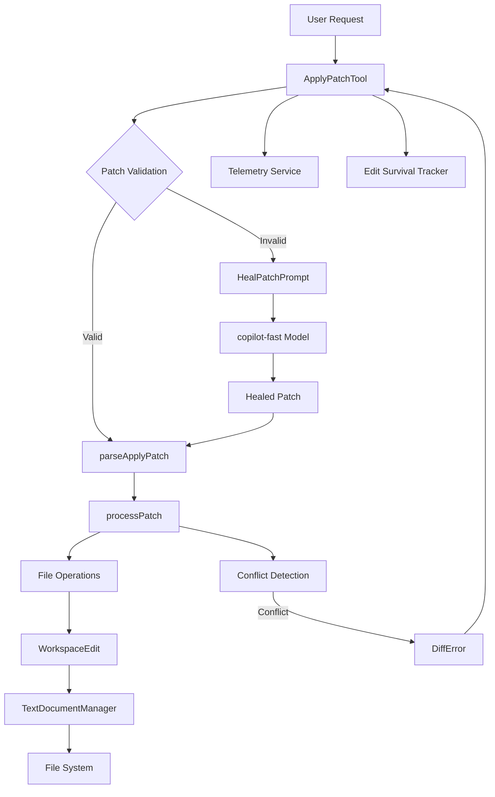
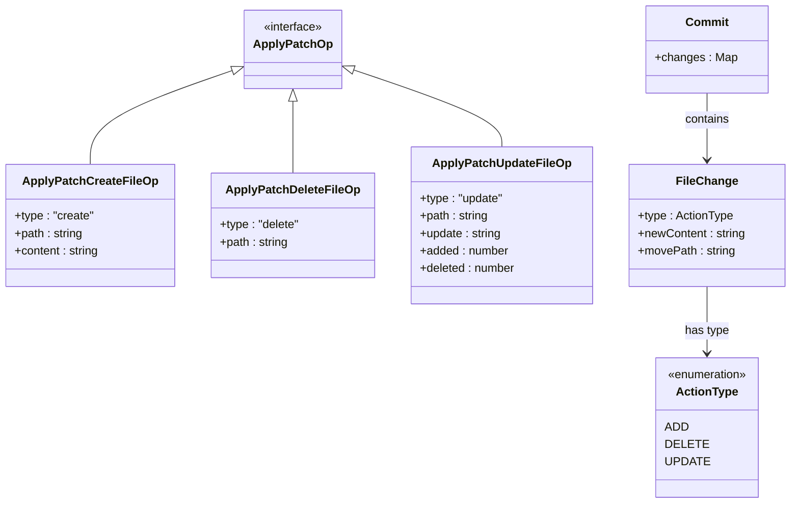
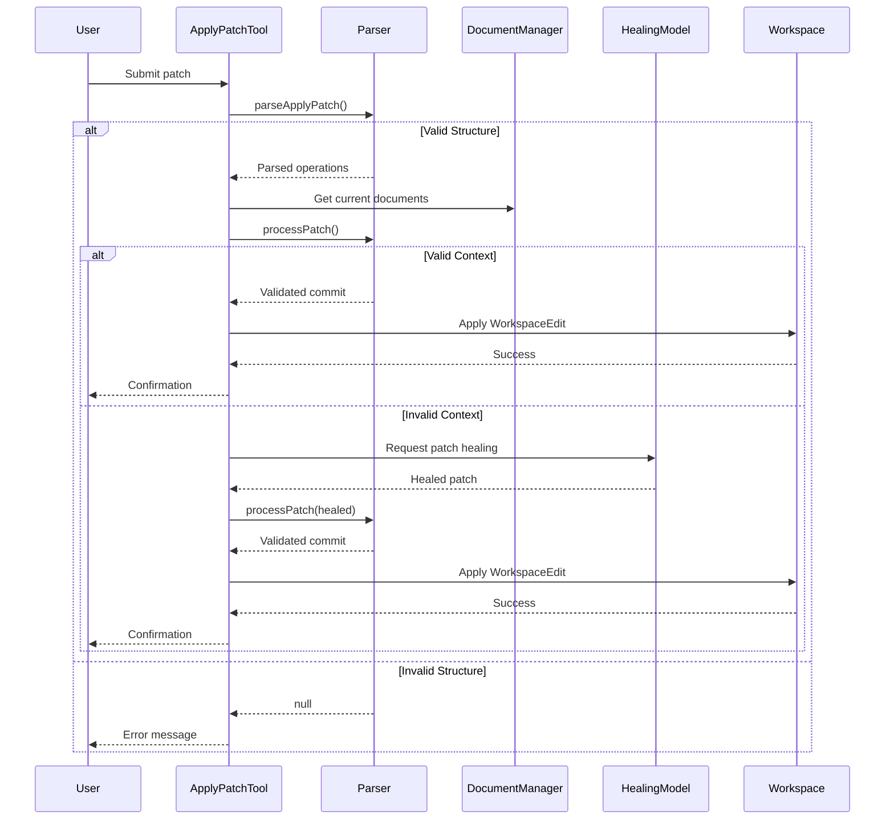
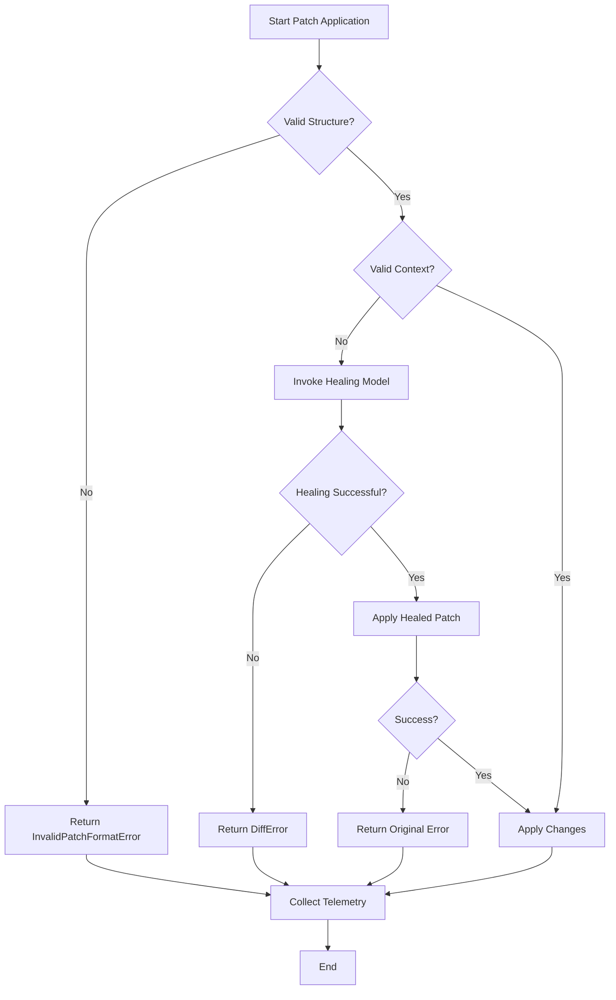

# Patch-Based Editing

<cite>
**Referenced Files in This Document**   
- [parseApplyPatch.ts](file://src/extension/tools/node/applyPatch/parseApplyPatch.ts)
- [applyPatchTool.tsx](file://src/extension/tools/node/applyPatchTool.tsx)
- [parser.ts](file://src/extension/tools/node/applyPatch/parser.ts)
- [applyPatch.spec.ts](file://src/extension/tools/node/test/applyPatch.spec.ts)
- [applyPatch.spec.tsx](file://src/extension/tools/test/node/applyPatch/applyPatch.spec.tsx)
</cite>

## Table of Contents
1. [Introduction](#introduction)
2. [Core Components](#core-components)
3. [Architecture Overview](#architecture-overview)
4. [Domain Model for Patch Operations](#domain-model-for-patch-operations)
5. [Patch Application Pipeline](#patch-application-pipeline)
6. [Configuration and Safety Options](#configuration-and-safety-options)
7. [Integration with Other Systems](#integration-with-other-systems)
8. [Error Handling and Conflict Resolution](#error-handling-and-conflict-resolution)
9. [Testing and Validation](#testing-and-validation)
10. [Best Practices and Recommendations](#best-practices-and-recommendations)

## Introduction
Patch-Based Editing in GitHub Copilot Chat enables reliable code modifications through a structured diff format that ensures safe and precise code transformations. This functionality allows AI-generated suggestions to be applied as atomic edits to source files, supporting create, update, and delete operations with proper context validation. The system is designed to prevent common issues like merge conflicts and invalid edits by validating patches against current file contents before application. This document provides a comprehensive analysis of the implementation, covering the domain model, processing pipeline, integration points, and error handling mechanisms that make patch-based editing both powerful and safe for developers.

## Core Components

The Patch-Based Editing functionality consists of several key components that work together to process and apply code changes. The core implementation revolves around the `applyPatch` tool that handles unified diff formats, with specialized parsers and validators ensuring correct application. The system integrates with the text document manager to access current file states and with the diff service to validate changes against existing content. Key components include the patch parser that processes the unified diff format, the application engine that executes the changes, and the healing mechanism that attempts to fix invalid patches using a secondary AI model. These components work in concert to provide a robust editing experience that maintains code integrity while enabling sophisticated AI-assisted development workflows.

**Section sources**
- [parseApplyPatch.ts](file://src/extension/tools/node/applyPatch/parseApplyPatch.ts#L1-L132)
- [applyPatchTool.tsx](file://src/extension/tools/node/applyPatchTool.tsx#L1-L642)
- [parser.ts](file://src/extension/tools/node/applyPatch/parser.ts#L1-L200)

## Architecture Overview

**Diagram sources **
- [applyPatchTool.tsx](file://src/extension/tools/node/applyPatchTool.tsx#L60-L591)
- [parseApplyPatch.ts](file://src/extension/tools/node/applyPatch/parseApplyPatch.ts#L55-L123)
- [parser.ts](file://src/extension/tools/node/applyPatch/parser.ts#L1-L200)

## Domain Model for Patch Operations

The domain model for patch operations defines a structured approach to code modifications using a custom diff format. At its core, the model supports three primary operations: create, update, and delete, each represented by specific types in the implementation. The `ApplyPatchOp` type union defines these operations with their respective properties, including path specifications and content modifications. Hunk parsing is a critical aspect of the model, where each change is represented with context lines that help uniquely identify the target location in the source file. The system uses special markers like `*** Begin Patch` and `*** End Patch` to delimit the patch content, with file-specific headers indicating the operation type. For updates, the model supports both content modifications and file renames through the `*** Move to:` directive. The hunk format uses standard diff indicators (`+` for additions, `-` for deletions, and ` ` for context) to specify changes at the line level, ensuring precise application of modifications.

**Diagram sources **
- [parseApplyPatch.ts](file://src/extension/tools/node/applyPatch/parseApplyPatch.ts#L18-L40)
- [parser.ts](file://src/extension/tools/node/applyPatch/parser.ts#L1-L200)

**Section sources**
- [parseApplyPatch.ts](file://src/extension/tools/node/applyPatch/parseApplyPatch.ts#L18-L40)
- [parser.ts](file://src/extension/tools/node/applyPatch/parser.ts#L1-L200)

## Patch Application Pipeline

The patch application pipeline follows a well-defined sequence of operations to ensure safe and reliable code modifications. When a patch is received, the system first validates its structure by checking for the required `*** Begin Patch` and `*** End Patch` markers. The `parseApplyPatch` function then processes the content, identifying file operations and their associated changes. For each file operation, the system retrieves the current document content through the text document manager to provide context for validation. The `processPatch` function performs detailed validation, ensuring that context lines in the patch match the actual file content, which prevents application of changes to incorrect locations. If validation fails, the system invokes a healing mechanism that uses a secondary AI model to correct the patch based on the current file contents and the intended changes. Once validated, the pipeline generates appropriate workspace edits, handling special cases like trailing whitespace preservation and notebook file formats. The entire operation is applied atomically, with telemetry collected throughout the process to monitor success rates and edit survival.

**Diagram sources **
- [applyPatchTool.tsx](file://src/extension/tools/node/applyPatchTool.tsx#L188-L419)
- [parseApplyPatch.ts](file://src/extension/tools/node/applyPatch/parseApplyPatch.ts#L55-L123)
- [parser.ts](file://src/extension/tools/node/applyPatch/parser.ts#L1-L200)

**Section sources**
- [applyPatchTool.tsx](file://src/extension/tools/node/applyPatchTool.tsx#L188-L419)
- [parseApplyPatch.ts](file://src/extension/tools/node/applyPatch/parseApplyPatch.ts#L55-L123)

## Configuration and Safety Options

The patch-based editing system includes several configuration options and safety mechanisms to ensure reliable code transformations. The system validates line endings and preserves trailing whitespace to maintain consistent code formatting across edits. Configuration options include strict context validation, which ensures that context lines in the patch exactly match the current file content, preventing accidental modifications to similar code patterns in different locations. The system also supports healing of invalid patches through a dedicated mechanism that uses a secondary AI model to correct formatting or context issues. Safety features include atomic application of changes, where all modifications are applied as a single workspace edit to prevent partial updates, and comprehensive telemetry that tracks edit success rates and survival over time. The implementation also includes safeguards for special file types like notebooks, with fallback mechanisms that recommend alternative editing tools when patch application might be problematic.

**Section sources**
- [applyPatchTool.tsx](file://src/extension/tools/node/applyPatchTool.tsx#L82-L138)
- [parseApplyPatch.ts](file://src/extension/tools/node/applyPatch/parseApplyPatch.ts#L55-L123)

## Integration with Other Systems

The patch-based editing functionality integrates with several key systems within GitHub Copilot Chat to provide a seamless development experience. It works closely with the inline edit system, allowing AI-generated suggestions to be applied directly within the editor context. The integration with version control systems ensures that changes are properly tracked and can be reviewed before final application. The system also connects with the telemetry service to collect data on edit success rates, healing effectiveness, and edit survival over time, providing valuable insights for improving the AI models. Integration with the notebook editing system allows for specialized handling of notebook files, with format-specific processing for Jupyter notebooks and other interactive coding environments. The tool also interfaces with the chat system to provide rich feedback on edit results, including success confirmations and error explanations with suggestions for alternative approaches.

**Section sources**
- [applyPatchTool.tsx](file://src/extension/tools/node/applyPatchTool.tsx#L237-L340)
- [applyPatchTool.tsx](file://src/extension/tools/node/applyPatchTool.tsx#L394-L411)

## Error Handling and Conflict Resolution

The system implements comprehensive error handling and conflict resolution mechanisms to ensure robust patch application. When a patch fails validation due to mismatched context lines, the system raises a `DiffError` with detailed information about the specific issue, such as which context line could not be found. Instead of immediately failing, the system attempts to heal the patch by sending it to a secondary AI model (`copilot-fast`) along with the current file contents and the intended changes. This healing process can correct common issues like outdated context lines or formatting errors. For more severe issues like invalid patch structure, the system returns appropriate error messages to guide the user. The implementation also handles special cases for notebook files, where complex formats like XML or Jupytext might cause parsing issues, by recommending the use of dedicated notebook editing tools. Comprehensive telemetry is collected for all error scenarios, helping to identify patterns and improve the overall reliability of the patch-based editing system.

**Diagram sources **
- [applyPatchTool.tsx](file://src/extension/tools/node/applyPatchTool.tsx#L198-L231)
- [applyPatchTool.tsx](file://src/extension/tools/node/applyPatchTool.tsx#L428-L460)

**Section sources**
- [applyPatchTool.tsx](file://src/extension/tools/node/applyPatchTool.tsx#L198-L231)
- [applyPatchTool.tsx](file://src/extension/tools/node/applyPatchTool.tsx#L428-L460)

## Testing and Validation

The patch-based editing functionality is supported by a comprehensive test suite that validates both the parsing and application of patches. Tests cover a wide range of scenarios, including basic patch parsing, handling of various file formats, and edge cases like empty files or files with special characters. The test suite includes specific validation for notebook files, ensuring that complex formats like XML-based notebooks and Jupytext can be properly processed. Integration tests verify the complete workflow from patch submission to application, including the healing mechanism for invalid patches. The implementation also includes snapshot testing to ensure that the output of patch applications matches expected results exactly. These tests help maintain the reliability of the system and catch regressions before they affect users, ensuring that patch-based editing remains a safe and effective way to apply AI-generated code changes.

**Section sources**
- [applyPatch.spec.ts](file://src/extension/tools/node/test/applyPatch.spec.ts#L1-L217)
- [applyPatch.spec.tsx](file://src/extension/tools/test/node/applyPatch/applyPatch.spec.tsx#L1-L91)

## Best Practices and Recommendations

When implementing and using patch-based editing, several best practices ensure reliable and effective code transformations. Always include sufficient context lines (typically 3 before and after changes) to uniquely identify the target location, especially in files with repetitive patterns. Use the `@@` header to specify class or function context when needed to disambiguate similar code sections. For multi-line changes that are close together, avoid duplicating context lines between adjacent hunks to keep patches concise. When creating new files, ensure all lines are prefixed with `+` to maintain proper format. For file renames, use the `*** Move to:` directive immediately after the update header. Always use absolute paths for file references to prevent ambiguity. When working with notebooks or other structured formats, consider using specialized editing tools if patch application encounters issues. Finally, monitor the telemetry data to understand edit success rates and adjust the AI prompts or validation rules as needed to improve reliability.