# String Replacement Tools

<cite>
**Referenced Files in This Document**   
- [replaceStringTool.tsx](file://src/extension/tools/node/replaceStringTool.tsx)
- [multiReplaceStringTool.tsx](file://src/extension/tools/node/multiReplaceStringTool.tsx)
- [abstractReplaceStringTool.tsx](file://src/extension/tools/node/abstractReplaceStringTool.tsx)
- [toolsService.ts](file://src/extension/tools/common/toolsService.ts)
- [multiReplaceStringTool.spec.tsx](file://src/extension/tools/node/test/multiReplaceStringTool.spec.tsx)
</cite>

## Table of Contents
1. [Introduction](#introduction)
2. [Core Components](#core-components)
3. [Architecture Overview](#architecture-overview)
4. [Detailed Component Analysis](#detailed-component-analysis)
5. [Domain Model for Text Replacement](#domain-model-for-text-replacement)
6. [Configuration and Safety Options](#configuration-and-safety-options)
7. [Integration with Editing Pipeline](#integration-with-editing-pipeline)
8. [Common Issues and Solutions](#common-issues-and-solutions)
9. [Performance Considerations](#performance-considerations)
10. [Conclusion](#conclusion)

## Introduction
The String Replacement Tools in GitHub Copilot Chat provide robust functionality for performing text substitution operations within codebases. These tools enable both single-file and multi-file string replacements, integrating seamlessly with the editing pipeline and file system services. The implementation supports precise text substitution with configurable safety options, ensuring reliable and consistent transformations across various file types and encoding scenarios.

**Section sources**
- [replaceStringTool.tsx](file://src/extension/tools/node/replaceStringTool.tsx#L1-L38)
- [multiReplaceStringTool.tsx](file://src/extension/tools/node/multiReplaceStringTool.tsx#L1-L149)

## Core Components
The string replacement functionality is implemented through two primary components: `ReplaceStringTool` for single-file operations and `MultiReplaceStringTool` for batch operations across multiple files. Both tools inherit from the `AbstractReplaceStringTool` base class, which provides common functionality for text replacement operations. The tools integrate with the language model tool invocation system and leverage the workspace editing capabilities to apply changes safely and efficiently.


**Diagram sources**
- [replaceStringTool.tsx](file://src/extension/tools/node/replaceStringTool.tsx#L20-L37)
- [multiReplaceStringTool.tsx](file://src/extension/tools/node/multiReplaceStringTool.tsx#L21-L108)
- [abstractReplaceStringTool.tsx](file://src/extension/tools/node/abstractReplaceStringTool.tsx)

**Section sources**
- [replaceStringTool.tsx](file://src/extension/tools/node/replaceStringTool.tsx#L6-L38)
- [multiReplaceStringTool.tsx](file://src/extension/tools/node/multiReplaceStringTool.tsx#L6-L108)

## Architecture Overview
The string replacement tools are integrated into the Copilot Chat extension's tool system, following a consistent pattern for language model tool implementations. The architecture follows a layered approach with clear separation between tool invocation, edit preparation, and edit application. The tools leverage the VS Code language model API for invocation and the workspace editing services for applying changes.


**Diagram sources**
- [replaceStringTool.tsx](file://src/extension/tools/node/replaceStringTool.tsx#L27-L29)
- [multiReplaceStringTool.tsx](file://src/extension/tools/node/multiReplaceStringTool.tsx#L28-L102)
- [toolsService.ts](file://src/extension/tools/common/toolsService.ts#L62-L63)

## Detailed Component Analysis

### ReplaceStringTool Analysis
The `ReplaceStringTool` handles single-file string replacement operations. It implements the `invoke` method to process replacement requests, preparing and applying edits through the inherited base class functionality. The tool validates input parameters and coordinates with the editing pipeline to ensure atomic application of changes.

```mermaid
sequenceDiagram
participant LM as Language Model
participant Tool as ReplaceStringTool
participant Base as AbstractReplaceStringTool
participant Workspace as Workspace Service
LM->>Tool : invoke(options, token)
Tool->>Base : prepareEditsForFile(options, input, token)
Base->>Workspace : Read file content
Workspace-->>Base : Text content
Base->>Base : Find exact string match
Base-->>Tool : PreparedEdit
Tool->>Base : applyAllEdits(options, [prepared], token)
Base->>Workspace : Apply text edits
Workspace-->>Base : Success status
Base-->>Tool : LanguageModelToolResult2
Tool-->>LM : Result
```



**Diagram sources**
- [replaceStringTool.tsx](file://src/extension/tools/node/replaceStringTool.tsx#L27-L29)
- [abstractReplaceStringTool.tsx](file://src/extension/tools/node/abstractReplaceStringTool.tsx)

**Section sources**
- [replaceStringTool.tsx](file://src/extension/tools/node/replaceStringTool.tsx#L20-L37)

### MultiReplaceStringTool Analysis
The `MultiReplaceStringTool` coordinates batch string replacements across multiple files. It processes an array of replacement operations, preparing edits for each file and merging operations on the same file to ensure consistent application. The tool includes comprehensive telemetry reporting to track success rates and performance metrics.


**Diagram sources**
- [multiReplaceStringTool.tsx](file://src/extension/tools/node/multiReplaceStringTool.tsx#L28-L102)
- [multiReplaceStringTool.spec.tsx](file://src/extension/tools/node/test/multiReplaceStringTool.spec.tsx#L59-L69)

**Section sources**
- [multiReplaceStringTool.tsx](file://src/extension/tools/node/multiReplaceStringTool.tsx#L21-L108)

## Domain Model for Text Replacement
The string replacement tools operate on a well-defined domain model that includes parameters for exact matching, case sensitivity, and scope limitations. The `IReplaceStringToolParams` interface defines the structure for single replacements, while `IMultiReplaceStringToolParams` extends this for batch operations.

```mermaid
erDiagram
REPLACE_STRING_PARAMS {
string explanation PK
string filePath FK
string oldString
string newString
}
MULTI_REPLACE_STRING_PARAMS {
string explanation PK
array replacements FK
}
REPLACE_STRING_PARAMS ||--o{ MULTI_REPLACE_STRING_PARAMS : "contained in"
REPLACE_STRING_PARAMS }|--|| FILE : "applies to"
class REPLACE_STRING_PARAMS <<interface>>
class MULTI_REPLACE_STRING_PARAMS <<interface>>
```

**Diagram sources**
- [replaceStringTool.tsx](file://src/extension/tools/node/replaceStringTool.tsx#L13-L18)
- [multiReplaceStringTool.tsx](file://src/extension/tools/node/multiReplaceStringTool.tsx#L16-L19)

**Section sources**
- [replaceStringTool.tsx](file://src/extension/tools/node/replaceStringTool.tsx#L13-L18)
- [multiReplaceStringTool.tsx](file://src/extension/tools/node/multiReplaceStringTool.tsx#L16-L19)

## Configuration and Safety Options
The string replacement tools include several configuration options to ensure safe and reliable operations. These include requiring exact matches, controlling replacement scope, and providing detailed return values that indicate the number of replacements made. The tools also support case sensitivity options and can be configured to prevent partial word matches.


**Diagram sources**
- [multiReplaceStringTool.tsx](file://src/extension/tools/node/multiReplaceStringTool.tsx#L49-L69)
- [abstractReplaceStringTool.tsx](file://src/extension/tools/node/abstractReplaceStringTool.tsx)

**Section sources**
- [multiReplaceStringTool.tsx](file://src/extension/tools/node/multiReplaceStringTool.tsx#L35-L69)

## Integration with Editing Pipeline
The string replacement tools integrate with the VS Code editing pipeline through the language model tool system and workspace services. They coordinate with the text document manager to ensure proper handling of file encodings and line endings. The tools also integrate with search functionality and workspace indexing to maintain consistency across the codebase.


**Diagram sources**
- [replaceStringTool.tsx](file://src/extension/tools/node/replaceStringTool.tsx#L27-L29)
- [toolUtils.ts](file://src/extension/tools/node/toolUtils.ts)
- [workspaceService.ts](file://src/platform/workspace/common/workspaceService.ts)

**Section sources**
- [replaceStringTool.tsx](file://src/extension/tools/node/replaceStringTool.tsx#L27-L29)
- [toolUtils.ts](file://src/extension/tools/node/toolUtils.ts)

## Common Issues and Solutions
The string replacement tools address several common issues in text transformation operations. These include handling partial word matches, managing encoding considerations, and ensuring consistent application of changes across multiple files. The implementation includes safeguards against common pitfalls such as accidental partial replacements and encoding corruption.


**Diagram sources**
- [abstractReplaceStringTool.tsx](file://src/extension/tools/node/abstractReplaceStringTool.tsx)
- [multiReplaceStringTool.tsx](file://src/extension/tools/node/multiReplaceStringTool.tsx#L82-L99)

**Section sources**
- [multiReplaceStringTool.tsx](file://src/extension/tools/node/multiReplaceStringTool.tsx#L82-L99)
- [abstractReplaceStringTool.tsx](file://src/extension/tools/node/abstractReplaceStringTool.tsx)

## Performance Considerations
The string replacement tools are designed with performance in mind, particularly for large-scale replacements. The implementation uses efficient string matching algorithms and minimizes file I/O operations. For multi-file operations, edits are batched and applied atomically to reduce overhead and improve responsiveness.


**Diagram sources**
- [multiReplaceStringTool.tsx](file://src/extension/tools/node/multiReplaceStringTool.tsx#L33-L34)
- [abstractReplaceStringTool.tsx](file://src/extension/tools/node/abstractReplaceStringTool.tsx)

**Section sources**
- [multiReplaceStringTool.tsx](file://src/extension/tools/node/multiReplaceStringTool.tsx#L33-L34)

## Conclusion
The String Replacement Tools in GitHub Copilot Chat provide a robust and reliable solution for text transformation operations. By leveraging a well-structured architecture and comprehensive safety features, these tools enable both simple and complex string replacements with confidence. The integration with the editing pipeline and workspace services ensures consistent behavior across different file types and project structures. Developers can use these tools to efficiently refactor code, update configurations, and perform bulk text modifications while maintaining code integrity and performance.