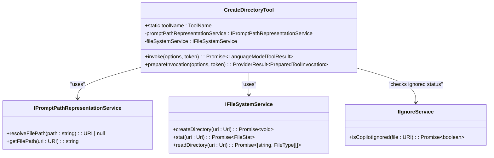
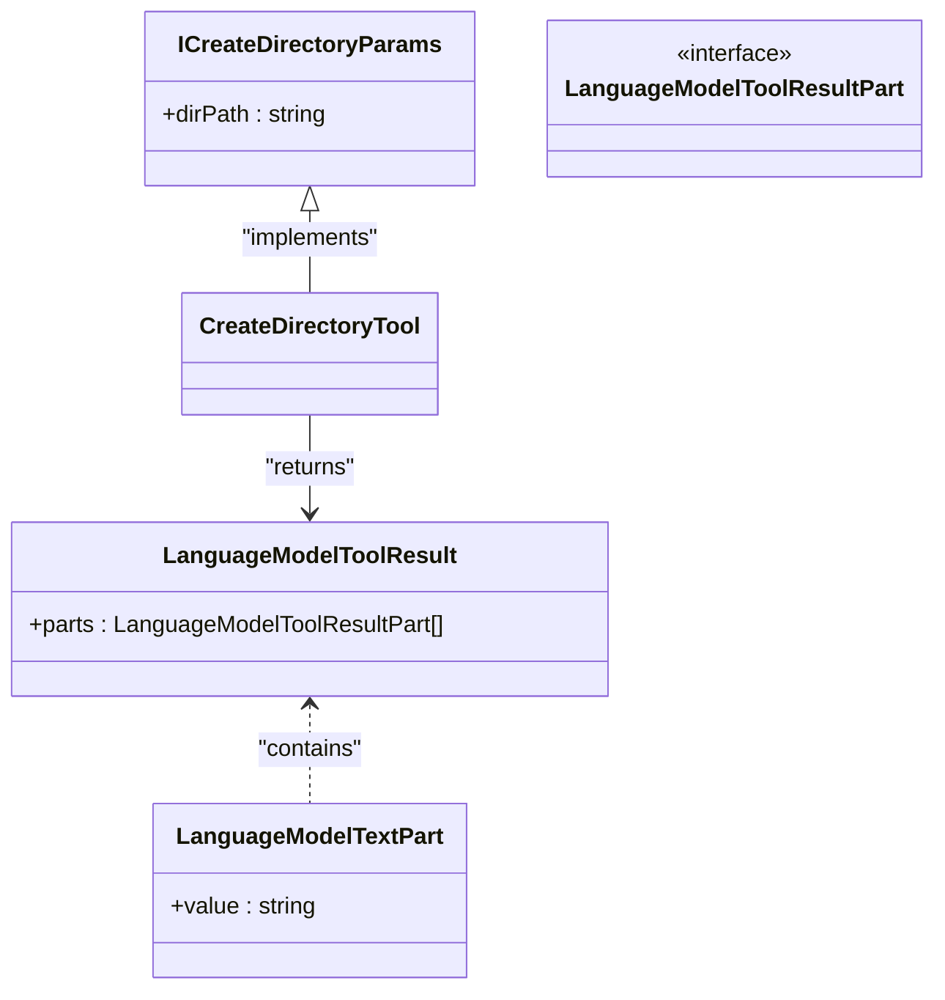
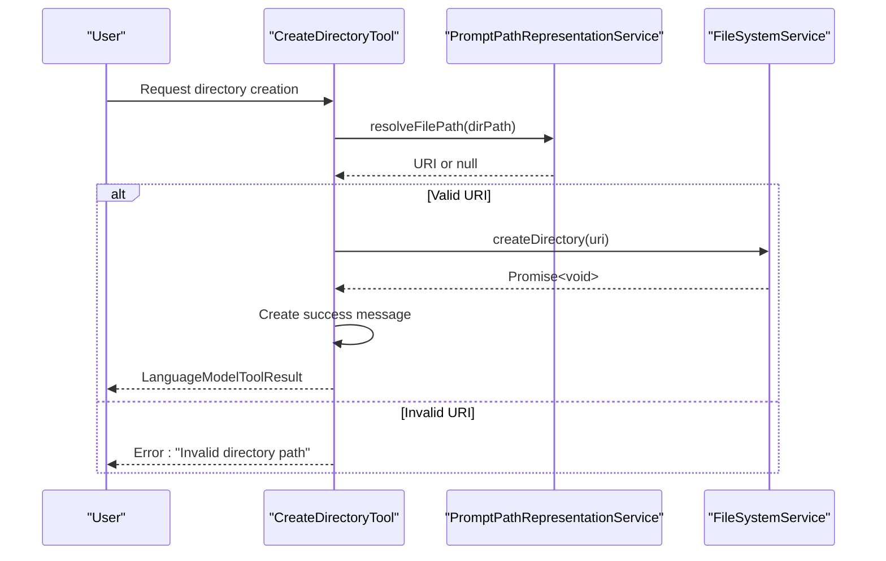
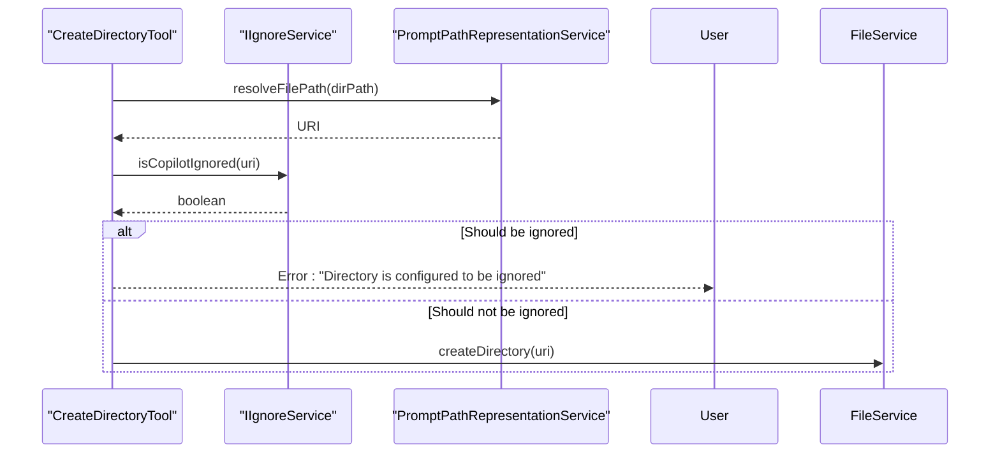
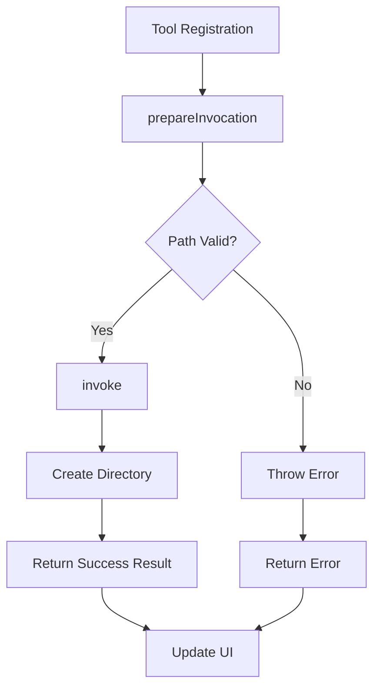
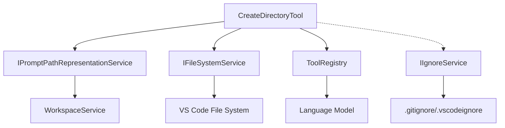

# Create Directory Tool

<cite>
**Referenced Files in This Document**   
- [createDirectoryTool.tsx](file://src/extension/tools/node/createDirectoryTool.tsx)
- [fileSystemService.ts](file://src/platform/filesystem/common/fileSystemService.ts)
- [toolUtils.ts](file://src/extension/tools/node/toolUtils.ts)
- [ignoreService.ts](file://src/platform/ignore/common/ignoreService.ts)
- [promptPathRepresentationService.ts](file://src/platform/prompts/common/promptPathRepresentationService.ts)
- [toolsRegistry.ts](file://src/extension/tools/common/toolsRegistry.ts)
</cite>

## Table of Contents
1. [Introduction](#introduction)
2. [Core Implementation](#core-implementation)
3. [Domain Model and Parameters](#domain-model-and-parameters)
4. [Directory Creation Process](#directory-creation-process)
5. [Path Resolution and Normalization](#path-resolution-and-normalization)
6. [Integration with Ignore Service](#integration-with-ignore-service)
7. [Error Handling Strategies](#error-handling-strategies)
8. [Tool Invocation Lifecycle](#tool-invocation-lifecycle)
9. [Relationships with Other Components](#relationships-with-other-components)
10. [Configuration and Input Parameters](#configuration-and-input-parameters)
11. [Return Value Patterns](#return-value-patterns)
12. [Common Issues and Solutions](#common-issues-and-solutions)

## Introduction
The Create Directory Tool in GitHub Copilot Chat provides a robust mechanism for creating directories within the workspace through natural language interactions. This tool enables users to create new directory structures programmatically, with comprehensive validation, cross-platform path handling, and integration with workspace services. The implementation follows a clean architectural pattern with clear separation of concerns, leveraging dependency injection and service-oriented design to ensure reliability and maintainability.

**Section sources**
- [createDirectoryTool.tsx](file://src/extension/tools/node/createDirectoryTool.tsx#L1-L51)

## Core Implementation

The Create Directory Tool is implemented as a TypeScript class that implements the `ICopilotTool` interface, following the tool registry pattern used throughout the Copilot extension. The core implementation revolves around the `CreateDirectoryTool` class which handles directory creation requests through the language model tool invocation system.

The tool follows a dependency injection pattern, receiving required services through its constructor parameters. It depends on two primary services: `IPromptPathRepresentationService` for path resolution and `IFileSystemService` for actual file system operations. This design ensures loose coupling between the tool logic and the underlying platform services.

**Diagram sources**
- [createDirectoryTool.tsx](file://src/extension/tools/node/createDirectoryTool.tsx#L19-L51)
- [fileSystemService.ts](file://src/platform/filesystem/common/fileSystemService.ts#L13-L33)
- [promptPathRepresentationService.ts](file://src/platform/prompts/common/promptPathRepresentationService.ts)

**Section sources**
- [createDirectoryTool.tsx](file://src/extension/tools/node/createDirectoryTool.tsx#L19-L51)

## Domain Model and Parameters

The domain model for directory operations is defined through the `ICreateDirectoryParams` interface, which specifies the required input parameters for directory creation. This interface defines a simple but effective contract for the tool invocation, focusing on the essential parameter needed for directory creation.

The primary parameter is `dirPath`, which represents the directory path to be created. This string parameter can accept both absolute and relative paths, with the system handling the appropriate resolution based on the current workspace context. The parameter is designed to be user-friendly, allowing natural language path specifications that are then resolved to proper URI objects.

**Diagram sources**
- [createDirectoryTool.tsx](file://src/extension/tools/node/createDirectoryTool.tsx#L15-L17)

**Section sources**
- [createDirectoryTool.tsx](file://src/extension/tools/node/createDirectoryTool.tsx#L15-L17)

## Directory Creation Process

The directory creation process follows a well-defined sequence of operations that ensures reliability and proper error handling. When a directory creation request is received, the tool first resolves the provided path string to a URI object using the `promptPathRepresentationService`. This resolution step is critical for handling cross-platform path differences and ensuring the path is valid within the current workspace context.

After path resolution, the tool delegates the actual directory creation to the `fileSystemService`. This service abstraction allows the tool to work consistently across different operating systems and file system types. The creation operation is performed asynchronously, respecting the cancellation token provided in the invocation options to support user-initiated cancellation.

The process includes validation at multiple levels: path validation during resolution, existence checks through the file system service, and permission verification at the operating system level. If any step fails, appropriate errors are thrown and propagated back to the caller.

**Diagram sources**
- [createDirectoryTool.tsx](file://src/extension/tools/node/createDirectoryTool.tsx#L27-L40)
- [fileSystemService.ts](file://src/platform/filesystem/common/fileSystemService.ts#L19)

**Section sources**
- [createDirectoryTool.tsx](file://src/extension/tools/node/createDirectoryTool.tsx#L27-L40)

## Path Resolution and Normalization

Path resolution and normalization are critical aspects of the Create Directory Tool's functionality, ensuring cross-platform compatibility and proper workspace integration. The tool leverages the `promptPathRepresentationService` to handle path resolution, which converts user-provided path strings into proper URI objects that can be used by the file system service.

The path resolution process handles various input formats, including absolute paths, relative paths, and workspace-relative paths. It normalizes these paths according to the current operating system conventions, ensuring that directory separators and path formats are correct for the target platform. This normalization is particularly important in cross-platform development environments where users might specify paths using conventions from different operating systems.

The tool also integrates with the workspace service to resolve paths relative to workspace folders, ensuring that directories are created in the appropriate location within the project structure. This integration allows users to specify paths relative to workspace roots without needing to provide full absolute paths.

**Section sources**
- [toolUtils.ts](file://src/extension/tools/node/toolUtils.ts#L94-L101)
- [createDirectoryTool.tsx](file://src/extension/tools/node/createDirectoryTool.tsx#L28-L31)

## Integration with Ignore Service

The Create Directory Tool integrates with the ignore service to ensure that newly created directories comply with the workspace's content exclusion rules. Although the primary implementation in `createDirectoryTool.tsx` does not directly reference the ignore service, the broader tool ecosystem uses this service to validate file and directory operations against ignore rules.

The ignore service checks whether a file or directory should be excluded from Copilot's context based on patterns defined in `.gitignore`, `.vscodeignore`, or other configuration files. When a directory is created, the ignore service can prevent it from being included in future context operations if it matches exclusion patterns.

This integration ensures that the tool respects the project's configuration and does not create directories that would be immediately excluded from Copilot's analysis. The ignore service also provides methods to check if regex-based exclusions are enabled and to obtain minimatch patterns for exclusion rules.

**Diagram sources**
- [ignoreService.ts](file://src/platform/ignore/common/ignoreService.ts#L32)
- [toolUtils.ts](file://src/extension/tools/node/toolUtils.ts#L128-L134)

**Section sources**
- [ignoreService.ts](file://src/platform/ignore/common/ignoreService.ts#L32)
- [toolUtils.ts](file://src/extension/tools/node/toolUtils.ts#L128-L134)

## Error Handling Strategies

The Create Directory Tool employs a comprehensive error handling strategy to manage various failure scenarios that may occur during directory creation. The primary error handling occurs at the path resolution stage, where an invalid path string results in an explicit error with a descriptive message.

The tool throws specific error types for different failure conditions, allowing callers to handle errors appropriately. For invalid paths, it throws a generic Error with a clear message indicating the path validation failure. More specific errors from the file system service, such as permission denied or disk full errors, are propagated through to the caller without modification.

The error handling is designed to provide meaningful feedback to users while maintaining security by not exposing sensitive system information. Error messages are localized where appropriate and provide actionable guidance for resolving common issues.

The tool also respects cancellation tokens, throwing a `CancellationError` if the operation is cancelled by the user. This allows for responsive user interfaces that can interrupt long-running operations when needed.

**Section sources**
- [createDirectoryTool.tsx](file://src/extension/tools/node/createDirectoryTool.tsx#L29-L31)
- [toolUtils.ts](file://src/extension/tools/node/toolUtils.ts#L24-L27)

## Tool Invocation Lifecycle

The Create Directory Tool follows the standard tool invocation lifecycle defined by the Copilot extension framework. This lifecycle consists of two main phases: preparation and invocation. The preparation phase is handled by the `prepareInvocation` method, which formats the user interface messages that will be displayed during tool execution.

During preparation, the tool resolves the input path and creates appropriate messages for both the invocation state (showing what will happen) and the past tense state (showing what happened). These messages are formatted using Markdown strings and include file widgets for better user experience.

The invocation phase is handled by the `invoke` method, which performs the actual directory creation operation. This method is asynchronous and returns a `LanguageModelToolResult` containing a text part with a success message. The result format is standardized across all Copilot tools to ensure consistent behavior in the language model integration.

The tool is registered with the `ToolRegistry`, making it available for discovery and invocation by the language model system. This registration pattern allows for dynamic tool loading and management within the extension.

**Diagram sources**
- [createDirectoryTool.tsx](file://src/extension/tools/node/createDirectoryTool.tsx#L42-L48)
- [toolsRegistry.ts](file://src/extension/tools/common/toolsRegistry.ts#L65-L75)

**Section sources**
- [createDirectoryTool.tsx](file://src/extension/tools/node/createDirectoryTool.tsx#L42-L48)

## Relationships with Other Components

The Create Directory Tool maintains several important relationships with other components in the Copilot extension ecosystem. The most critical relationship is with the `IFileSystemService`, which provides the actual file system operations. This service abstraction allows the tool to work across different platforms and file system types while maintaining a consistent interface.

Another key relationship is with the `IPromptPathRepresentationService`, which handles path resolution and formatting. This service ensures that paths are properly normalized and represented according to the current workspace and platform conventions.

The tool also indirectly relates to the `IIgnoreService` through shared utilities in `toolUtils.ts`, allowing it to respect content exclusion rules defined in the workspace. Additionally, it integrates with the `ToolRegistry` system, which manages the lifecycle and discovery of all Copilot tools.

These relationships follow a dependency injection pattern, with services being provided to the tool constructor rather than being directly instantiated. This design promotes testability, maintainability, and flexibility in the overall architecture.

**Diagram sources**
- [createDirectoryTool.tsx](file://src/extension/tools/node/createDirectoryTool.tsx#L22-L25)
- [toolUtils.ts](file://src/extension/tools/node/toolUtils.ts)
- [toolsRegistry.ts](file://src/extension/tools/common/toolsRegistry.ts)

**Section sources**
- [createDirectoryTool.tsx](file://src/extension/tools/node/createDirectoryTool.tsx#L22-L25)

## Configuration and Input Parameters

The Create Directory Tool accepts a simple but effective configuration through its input parameters. The primary parameter is `dirPath`, a string that specifies the directory path to create. This parameter supports various path formats including absolute paths, relative paths, and workspace-relative paths.

The tool does not require additional configuration options, as it relies on the underlying platform services for path resolution and file system operations. These services are configured at the workspace or user level, allowing consistent behavior across all file operations in the extension.

Input validation is performed through the `promptPathRepresentationService`, which ensures that the provided path string can be resolved to a valid URI within the current workspace context. This validation includes checking for proper path syntax and ensuring the path is within allowed workspace boundaries.

The tool follows the principle of least surprise, accepting path inputs in the most natural format for the user while handling the technical details of path normalization and resolution behind the scenes.

**Section sources**
- [createDirectoryTool.tsx](file://src/extension/tools/node/createDirectoryTool.tsx#L15-L17)
- [toolUtils.ts](file://src/extension/tools/node/toolUtils.ts#L94-L101)

## Return Value Patterns

The Create Directory Tool follows a standardized return value pattern used throughout the Copilot tool ecosystem. Upon successful execution, the tool returns a `LanguageModelToolResult` object containing a single `LanguageModelTextPart` with a success message.

The success message follows a consistent format: "Created directory at [path]", where [path] is the resolved path representation. This message is formatted using the `promptPathRepresentationService` to ensure proper path display according to the current workspace conventions.

The return value pattern is designed to be both human-readable and machine-parsable, allowing the language model to incorporate the result into its response generation. The use of standardized result types ensures consistency across different tools and enables reliable integration with the language model system.

In case of errors, the tool does not return a result object but instead throws an exception, following the JavaScript/TypeScript convention for error handling. This approach simplifies the success path while providing clear error signaling for failure conditions.

**Section sources**
- [createDirectoryTool.tsx](file://src/extension/tools/node/createDirectoryTool.tsx#L35-L39)

## Common Issues and Solutions

The Create Directory Tool addresses several common issues that may arise during directory creation operations. One common issue is invalid path specifications, which are handled by thorough validation and clear error messages that guide users to provide correct paths.

Another common issue is permission errors, which are handled by allowing the underlying file system service to throw appropriate errors. These errors are then propagated to the user with actionable guidance for resolving permission issues.

Race conditions during concurrent directory creation are mitigated by the atomic nature of the file system operations and the asynchronous promise-based API. The tool does not implement additional locking mechanisms, relying on the operating system's file system to handle concurrent access.

Symbolic links are handled transparently by the file system service, with the tool treating them as regular directories for creation purposes. The actual behavior depends on the underlying platform and file system capabilities.

Error propagation is handled consistently throughout the call stack, with errors being thrown at the point of failure and caught by higher-level handlers in the Copilot system. This ensures that users receive timely and accurate feedback about operation failures.

**Section sources**
- [createDirectoryTool.tsx](file://src/extension/tools/node/createDirectoryTool.tsx#L29-L31)
- [fileSystemService.ts](file://src/platform/filesystem/common/fileSystemService.ts#L19)
- [toolUtils.ts](file://src/extension/tools/node/toolUtils.ts#L94-L101)