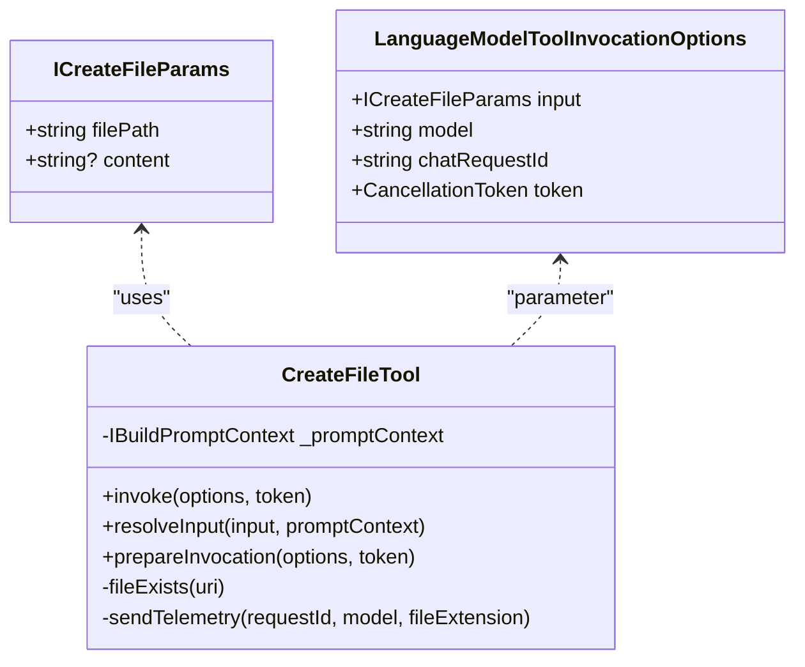
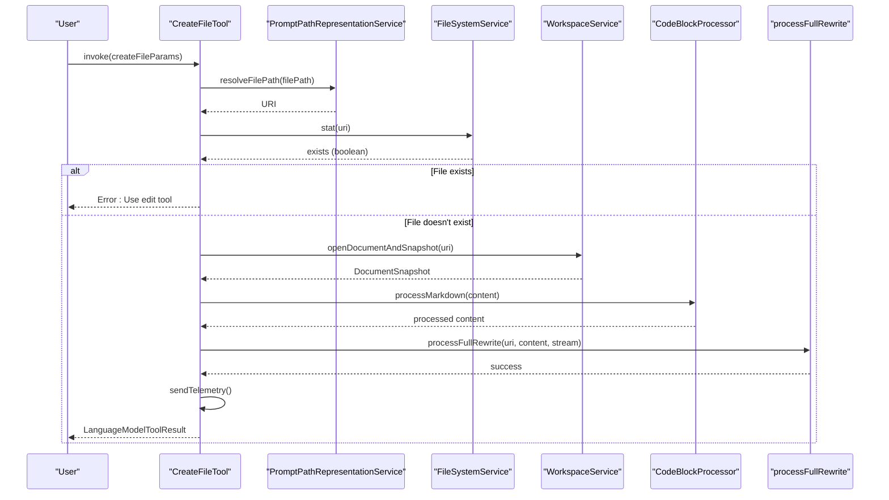
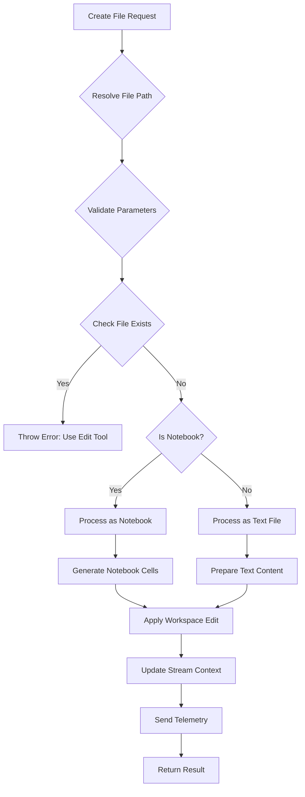
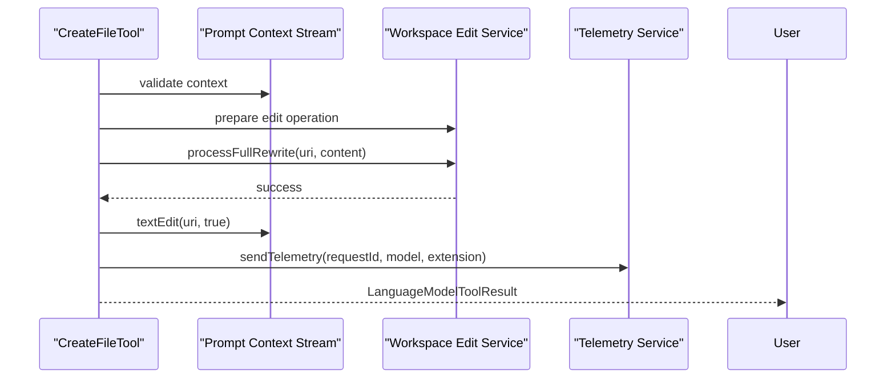
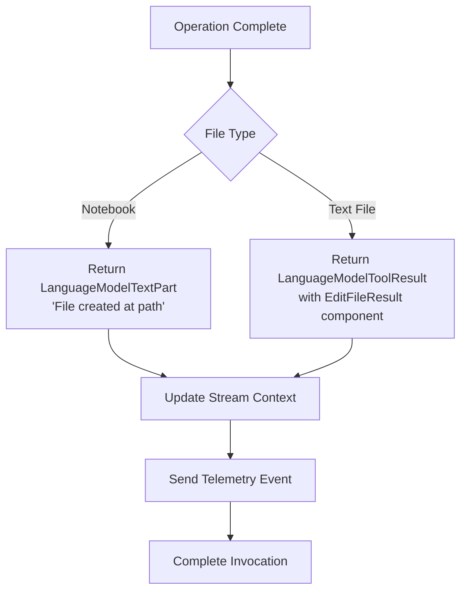

# Create File Tool

<cite>
**Referenced Files in This Document**   
- [createFileTool.tsx](file://src/extension/tools/node/createFileTool.tsx)
- [toolUtils.ts](file://src/extension/tools/node/toolUtils.ts)
- [editFileToolResult.tsx](file://src/extension/tools/node/editFileToolResult.tsx)
- [allTools.ts](file://src/extension/tools/node/allTools.ts)
- [processFullRewrite](file://src/extension/prompts/node/codeMapper/codeMapper.ts)
</cite>

## Table of Contents
1. [Introduction](#introduction)
2. [Domain Model and Parameters](#domain-model-and-parameters)
3. [Implementation Details](#implementation-details)
4. [File System Interaction](#file-system-interaction)
5. [Workspace Edit Service Integration](#workspace-edit-service-integration)
6. [Conflict Resolution and Validation](#conflict-resolution-and-validation)
7. [Error Handling and Edge Cases](#error-handling-and-edge-cases)
8. [Configuration and Input Parameters](#configuration-and-input-parameters)
9. [Return Value Patterns](#return-value-patterns)
10. [Integration with Workspace Recorder](#integration-with-workspace-recorder)
11. [Cross-Platform Considerations](#cross-platform-considerations)
12. [Performance and Atomicity](#performance-and-atomicity)

## Introduction
The Create File Tool in GitHub Copilot Chat provides a robust mechanism for creating new files within the VS Code workspace through AI-assisted interactions. This tool enables users to generate files with specified content and paths directly from chat commands, streamlining development workflows. The implementation follows a service-oriented architecture that integrates with VS Code's language model tool system, providing both synchronous validation and asynchronous file creation capabilities. The tool handles various file types including regular text files and notebook documents, with specialized processing for each type. It incorporates comprehensive validation, telemetry, and user feedback mechanisms to ensure reliable operation within collaborative development environments.

**Section sources**
- [createFileTool.tsx](file://src/extension/tools/node/createFileTool.tsx#L1-L192)

## Domain Model and Parameters
The Create File Tool operates on a well-defined domain model with specific parameters for file creation operations. The primary interface `ICreateFileParams` defines the contract for file creation requests, consisting of two key properties: `filePath` (required string) and `content` (optional string). The filePath parameter accepts both absolute and relative paths, which are resolved through the `promptPathRepresentationService`. The content parameter contains the initial text content for the new file, which can be empty. When processing notebook files, the tool handles special content formats including code blocks with language identifiers. The model supports extension-specific processing through the `languageId` property derived from the file extension, enabling appropriate syntax handling during creation. This domain model ensures consistent parameter handling across different file types and usage scenarios.

**Diagram sources**
- [createFileTool.tsx](file://src/extension/tools/node/createFileTool.tsx#L36-L40)
- [createFileTool.tsx](file://src/extension/tools/node/createFileTool.tsx#L60-L192)

**Section sources**
- [createFileTool.tsx](file://src/extension/tools/node/createFileTool.tsx#L36-L40)

## Implementation Details
The Create File Tool implements the `ICopilotTool<ICreateFileParams>` interface with a comprehensive workflow for handling file creation requests. The core `invoke` method orchestrates the entire process, beginning with path resolution using the `promptPathRepresentationService.resolveFilePath` method. After validating the input parameters and ensuring the stream context exists, the tool checks for file existence using a helper method that wraps the file system service's stat operation. For existing files, the tool enforces a policy that requires using edit tools instead of create operations. The implementation distinguishes between regular text files and notebook documents, using different processing pipelines for each type. For notebooks, it leverages the `CodeBlockProcessor` to extract code content and applies special comment removal logic. The actual file creation is delegated to the `processFullRewrite` and `processFullRewriteNewNotebook` functions, which handle the low-level workspace modifications. Throughout the process, the tool maintains context awareness and provides appropriate feedback through the language model result system.

**Diagram sources**
- [createFileTool.tsx](file://src/extension/tools/node/createFileTool.tsx#L60-L140)
- [toolUtils.ts](file://src/extension/tools/node/toolUtils.ts#L94-L101)

**Section sources**
- [createFileTool.tsx](file://src/extension/tools/node/createFileTool.tsx#L60-L140)

## File System Interaction
The Create File Tool interacts with the VS Code file system through the `IFileSystemService` interface, which provides an abstraction layer over the underlying file system operations. The primary interaction occurs through the `stat` method used to check file existence before creation, implemented in the private `fileExists` helper method. This method employs a try-catch pattern to determine existence, returning true if the stat operation succeeds and false if it throws an error (typically indicating the file doesn't exist). The actual file creation is handled indirectly through the `processFullRewrite` function, which uses VS Code's workspace edit API to create files atomically. The tool also integrates with the `IWorkspaceService` to open and manage document snapshots during the creation process. For notebook files, it utilizes the `IAlternativeNotebookContentEditGenerator` to generate appropriate notebook cell structures from the provided content. These interactions are designed to be non-blocking and cancellation-aware, respecting the provided `CancellationToken` throughout the operation.

**Diagram sources**
- [createFileTool.tsx](file://src/extension/tools/node/createFileTool.tsx#L145-L152)
- [createFileTool.tsx](file://src/extension/tools/node/createFileTool.tsx#L115-L118)

**Section sources**
- [createFileTool.tsx](file://src/extension/tools/node/createFileTool.tsx#L145-L152)

## Workspace Edit Service Integration
The Create File Tool integrates with the workspace edit service through a sophisticated batching and application mechanism that ensures atomic operations and proper change tracking. Rather than directly creating files, the tool delegates the actual modification to the `processFullRewrite` and `processFullRewriteNewNotebook` functions, which coordinate with VS Code's workspace edit API. These functions receive the target URI, content, and stream context, then construct appropriate workspace edit operations that are applied as a single transaction. The integration maintains consistency by updating the prompt context stream with `textEdit` or `notebookEdit` notifications immediately after successful operations. This stream integration enables subsequent AI responses to reference the newly created files. The tool also participates in the preparation phase through the `prepareInvocation` method, which creates confirmation dialogs and presentation messages that enhance user experience. Telemetry events are sent after successful operations to track usage patterns and performance metrics across different file types and models.

**Diagram sources**
- [createFileTool.tsx](file://src/extension/tools/node/createFileTool.tsx#L115-L118)
- [createFileTool.tsx](file://src/extension/tools/node/createFileTool.tsx#L174-L188)

**Section sources**
- [createFileTool.tsx](file://src/extension/tools/node/createFileTool.tsx#L115-L118)

## Conflict Resolution and Validation
The Create File Tool implements comprehensive validation and conflict resolution mechanisms to prevent data loss and ensure workspace integrity. The primary validation occurs in the `invoke` method, which checks for required parameters (filePath and content) and validates the stream context before proceeding. For conflict resolution, the tool performs a file existence check using the `fileExists` helper method, combined with document snapshot analysis to determine if a file is already present in the workspace. If a file exists with content, the tool throws a descriptive error message directing users to use appropriate edit tools instead of create operations. Special handling exists for notebook files, which require the `EditNotebook` tool for modifications. The validation also includes security checks through the `assertFileNotContentExcluded` function, which verifies that the target file is not in a Copilot-ignored location. Path resolution is handled through the `resolveToolInputPath` utility, ensuring that only valid, accessible paths within the workspace can be created.

**Section sources**
- [createFileTool.tsx](file://src/extension/tools/node/createFileTool.tsx#L72-L97)
- [toolUtils.ts](file://src/extension/tools/node/toolUtils.ts#L128-L135)

## Error Handling and Edge Cases
The Create File Tool employs robust error handling strategies to manage various edge cases and failure scenarios. The implementation uses try-catch blocks around file system operations, particularly in the `fileExists` method where stat operations might fail for non-existent files. For notebook files, the tool gracefully handles cases where notebook services are not available by catching exceptions during document opening. The validation logic prevents common errors by checking for required parameters and valid stream contexts before proceeding with file creation. When processing content, the tool removes leading filepath comments using the `removeLeadingFilepathComment` utility, handling edge cases where code blocks might contain file path annotations. For error reporting, the tool returns structured `LanguageModelToolResult` objects that provide clear feedback to users, including specific guidance on which tools to use for editing existing files. The telemetry system captures error conditions and success metrics, enabling monitoring and improvement of the tool's reliability over time.

**Section sources**
- [createFileTool.tsx](file://src/extension/tools/node/createFileTool.tsx#L86-L88)
- [createFileTool.tsx](file://src/extension/tools/node/createFileTool.tsx#L91-L97)

## Configuration and Input Parameters
The Create File Tool accepts configuration through its invocation options and leverages workspace-level services to determine appropriate behavior. The primary input parameters are defined in the `ICreateFileParams` interface, requiring a filePath and optionally accepting content. The tool uses the `promptPathRepresentationService` to resolve relative paths against the current workspace, supporting both absolute and workspace-relative file paths. During invocation, the tool receives additional context through the `LanguageModelToolInvocationOptions`, including the language model identifier, chat request ID, and tokenization options. The `prepareInvocation` method utilizes this context to generate user-facing confirmation messages and presentation elements. Configuration also includes telemetry settings that control whether usage data is collected, with the `sendTelemetry` method respecting privacy settings. The tool integrates with the `IEndpointProvider` to determine model-specific behaviors and capabilities, allowing for adaptive processing based on the invoking AI model.

**Section sources**
- [createFileTool.tsx](file://src/extension/tools/node/createFileTool.tsx#L36-L40)
- [createFileTool.tsx](file://src/extension/tools/node/createFileTool.tsx#L159-L171)

## Return Value Patterns
The Create File Tool uses distinct return value patterns to communicate operation outcomes to the language model system. For successful notebook file creations, the tool returns a simple `LanguageModelTextPart` with a confirmation message indicating the file was created. For text file operations, it returns a `LanguageModelToolResult` containing a `LanguageModelPromptTsxPart` that renders the `EditFileResult` component. This component provides rich feedback about the operation, including success status and potential diagnostics. The return values are designed to be consumed by the language model in subsequent turns, enabling natural conversation flow. When errors occur, the tool throws descriptive exceptions that are converted to appropriate error messages in the chat interface. The return pattern also includes stream updates through `textEdit` or `notebookEdit` calls, which modify the conversation context to reflect the new file's existence. This multi-layered return approach ensures both immediate user feedback and proper context maintenance for ongoing interactions.

**Diagram sources**
- [createFileTool.tsx](file://src/extension/tools/node/createFileTool.tsx#L139-L140)
- [createFileTool.tsx](file://src/extension/tools/node/createFileTool.tsx#L119-L132)

**Section sources**
- [createFileTool.tsx](file://src/extension/tools/node/createFileTool.tsx#L119-L140)

## Integration with Workspace Recorder
The Create File Tool integrates with the workspace recorder system through its use of the prompt context stream and telemetry services. When a file is successfully created, the tool calls `stream.textEdit(uri, true)` or `stream.notebookEdit(uri, true)` to record the operation in the conversation context. This recording enables the workspace recorder to track file creation events as part of the overall development session, supporting features like session replay and change history. The tool's registration in `allTools.ts` ensures it's included in the global tool registry, making it available for recording and simulation purposes. Telemetry events sent through `sendTelemetry` include the request ID, model identifier, and file extension, providing detailed information for analytics and debugging. The integration also supports simulation testing through the `ISimulationTestContext`, allowing the tool's behavior to be validated in controlled environments. This comprehensive recording capability enables both user-facing features and backend analytics for improving the tool's effectiveness.

**Section sources**
- [createFileTool.tsx](file://src/extension/tools/node/createFileTool.tsx#L112-L113)
- [allTools.ts](file://src/extension/tools/node/allTools.ts#L1-L41)

## Cross-Platform Considerations
The Create File Tool addresses cross-platform considerations through its use of URI-based path handling and platform-agnostic file system abstractions. By leveraging the `URI` class from VS Code's base utilities, the tool ensures consistent path representation across Windows, macOS, and Linux systems. The `resolveToolInputPath` utility handles platform-specific path separators and normalization, converting user input into properly formatted URIs. The tool also considers file system limitations on different operating systems, such as restricted characters in filenames (e.g., colon on Windows) and case sensitivity differences between platforms. The `extname` utility properly extracts file extensions regardless of platform, enabling accurate language identification and telemetry. For notebook files, the tool respects platform-specific file associations and content handling. These cross-platform considerations are implemented transparently through the underlying VS Code APIs, allowing the tool to operate reliably in diverse development environments without requiring platform-specific code paths.

**Section sources**
- [createFileTool.tsx](file://src/extension/tools/node/createFileTool.tsx#L20-L21)
- [toolUtils.ts](file://src/extension/tools/node/toolUtils.ts#L94-L101)

## Performance and Atomicity
The Create File Tool prioritizes performance and atomicity through its integration with VS Code's workspace edit system and efficient validation patterns. The tool minimizes file system operations by using a single `stat` call to check file existence, avoiding race conditions where possible. File creation is handled atomically through the `processFullRewrite` function, which applies changes as a single workspace edit transaction, ensuring either complete success or failure without partial states. The implementation uses asynchronous operations throughout, preventing UI blocking during file operations. Cancellation support via the `CancellationToken` allows users to abort long-running operations. The tool optimizes performance by batching related operations, such as content processing and stream updates, to minimize context switching. Telemetry is sent asynchronously to avoid impacting the main operation flow. For large files, the streaming interface enables incremental processing, while the use of document snapshots reduces memory overhead by leveraging VS Code's built-in document management system.

**Section sources**
- [createFileTool.tsx](file://src/extension/tools/node/createFileTool.tsx#L145-L152)
- [createFileTool.tsx](file://src/extension/tools/node/createFileTool.tsx#L115-L118)