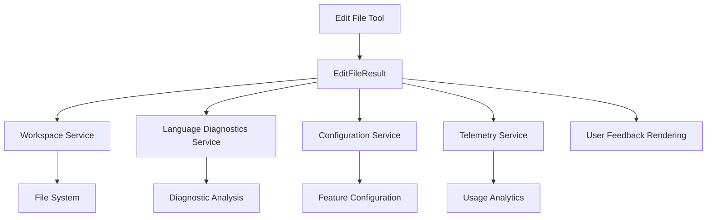
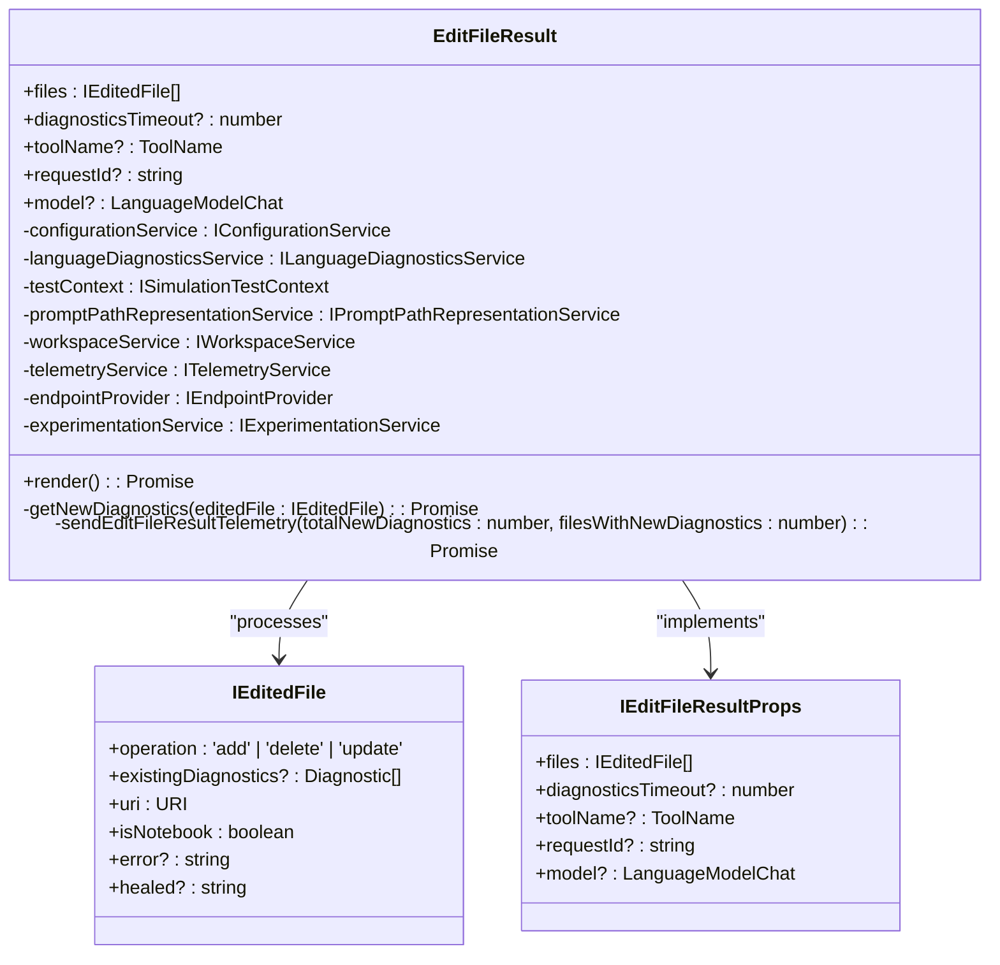
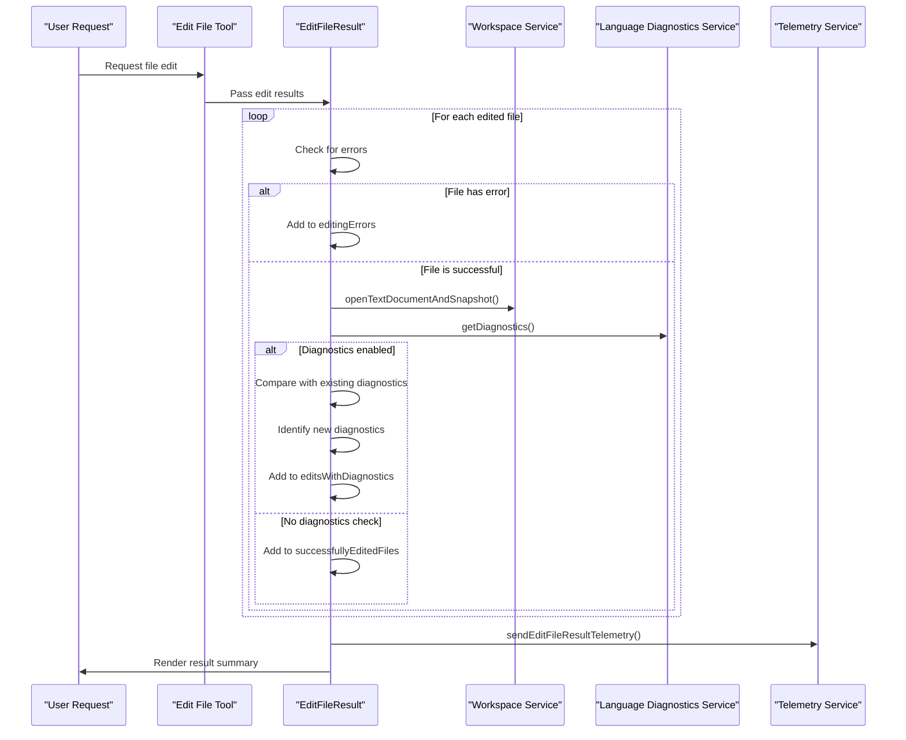
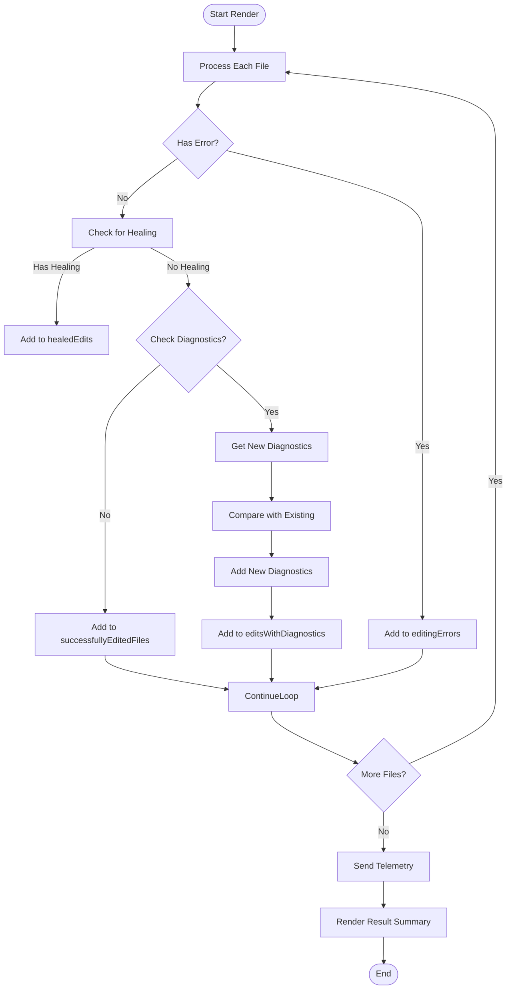
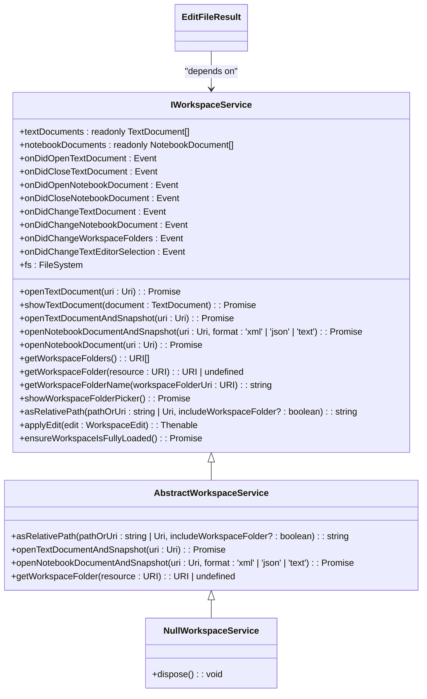
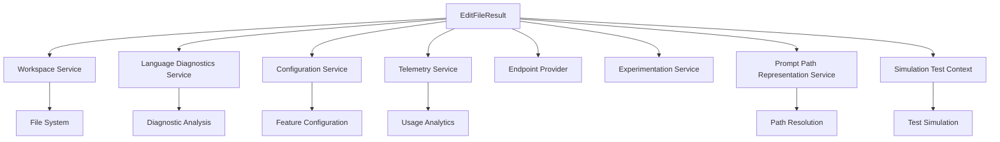

# Edit File Tool Result

<cite>
**Referenced Files in This Document**   
- [editFileToolResult.tsx](file://src/extension/tools/node/editFileToolResult.tsx)
- [workspaceService.ts](file://src/platform/workspace/common/workspaceService.ts)
- [toolUtils.ts](file://src/extension/tools/node/toolUtils.ts)
</cite>

## Table of Contents
1. [Introduction](#introduction)
2. [Core Components](#core-components)
3. [Architecture Overview](#architecture-overview)
4. [Detailed Component Analysis](#detailed-component-analysis)
5. [Dependency Analysis](#dependency-analysis)
6. [Performance Considerations](#performance-considerations)
7. [Troubleshooting Guide](#troubleshooting-guide)
8. [Conclusion](#conclusion)

## Introduction
The Edit File Tool Result component in GitHub Copilot Chat handles the processing and validation of file edit operations initiated by AI-powered tools. This system manages the application of changes to the file system, handles conflict detection, and coordinates multiple file edits atomically. The implementation focuses on ensuring data integrity, providing meaningful feedback about edit outcomes, and integrating with various workspace services for comprehensive file modification handling.

**Section sources**
- [editFileToolResult.tsx](file://src/extension/tools/node/editFileToolResult.tsx#L1-L206)

## Core Components

The core functionality revolves around the `EditFileResult` class which processes the outcome of file edit operations. It analyzes the results of attempted file modifications, categorizes them into successful edits, errors, and diagnostic warnings, and generates appropriate user feedback. The component interacts with several key services including configuration, diagnostics, workspace, and telemetry services to provide a comprehensive edit result processing pipeline.

The domain model for file edit results includes the `IEditedFile` interface which defines the structure of edited file information with properties for operation type (add, delete, update), URI, error information, and healing data. The `IEditFileResultProps` interface extends this with additional metadata like diagnostics timeout, tool name, and request ID for tracking purposes.

**Section sources**
- [editFileToolResult.tsx](file://src/extension/tools/node/editFileToolResult.tsx#L25-L40)

## Architecture Overview

**Diagram sources **
- [editFileToolResult.tsx](file://src/extension/tools/node/editFileToolResult.tsx#L42-L205)
- [workspaceService.ts](file://src/platform/workspace/common/workspaceService.ts#L17-L52)

## Detailed Component Analysis

### Edit File Result Analysis

The `EditFileResult` class implements a comprehensive processing pipeline for file edit operations. It evaluates each edited file and categorizes the outcomes into several types: successful edits, editing errors, files with new diagnostics, and healed edits (where the original patch had errors but was corrected).

#### For Object-Oriented Components:

**Diagram sources **
- [editFileToolResult.tsx](file://src/extension/tools/node/editFileToolResult.tsx#L25-L205)

#### For API/Service Components:

**Diagram sources **
- [editFileToolResult.tsx](file://src/extension/tools/node/editFileToolResult.tsx#L57-L146)
- [workspaceService.ts](file://src/platform/workspace/common/workspaceService.ts#L34-L35)

#### For Complex Logic Components:

**Diagram sources **
- [editFileToolResult.tsx](file://src/extension/tools/node/editFileToolResult.tsx#L57-L146)

**Section sources**
- [editFileToolResult.tsx](file://src/extension/tools/node/editFileToolResult.tsx#L42-L205)

### Workspace Service Integration

The Edit File Tool Result component integrates with the workspace service to access file system operations and document management capabilities. The `IWorkspaceService` interface provides essential methods for opening documents, applying edits, and managing workspace folders. This integration enables the tool to verify file edits, access document snapshots, and ensure proper workspace context.

**Diagram sources **
- [workspaceService.ts](file://src/platform/workspace/common/workspaceService.ts#L17-L52)

**Section sources**
- [workspaceService.ts](file://src/platform/workspace/common/workspaceService.ts#L1-L227)

## Dependency Analysis

The Edit File Tool Result component has several key dependencies that enable its functionality. It relies on the workspace service for file system operations and document management, the language diagnostics service for post-edit analysis, the configuration service for feature flags, and the telemetry service for usage tracking.

The component also depends on utility functions from `toolUtils.ts` for path resolution and file validation. These utilities ensure that file operations are performed on valid targets and that paths are properly resolved within the workspace context.

**Diagram sources **
- [editFileToolResult.tsx](file://src/extension/tools/node/editFileToolResult.tsx#L45-L52)
- [workspaceService.ts](file://src/platform/workspace/common/workspaceService.ts#L17-L52)

**Section sources**
- [editFileToolResult.tsx](file://src/extension/tools/node/editFileToolResult.tsx#L8-L52)
- [workspaceService.ts](file://src/platform/workspace/common/workspaceService.ts#L17-L52)

## Performance Considerations

The implementation includes several performance optimizations. The diagnostics checking is configurable and can be disabled or timed out to prevent blocking the UI. The component uses efficient comparison algorithms to identify new diagnostics by comparing message content and range positions with existing diagnostics.

For large file edits, the system processes files sequentially but efficiently, minimizing memory usage by processing one file at a time. The telemetry reporting is asynchronous to avoid impacting the main execution flow.

## Troubleshooting Guide

Common issues with the Edit File Tool Result include notebook edit failures, diagnostic checking timeouts, and path resolution errors. The system provides specific retry messages based on the type of failure, guiding users to use appropriate tools for different file types.

When notebook edits fail, the system suggests using the `EditNotebook` tool instead of the general `EditFile` tool. For files outside the workspace, the system checks if they are open in an editor before allowing access, preventing unauthorized file modifications.

The component also handles healing of patches that have minor errors, attempting to correct them before application. This improves success rates for edits that have formatting issues or minor discrepancies.

**Section sources**
- [editFileToolResult.tsx](file://src/extension/tools/node/editFileToolResult.tsx#L111-L122)
- [toolUtils.ts](file://src/extension/tools/node/toolUtils.ts#L112-L125)

## Conclusion

The Edit File Tool Result implementation in GitHub Copilot Chat provides a robust system for processing and validating file edit operations. It effectively handles various edit outcomes, provides meaningful feedback to users, and integrates with workspace services for comprehensive file modification handling. The architecture balances functionality with performance, offering configurable diagnostics checking and efficient processing of edit results. The system's design supports both simple file edits and complex multi-file operations while maintaining data integrity and providing clear error recovery paths.