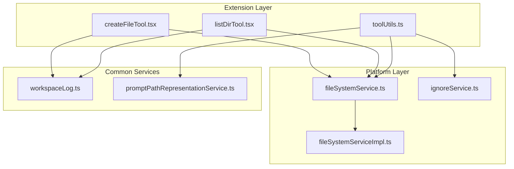
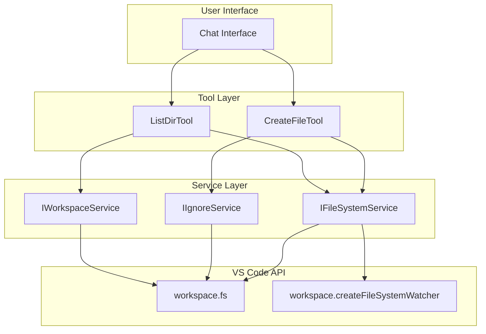
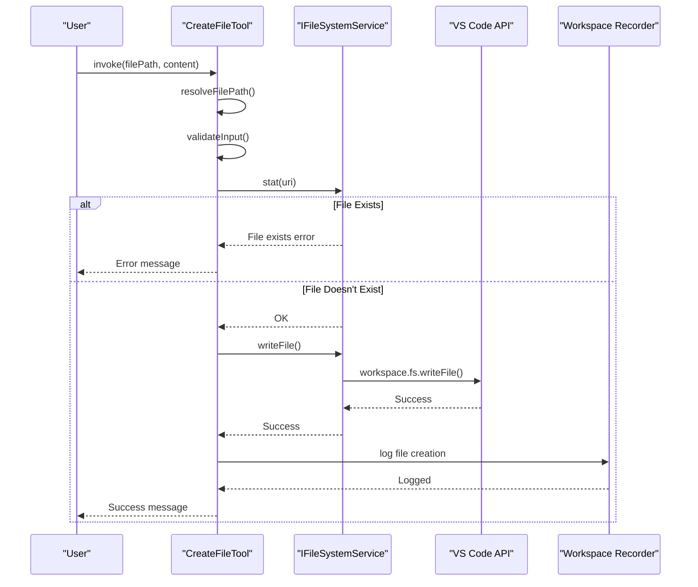
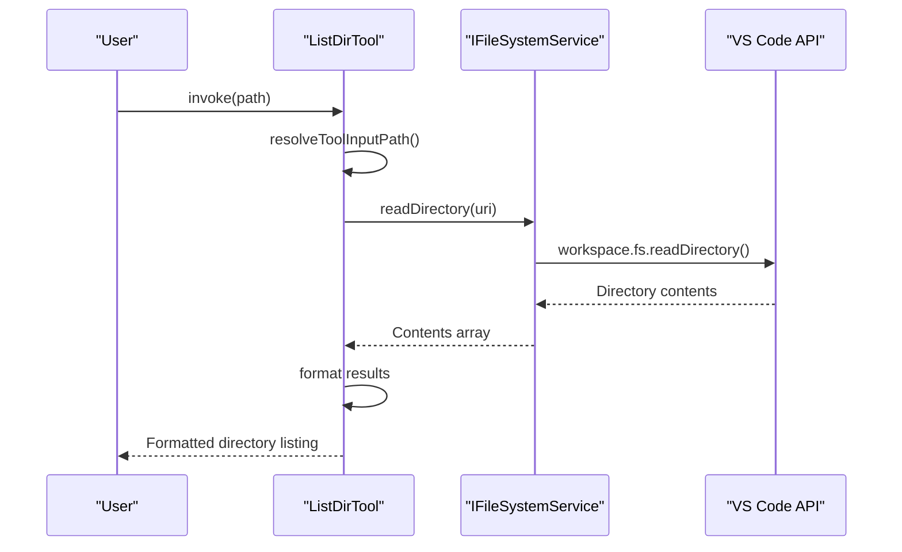
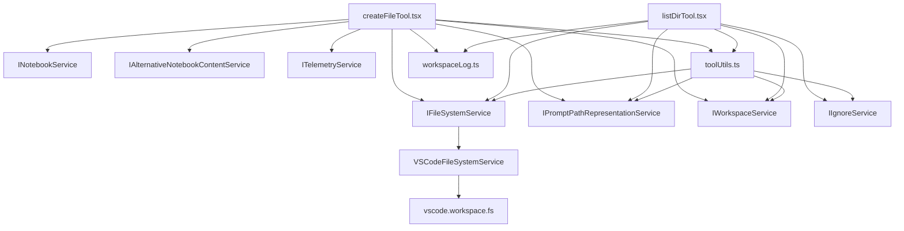

# File Operations Tools

<cite>
**Referenced Files in This Document**   
- [createFileTool.tsx](file://src/extension/tools/node/createFileTool.tsx)
- [listDirTool.tsx](file://src/extension/tools/node/listDirTool.tsx)
- [fileSystemService.ts](file://src/platform/filesystem/common/fileSystemService.ts)
- [fileSystemServiceImpl.ts](file://src/platform/filesystem/vscode/fileSystemServiceImpl.ts)
- [toolUtils.ts](file://src/extension/tools/node/toolUtils.ts)
- [ignoreService.ts](file://src/platform/ignore/common/ignoreService.ts)
- [workspaceLog.ts](file://src/platform/workspaceRecorder/common/workspaceLog.ts)
</cite>

## Table of Contents
1. [Introduction](#introduction)
2. [Project Structure](#project-structure)
3. [Core Components](#core-components)
4. [Architecture Overview](#architecture-overview)
5. [Detailed Component Analysis](#detailed-component-analysis)
6. [Dependency Analysis](#dependency-analysis)
7. [Performance Considerations](#performance-considerations)
8. [Troubleshooting Guide](#troubleshooting-guide)
9. [Conclusion](#conclusion)

## Introduction
The File Operations Tools in GitHub Copilot Chat provide a comprehensive system for managing file system interactions within the VS Code environment. These tools enable secure and efficient file creation, directory listing, and project structure reading operations through a well-defined architecture that integrates with the VS Code file system API. The implementation follows a layered approach with clear separation of concerns between tool interfaces, file system services, and workspace integration components. This documentation provides a detailed analysis of the domain model for file paths, directory structures, and file content manipulation, along with concrete examples from the codebase that demonstrate how these tools handle path validation, recursive directory traversal, and integration with other system components like the workspace recorder and ignore service.

## Project Structure



**Diagram sources**
- [createFileTool.tsx](file://src/extension/tools/node/createFileTool.tsx)
- [listDirTool.tsx](file://src/extension/tools/node/listDirTool.tsx)
- [fileSystemService.ts](file://src/platform/filesystem/common/fileSystemService.ts)
- [fileSystemServiceImpl.ts](file://src/platform/filesystem/vscode/fileSystemServiceImpl.ts)

**Section sources**
- [src/extension/tools/node](file://src/extension/tools/node)
- [src/platform/filesystem](file://src/platform/filesystem)

## Core Components

The File Operations Tools system consists of several core components that work together to provide file system functionality. The `createFileTool.tsx` implements file creation with proper path validation and content handling, while `listDirTool.tsx` provides directory listing capabilities with recursive traversal support. These tools rely on the `IFileSystemService` interface which abstracts the underlying VS Code file system API, providing a consistent interface for file operations across different environments. The system includes comprehensive error handling for file permission issues and path normalization across operating systems, with specific implementations for Windows, macOS, and Linux. Configuration options are exposed through the tool parameters, allowing customization of path handling and return value patterns for file system responses.

**Section sources**
- [createFileTool.tsx](file://src/extension/tools/node/createFileTool.tsx)
- [listDirTool.tsx](file://src/extension/tools/node/listDirTool.tsx)
- [fileSystemService.ts](file://src/platform/filesystem/common/fileSystemService.ts)

## Architecture Overview



**Diagram sources**
- [createFileTool.tsx](file://src/extension/tools/node/createFileTool.tsx)
- [listDirTool.tsx](file://src/extension/tools/node/listDirTool.tsx)
- [fileSystemServiceImpl.ts](file://src/platform/filesystem/vscode/fileSystemServiceImpl.ts)

## Detailed Component Analysis

### Create File Tool Analysis



**Diagram sources**
- [createFileTool.tsx](file://src/extension/tools/node/createFileTool.tsx)
- [fileSystemService.ts](file://src/platform/filesystem/common/fileSystemService.ts)
- [workspaceLog.ts](file://src/platform/workspaceRecorder/common/workspaceLog.ts)

**Section sources**
- [createFileTool.tsx](file://src/extension/tools/node/createFileTool.tsx)
- [fileSystemService.ts](file://src/platform/filesystem/common/fileSystemService.ts)

### List Directory Tool Analysis



**Diagram sources**
- [listDirTool.tsx](file://src/extension/tools/node/listDirTool.tsx)
- [fileSystemServiceImpl.ts](file://src/platform/filesystem/vscode/fileSystemServiceImpl.ts)

**Section sources**
- [listDirTool.tsx](file://src/extension/tools/node/listDirTool.tsx)
- [fileSystemService.ts](file://src/platform/filesystem/common/fileSystemService.ts)

### File System Service Analysis

```mermaid
classDiagram
class IFileSystemService {
<<interface>>
+stat(uri : Uri) : Promise~FileStat~
+readDirectory(uri : Uri) : Promise~[string, FileType][]~
+createDirectory(uri : Uri) : Promise~void~
+readFile(uri : Uri, disableLimit? : boolean) : Promise~Uint8Array~
+writeFile(uri : Uri, content : Uint8Array) : Promise~void~
+delete(uri : Uri, options? : {recursive? : boolean; useTrash? : boolean}) : Promise~void~
+rename(oldURI : Uri, newURI : Uri, options? : {overwrite? : boolean}) : Promise~void~
+copy(source : Uri, destination : Uri, options? : {overwrite? : boolean}) : Promise~void~
+isWritableFileSystem(scheme : string) : boolean | undefined
+createFileSystemWatcher(glob : string) : FileSystemWatcher
}
class VSCodeFileSystemService {
-workspace : vscode.workspace
+stat(uri : URI) : Promise~vscode.FileStat~
+readDirectory(uri : URI) : Promise~[string, FileType][]~
+createDirectory(uri : URI) : Promise~void~
+readFile(uri : URI, disableLimit? : boolean) : Promise~Uint8Array~
+writeFile(uri : URI, content : Uint8Array) : Promise~void~
+delete(uri : URI, options? : {recursive? : boolean; useTrash? : boolean}) : Promise~void~
+rename(oldURI : URI, newURI : URI, options? : {overwrite? : boolean}) : Promise~void~
+copy(source : URI, destination : URI, options? : {overwrite? : boolean}) : Promise~void~
+isWritableFileSystem(scheme : string) : boolean
+createFileSystemWatcher(glob : string) : vscode.FileSystemWatcher
}
IFileSystemService <|-- VSCodeFileSystemService
```

**Diagram sources**
- [fileSystemService.ts](file://src/platform/filesystem/common/fileSystemService.ts)
- [fileSystemServiceImpl.ts](file://src/platform/filesystem/vscode/fileSystemServiceImpl.ts)

**Section sources**
- [fileSystemService.ts](file://src/platform/filesystem/common/fileSystemService.ts)
- [fileSystemServiceImpl.ts](file://src/platform/filesystem/vscode/fileSystemServiceImpl.ts)

## Dependency Analysis



**Diagram sources**
- [createFileTool.tsx](file://src/extension/tools/node/createFileTool.tsx)
- [listDirTool.tsx](file://src/extension/tools/node/listDirTool.tsx)
- [fileSystemService.ts](file://src/platform/filesystem/common/fileSystemService.ts)
- [toolUtils.ts](file://src/extension/tools/node/toolUtils.ts)
- [workspaceLog.ts](file://src/platform/workspaceRecorder/common/workspaceLog.ts)

**Section sources**
- [src/extension/tools/node](file://src/extension/tools/node)
- [src/platform/filesystem](file://src/platform/filesystem)
- [src/platform/workspaceRecorder](file://src/platform/workspaceRecorder)

## Performance Considerations

The File Operations Tools implement several performance optimizations to ensure efficient file system operations. The system enforces a 5MB file size limit (FS_READ_MAX_FILE_SIZE) to prevent memory issues when reading large files, with the ability to disable this limit for specific operations when necessary. The fileSystemServiceReadAsJSON utility includes an LRU cache that stores up to 10 recently parsed JSON files, reducing redundant parsing operations during simulations. Directory traversal operations are optimized by using the VS Code API's native readDirectory method, which is implemented natively for performance. The system also includes cancellation checking during long-running operations to prevent blocking the UI thread. For file creation operations, the implementation uses atomic write operations through the VS Code API to ensure data integrity.

## Troubleshooting Guide

Common issues with the File Operations Tools typically relate to path resolution, file permissions, and workspace boundaries. When encountering "Invalid file path" errors, verify that absolute paths are used and that the path is properly resolved through the IPromptPathRepresentationService. For "File already exists" errors, ensure the target file does not exist before attempting creation, or use the appropriate edit tool instead. Directory access issues outside the workspace can be resolved by ensuring the directory is within the workspace folder or that the file is open in an editor. File permission errors may occur when attempting to modify files in protected directories; these can be addressed by running VS Code with appropriate permissions or modifying the file location. The ignore service may prevent access to certain files; check .gitignore and .copilotignore files to ensure the target file is not excluded. For large file operations exceeding the 5MB limit, consider processing the file in chunks or using the disableLimit parameter with caution.

**Section sources**
- [createFileTool.tsx](file://src/extension/tools/node/createFileTool.tsx)
- [listDirTool.tsx](file://src/extension/tools/node/listDirTool.tsx)
- [toolUtils.ts](file://src/extension/tools/node/toolUtils.ts)
- [fileSystemService.ts](file://src/platform/filesystem/common/fileSystemService.ts)

## Conclusion

The File Operations Tools in GitHub Copilot Chat provide a robust and secure framework for file system interactions within the VS Code environment. The architecture effectively separates concerns between tool implementations, file system services, and workspace integration, enabling maintainable and extensible code. The system demonstrates best practices in secure file operations, including proper path validation, permission handling, and workspace boundary enforcement. Integration with the ignore service and workspace recorder ensures that file operations respect user configuration and are properly tracked for debugging and auditing purposes. The implementation handles cross-platform path normalization and provides clear error messages for common issues. For developers implementing similar functionality, the codebase serves as an excellent example of how to create secure, efficient, and user-friendly file system tools that integrate seamlessly with the VS Code API.