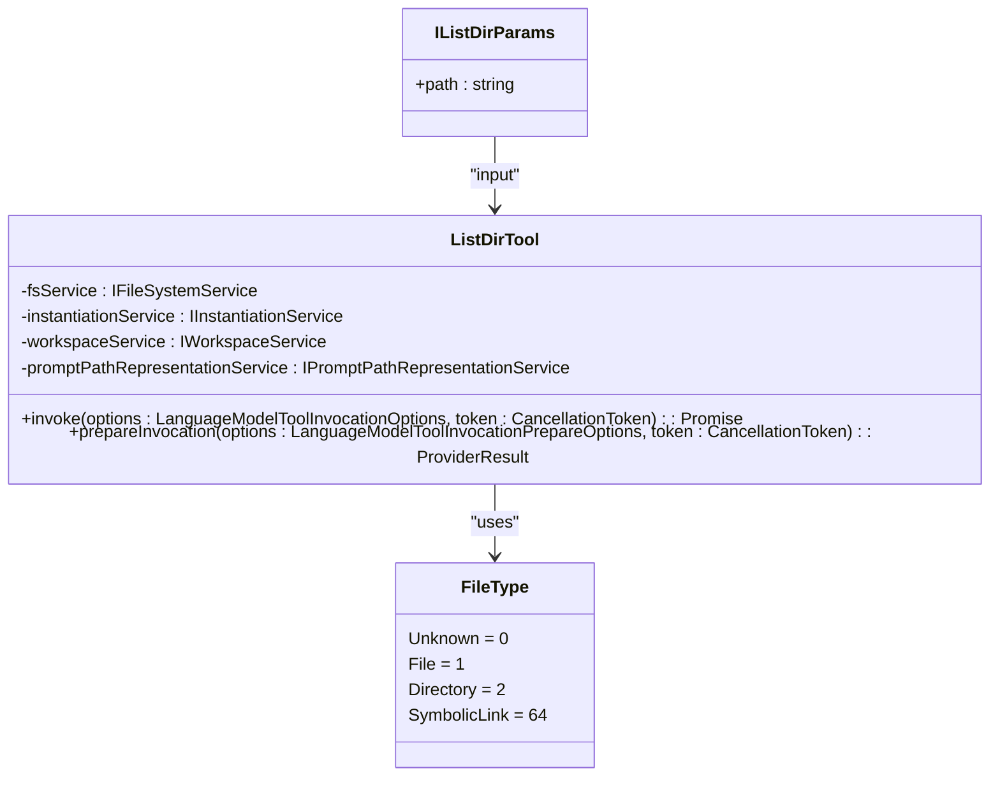
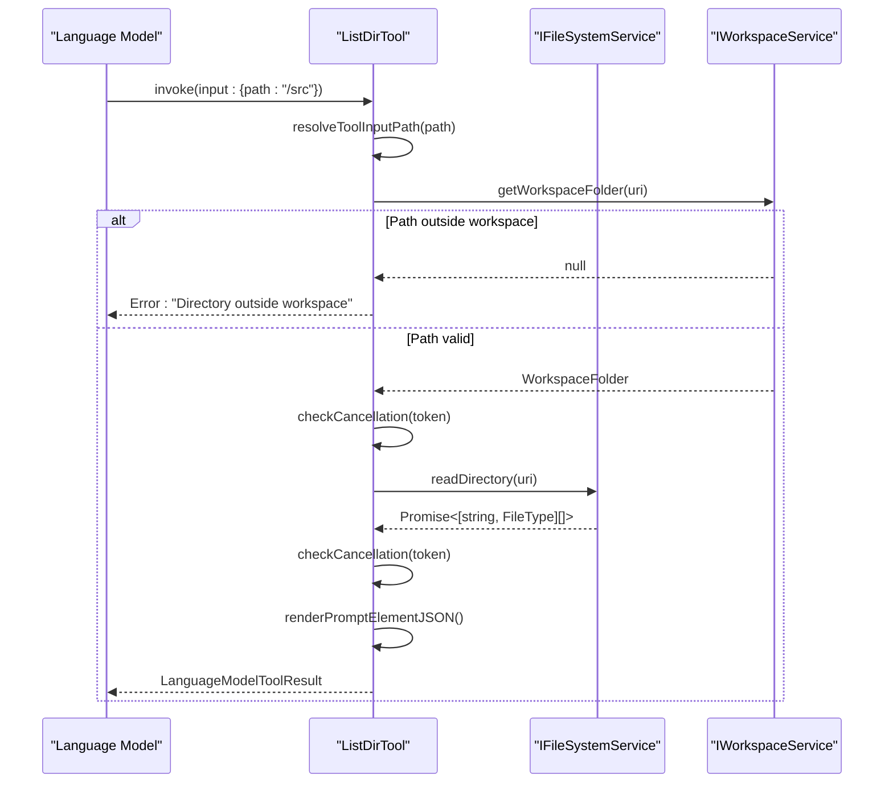
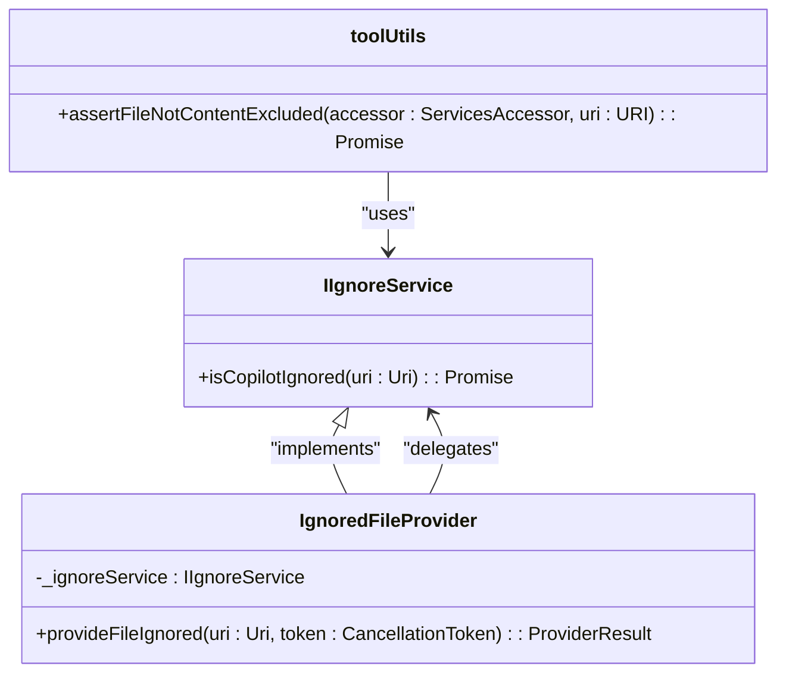
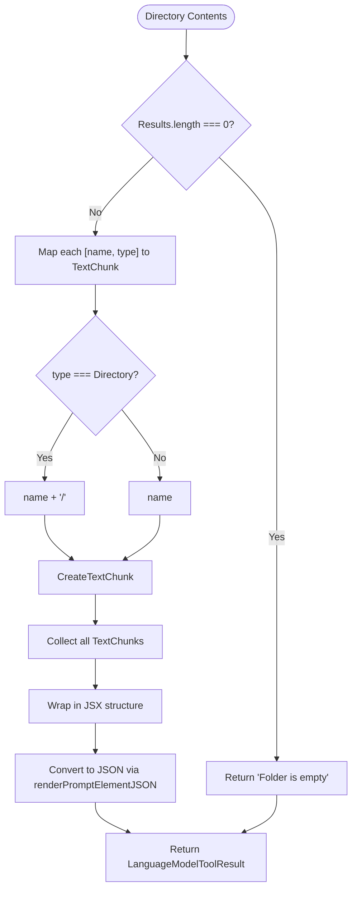

# List Directory Tool

<cite>
**Referenced Files in This Document**   
- [listDirTool.tsx](file://src/extension/tools/node/listDirTool.tsx)
- [fileSystemService.ts](file://src/platform/filesystem/common/fileSystemService.ts)
- [fileTypes.ts](file://src/platform/filesystem/common/fileTypes.ts)
- [ignoreProvider.ts](file://src/extension/ignore/vscode-node/ignoreProvider.ts)
- [toolUtils.ts](file://src/extension/tools/node/toolUtils.ts)
- [findFilesTool.tsx](file://src/extension/tools/node/findFilesTool.tsx)
- [workspaceService.ts](file://src/platform/workspace/common/workspaceService.ts)
- [searchService.ts](file://src/platform/search/common/searchService.ts)
</cite>

## Table of Contents
1. [Introduction](#introduction)
2. [Core Implementation](#core-implementation)
3. [Domain Model and Parameters](#domain-model-and-parameters)
4. [File System Integration](#file-system-integration)
5. [Ignore Service Integration](#ignore-service-integration)
6. [Result Formatting and Rendering](#result-formatting-and-rendering)
7. [Error Handling and Security](#error-handling-and-security)
8. [Performance Considerations](#performance-considerations)
9. [Integration with Other Components](#integration-with-other-components)
10. [Configuration and Customization](#configuration-and-customization)
11. [Common Issues and Solutions](#common-issues-and-solutions)

## Introduction
The List Directory Tool in GitHub Copilot Chat provides a fundamental capability for AI-assisted code navigation and understanding by enabling the language model to explore directory structures within a workspace. This tool allows the AI to retrieve and process directory contents, forming the basis for codebase exploration, file discovery, and context-aware responses. The implementation follows a modular design pattern with clear separation between tool invocation, file system operations, and result rendering. The tool operates within strict security boundaries, ensuring that only workspace-contained directories can be accessed, and integrates with the ignore service to respect user-defined exclusion rules. This documentation provides a comprehensive analysis of the tool's architecture, implementation details, and integration points within the Copilot Chat ecosystem.

## Core Implementation

The List Directory Tool is implemented as a TypeScript class that implements the `vscode.LanguageModelTool` interface, providing a standardized way for the language model to interact with the file system. The tool follows the dependency injection pattern, receiving essential services through its constructor parameters, including the file system service, instantiation service, workspace service, and path representation service. The core functionality is centered around the `invoke` method, which handles the directory listing operation by first resolving the input path to a URI, validating that it resides within the workspace, and then delegating to the file system service to retrieve directory contents. The implementation includes cancellation checking at multiple points to ensure responsiveness and prevent hanging operations. The tool registration is handled through the `ToolRegistry`, making it available to the language model system. The implementation is designed to be lightweight and focused, delegating complex operations to specialized services while maintaining a clear contract with the AI system.

**Section sources**
- [listDirTool.tsx](file://src/extension/tools/node/listDirTool.tsx#L26-L61)

## Domain Model and Parameters

The domain model for the List Directory Tool is defined through a simple interface that specifies the required input parameters. The `IListDirParams` interface contains a single property, `path`, which represents the directory path to be listed. This path can be either absolute or relative and is resolved to a URI using the `promptPathRepresentationService`. The tool does not support recursive traversal, file type filtering, or sorting options in its current implementation, focusing instead on providing a basic directory listing capability. The output model consists of an array of tuples, where each tuple contains a file name string and a `FileType` enum value. The `FileType` enum includes three values: `Unknown`, `File`, and `Directory`, with the additional capability to represent symbolic links through bitwise combination with the `SymbolicLink` flag. This simple model provides sufficient information for the AI to understand the basic structure of a directory while keeping the interface minimal and focused.



**Diagram sources**
- [listDirTool.tsx](file://src/extension/tools/node/listDirTool.tsx#L22-L24)
- [fileTypes.ts](file://src/platform/filesystem/common/fileTypes.ts#L15-L32)

## File System Integration

The List Directory Tool integrates with the file system through the `IFileSystemService` interface, which provides a standardized API for file and directory operations. The tool uses the `readDirectory` method to retrieve the contents of a specified directory, which returns a promise that resolves to an array of name-type tuples. This interface abstracts the underlying file system implementation, allowing for different providers and enabling testing through mocking. The file system service also provides additional methods for file operations such as `stat`, `createDirectory`, `readFile`, and `writeFile`, though the List Directory Tool only utilizes the directory reading capability. The integration includes workspace boundary checking through the `IWorkspaceService`, which ensures that directory operations are confined to the current workspace. This security measure prevents the tool from accessing files outside the project context, maintaining user privacy and system integrity. The file system operations are designed to be asynchronous, allowing for non-blocking execution and proper handling of I/O operations.



**Diagram sources**
- [listDirTool.tsx](file://src/extension/tools/node/listDirTool.tsx#L36-L50)
- [fileSystemService.ts](file://src/platform/filesystem/common/fileSystemService.ts#L17-L33)

## Ignore Service Integration

The List Directory Tool integrates with the ignore service through the broader tool ecosystem rather than directly. While the tool itself does not explicitly check the ignore service, the system is designed with ignore functionality at multiple levels. The `IgnoredFileProvider` class registers with the language model system to provide file ignore status, and the `assertFileNotContentExcluded` function in `toolUtils.ts` demonstrates how other tools check the ignore service before processing files. This suggests that directory listing operations may be subject to ignore rules either at the file system level or through subsequent processing of the results. The ignore service uses the `IIgnoreService` interface, which provides the `isCopilotIgnored` method to determine whether a specific URI should be excluded from Copilot operations. This integration ensures that files and directories matching user-defined ignore patterns (such as version control directories, build artifacts, or sensitive files) are not exposed to the language model, maintaining privacy and reducing noise in the AI's context.



**Diagram sources**
- [ignoreProvider.ts](file://src/extension/ignore/vscode-node/ignoreProvider.ts#L12-L20)
- [toolUtils.ts](file://src/extension/tools/node/toolUtils.ts#L128-L135)

## Result Formatting and Rendering

The List Directory Tool formats its results using the prompt-tsx framework, which enables rich, structured output that can be efficiently processed by the language model. The results are rendered through the `ListDirResult` class, which extends `PromptElement` and implements the `render` method to transform the directory contents into a visual representation. The rendering logic handles two cases: empty directories, which display "Folder is empty", and non-empty directories, which display each file or directory name followed by a trailing slash for directories. The output is wrapped in `TextChunk` components, which provide additional metadata for the prompt system. The rendering process is asynchronous and uses the `renderPromptElementJSON` function to convert the React-like JSX structure into a JSON format that can be transmitted to the language model. This approach allows for flexible and extensible result formatting while maintaining compatibility with the underlying prompt system. The tool also provides preparation messages through the `prepareInvocation` method, which generates user-friendly messages indicating the directory being read.



**Diagram sources**
- [listDirTool.tsx](file://src/extension/tools/node/listDirTool.tsx#L63-L77)

## Error Handling and Security

The List Directory Tool implements several layers of error handling and security measures to ensure robust and safe operation. The primary security mechanism is workspace boundary checking, which verifies that the requested directory is within the current workspace using the `IWorkspaceService.getWorkspaceFolder` method. If the directory is outside the workspace, the tool throws an error with a descriptive message, preventing unauthorized access to files outside the project context. The tool also includes cancellation checking through the `checkCancellation` function, which throws a `CancellationError` if the operation has been cancelled, allowing for responsive interruption of long-running operations. Input validation is performed through the `resolveToolInputPath` function, which ensures that the provided path can be resolved to a valid URI. The error handling strategy follows a fail-fast approach, immediately terminating the operation when a security or validation issue is detected. This prevents partial or incomplete results from being returned and ensures that the AI system receives clear feedback about operation failures.

**Section sources**
- [listDirTool.tsx](file://src/extension/tools/node/listDirTool.tsx#L39-L41)
- [toolUtils.ts](file://src/extension/tools/node/toolUtils.ts#L24-L28)

## Performance Considerations

The List Directory Tool is designed with performance considerations in mind, particularly regarding the handling of large directories and potential I/O bottlenecks. The tool uses asynchronous operations throughout its execution path, preventing blocking of the main thread and allowing for concurrent processing of multiple requests. The file system operations are delegated to the `IFileSystemService`, which may implement caching or other optimizations to improve performance. The tool includes cancellation checking at multiple points, allowing operations to be terminated if they exceed acceptable time limits or if the user cancels the request. While the current implementation does not include explicit limits on the number of files returned or the depth of directory traversal, the underlying file system service may enforce such limits to prevent performance degradation. The result rendering is optimized through the use of the prompt-tsx framework, which efficiently converts the directory contents into a compact JSON representation suitable for transmission to the language model. The tool's focused scope—providing only basic directory listing without recursive traversal or complex filtering—contributes to its performance by minimizing the computational overhead of each operation.

**Section sources**
- [listDirTool.tsx](file://src/extension/tools/node/listDirTool.tsx#L43-L44)
- [fileSystemService.ts](file://src/platform/filesystem/common/fileSystemService.ts#L66-L80)

## Integration with Other Components

The List Directory Tool integrates with several other components in the GitHub Copilot Chat system to provide a cohesive user experience. It is registered with the `ToolRegistry`, making it discoverable and invocable by the language model system alongside other tools like `FindFilesTool` and `ReadFileTool`. The tool relies on the `IWorkspaceService` to determine workspace boundaries and ensure that directory operations are confined to the project context. It uses the `IPromptPathRepresentationService` to resolve and format file paths, ensuring consistency in how paths are represented across different tools and contexts. The tool's output format is compatible with the prompt-tsx framework, allowing its results to be seamlessly integrated into the larger prompt construction process. The tool also integrates with the cancellation system through the `CancellationToken`, enabling coordinated cancellation of operations across the system. These integrations demonstrate how the List Directory Tool fits into the broader architecture of Copilot Chat, serving as a building block for more complex AI-assisted workflows like codebase navigation, file discovery, and context-aware code generation.

```mermaid
graph TD
ListDirTool --> ToolRegistry : "registered"
ListDirTool --> IFileSystemService : "uses"
ListDirTool --> IWorkspaceService : "uses"
ListDirTool --> IPromptPathRepresentationService : "uses"
ListDirTool --> CancellationToken : "respects"
ListDirTool --> prompt-tsx : "formats output"
ToolRegistry --> LanguageModel : "provides tools"
LanguageModel --> ListDirTool : "invokes"
IWorkspaceService --> Workspace : "manages"
IPromptPathRepresentationService --> PathFormatting : "handles"
```

**Diagram sources**
- [listDirTool.tsx](file://src/extension/tools/node/listDirTool.tsx#L29-L34)
- [toolsRegistry.ts](file://src/extension/tools/common/toolsRegistry.ts)
- [workspaceService.ts](file://src/platform/workspace/common/workspaceService.ts)

## Configuration and Customization

The List Directory Tool has minimal configuration options, reflecting its role as a fundamental building block in the Copilot Chat system. The tool does not expose user-configurable parameters beyond the required `path` input, focusing on providing a reliable and consistent directory listing capability. Configuration is primarily handled through the system's ignore rules, which can be customized by users to exclude specific files or directories from Copilot operations. The tool respects these ignore rules through the integrated ignore service, allowing users to control which parts of their codebase are accessible to the AI. The tool's behavior is also influenced by workspace settings and the overall configuration of the Copilot Chat system, such as the maximum file size limit defined in `FS_READ_MAX_FILE_SIZE`. While the tool itself does not provide sorting, filtering, or recursive traversal options, these capabilities are available through other tools like `FindFilesTool`, which can be used in conjunction with the List Directory Tool to achieve more complex directory exploration workflows.

**Section sources**
- [listDirTool.tsx](file://src/extension/tools/node/listDirTool.tsx#L22-L24)
- [fileSystemService.ts](file://src/platform/filesystem/common/fileSystemService.ts#L66)
- [findFilesTool.tsx](file://src/extension/tools/node/findFilesTool.tsx#L25-L28)

## Common Issues and Solutions

The List Directory Tool addresses several common issues related to directory enumeration in AI-assisted development environments. One common issue is accessing directories outside the workspace, which is handled by validating the path against the workspace boundaries and throwing a descriptive error message. Another issue is handling large directories that could impact performance, which is mitigated through asynchronous operations and cancellation support. Permission errors when accessing restricted directories are handled by the underlying file system service, with appropriate error propagation to the tool layer. The tool also addresses the challenge of consistent path representation across different operating systems by using the `promptPathRepresentationService` to normalize and resolve paths. For symbolic links and junctions, the tool relies on the file system service to properly identify these special file types through the `FileType.SymbolicLink` flag. The integration with the ignore service helps address privacy concerns by preventing access to sensitive files and directories that users have chosen to exclude from Copilot operations. These solutions demonstrate a thoughtful approach to the practical challenges of implementing reliable directory enumeration in a secure and user-friendly manner.

**Section sources**
- [listDirTool.tsx](file://src/extension/tools/node/listDirTool.tsx#L39-L41)
- [fileTypes.ts](file://src/platform/filesystem/common/fileTypes.ts#L31)
- [toolUtils.ts](file://src/extension/tools/node/toolUtils.ts#L128-L135)
- [fileSystemService.ts](file://src/platform/filesystem/common/fileSystemService.ts#L68-L77)