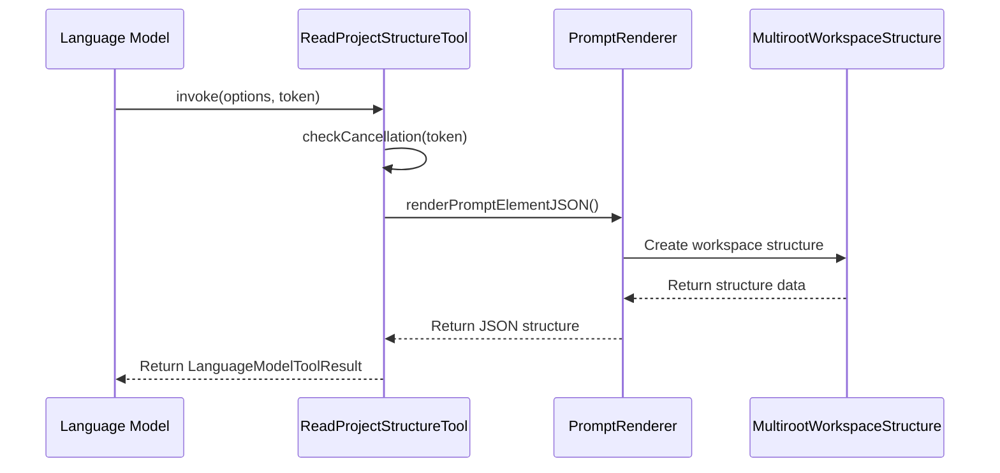
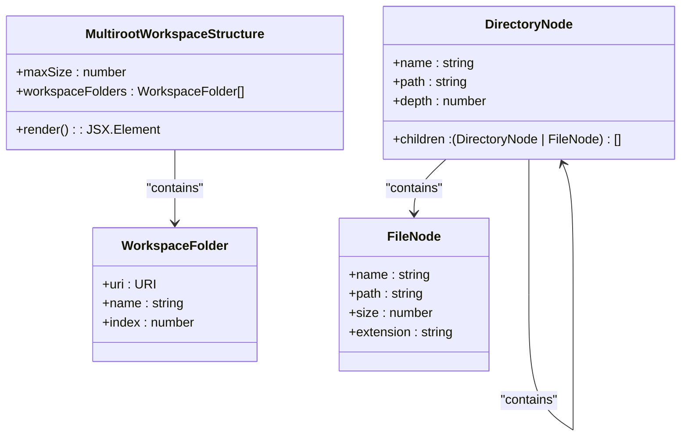
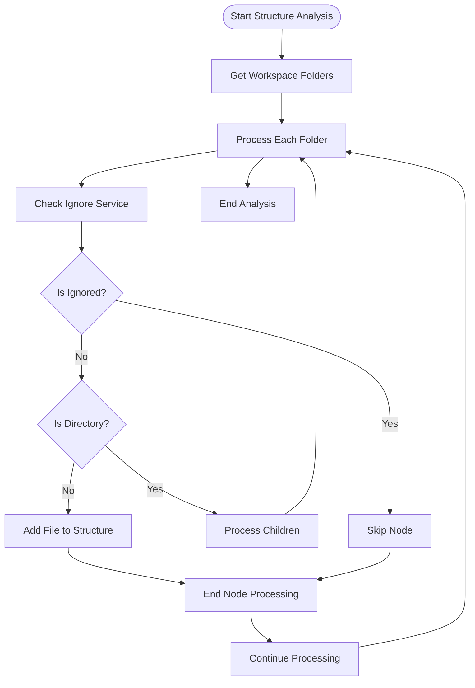
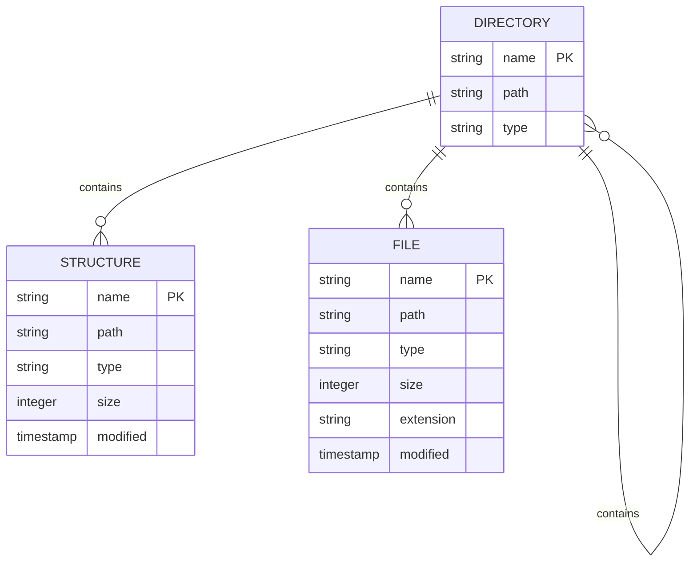
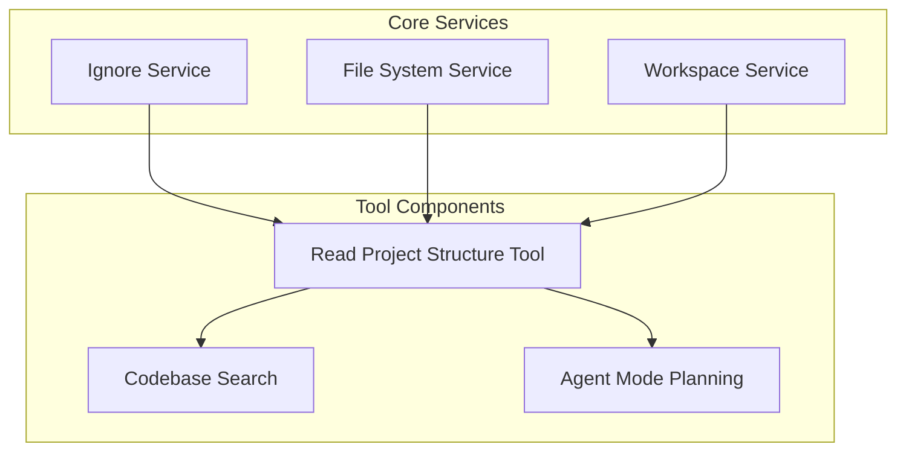

# Read Project Structure Tool

<cite>
**Referenced Files in This Document**   
- [readProjectStructureTool.ts](file://src/extension/tools/node/readProjectStructureTool.ts)
- [workspaceStructure.ts](file://src/extension/prompts/node/panel/workspace/workspaceStructure.ts)
- [promptRenderer.ts](file://src/extension/prompts/node/base/promptRenderer.ts)
- [ignoreProvider.ts](file://src/extension/ignore/vscode-node/ignoreProvider.ts)
- [workspaceServiceImpl.ts](file://src/platform/workspace/vscode/workspaceServiceImpl.ts)
- [toolsRegistry.ts](file://src/extension/tools/common/toolsRegistry.ts)
- [toolUtils.ts](file://src/extension/tools/node/toolUtils.ts)
- [fileSystem.ts](file://src/util/common/fileSystem.ts)
</cite>

## Table of Contents
1. [Introduction](#introduction)
2. [Core Implementation](#core-implementation)
3. [Domain Model and Parameters](#domain-model-and-parameters)
4. [Integration with File System and Ignore Services](#integration-with-file-system-and-ignore-services)
5. [Configuration and Input Parameters](#configuration-and-input-parameters)
6. [Return Value Structure](#return-value-structure)
7. [Relationships with Other Components](#relationships-with-other-components)
8. [Performance and Optimization](#performance-and-optimization)
9. [Common Issues and Solutions](#common-issues-and-solutions)
10. [Conclusion](#conclusion)

## Introduction
The Read Project Structure Tool in GitHub Copilot Chat is a specialized component designed to analyze and represent the hierarchical organization of a codebase for AI consumption. This tool enables the Copilot system to understand the project's directory layout, file organization, and structural relationships, which is essential for providing context-aware assistance. The implementation leverages TypeScript and integrates with various platform services to efficiently traverse the workspace while respecting user-defined ignore patterns and configuration settings. The tool is particularly valuable in agent mode planning and codebase search functionality, where understanding the project structure is crucial for generating relevant and accurate responses.

**Section sources**
- [readProjectStructureTool.ts](file://src/extension/tools/node/readProjectStructureTool.ts#L1-L43)
- [workspaceStructure.ts](file://src/extension/prompts/node/panel/workspace/workspaceStructure.ts#L1-L50)

## Core Implementation

The Read Project Structure Tool is implemented as a language model tool that integrates with the Copilot system to provide project structure information. The core implementation resides in the `readProjectStructureTool.ts` file, where the `ReadProjectStructureTool` class implements the `vscode.LanguageModelTool` interface. This tool is registered with the `ToolRegistry`, making it available for invocation by the language model. When invoked, the tool uses the `renderPromptElementJSON` function to generate a JSON representation of the project structure, which is then passed to the language model as part of the prompt. The implementation follows a dependency injection pattern, utilizing the `IInstantiationService` to create instances of required services.

The tool's invocation process begins with a cancellation check to ensure responsiveness, followed by the creation of a `LanguageModelToolResult` containing the project structure data. The structure is rendered using the `MultirootWorkspaceStructure` component, which handles the visualization of workspaces that may contain multiple root folders. This approach allows the tool to provide a comprehensive view of the project, regardless of its complexity or organization.

**Diagram sources**
- [readProjectStructureTool.ts](file://src/extension/tools/node/readProjectStructureTool.ts#L19-L42)
- [promptRenderer.ts](file://src/extension/prompts/node/base/promptRenderer.ts#L207-L222)

**Section sources**
- [readProjectStructureTool.ts](file://src/extension/tools/node/readProjectStructureTool.ts#L1-L43)
- [promptRenderer.ts](file://src/extension/prompts/node/base/promptRenderer.ts#L161-L223)

## Domain Model and Parameters

The domain model for project structure representation in the Read Project Structure Tool is designed to capture the hierarchical nature of file systems while providing flexibility for customization. The model includes parameters for depth limits, file size thresholds, and filtering criteria, allowing users to control the scope and detail of the structure analysis. The primary parameter is the `maxSize` property, which is passed to the `MultirootWorkspaceStructure` component to limit the size of the generated structure. This parameter helps prevent excessive memory usage and ensures that the tool remains responsive even with large codebases.

The structure representation follows a tree-like pattern, where each node represents either a directory or a file. Directories contain child nodes, creating a nested hierarchy that mirrors the actual file system organization. The model also includes metadata about each file and directory, such as size, modification time, and type, which can be used by the AI to make informed decisions about code navigation and analysis. The implementation uses the `looksLikeDirectory` function from the `fileSystem.ts` utility to determine whether a file path represents a directory, even when the extension is missing.

**Diagram sources**
- [workspaceStructure.ts](file://src/extension/prompts/node/panel/workspace/workspaceStructure.ts#L1-L100)
- [fileSystem.ts](file://src/util/common/fileSystem.ts#L7-L9)

**Section sources**
- [workspaceStructure.ts](file://src/extension/prompts/node/panel/workspace/workspaceStructure.ts#L1-L100)
- [fileSystem.ts](file://src/util/common/fileSystem.ts#L1-L9)

## Integration with File System and Ignore Services

The Read Project Structure Tool integrates closely with both the file system service and the ignore service to provide accurate and relevant project structure information. The file system integration is handled through the `workspace.fs` API, which provides access to the underlying file system operations. This allows the tool to traverse directories, read file metadata, and construct the hierarchical structure representation. The integration is abstracted through the `IWorkspaceService` interface, which provides a consistent API for workspace operations across different environments.

The ignore service integration is crucial for respecting user preferences and project configurations. The tool uses the `IIgnoreService` to determine which files and directories should be excluded from the structure analysis. This service checks for ignore patterns defined in configuration files like `.gitignore` and user preferences, ensuring that sensitive or irrelevant files are not included in the output. The `isCopilotIgnored` method is called for each file and directory to determine whether it should be excluded, providing a fine-grained control mechanism.

**Diagram sources**
- [ignoreProvider.ts](file://src/extension/ignore/vscode-node/ignoreProvider.ts#L12-L20)
- [workspaceServiceImpl.ts](file://src/platform/workspace/vscode/workspaceServiceImpl.ts#L41-L43)

**Section sources**
- [ignoreProvider.ts](file://src/extension/ignore/vscode-node/ignoreProvider.ts#L1-L31)
- [workspaceServiceImpl.ts](file://src/platform/workspace/vscode/workspaceServiceImpl.ts#L1-L113)

## Configuration and Input Parameters

The Read Project Structure Tool supports various configuration options and input parameters that allow users to customize its behavior. These parameters are passed through the `LanguageModelToolInvocationOptions` interface, which provides a standardized way to configure tool behavior. The primary configuration parameter is the `maxSize` property, which controls the maximum size of the generated structure. This parameter helps prevent performance issues with large codebases by limiting the amount of data that needs to be processed and transmitted.

Additional configuration options include tokenization settings, which affect how the structure is formatted for AI consumption. The `tokenizationOptions` parameter allows users to specify how tokens should be counted and processed, ensuring that the output fits within the language model's token limits. The tool also respects global configuration settings, such as those defined in the `settings.json` file, which can affect the behavior of the ignore service and other integrated components.

The input parameters are designed to be flexible and extensible, allowing for future enhancements without breaking existing functionality. The tool uses the `resolveInput` method from the `ICopilotTool` interface to process and validate input parameters, ensuring that they are appropriate for the current context. This approach provides a robust mechanism for handling user input while maintaining compatibility with the broader Copilot ecosystem.

**Section sources**
- [readProjectStructureTool.ts](file://src/extension/tools/node/readProjectStructureTool.ts#L27-L32)
- [toolUtils.ts](file://src/extension/tools/node/toolUtils.ts#L62-L92)

## Return Value Structure

The Read Project Structure Tool returns a structured representation of the project hierarchy in JSON format, wrapped in a `LanguageModelToolResult` object. The return value consists of an array containing a single `LanguageModelPromptTsxPart`, which encapsulates the JSON structure data. This format is designed to be easily consumed by the language model while preserving the hierarchical nature of the project structure.

The JSON structure follows a tree-like pattern, with each node representing either a directory or a file. Directory nodes contain a `children` property that lists their contents, creating a nested hierarchy that mirrors the actual file system. Each node includes properties such as `name`, `path`, and `type`, which provide essential information about the file or directory. The structure is optimized for AI consumption, with redundant information minimized and important metadata preserved.

The return value is designed to be both human-readable and machine-processable, allowing developers to understand the output while enabling the AI to extract relevant information efficiently. The use of JSON format ensures compatibility with various systems and tools, making it easy to integrate the structure data into different workflows and applications.

**Diagram sources**
- [readProjectStructureTool.ts](file://src/extension/tools/node/readProjectStructureTool.ts#L29-L32)
- [promptRenderer.ts](file://src/extension/prompts/node/base/promptRenderer.ts#L207-L222)

**Section sources**
- [readProjectStructureTool.ts](file://src/extension/tools/node/readProjectStructureTool.ts#L27-L32)
- [promptRenderer.ts](file://src/extension/prompts/node/base/promptRenderer.ts#L161-L223)

## Relationships with Other Components

The Read Project Structure Tool is tightly integrated with several other components in the GitHub Copilot Chat system, forming a cohesive ecosystem for code analysis and assistance. One of the most important relationships is with the codebase search functionality, which relies on the project structure information to provide context-aware search results. By understanding the organization of the codebase, the search system can prioritize results from relevant directories and files, improving the accuracy and relevance of its responses.

Another critical relationship is with the agent mode planning system, which uses the project structure to make informed decisions about code navigation and modification. The agent mode can leverage the structure information to identify potential targets for refactoring, locate related files for comprehensive changes, and understand the overall architecture of the project. This integration enables more sophisticated and context-aware assistance, going beyond simple code completion to provide holistic development support.

The tool also interacts with the ignore service, file system service, and workspace service, forming a network of dependencies that ensure consistent and accurate behavior across different environments. These relationships are managed through well-defined interfaces and dependency injection, promoting loose coupling and high cohesion within the system.

**Diagram sources**
- [toolsRegistry.ts](file://src/extension/tools/common/toolsRegistry.ts#L65-L75)
- [workspaceServiceImpl.ts](file://src/platform/workspace/vscode/workspaceServiceImpl.ts#L14-L113)

**Section sources**
- [toolsRegistry.ts](file://src/extension/tools/common/toolsRegistry.ts#L1-L76)
- [workspaceServiceImpl.ts](file://src/platform/workspace/vscode/workspaceServiceImpl.ts#L1-L113)

## Performance and Optimization

The Read Project Structure Tool employs several optimization strategies to ensure efficient performance, especially with large codebases. One of the primary optimizations is the use of depth limits and size thresholds, which prevent the tool from processing excessively large or deeply nested directory structures. This approach helps maintain responsiveness and prevents memory exhaustion, even when analyzing complex projects.

The tool also leverages caching mechanisms to avoid redundant file system operations. When the structure is requested multiple times, the tool can return cached results instead of traversing the file system again, significantly improving performance. The integration with the workspace service ensures that file system operations are optimized for the specific environment, taking advantage of platform-specific features and optimizations.

Another important optimization is the use of asynchronous operations and cancellation tokens. The tool supports cancellation through the `CancellationToken` parameter, allowing users to abort long-running operations if needed. This feature is particularly valuable when working with large repositories, where structure analysis might take considerable time. The asynchronous nature of the implementation ensures that the UI remains responsive during the analysis process.

**Section sources**
- [readProjectStructureTool.ts](file://src/extension/tools/node/readProjectStructureTool.ts#L27-L32)
- [toolUtils.ts](file://src/extension/tools/node/toolUtils.ts#L24-L28)

## Common Issues and Solutions

The Read Project Structure Tool addresses several common issues that arise when analyzing project structures, particularly in complex or large codebases. One of the most significant challenges is handling circular symbolic links, which can cause infinite loops during directory traversal. The tool mitigates this issue by maintaining a set of visited paths and checking for duplicates before processing each directory. This approach ensures that the analysis terminates correctly, even in the presence of circular references.

Memory usage is another critical concern, especially when dealing with large repositories. The tool addresses this by implementing size thresholds and depth limits, which prevent excessive memory consumption. The use of streaming and incremental processing allows the tool to handle large structures without loading everything into memory at once. Additionally, the integration with the ignore service helps reduce memory usage by excluding unnecessary files and directories from the analysis.

Cross-platform path representation is handled through the use of the `URI` class and related utilities, which provide a consistent way to represent file paths across different operating systems. This ensures that the tool works correctly on Windows, macOS, and Linux, regardless of the underlying file system conventions. The `normalizePath` function is used to standardize path representations, preventing issues related to case sensitivity and path separators.

**Section sources**
- [toolUtils.ts](file://src/extension/tools/node/toolUtils.ts#L118-L135)
- [fileSystem.ts](file://src/util/common/fileSystem.ts#L7-L9)

## Conclusion
The Read Project Structure Tool is a critical component of the GitHub Copilot Chat system, providing essential project structure information for AI-driven code assistance. Through its integration with various platform services and its optimized implementation, the tool delivers efficient and accurate structure analysis, even for large and complex codebases. The use of well-defined interfaces, dependency injection, and asynchronous operations ensures that the tool is both robust and performant, making it a valuable asset for developers seeking context-aware assistance in their coding workflows.