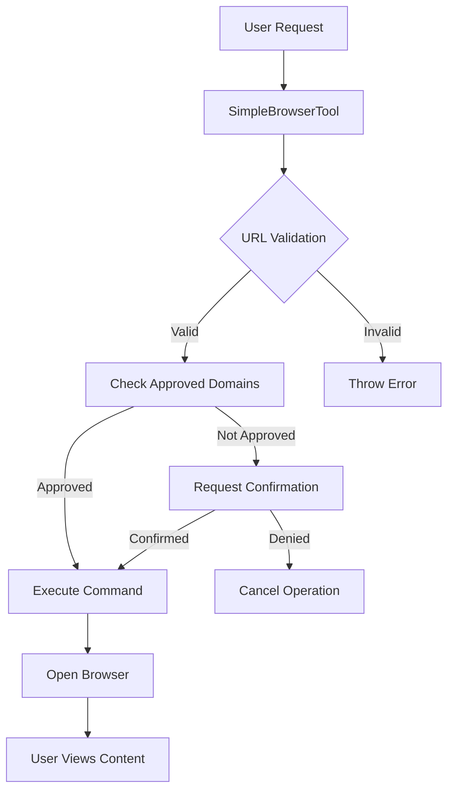
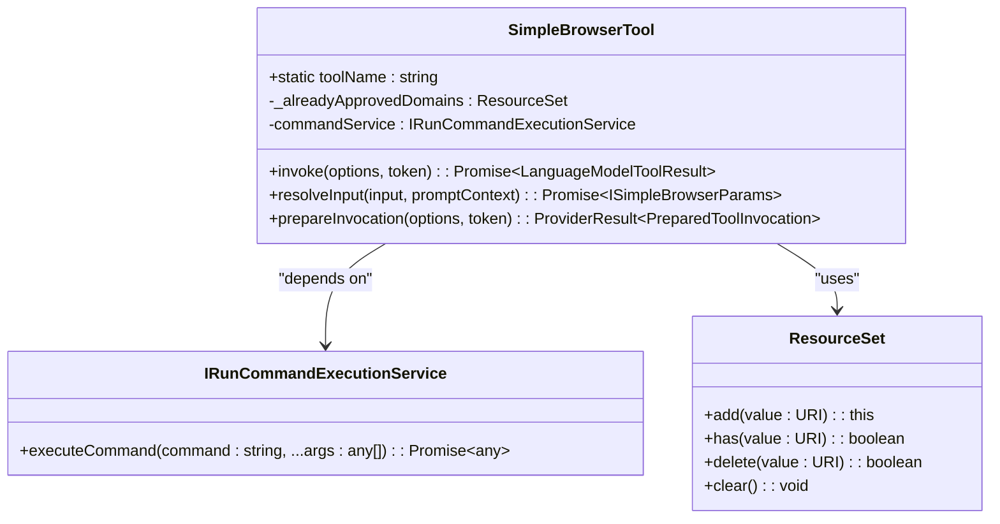
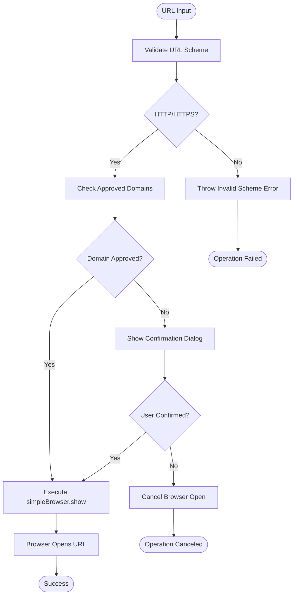
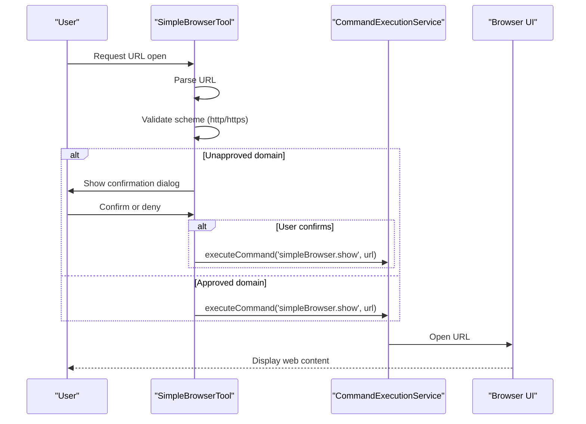
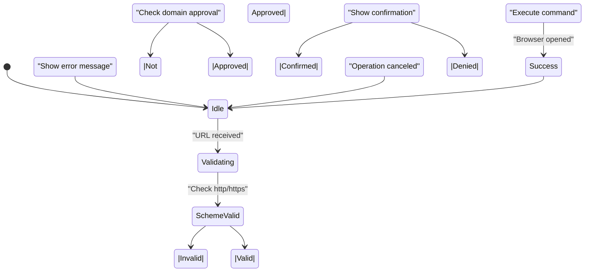

# Browser Integration

<cite>
**Referenced Files in This Document**   
- [simpleBrowserTool.tsx](file://src/extension/tools/node/simpleBrowserTool.tsx)
- [runCommandExecutionService.ts](file://src/platform/commands/common/runCommandExecutionService.ts)
- [requestLogTree.ts](file://src/extension/log/vscode-node/requestLogTree.ts)
- [map.ts](file://src/util/vs/base/common/map.ts)
</cite>

## Table of Contents
1. [Introduction](#introduction)
2. [Core Components](#core-components)
3. [Architecture Overview](#architecture-overview)
4. [Detailed Component Analysis](#detailed-component-analysis)
5. [Security and Validation](#security-and-validation)
6. [Request Flow and Invocation](#request-flow-and-invocation)
7. [Domain Model and State Management](#domain-model-and-state-management)
8. [Error Handling and User Feedback](#error-handling-and-user-feedback)
9. [Integration with External Services](#integration-with-external-services)
10. [Common Issues and Solutions](#common-issues-and-solutions)

## Introduction
The Browser Integration capability in GitHub Copilot Chat enables users to open web pages directly from the chat interface through the simpleBrowserTool. This feature allows for contextual exploration of external resources while maintaining security boundaries and user control. The implementation focuses on secure URL validation, user confirmation for untrusted domains, and integration with the command execution system to display web content. This documentation provides a comprehensive analysis of the implementation, covering the technical architecture, security considerations, and integration patterns.

## Core Components

The Browser Integration capability is implemented through several key components that work together to provide a secure and user-friendly experience. The core functionality is centered around the SimpleBrowserTool class, which handles URL validation, user confirmation, and command invocation. The tool integrates with the command execution service to open web pages and maintains a record of approved domains to reduce repeated user prompts. The implementation follows a modular design pattern, separating concerns between input validation, user interaction, and command execution.

**Section sources**
- [simpleBrowserTool.tsx](file://src/extension/tools/node/simpleBrowserTool.tsx#L1-L66)

## Architecture Overview



**Diagram sources**
- [simpleBrowserTool.tsx](file://src/extension/tools/node/simpleBrowserTool.tsx#L1-L66)

## Detailed Component Analysis

### SimpleBrowserTool Implementation
The SimpleBrowserTool class implements the ICopilotTool interface and provides the core functionality for browser integration. It handles URL parsing, scheme validation, domain approval tracking, and command execution. The tool maintains a ResourceSet of approved domains to minimize repeated user prompts for frequently visited sites.

#### Class Structure and Dependencies


**Diagram sources**
- [simpleBrowserTool.tsx](file://src/extension/tools/node/simpleBrowserTool.tsx#L1-L66)
- [runCommandExecutionService.ts](file://src/platform/commands/common/runCommandExecutionService.ts#L9-L13)
- [map.ts](file://src/util/vs/base/common/map.ts#L154-L212)

## Security and Validation

The Browser Integration implementation includes several security measures to protect users from malicious websites and ensure safe browsing. The system validates URL schemes to only allow HTTP and HTTPS protocols, preventing potentially dangerous schemes like JavaScript or File. Before opening untrusted domains, the system prompts the user for confirmation, displaying the URL in a Markdown-formatted message for clear visibility. The ResourceSet class is used to track approved domains, allowing users to bypass repeated confirmation dialogs for sites they've previously approved.



**Diagram sources**
- [simpleBrowserTool.tsx](file://src/extension/tools/node/simpleBrowserTool.tsx#L47-L50)

## Request Flow and Invocation

The request flow for the Browser Integration follows a structured sequence from user input to browser display. When a user requests to open a URL, the SimpleBrowserTool first parses the URL and validates its scheme. If the domain hasn't been previously approved, the system prepares a confirmation message that will be displayed to the user. Upon user confirmation, the tool invokes the 'simpleBrowser.show' command through the command execution service, passing the URL as a parameter. This decoupled approach allows the browser display functionality to be implemented separately from the validation and security logic.



**Diagram sources**
- [simpleBrowserTool.tsx](file://src/extension/tools/node/simpleBrowserTool.tsx#L30-L38)
- [requestLogTree.ts](file://src/extension/log/vscode-node/requestLogTree.ts#L104)

## Domain Model and State Management

The domain model for the Browser Integration capability centers around the ISimpleBrowserParams interface and the ResourceSet class for state management. The ISimpleBrowserParams interface defines the input contract for the tool, requiring a URL string parameter. The ResourceSet class, imported from the base common utilities, provides a URI-aware set implementation that tracks approved domains. This state is maintained within the SimpleBrowserTool instance for the duration of the session, allowing users to avoid repeated confirmation dialogs for domains they've previously approved.

```mermaid
erDiagram
URL_REQUEST {
string url PK
}
APPROVED_DOMAINS {
URI domain PK
}
URL_REQUEST ||--o{ APPROVED_DOMAINS : "checked against"
class URL_REQUEST {
Represents a browser open request
Contains single URL parameter
}
class APPROVED_DOMAINS {
Set of previously approved domains
Uses URI for accurate domain comparison
Persists for session duration
}
```

**Diagram sources**
- [simpleBrowserTool.tsx](file://src/extension/tools/node/simpleBrowserTool.tsx#L18-L20)
- [map.ts](file://src/util/vs/base/common/map.ts#L154-L212)

## Error Handling and User Feedback

The Browser Integration implementation includes comprehensive error handling and user feedback mechanisms. When invalid URL schemes are detected, the system throws a descriptive error message indicating that only HTTP and HTTPS protocols are supported. For untrusted domains, the system provides a clear confirmation dialog with the full URL displayed in Markdown format. Success messages are also provided to confirm when a browser has been opened, giving users confidence that their request was processed. The use of localized strings (via l10n) ensures that all messages are properly internationalized.



**Diagram sources**
- [simpleBrowserTool.tsx](file://src/extension/tools/node/simpleBrowserTool.tsx#L48-L49)

## Integration with External Services

The Browser Integration capability integrates with several external services and components within the GitHub Copilot Chat ecosystem. The primary integration is with the command execution service (IRunCommandExecutionService), which provides the mechanism for opening the browser UI. The tool also integrates with the language model system through the LanguageModelToolResult and LanguageModelTextPart classes, allowing it to communicate status back to the chat interface. Additionally, the implementation leverages the URI and ResourceSet utilities from the base platform for reliable URL handling and domain tracking.

```mermaid
graph TB
subgraph "Browser Integration"
Tool[SimpleBrowserTool]
Params[ISimpleBrowserParams]
end
subgraph "Platform Services"
CommandService[CommandExecutionService]
ResourceUtils[ResourceSet/URI]
Localization[l10n]
end
subgraph "Language Model"
LM[LanguageModelToolResult]
TextPart[LanguageModelTextPart]
end
Tool --> CommandService : executeCommand
Tool --> ResourceUtils : URI parsing/domain tracking
Tool --> Localization : message translation
Tool --> LM : result reporting
Tool --> TextPart : message formatting
```

**Diagram sources**
- [simpleBrowserTool.tsx](file://src/extension/tools/node/simpleBrowserTool.tsx#L6-L12)

## Common Issues and Solutions

### Blocked Requests
When users encounter blocked requests, it's typically due to non-HTTP/HTTPS URL schemes. The solution is to ensure URLs use valid web protocols. The system explicitly blocks potentially dangerous schemes like javascript:, file:, or data: to prevent security risks.

### Malformed URLs
Malformed URLs are handled through the URI parsing system, which will throw errors for invalid formats. Users should ensure URLs are properly formatted with the correct protocol prefix (http:// or https://) and valid domain structure.

### Large Payload Handling
The current implementation doesn't handle large payloads directly, as it only passes URL strings to the browser. The actual content loading and rendering is handled by the browser UI component, which has its own mechanisms for managing large web pages.

### Configuration Options
The Browser Integration has limited configuration options, focusing on security and user experience:
- Automatic approval of previously visited domains
- User confirmation for untrusted sites
- Support for HTTP and HTTPS protocols only
- Localized user interface messages

Solutions for common issues focus on user education and clear error messaging, ensuring users understand why certain requests are blocked and how to format their URLs correctly.