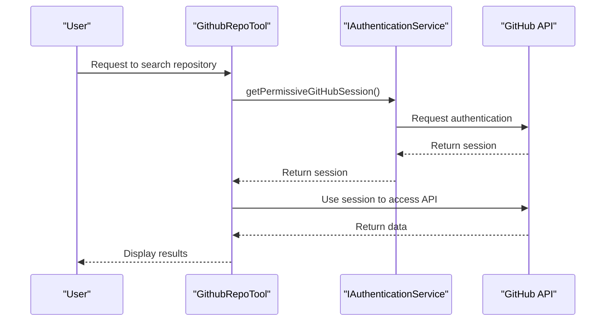
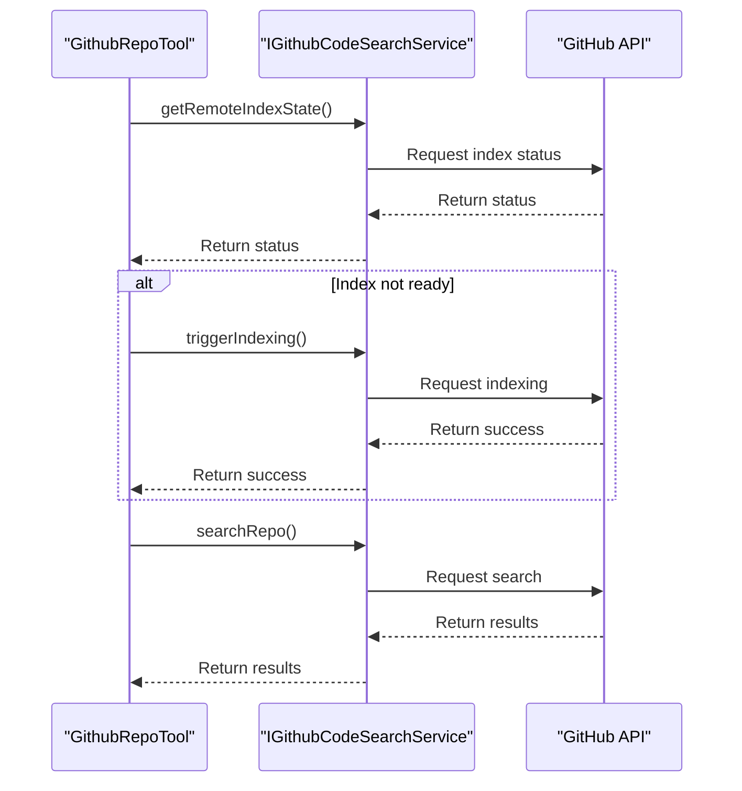
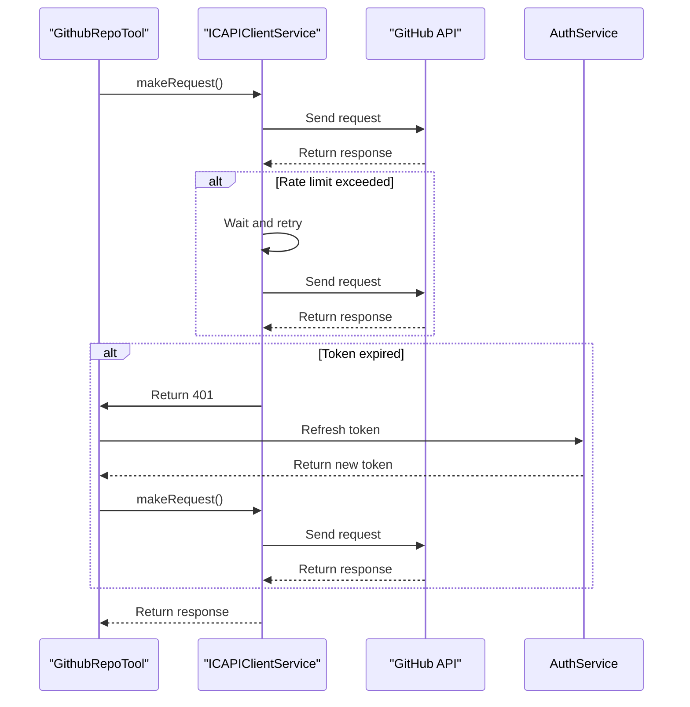
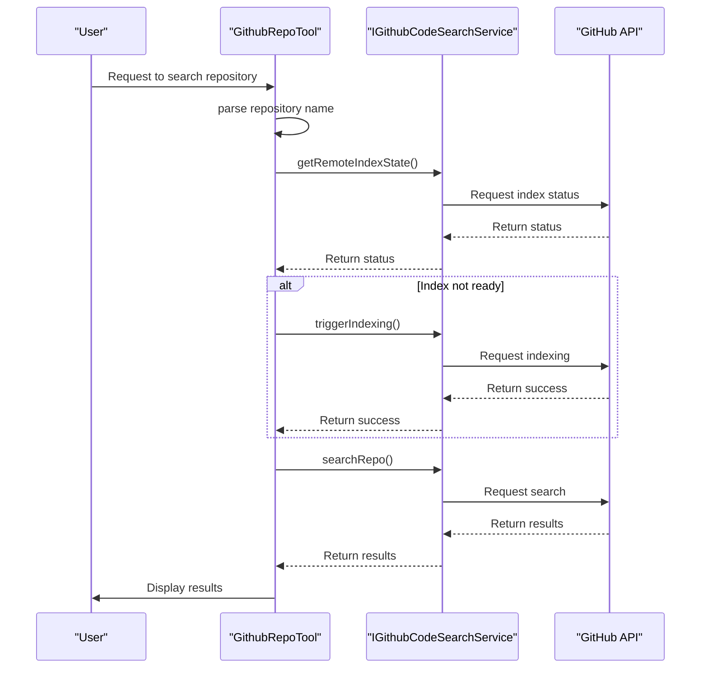
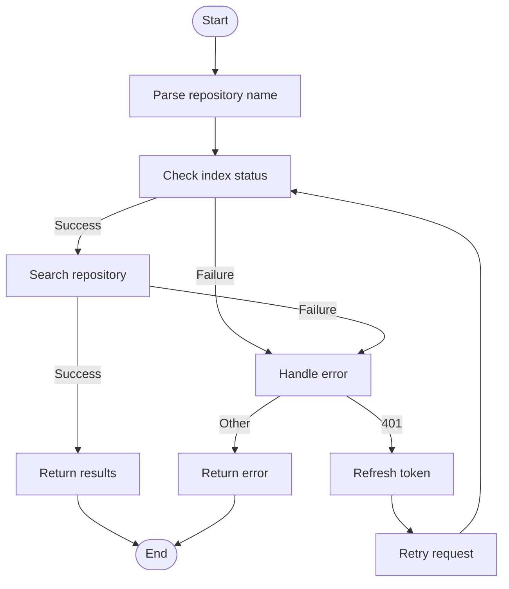
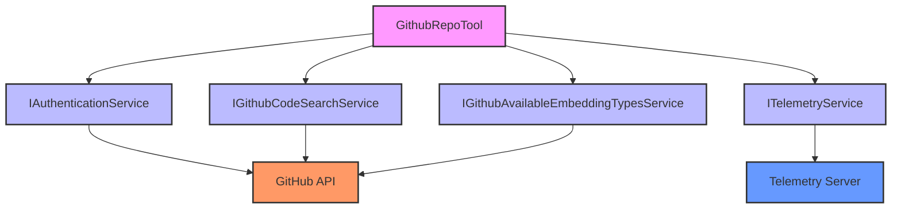
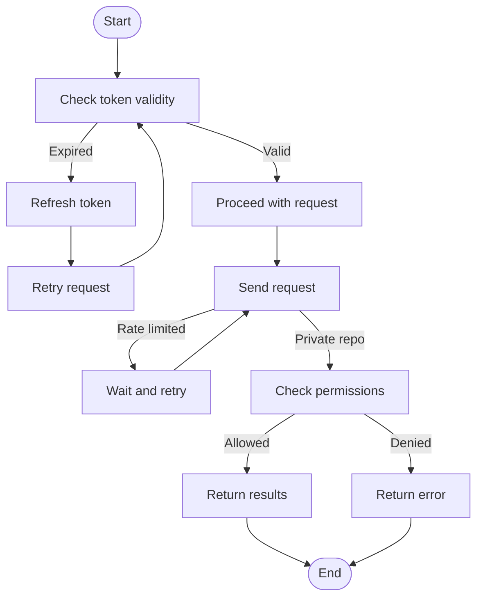

# GitHub Integration

<cite>
**Referenced Files in This Document**   
- [githubRepoTool.tsx](file://src/extension/tools/node/githubRepoTool.tsx)
- [githubCodeSearchService.ts](file://src/platform/remoteCodeSearch/common/githubCodeSearchService.ts)
- [gitService.ts](file://src/platform/git/common/gitService.ts)
- [authentication.ts](file://src/platform/authentication/common/authentication.ts)
- [telemetry.ts](file://src/platform/telemetry/common/telemetry.ts)
- [remoteCodeSearch.ts](file://src/platform/remoteCodeSearch/common/remoteCodeSearch.ts)
</cite>

## Table of Contents
1. [Introduction](#introduction)
2. [Core Components](#core-components)
3. [Authentication Mechanism](#authentication-mechanism)
4. [Repository Metadata Retrieval](#repository-metadata-retrieval)
5. [API Rate Limit Management](#api-rate-limit-management)
6. [Domain Model](#domain-model)
7. [Tool Invocation and API Endpoints](#tool-invocation-and-api-endpoints)
8. [Error Handling](#error-handling)
9. [Configuration Options](#configuration-options)
10. [Integration with Other Components](#integration-with-other-components)
11. [Common Issues and Solutions](#common-issues-and-solutions)
12. [Conclusion](#conclusion)

## Introduction
The GitHub Repository Integration tool in GitHub Copilot Chat enables developers to search and retrieve relevant code snippets from GitHub repositories directly within the chat interface. This document provides a comprehensive analysis of the implementation, focusing on the `githubRepoTool.tsx` file and its interactions with various services. The tool leverages GitHub's API to authenticate, retrieve repository metadata, manage API rate limits, and handle errors effectively. It is designed to provide a seamless experience for developers by integrating GitHub's vast codebase into the Copilot Chat environment.

## Core Components
The core functionality of the GitHub Repository Integration tool is implemented in the `githubRepoTool.tsx` file. This component is responsible for handling user queries, authenticating with GitHub, and retrieving relevant code snippets. The tool is designed to be modular and extensible, allowing for easy integration with other components and services.

**Section sources**
- [githubRepoTool.tsx](file://src/extension/tools/node/githubRepoTool.tsx#L1-L233)

## Authentication Mechanism
The GitHub Repository Integration tool uses the platform's authentication service to authenticate with GitHub APIs. The authentication process is handled by the `IAuthenticationService` interface, which provides methods for obtaining both permissive and non-permissive GitHub sessions. The tool first attempts to obtain a permissive session, which includes the `repo` scope, allowing access to private repositories. If a permissive session is not available, it falls back to a non-permissive session with the `user:email` scope.

The authentication service is designed to handle various scenarios, including token expiration and user logout. It listens for authentication changes and updates the session accordingly. The `getPermissiveGitHubSession` method is used to obtain a session with the necessary permissions, and it throws a `MinimalModeError` if the service is in minimal mode, indicating that permissive sessions are not allowed.



**Diagram sources**
- [githubRepoTool.tsx](file://src/extension/tools/node/githubRepoTool.tsx#L48-L51)
- [authentication.ts](file://src/platform/authentication/common/authentication.ts#L32-L143)

## Repository Metadata Retrieval
The tool retrieves repository metadata using the `IGithubCodeSearchService` interface. This service provides methods for checking the status of a repository's index, triggering indexing, and searching the repository. The `getRemoteIndexState` method is used to check if the repository is indexed and ready for search. If the repository is not indexed, the `triggerIndexing` method is called to start the indexing process.

The `searchRepo` method is used to perform semantic searches on the repository. It takes a query, the number of results to return, and other options. The method constructs a request to the GitHub API, including the necessary headers and body, and sends it to the server. The response is then parsed and returned to the caller.



**Diagram sources**
- [githubCodeSearchService.ts](file://src/platform/remoteCodeSearch/common/githubCodeSearchService.ts#L64-L103)
- [githubRepoTool.tsx](file://src/extension/tools/node/githubRepoTool.tsx#L53-L97)

## API Rate Limit Management
The tool manages API rate limits by using the `ICAPIClientService` to make requests to the GitHub API. This service handles rate limiting and retries failed requests. The `makeRequest` method is used to send requests to the API, and it includes headers for authentication and rate limiting. If a request fails due to rate limiting, the service will automatically retry the request after a delay.

The tool also includes a mechanism for handling token expiration. If a request fails with a 401 status code, the tool will attempt to refresh the token and retry the request. This ensures that the tool can continue to function even if the user's token expires during a session.



**Diagram sources**
- [githubCodeSearchService.ts](file://src/platform/remoteCodeSearch/common/githubCodeSearchService.ts#L119-L252)
- [authentication.ts](file://src/platform/authentication/common/authentication.ts#L116-L132)

## Domain Model
The domain model for the GitHub Repository Integration tool includes several key components: repository data, pull request contexts, and commit information. The `GithubRepoId` class represents a GitHub repository and includes methods for parsing and formatting repository names. The `FileChunkAndScore` class represents a chunk of code and its relevance score. The `CodeSearchResult` interface represents the result of a code search, including the chunks of code and a flag indicating if the results are out of sync with the local repository.

The `GithubChunkSearchResults` class is a React component that renders the search results. It takes a list of `FileChunkAndScore` objects and a list of `PromptReference` objects and displays them in a user-friendly format. The `WorkspaceChunkList` component is used to display the results, and it includes options for absolute paths and tool calls.

```mermaid
classDiagram
class GithubRepoId {
+type : string
+org : string
+repo : string
+parse(nwo : string) : GithubRepoId | undefined
+toString() : string
}
class FileChunkAndScore {
+chunk : FileChunk
+distance : number
}
class FileChunk {
+file : URI
+text : string
+rawText : string | undefined
+range : Range
+isFullFile : boolean
}
class CodeSearchResult {
+chunks : FileChunkAndScore[]
+outOfSync : boolean
}
class PromptReference {
+anchor : URI | Location
+provider : string
}
class GithubChunkSearchResults {
+chunks : FileChunkAndScore[]
+referencesOut : PromptReference[]
+render() : JSX.Element
}
class WorkspaceChunkList {
+result : { chunks : FileChunkAndScore[], isFullWorkspace : boolean }
+referencesOut : PromptReference[]
+absolutePaths : boolean
+isToolCall : boolean
}
GithubChunkSearchResults --> WorkspaceChunkList : "uses"
FileChunkAndScore --> FileChunk : "contains"
CodeSearchResult --> FileChunkAndScore : "contains"
```

**Diagram sources**
- [gitService.ts](file://src/platform/git/common/gitService.ts#L177-L200)
- [githubCodeSearchService.ts](file://src/platform/remoteCodeSearch/common/githubCodeSearchService.ts#L18-L21)
- [githubRepoTool.tsx](file://src/extension/tools/node/githubRepoTool.tsx#L209-L228)

## Tool Invocation and API Endpoints
The `GithubRepoTool` class implements the `ICopilotTool` interface and is responsible for invoking the GitHub API endpoints. The `invoke` method is called when the user requests a search, and it takes the repository name and query as input. The method first parses the repository name using the `GithubRepoId.parse` method and checks if the repository is indexed using the `getRemoteIndexState` method. If the repository is not indexed, it triggers indexing using the `triggerIndexing` method.

Once the repository is indexed, the `searchRepo` method is called to perform the search. The method constructs a request to the GitHub API, including the necessary headers and body, and sends it to the server. The response is then parsed and returned to the caller. The `prepareInvocation` method is used to prepare the invocation by checking the repository status and triggering indexing if necessary.



**Diagram sources**
- [githubRepoTool.tsx](file://src/extension/tools/node/githubRepoTool.tsx#L53-L97)
- [githubCodeSearchService.ts](file://src/platform/remoteCodeSearch/common/githubCodeSearchService.ts#L93-L102)

## Error Handling
The tool includes robust error handling for common scenarios such as 404s and permission denials. The `getRemoteIndexState` method returns a `Result` object that includes an error if the request fails. The error can be of type `not-authorized` if the user is not authenticated, or `generic-error` if there is a generic error. The `triggerIndexing` method also returns a `Result` object, and it includes telemetry events for tracking errors.

The `searchRepo` method throws an error if the request fails with a non-200 status code. The error message includes the status code and the response text. The tool also includes a mechanism for handling token expiration. If a request fails with a 401 status code, the tool will attempt to refresh the token and retry the request.



**Diagram sources**
- [githubCodeSearchService.ts](file://src/platform/remoteCodeSearch/common/githubCodeSearchService.ts#L119-L252)
- [githubRepoTool.tsx](file://src/extension/tools/node/githubRepoTool.tsx#L123-L206)

## Configuration Options
The tool supports several configuration options, including API endpoint overrides, parameters for repository queries, and return value patterns for different GitHub objects. The `GithubRepoToolParams` interface defines the input parameters for the tool, including the repository name and query. The `CodeSearchOptions` interface defines additional options for the search, such as glob patterns for filtering results.

The tool also includes options for controlling the behavior of the search, such as the number of results to return and whether to include embeddings in the response. These options are passed to the `searchRepo` method and are used to construct the request to the GitHub API.

```mermaid
erDiagram
TOOL ||--o{ OPTIONS : "has"
TOOL ||--o{ PARAMETERS : "uses"
OPTIONS ||--o{ GLOB_PATTERNS : "includes"
PARAMETERS ||--o{ REPO_NAME : "specifies"
PARAMETERS ||--o{ QUERY : "specifies"
class TOOL {
+toolName: string
+invoke(params: GithubRepoToolParams, token: CancellationToken): Promise<LanguageModelToolResult>
+prepareInvocation(options: LanguageModelToolInvocationPrepareOptions<GithubRepoToolParams>, token: CancellationToken): Promise<PreparedToolInvocation>
}
class OPTIONS {
+globPatterns: GlobIncludeOptions
}
class PARAMETERS {
+repo: string
+query: string
}
class GLOB_PATTERNS {
+include: string[]
+exclude: string[]
}
class REPO_NAME {
+org: string
+repo: string
}
class QUERY {
+text: string
+maxResults: number
}
```

**Diagram sources**
- [githubRepoTool.tsx](file://src/extension/tools/node/githubRepoTool.tsx#L30-L33)
- [remoteCodeSearch.ts](file://src/platform/remoteCodeSearch/common/remoteCodeSearch.ts#L39-L41)

## Integration with Other Components
The GitHub Repository Integration tool integrates with several other components, including the authentication system for token management and the telemetry service for tracking API usage. The `IAuthenticationService` is used to obtain and manage GitHub sessions, and the `ITelemetryService` is used to send telemetry events for tracking the tool's usage and performance.

The tool also integrates with the `IGithubAvailableEmbeddingTypesService` to determine the preferred embedding type for the search. This service provides methods for getting the available embedding types and the preferred type. The tool uses this information to construct the request to the GitHub API.



**Diagram sources**
- [githubRepoTool.tsx](file://src/extension/tools/node/githubRepoTool.tsx#L45-L51)
- [telemetry.ts](file://src/platform/telemetry/common/telemetry.ts#L80-L112)

## Common Issues and Solutions
The tool addresses several common issues, including token expiration, pagination of results, and handling private repositories. Token expiration is handled by the `IAuthenticationService`, which automatically refreshes the token when it expires. Pagination of results is handled by the `searchRepo` method, which limits the number of results returned and provides a mechanism for requesting additional results.

Handling private repositories is managed by the `getPermissiveGitHubSession` method, which ensures that the user has the necessary permissions to access the repository. If the user does not have the necessary permissions, the method returns an error. The tool also includes a mechanism for handling rate limits, which is managed by the `ICAPIClientService`.



**Diagram sources**
- [githubCodeSearchService.ts](file://src/platform/remoteCodeSearch/common/githubCodeSearchService.ts#L119-L252)
- [authentication.ts](file://src/platform/authentication/common/authentication.ts#L77-L99)

## Conclusion
The GitHub Repository Integration tool in GitHub Copilot Chat is a powerful and flexible component that enables developers to search and retrieve relevant code snippets from GitHub repositories. The tool is designed to be secure, efficient, and user-friendly, with robust error handling and integration with other components. By leveraging the platform's authentication service, the tool ensures that users have the necessary permissions to access the repositories they need. The tool's modular design and comprehensive error handling make it a valuable addition to the Copilot Chat environment.