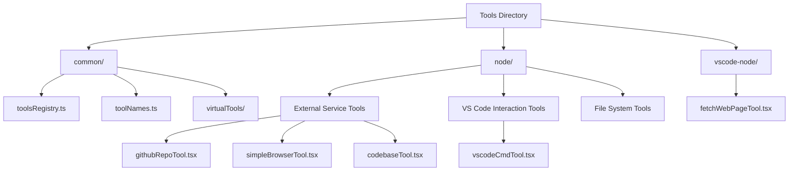
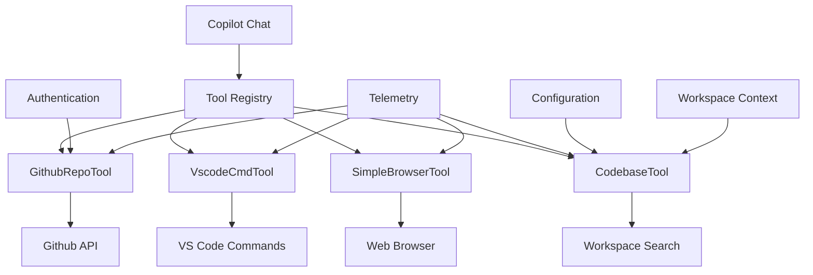
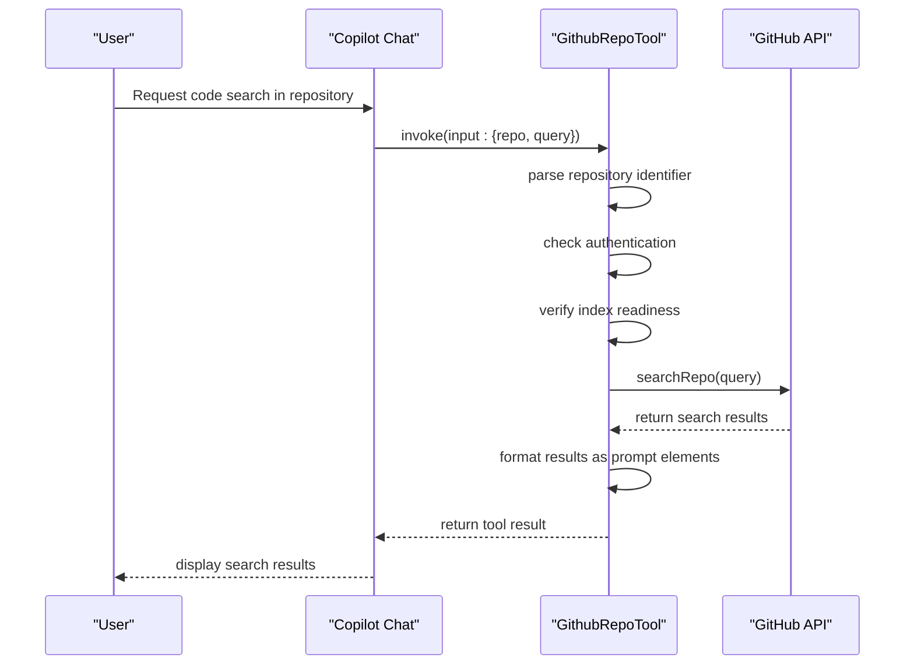
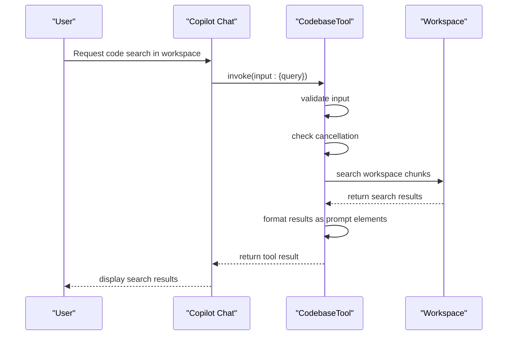
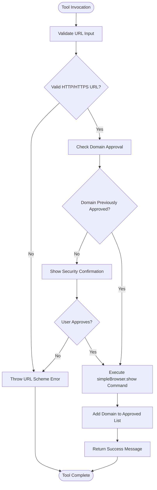
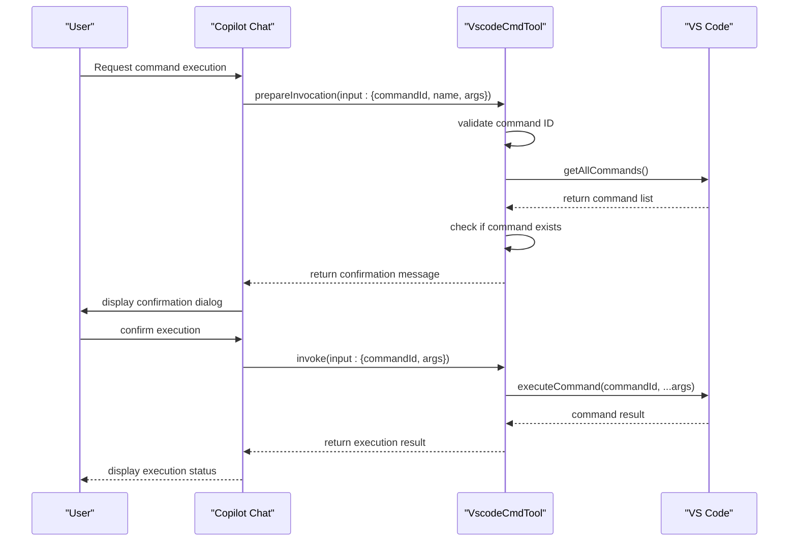
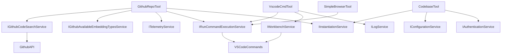

# Integration Tools

<cite>
**Referenced Files in This Document**   
- [githubRepoTool.tsx](file://src/extension/tools/node/githubRepoTool.tsx)
- [vscodeCmdTool.tsx](file://src/extension/tools/node/vscodeCmdTool.tsx)
- [simpleBrowserTool.tsx](file://src/extension/tools/node/simpleBrowserTool.tsx)
- [codebaseTool.tsx](file://src/extension/tools/node/codebaseTool.tsx)
- [toolsRegistry.ts](file://src/extension/tools/common/toolsRegistry.ts)
- [toolNames.ts](file://src/extension/tools/common/toolNames.ts)
</cite>

## Table of Contents
1. [Introduction](#introduction)
2. [Project Structure](#project-structure)
3. [Core Components](#core-components)
4. [Architecture Overview](#architecture-overview)
5. [Detailed Component Analysis](#detailed-component-analysis)
6. [Dependency Analysis](#dependency-analysis)
7. [Performance Considerations](#performance-considerations)
8. [Troubleshooting Guide](#troubleshooting-guide)
9. [Conclusion](#conclusion)

## Introduction
This document provides comprehensive documentation for the Integration Tools in GitHub Copilot Chat, focusing on external service integration, browser access, and VS Code command execution capabilities. The integration tools framework enables Copilot to interact with various external systems and services, enhancing its ability to assist developers with code-related tasks. This documentation explains the implementation details, domain models, configuration options, and relationships with other components in the system.

## Project Structure
The integration tools are organized within the `src/extension/tools` directory, which contains a well-structured hierarchy for different types of tools and their supporting components. The tools are categorized into different directories based on their execution environment and functionality.

**Diagram sources**
- [githubRepoTool.tsx](file://src/extension/tools/node/githubRepoTool.tsx)
- [vscodeCmdTool.tsx](file://src/extension/tools/node/vscodeCmdTool.tsx)
- [simpleBrowserTool.tsx](file://src/extension/tools/node/simpleBrowserTool.tsx)
- [codebaseTool.tsx](file://src/extension/tools/node/codebaseTool.tsx)

**Section sources**
- [githubRepoTool.tsx](file://src/extension/tools/node/githubRepoTool.tsx)
- [vscodeCmdTool.tsx](file://src/extension/tools/node/vscodeCmdTool.tsx)
- [simpleBrowserTool.tsx](file://src/extension/tools/node/simpleBrowserTool.tsx)
- [codebaseTool.tsx](file://src/extension/tools/node/codebaseTool.tsx)

## Core Components
The integration tools framework consists of several core components that enable external service integration, browser access, and VS Code command execution. These components follow a consistent pattern of implementation with standardized interfaces for tool registration, invocation, and preparation.

**Section sources**
- [toolsRegistry.ts](file://src/extension/tools/common/toolsRegistry.ts)
- [toolNames.ts](file://src/extension/tools/common/toolNames.ts)

## Architecture Overview
The integration tools architecture is designed to provide a flexible and extensible framework for connecting GitHub Copilot with various external services and VS Code functionality. The architecture follows a modular design with clear separation of concerns between tool implementation, execution, and management.

**Diagram sources**
- [githubRepoTool.tsx](file://src/extension/tools/node/githubRepoTool.tsx)
- [vscodeCmdTool.tsx](file://src/extension/tools/node/vscodeCmdTool.tsx)
- [simpleBrowserTool.tsx](file://src/extension/tools/node/simpleBrowserTool.tsx)
- [codebaseTool.tsx](file://src/extension/tools/node/codebaseTool.tsx)

## Detailed Component Analysis

### External Service Integration Tools
The external service integration tools enable GitHub Copilot to interact with external APIs and services, providing enhanced functionality for code search, repository analysis, and web content retrieval.

#### GithubRepoTool Analysis
The GithubRepoTool enables searching for code snippets in public GitHub repositories by leveraging the GitHub API. This tool authenticates with GitHub and performs semantic search on repository content.

**Diagram sources**
- [githubRepoTool.tsx](file://src/extension/tools/node/githubRepoTool.tsx#L41-L232)

**Section sources**
- [githubRepoTool.tsx](file://src/extension/tools/node/githubRepoTool.tsx#L30-L232)

#### CodebaseTool Analysis
The CodebaseTool provides semantic search capabilities within the user's local codebase, enabling Copilot to find relevant code snippets and patterns in the current workspace.

**Diagram sources**
- [codebaseTool.tsx](file://src/extension/tools/node/codebaseTool.tsx#L38-L157)

**Section sources**
- [codebaseTool.tsx](file://src/extension/tools/node/codebaseTool.tsx#L30-L157)

### Browser Access Tools
The browser access tools enable GitHub Copilot to open web pages and interact with online content, providing users with relevant information from external sources.

#### SimpleBrowserTool Analysis
The SimpleBrowserTool allows Copilot to open web pages in a simple browser interface within VS Code, enabling users to view external documentation and resources.

**Diagram sources**
- [simpleBrowserTool.tsx](file://src/extension/tools/node/simpleBrowserTool.tsx#L22-L65)

**Section sources**
- [simpleBrowserTool.tsx](file://src/extension/tools/node/simpleBrowserTool.tsx#L18-L65)

### VS Code Command Execution Tools
The VS Code command execution tools enable GitHub Copilot to safely execute VS Code commands on behalf of the user, automating common development tasks.

#### VscodeCmdTool Analysis
The VscodeCmdTool provides a secure way for Copilot to execute VS Code commands, with proper confirmation and error handling mechanisms.

**Diagram sources**
- [vscodeCmdTool.tsx](file://src/extension/tools/node/vscodeCmdTool.tsx#L23-L74)

**Section sources**
- [vscodeCmdTool.tsx](file://src/extension/tools/node/vscodeCmdTool.tsx#L17-L74)

## Dependency Analysis
The integration tools have well-defined dependencies on various platform services and external APIs, ensuring proper separation of concerns and maintainability.

**Diagram sources**
- [githubRepoTool.tsx](file://src/extension/tools/node/githubRepoTool.tsx#L45-L51)
- [vscodeCmdTool.tsx](file://src/extension/tools/node/vscodeCmdTool.tsx#L27-L31)
- [simpleBrowserTool.tsx](file://src/extension/tools/node/simpleBrowserTool.tsx#L26-L28)
- [codebaseTool.tsx](file://src/extension/tools/node/codebaseTool.tsx#L41-L45)

**Section sources**
- [githubRepoTool.tsx](file://src/extension/tools/node/githubRepoTool.tsx#L45-L51)
- [vscodeCmdTool.tsx](file://src/extension/tools/node/vscodeCmdTool.tsx#L27-L31)
- [simpleBrowserTool.tsx](file://src/extension/tools/node/simpleBrowserTool.tsx#L26-L28)
- [codebaseTool.tsx](file://src/extension/tools/node/codebaseTool.tsx#L41-L45)

## Performance Considerations
The integration tools are designed with performance in mind, implementing various optimization strategies to ensure responsive user experiences:

1. **Caching**: The tools leverage caching mechanisms to avoid redundant API calls and improve response times.
2. **Asynchronous Operations**: All tool operations are implemented asynchronously to prevent blocking the UI thread.
3. **Rate Limiting**: The tools handle API rate limiting gracefully, with appropriate retry mechanisms and user feedback.
4. **Resource Management**: The tools manage resources efficiently, cleaning up after operations and preventing memory leaks.
5. **Progress Reporting**: Long-running operations provide progress updates to keep users informed.

## Troubleshooting Guide
This section addresses common issues that may arise when using the integration tools and provides solutions for resolving them.

### API Rate Limiting
When interacting with external APIs like GitHub, rate limiting may occur, especially for unauthenticated users or high-frequency requests.

**Symptoms**:
- Slow response times from external service tools
- Error messages indicating rate limiting
- Failed API requests

**Solutions**:
1. Ensure proper authentication is configured
2. Implement exponential backoff for retry attempts
3. Cache results to reduce API calls
4. Monitor usage patterns and adjust accordingly

### Cross-Origin Restrictions
Browser access tools may encounter cross-origin restrictions when attempting to access certain web resources.

**Symptoms**:
- Web pages failing to load in the simple browser
- Security warnings when accessing external content
- Blocked requests to certain domains

**Solutions**:
1. Use the approved domains list to manage trusted sites
2. Implement proper security confirmation dialogs
3. Educate users about the risks of accessing untrusted content
4. Provide alternative methods for accessing restricted content

### Security Considerations for Command Execution
Executing VS Code commands through Copilot requires careful security considerations to prevent unauthorized actions.

**Best Practices**:
1. Always show confirmation dialogs before executing commands
2. Validate command existence before execution
3. Log command execution attempts for audit purposes
4. Implement proper error handling to prevent unexpected behavior
5. Use trusted command lists to restrict executable commands

**Section sources**
- [vscodeCmdTool.tsx](file://src/extension/tools/node/vscodeCmdTool.tsx#L52-L70)
- [simpleBrowserTool.tsx](file://src/extension/tools/node/simpleBrowserTool.tsx#L45-L61)

## Conclusion
The integration tools in GitHub Copilot Chat provide a powerful framework for connecting with external services, accessing web content, and executing VS Code commands. These tools enhance Copilot's capabilities by enabling it to perform a wide range of tasks that go beyond simple code completion. The architecture is designed with security, performance, and usability in mind, ensuring that users can leverage these capabilities safely and efficiently. By understanding the implementation details and relationships between components, developers can effectively utilize these tools to improve their productivity and development workflows.