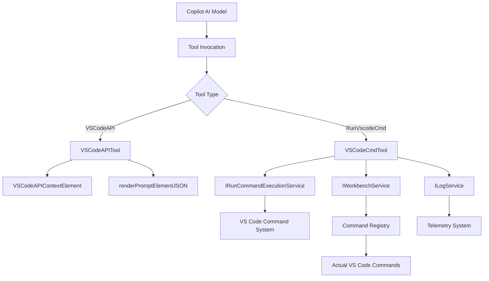
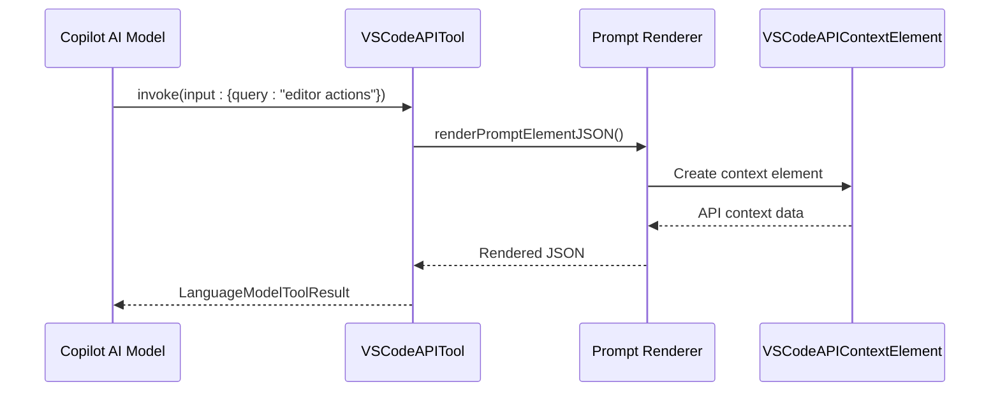
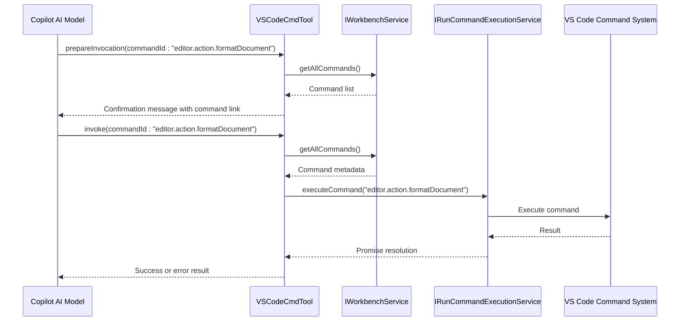
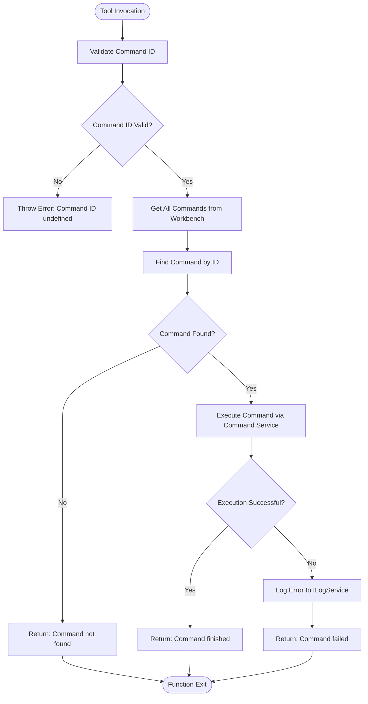
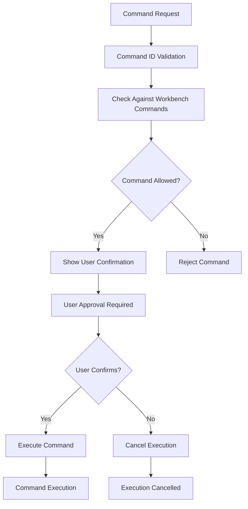
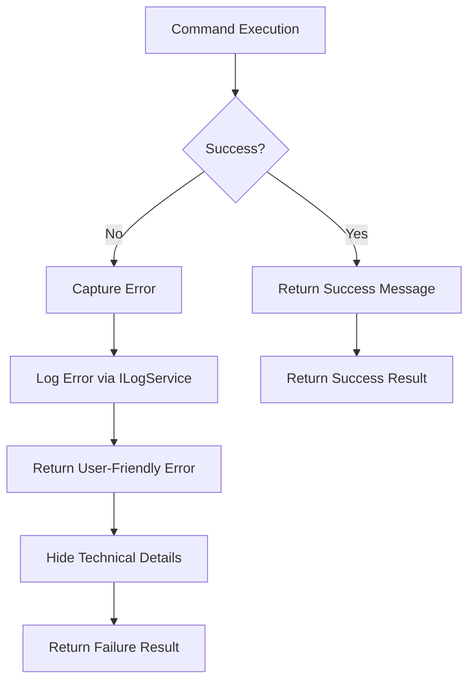
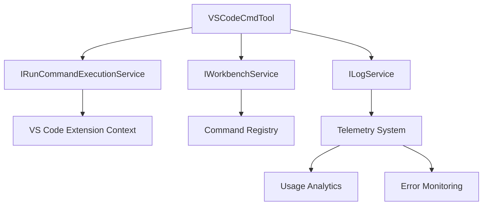

# VS Code Command Integration

<cite>
**Referenced Files in This Document**   
- [vscodeAPITool.ts](file://src/extension/tools/node/vscodeAPITool.ts)
- [vscodeCmdTool.tsx](file://src/extension/tools/node/vscodeCmdTool.tsx)
- [toolsRegistry.ts](file://src/extension/tools/common/toolsRegistry.ts)
- [toolNames.ts](file://src/extension/tools/common/toolNames.ts)
- [runCommandExecutionService.ts](file://src/platform/commands/common/runCommandExecutionService.ts)
- [workbenchService.ts](file://src/platform/workbench/common/workbenchService.ts)
</cite>

## Table of Contents
1. [Introduction](#introduction)
2. [Core Components](#core-components)
3. [Architecture Overview](#architecture-overview)
4. [Detailed Component Analysis](#detailed-component-analysis)
5. [Domain Model for Command Execution](#domain-model-for-command-execution)
6. [Configuration and Security](#configuration-and-security)
7. [Error Handling and Common Issues](#error-handling-and-common-issues)
8. [Integration with Other Components](#integration-with-other-components)
9. [Conclusion](#conclusion)

## Introduction
The VS Code Command Integration system in GitHub Copilot Chat enables secure and reliable execution of VS Code commands through AI-driven tool calls. This documentation provides a comprehensive analysis of the implementation, focusing on the `vscodeAPITool.ts` and `vscodeCmdTool.tsx` components that facilitate interaction with the VS Code extension API. The system allows Copilot to query editor state, execute commands safely, and integrate with the broader IDE functionality while maintaining security and user control.

**Section sources**
- [vscodeAPITool.ts](file://src/extension/tools/node/vscodeAPITool.ts#L1-L42)
- [vscodeCmdTool.tsx](file://src/extension/tools/node/vscodeCmdTool.tsx#L1-L75)

## Core Components
The VS Code command integration system consists of two primary components: `VSCodeAPITool` for querying API information and `VSCodeCmdTool` for executing commands. These tools are registered in the tool registry and follow the language model tool interface pattern, enabling them to be invoked by the Copilot AI system. The components leverage dependency injection to access necessary services and implement both invocation and preparation methods for command execution workflows.

**Section sources**
- [vscodeAPITool.ts](file://src/extension/tools/node/vscodeAPITool.ts#L1-L42)
- [vscodeCmdTool.tsx](file://src/extension/tools/node/vscodeCmdTool.tsx#L1-L75)

## Architecture Overview



**Diagram sources**
- [vscodeAPITool.ts](file://src/extension/tools/node/vscodeAPITool.ts#L1-L42)
- [vscodeCmdTool.tsx](file://src/extension/tools/node/vscodeCmdTool.tsx#L1-L75)
- [runCommandExecutionService.ts](file://src/platform/commands/common/runCommandExecutionService.ts#L1-L15)
- [workbenchService.ts](file://src/platform/workbench/common/workbenchService.ts#L1-L18)

## Detailed Component Analysis

### VSCodeAPITool Analysis
The VSCodeAPITool component enables querying of VS Code API information through the language model tool interface. It accepts a query parameter and renders the appropriate context element using the prompt rendering system.



**Diagram sources**
- [vscodeAPITool.ts](file://src/extension/tools/node/vscodeAPITool.ts#L1-L42)

**Section sources**
- [vscodeAPITool.ts](file://src/extension/tools/node/vscodeAPITool.ts#L1-L42)

### VSCodeCmdTool Analysis
The VSCodeCmdTool component handles the execution of VS Code commands with proper validation, user confirmation, and error handling. It interacts with the command execution service and workbench service to ensure commands are available and can be executed safely.



**Diagram sources**
- [vscodeCmdTool.tsx](file://src/extension/tools/node/vscodeCmdTool.tsx#L1-L75)
- [workbenchService.ts](file://src/platform/workbench/common/workbenchService.ts#L1-L18)
- [runCommandExecutionService.ts](file://src/platform/commands/common/runCommandExecutionService.ts#L1-L15)

**Section sources**
- [vscodeCmdTool.tsx](file://src/extension/tools/node/vscodeCmdTool.tsx#L1-L75)

## Domain Model for Command Execution

### Command Execution Domain Model
```mermaid
classDiagram
class VSCodeCmdTool {
+static readonly toolName : ToolName.RunVscodeCmd
-_commandService : IRunCommandExecutionService
-_workbenchService : IWorkbenchService
-_logService : ILogService
+invoke(options : LanguageModelToolInvocationOptions, token : CancellationToken) : Promise~LanguageModelToolResult~
+prepareInvocation(options : LanguageModelToolInvocationPrepareOptions, token : CancellationToken) : Promise~PreparedToolInvocation~
}
class IVSCodeCmdToolToolInput {
+commandId : string
+name : string
+args : any[]
}
class IRunCommandExecutionService {
+executeCommand(command : string, ...args : any[]) : Promise~any~
}
class IWorkbenchService {
+getAllCommands(filterByPreCondition? : boolean) : Promise~{ label : string; command : string; keybinding : string }[]~
}
class LanguageModelToolResult {
+parts : LanguageModelToolResponsePart[]
}
VSCodeCmdTool --> IVSCodeCmdToolToolInput : "uses"
VSCodeCmdTool --> IRunCommandExecutionService : "depends on"
VSCodeCmdTool --> IWorkbenchService : "depends on"
VSCodeCmdTool --> LanguageModelToolResult : "returns"
```

**Diagram sources**
- [vscodeCmdTool.tsx](file://src/extension/tools/node/vscodeCmdTool.tsx#L1-L75)
- [runCommandExecutionService.ts](file://src/platform/commands/common/runCommandExecutionService.ts#L1-L15)
- [workbenchService.ts](file://src/platform/workbench/common/workbenchService.ts#L1-L18)

### Command Invocation Flow


**Diagram sources**
- [vscodeCmdTool.tsx](file://src/extension/tools/node/vscodeCmdTool.tsx#L1-L75)

**Section sources**
- [vscodeCmdTool.tsx](file://src/extension/tools/node/vscodeCmdTool.tsx#L1-L75)

## Configuration and Security

### Command Allowlist and Permissions
The system implements security through command validation and user confirmation. Before executing any command, the system verifies its existence in the workbench command registry. The `prepareInvocation` method provides user confirmation with a clickable link to the command in Quick Open, ensuring transparency.



**Diagram sources**
- [vscodeCmdTool.tsx](file://src/extension/tools/node/vscodeCmdTool.tsx#L1-L75)

### Parameter Serialization and Response Formatting
The system handles parameter serialization through the standard JavaScript spread operator when passing arguments to commands. Response formatting follows the LanguageModelToolResult pattern, wrapping text responses in LanguageModelTextPart objects for consistent handling by the Copilot system.

**Section sources**
- [vscodeCmdTool.tsx](file://src/extension/tools/node/vscodeCmdTool.tsx#L1-L75)

## Error Handling and Common Issues

### Error Handling Flow


The system handles common issues such as command timeouts, permission denials, and unsafe command execution through comprehensive error handling. All errors are caught and logged internally while providing user-friendly messages that don't expose technical implementation details.

**Diagram sources**
- [vscodeCmdTool.tsx](file://src/extension/tools/node/vscodeCmdTool.tsx#L1-L75)

**Section sources**
- [vscodeCmdTool.tsx](file://src/extension/tools/node/vscodeCmdTool.tsx#L1-L75)

## Integration with Other Components

### Extension Context and Telemetry Integration
The VS Code command tools integrate with the extension context for access control and with the telemetry service for tracking command usage. The ILogService dependency enables logging of command execution attempts and failures for diagnostic purposes.



**Diagram sources**
- [vscodeCmdTool.tsx](file://src/extension/tools/node/vscodeCmdTool.tsx#L1-L75)
- [runCommandExecutionService.ts](file://src/platform/commands/common/runCommandExecutionService.ts#L1-L15)
- [workbenchService.ts](file://src/platform/workbench/common/workbenchService.ts#L1-L18)

**Section sources**
- [vscodeCmdTool.tsx](file://src/extension/tools/node/vscodeCmdTool.tsx#L1-L75)

## Conclusion
The VS Code Command Integration system in GitHub Copilot Chat provides a secure and reliable mechanism for executing IDE commands through AI-driven interactions. By leveraging the tool registry pattern and implementing proper validation, user confirmation, and error handling, the system enables powerful automation capabilities while maintaining user control and security. The separation of concerns between command querying (VSCodeAPITool) and command execution (VSCodeCmdTool) provides a clean architecture that can be extended with additional command types and integration points.