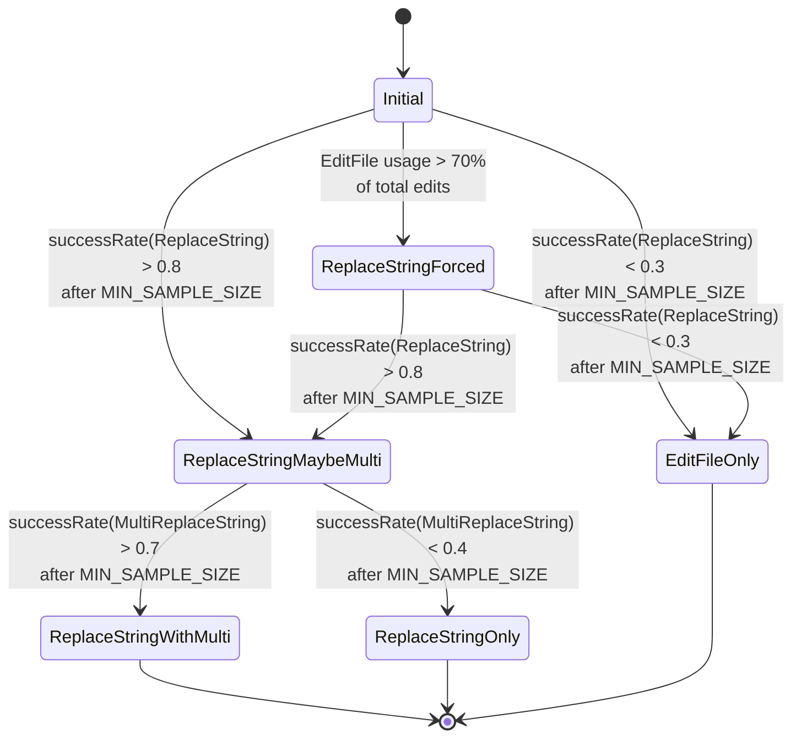
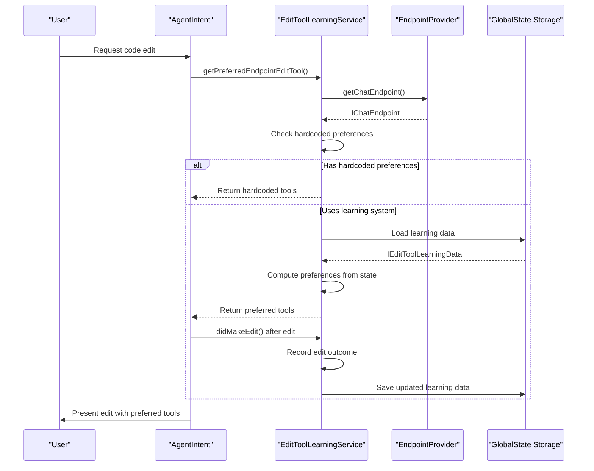
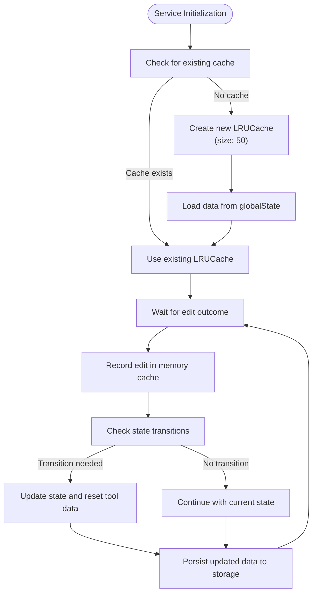

# Edit Tool Learning Service

<cite>
**Referenced Files in This Document**   
- [editToolLearningService.ts](file://src/extension/tools/common/editToolLearningService.ts)
- [editToolLearningStates.ts](file://src/extension/tools/common/editToolLearningStates.ts)
- [toolNames.ts](file://src/extension/tools/common/toolNames.ts)
- [editToolLearningService.spec.ts](file://src/extension/tools/node/test/editToolLearningService.spec.ts)
</cite>

## Table of Contents
1. [Introduction](#introduction)
2. [Core Components](#core-components)
3. [State Management and Learning Logic](#state-management-and-learning-logic)
4. [Integration with Tool Framework](#integration-with-tool-framework)
5. [Performance and Optimization](#performance-and-optimization)
6. [Common Issues and Solutions](#common-issues-and-solutions)
7. [Conclusion](#conclusion)

## Introduction
The Edit Tool Learning Service in GitHub Copilot Chat is a sophisticated system designed to adapt to user preferences when using code manipulation tools. This service captures user interactions with tool-generated edits, evaluates acceptance patterns, and adjusts future tool behavior accordingly. The system implements a state-based learning approach that tracks the success rate of different edit tools and transitions between states based on performance metrics. The service is specifically designed to optimize the selection of edit tools such as ApplyPatch, ReplaceString, MultiReplaceString, and EditFile based on historical performance data.

**Section sources**
- [editToolLearningService.ts](file://src/extension/tools/common/editToolLearningService.ts#L1-L225)
- [editToolLearningStates.ts](file://src/extension/tools/common/editToolLearningStates.ts#L1-L137)

## Core Components

The Edit Tool Learning Service consists of several key components that work together to track and adapt to user preferences. The service is implemented as a class that implements the IEditToolLearningService interface, providing methods to get preferred edit tools and record edit outcomes. The system maintains a cache of learning data for different language models, storing information about the success rate of various edit tools. The service integrates with the endpoint provider to determine which models are eligible for learning-based tool selection and uses telemetry to track state transitions. The implementation uses a rolling window approach to track recent edit successes and failures, ensuring that the learning system remains responsive to changing user preferences.

```mermaid
classDiagram
class IEditToolLearningService {
<<interface>>
+getPreferredEditTool(model : LanguageModelChat) Promise<EditTools[] | undefined>
+getPreferredEndpointEditTool(endpoint : IChatEndpoint) EditTools[] | undefined
+didMakeEdit(model : LanguageModelChat, tool : EditTools, success : boolean) void
}
class EditToolLearningService {
-_cache : LRUCache<string, IEditToolLearningData>
-_context : IVSCodeExtensionContext
-_endpointProvider : IEndpointProvider
-_telemetryService : ITelemetryService
+getPreferredEditTool(model : LanguageModelChat) Promise<EditTools[] | undefined>
+getPreferredEndpointEditTool(endpoint : IChatEndpoint) EditTools[] | undefined
+didMakeEdit(model : LanguageModelChat, tool : EditTools, success : boolean) Promise<void>
-_getHardcodedPreferences(family : string) EditTools[] | undefined
-_computePreferences(data : IEditToolLearningData) EditTools[] | undefined
-_checkStateTransitions(modelId : string, data : IEditToolLearningData) State
-_recordEdit(modelId : string, data : IEditToolLearningData, tool : EditTools, success : boolean) void
-_getCache() LRUCache<string, IEditToolLearningData>
-_loadCacheFromStorage() LRUCache<string, IEditToolLearningData>
-_saveCacheToStorage() Promise<void>
-_saveModelLearningData(modelId : string, data : IEditToolLearningData) Promise<void>
-_getModelLearningData(modelId : string) IEditToolLearningData
}
class IEditToolLearningData {
+state : State
+tools : { [K in EditTools]? : ToolLearningData }
}
class ToolLearningData {
+successBitset : bigint
+attempts : number
}
class State {
<<enumeration>>
Initial
ReplaceStringForced
ReplaceStringMaybeMulti
EditFileOnly
ReplaceStringOnly
ReplaceStringWithMulti
}
IEditToolLearningService <|-- EditToolLearningService
EditToolLearningService --> IEditToolLearningData
IEditToolLearningData --> ToolLearningData
IEditToolLearningData --> State
```

**Diagram sources **
- [editToolLearningService.ts](file://src/extension/tools/common/editToolLearningService.ts#L31-L38)
- [editToolLearningStates.ts](file://src/extension/tools/common/editToolLearningStates.ts#L11-L52)

**Section sources**
- [editToolLearningService.ts](file://src/extension/tools/common/editToolLearningService.ts#L31-L225)
- [editToolLearningStates.ts](file://src/extension/tools/common/editToolLearningStates.ts#L8-L52)

## State Management and Learning Logic

The Edit Tool Learning Service implements a state machine that governs the selection of edit tools based on historical performance. The system defines six states: Initial, ReplaceStringForced, ReplaceStringMaybeMulti, EditFileOnly, ReplaceStringOnly, and ReplaceStringWithMulti. Each state specifies which tools are allowed and defines transition conditions to other states based on success rates and usage patterns. The service uses a rolling window of 100 edit attempts to calculate success rates for each tool, with configurable thresholds for transitioning between states. For example, if the ReplaceString tool achieves a success rate above 80% after a minimum sample size, the system transitions to a state where MultiReplaceString is also enabled. The state transitions are tracked via telemetry to monitor the learning process.



**Diagram sources **
- [editToolLearningStates.ts](file://src/extension/tools/common/editToolLearningStates.ts#L33-L136)
- [editToolLearningService.ts](file://src/extension/tools/common/editToolLearningService.ts#L111-L145)

**Section sources**
- [editToolLearningStates.ts](file://src/extension/tools/common/editToolLearningStates.ts#L33-L136)
- [editToolLearningService.ts](file://src/extension/tools/common/editToolLearningService.ts#L111-L145)

## Integration with Tool Framework

The Edit Tool Learning Service integrates with the broader tool framework through several key mechanisms. The service is registered as a dependency injection service using the IEditToolLearningService identifier, allowing other components to access its functionality. The agent intent system uses the learning service to determine preferred edit tools for specific language models, influencing how tool calls are generated and prioritized. The service also integrates with the endpoint provider to determine which models are eligible for learning-based tool selection, specifically targeting extension-contributed models. Hardcoded preferences are implemented for certain model families like GPT and Sonnet, bypassing the learning system for models with known optimal tool configurations. The service uses the global state storage to persist learning data across sessions, ensuring continuity of user preferences.



**Diagram sources **
- [editToolLearningService.ts](file://src/extension/tools/common/editToolLearningService.ts#L57-L95)
- [agentIntent.ts](file://src/extension/intents/node/agentIntent.ts#L44-L68)

**Section sources**
- [editToolLearningService.ts](file://src/extension/tools/common/editToolLearningService.ts#L57-L95)
- [agentIntent.ts](file://src/extension/intents/node/agentIntent.ts#L44-L68)

## Performance and Optimization

The Edit Tool Learning Service implements several performance optimizations to ensure efficient operation. The service uses an LRU (Least Recently Used) cache with a configurable size of 50 models to keep frequently accessed learning data in memory, reducing the need for storage access. Learning data is persisted to the global state using a structured format that includes model IDs, state information, and tool performance metrics. The implementation uses BigInt for tracking success bitsets, allowing efficient bit manipulation for the rolling window of edit outcomes. The service minimizes storage writes by batching updates and only persisting data when necessary. The state transition logic is optimized to avoid unnecessary calculations, with transitions only evaluated when new edit outcomes are recorded. The system also handles concurrent edits correctly, ensuring thread safety in multi-user scenarios.



**Diagram sources **
- [editToolLearningService.ts](file://src/extension/tools/common/editToolLearningService.ts#L160-L212)
- [editToolLearningStates.ts](file://src/extension/tools/common/editToolLearningStates.ts#L17-L21)

**Section sources**
- [editToolLearningService.ts](file://src/extension/tools/common/editToolLearningService.ts#L160-L212)
- [editToolLearningStates.ts](file://src/extension/tools/common/editToolLearningStates.ts#L17-L21)

## Common Issues and Solutions

The Edit Tool Learning Service addresses several common issues in adaptive systems. For the cold start problem with new users or models, the system begins in the Initial state with a default set of allowed tools (EditFile and ReplaceString), allowing the learning process to begin immediately. To prevent overfitting to recent interactions, the system uses a rolling window of 100 edit attempts, ensuring that historical performance is weighted appropriately. The minimum sample size requirement (approximately 67 attempts) prevents premature state transitions based on insufficient data. For models with hardcoded preferences (like GPT and Sonnet families), the learning system is bypassed entirely, ensuring consistent behavior for models with known optimal configurations. The LRU cache with a fixed size prevents memory leaks when dealing with a large number of models. The service also handles edge cases such as concurrent edits and storage failures gracefully, ensuring robust operation in various scenarios.

**Section sources**
- [editToolLearningService.ts](file://src/extension/tools/common/editToolLearningService.ts#L97-L109)
- [editToolLearningStates.ts](file://src/extension/tools/common/editToolLearningStates.ts#L22-L31)
- [editToolLearningService.spec.ts](file://src/extension/tools/node/test/editToolLearningService.spec.ts#L297-L352)

## Conclusion

The Edit Tool Learning Service in GitHub Copilot Chat represents a sophisticated approach to adaptive tool selection in code editing environments. By tracking user interactions with edit tools and adjusting future behavior based on success patterns, the system provides a personalized experience that improves over time. The state-based learning approach balances exploration of different tools with exploitation of proven effective ones, while the configurable thresholds and rolling window ensure responsiveness to changing user preferences. The integration with the broader tool framework allows the learning system to influence tool selection across various features, while the performance optimizations ensure efficient operation. This implementation serves as a model for adaptive systems in developer tools, demonstrating how machine learning principles can be applied to improve user experience in code editing environments.