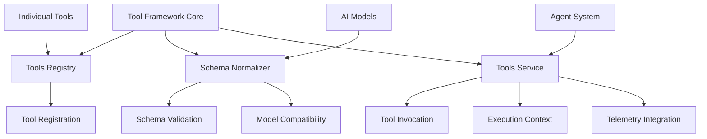
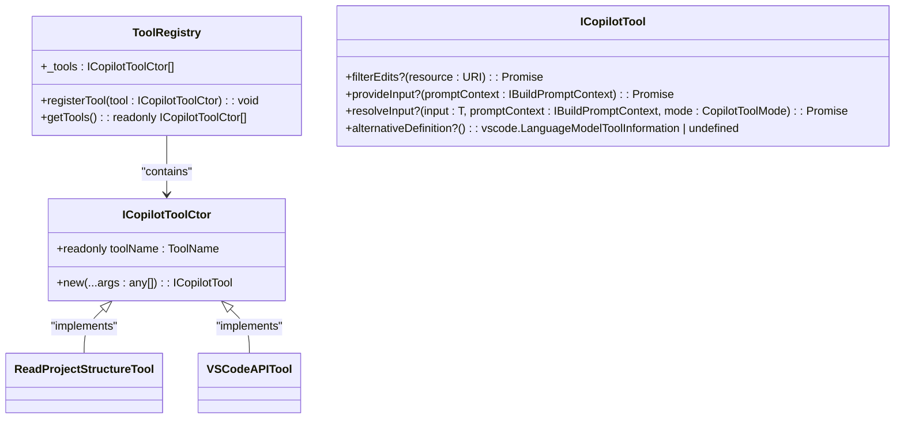
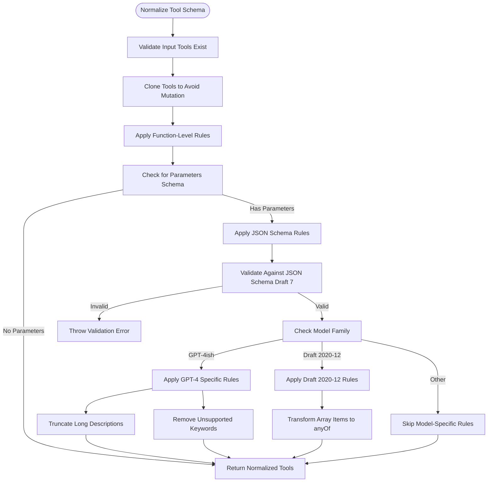
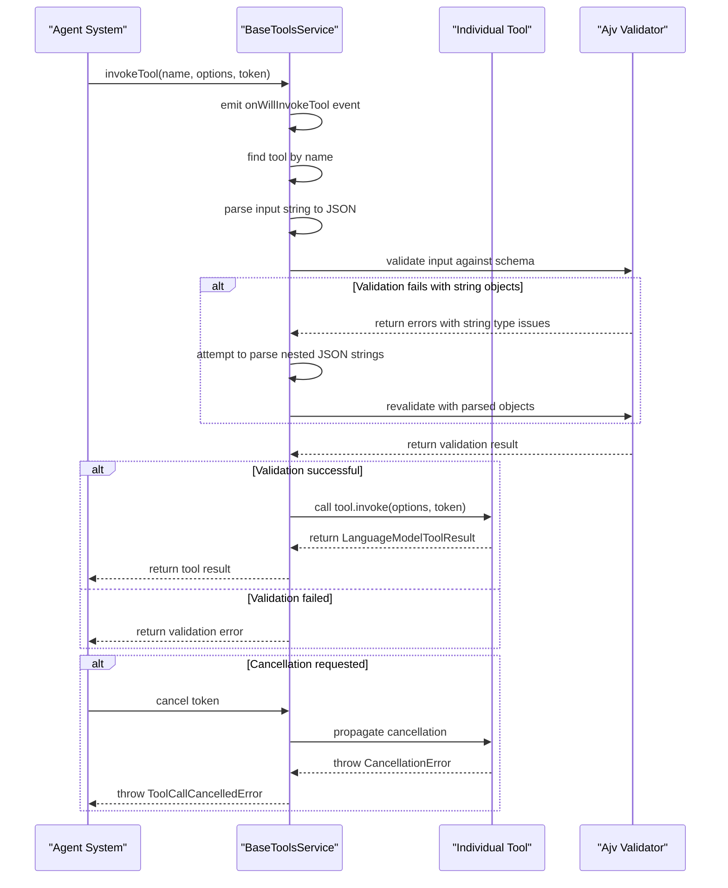
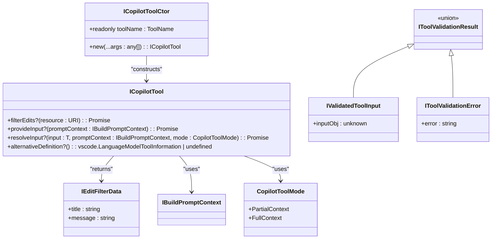
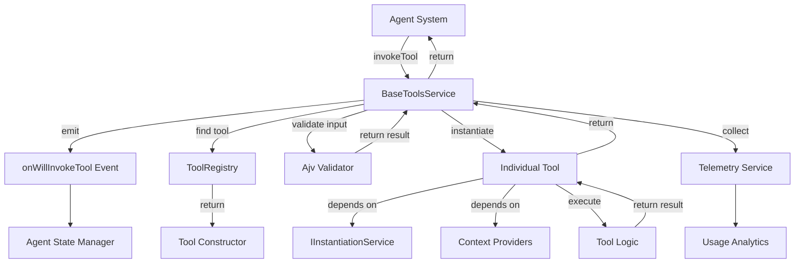

# Tool Framework Core

<cite>
**Referenced Files in This Document**   
- [toolsRegistry.ts](file://src/extension/tools/common/toolsRegistry.ts)
- [toolSchemaNormalizer.ts](file://src/extension/tools/common/toolSchemaNormalizer.ts)
- [toolsService.ts](file://src/extension/tools/common/toolsService.ts)
- [readProjectStructureTool.ts](file://src/extension/tools/node/readProjectStructureTool.ts)
- [vscodeAPITool.ts](file://src/extension/tools/node/vscodeAPITool.ts)
- [toolSchemaNormalizer.spec.ts](file://src/extension/tools/test/common/toolSchemaNormalizer.spec.ts)
</cite>

## Table of Contents
1. [Introduction](#introduction)
2. [Core Architecture](#core-architecture)
3. [Tools Registry Implementation](#tools-registry-implementation)
4. [Schema Normalizer](#schema-normalizer)
5. [Tool Lifecycle Management](#tool-lifecycle-management)
6. [Domain Model](#domain-model)
7. [Tool Invocation Relationships](#tool-invocation-relationships)
8. [Configuration and Discovery](#configuration-and-discovery)
9. [Integration with Other Components](#integration-with-other-components)
10. [Common Issues and Solutions](#common-issues-and-solutions)
11. [Conclusion](#conclusion)

## Introduction

The Tool Framework Core in GitHub Copilot Chat provides a robust infrastructure for managing AI-powered tools that extend the capabilities of the chat interface. This framework enables the registration, validation, and execution of various tools that can interact with the codebase, version control system, and other development resources. The core components include the tools registry, schema normalizer, and tool lifecycle management system, which work together to provide a seamless experience for both users and developers.

The framework is designed to be extensible, allowing new tools to be easily added while maintaining compatibility across different AI models and providers. It handles the complexities of tool discovery, parameter validation, and execution context management, abstracting these concerns from individual tool implementations.

**Section sources**
- [toolsRegistry.ts](file://src/extension/tools/common/toolsRegistry.ts#L1-L76)
- [toolSchemaNormalizer.ts](file://src/extension/tools/common/toolSchemaNormalizer.ts#L1-L241)

## Core Architecture

The Tool Framework Core follows a modular architecture with clear separation of concerns. At its heart is the tools registry that maintains a collection of available tools, the schema normalizer that ensures compatibility across different AI models, and the tools service that manages the lifecycle of tool execution.

The architecture is designed around the principle of loose coupling, where individual tools are independent components that register themselves with the framework but otherwise have minimal dependencies on it. This allows for easy addition and removal of tools without affecting the overall system stability.

The framework integrates with the VS Code language model system through the `vscode.LanguageModelTool` interface, providing a standardized way for tools to be discovered and invoked. It also includes comprehensive error handling and telemetry capabilities to ensure reliability and provide insights into tool usage patterns.

**Diagram sources**
- [toolsRegistry.ts](file://src/extension/tools/common/toolsRegistry.ts#L1-L76)
- [toolSchemaNormalizer.ts](file://src/extension/tools/common/toolSchemaNormalizer.ts#L1-L241)
- [toolsService.ts](file://src/extension/tools/common/toolsService.ts#L1-L253)

## Tools Registry Implementation

The tools registry is implemented as a singleton class that provides a central repository for all available tools in the system. It uses a simple array-based storage mechanism to maintain references to tool constructors, allowing for efficient registration and retrieval operations.

The registry exposes two primary methods: `registerTool` for adding new tools to the system, and `getTools` for retrieving the complete list of registered tools. Each tool is represented by a constructor function that implements the `ICopilotToolCtor` interface, which requires a `toolName` property and a constructor that returns an `ICopilotTool` instance.

Tool registration occurs when individual tool modules are imported, typically through the `allTools.ts` file that imports all available tools. This approach ensures that tools are registered at startup without requiring explicit configuration or discovery mechanisms.

The registry also defines the `ICopilotTool` interface, which extends the base `vscode.LanguageModelTool` interface with additional methods specific to the Copilot ecosystem. These include `filterEdits` for handling edit confirmations, `provideInput` for generating tool inputs, and `resolveInput` for resolving model-generated inputs.

**Diagram sources**
- [toolsRegistry.ts](file://src/extension/tools/common/toolsRegistry.ts#L1-L76)

**Section sources**
- [toolsRegistry.ts](file://src/extension/tools/common/toolsRegistry.ts#L1-L76)
- [readProjectStructureTool.ts](file://src/extension/tools/node/readProjectStructureTool.ts#L1-L43)
- [vscodeAPITool.ts](file://src/extension/tools/node/vscodeAPITool.ts#L1-L42)

## Schema Normalizer

The schema normalizer is a critical component that ensures tool parameter schemas are compatible with various AI models and their specific requirements. It addresses the challenge of schema compatibility across different AI providers by normalizing schemas according to model-specific rules.

The normalizer operates on `OpenAiFunctionTool` objects, which represent tools with their associated JSON schemas for parameter validation. It applies a series of transformation rules to ensure that schemas meet the requirements of the target AI model, particularly addressing known limitations of models like GPT-4 and Claude.

The normalization process consists of two main phases: function-level rules and JSON schema rules. Function-level rules handle top-level properties of the tool definition, such as ensuring parameters are objects and descriptions are present. JSON schema rules operate on the parameter schema itself, validating it against JSON Schema Draft 7 and applying model-specific transformations.

For GPT-4 family models, the normalizer truncates descriptions that exceed the maximum allowed length (1024 characters) and removes unsupported schema keywords such as `minLength`, `maxLength`, `pattern`, and others. For models that follow JSON Schema Draft 2020-12 (like GPT-4, Claude, and O4), it transforms array schemas with multiple item types into the appropriate `anyOf` structure.

The normalizer also includes comprehensive validation using the Ajv library to ensure that schemas conform to JSON Schema standards before any transformations are applied. This prevents invalid schemas from being passed to AI models, which could result in cryptic error messages.

**Diagram sources**
- [toolSchemaNormalizer.ts](file://src/extension/tools/common/toolSchemaNormalizer.ts#L1-L241)

**Section sources**
- [toolSchemaNormalizer.ts](file://src/extension/tools/common/toolSchemaNormalizer.ts#L1-L241)
- [toolSchemaNormalizer.spec.ts](file://src/extension/tools/test/common/toolSchemaNormalizer.spec.ts#L1-L242)

## Tool Lifecycle Management

Tool lifecycle management in the Tool Framework Core is handled by the `BaseToolsService` class, which provides the infrastructure for tool invocation, validation, and execution context management. The service acts as the intermediary between the agent system and individual tool implementations, managing the complete lifecycle from discovery to execution and result handling.

The lifecycle begins with tool discovery, where the service maintains a collection of available tools through the `tools` property, which contains `LanguageModelToolInformation` objects. These are obtained from the VS Code language model system and represent the tools that can be invoked by AI models.

When a tool invocation is requested, the service first validates the input parameters using the `validateToolInput` method. This method parses the input string into a JSON object and validates it against the tool's schema using Ajv. If validation fails due to string values that should be objects, the service attempts to parse nested JSON strings automatically, providing a more forgiving user experience.

The actual tool invocation is handled by the `invokeTool` method, which is implemented by concrete subclasses. Before invocation, the service emits an `onWillInvokeTool` event, allowing other components to react to tool usage. During execution, the service manages cancellation tokens to ensure that long-running tools can be interrupted if needed.

Error handling is a critical aspect of the lifecycle management, with specific handling for cancellation errors through the `ToolCallCancelledError` class. The service also maintains a cache of compiled JSON schemas to improve performance when the same tool is invoked multiple times.

**Diagram sources**
- [toolsService.ts](file://src/extension/tools/common/toolsService.ts#L1-L253)

**Section sources**
- [toolsService.ts](file://src/extension/tools/common/toolsService.ts#L1-L253)

## Domain Model

The domain model for the Tool Framework Core consists of several key interfaces and types that define the structure and behavior of tools and their interactions within the system. These components form the foundation for tool registration, schema validation, and execution context management.

At the core of the domain model is the `ICopilotTool` interface, which extends the base `vscode.LanguageModelTool` interface with Copilot-specific capabilities. This interface defines methods for handling edit confirmations (`filterEdits`), providing input data (`provideInput`), resolving model-generated inputs (`resolveInput`), and offering alternative tool definitions (`alternativeDefinition`).

The `CopilotToolMode` enum defines two execution modes: `PartialContext` for shorter results where the agent can call again for more context, and `FullContext` for longer results where the tool gets one shot to provide complete information. This distinction allows tools to adapt their behavior based on the expected usage pattern.

The `IToolValidationResult` type represents the outcome of tool input validation, either as a successful validation with the parsed input object (`IValidatedToolInput`) or as a validation error with an error message (`IToolValidationError`). This discriminated union pattern enables type-safe handling of validation results.

The domain model also includes utility functions like `isValidatedToolInput` and `isToolValidationError` that provide type guards for narrowing the validation result type, making it easier to work with the results in a type-safe manner.

**Diagram sources**
- [toolsRegistry.ts](file://src/extension/tools/common/toolsRegistry.ts#L1-L76)
- [toolsService.ts](file://src/extension/tools/common/toolsService.ts#L1-L253)

**Section sources**
- [toolsRegistry.ts](file://src/extension/tools/common/toolsRegistry.ts#L1-L76)
- [toolsService.ts](file://src/extension/tools/common/toolsService.ts#L1-L253)

## Tool Invocation Relationships

The tool invocation relationships in the Tool Framework Core illustrate how the core framework components interact with individual tool implementations and external systems. These relationships define the flow of control and data during tool execution, from initial request to final result.

The primary relationship is between the `BaseToolsService` and individual tool implementations. The service acts as the orchestrator, managing the invocation lifecycle, while individual tools implement the specific functionality. Tools register themselves with the `ToolRegistry`, which the service uses to discover available tools.

When an invocation request is received, the service first validates the tool name and input parameters. It then locates the appropriate tool implementation through the registry and delegates the actual execution to the tool's `invoke` method. This delegation pattern allows the service to handle cross-cutting concerns like validation, error handling, and telemetry, while individual tools focus on their specific functionality.

The framework also integrates with the agent system through the `onWillInvokeTool` event, which notifies the agent when a tool is about to be invoked. This allows the agent to update its state and provide appropriate feedback to the user.

Individual tools may have dependencies on other services, such as the `IInstantiationService` for dependency injection, or specific context providers for accessing workspace information. These dependencies are typically injected through the tool's constructor, following the dependency inversion principle.

**Diagram sources**
- [toolsService.ts](file://src/extension/tools/common/toolsService.ts#L1-L253)
- [toolsRegistry.ts](file://src/extension/tools/common/toolsRegistry.ts#L1-L76)

**Section sources**
- [toolsService.ts](file://src/extension/tools/common/toolsService.ts#L1-L253)
- [toolsRegistry.ts](file://src/extension/tools/common/toolsRegistry.ts#L1-L76)
- [readProjectStructureTool.ts](file://src/extension/tools/node/readProjectStructureTool.ts#L1-L43)
- [vscodeAPITool.ts](file://src/extension/tools/node/vscodeAPITool.ts#L1-L42)

## Configuration and Discovery

Tool configuration and discovery in the Tool Framework Core is designed to be both flexible and reliable. The framework supports multiple configuration options for tool discovery, parameter transformation, and metadata handling, ensuring that tools can be easily integrated and used across different scenarios.

Tool discovery is primarily based on the registration pattern, where individual tools import the `ToolRegistry` and call `registerTool` with their constructor. This approach eliminates the need for configuration files or complex discovery mechanisms, making it easy to add new tools to the system.

The framework supports configuration through several mechanisms. The `normalizeToolSchema` function accepts an optional `onFix` callback that is invoked when schema transformations are applied, allowing consumers to be notified of changes. This is particularly useful for debugging and understanding why certain schema elements were modified.

Tool parameters are transformed through the schema normalization process, which applies model-specific rules to ensure compatibility. The transformation parameters include the AI model family (e.g., "gpt-4", "claude-3") which determines which rules are applied, and the tool definitions themselves which are processed to meet the requirements of the target model.

Return value patterns for tool metadata follow a consistent structure. The `normalizeToolSchema` function returns an array of `OpenAiFunctionTool` objects with normalized schemas, or `undefined` if no tools were provided. Individual tools return `LanguageModelToolResult` objects containing the results of their execution, typically as an array of `LanguageModelPromptTsxPart` objects that can be rendered in the chat interface.

The framework also supports conditional tool enabling through the `getEnabledTools` method, which allows consumers to filter tools based on the current request context. This enables dynamic tool availability based on factors like user permissions, workspace state, or other contextual information.

**Section sources**
- [toolSchemaNormalizer.ts](file://src/extension/tools/common/toolSchemaNormalizer.ts#L1-L241)
- [toolsService.ts](file://src/extension/tools/common/toolsService.ts#L1-L253)

## Integration with Other Components

The Tool Framework Core integrates with several other components in the GitHub Copilot Chat ecosystem, creating a cohesive system for AI-powered development assistance. These integrations enable the framework to leverage existing services and provide enhanced functionality to users.

The most significant integration is with the agent system, which uses the tools to extend its capabilities beyond what can be achieved through language models alone. The agent system discovers available tools through the `tools` property of the `IToolsService` interface and can invoke them as needed to gather information or perform actions.

Integration with the telemetry service is critical for monitoring tool usage and identifying areas for improvement. The framework emits events through the `onWillInvokeTool` event, which are collected by the telemetry system to track which tools are being used, how frequently, and in what contexts. This data helps prioritize tool development and optimization efforts.

The framework also integrates with the context system, which provides tools with access to relevant information about the current workspace, file, and user preferences. Tools can use context providers to retrieve specific information needed for their operation, such as the current project structure or version control status.

Another important integration is with the prompt system, which uses tool information to generate appropriate prompts for the language model. The schema normalization ensures that tool parameters are properly formatted for inclusion in prompts, while the `provideInput` method allows tools to contribute contextual data directly to the prompt construction process.

These integrations create a rich ecosystem where tools can leverage various services to provide comprehensive assistance, while the core framework ensures consistency and reliability across all tool interactions.

**Section sources**
- [toolsService.ts](file://src/extension/tools/common/toolsService.ts#L1-L253)
- [readProjectStructureTool.ts](file://src/extension/tools/node/readProjectStructureTool.ts#L1-L43)
- [vscodeAPITool.ts](file://src/extension/tools/node/vscodeAPITool.ts#L1-L42)

## Common Issues and Solutions

The Tool Framework Core addresses several common issues that arise in AI-powered tool systems, particularly around schema compatibility, race conditions, and error handling. These solutions ensure a reliable and consistent user experience across different AI providers and usage scenarios.

One of the most significant challenges is schema compatibility between different AI providers. Models like GPT-4 and Claude have different requirements and limitations for tool parameter schemas, which can lead to validation errors or unexpected behavior. The schema normalizer addresses this by applying provider-specific transformations to ensure compatibility. For example, it removes unsupported schema keywords for GPT-4 and transforms array schemas for Draft 2020-12 compliant models.

Tool registration race conditions could potentially occur when multiple tools are registered simultaneously, but the framework avoids this through its simple, synchronous registration pattern. Since tool registration happens at module load time and the `ToolRegistry` is a singleton with thread-safe operations (in the JavaScript single-threaded context), race conditions are not a concern.

Another common issue is handling invalid input from language models, which may generate JSON strings where objects are expected. The framework addresses this through the `ajvValidateForTool` function, which attempts to parse nested JSON strings automatically when validation fails due to type mismatches. This provides a more forgiving user experience while maintaining data integrity.

The framework also handles the challenge of cryptic error messages from AI providers by providing clear, actionable error messages when schema validation fails. Instead of passing through opaque 400 errors from the CAPI, it generates descriptive messages that help users and developers understand what went wrong and how to fix it.

For performance considerations, the framework uses an LRU cache to store compiled JSON schemas, avoiding the overhead of recompiling the same schema multiple times. This is particularly important for frequently used tools, as schema compilation can be computationally expensive.

**Section sources**
- [toolSchemaNormalizer.ts](file://src/extension/tools/common/toolSchemaNormalizer.ts#L1-L241)
- [toolsService.ts](file://src/extension/tools/common/toolsService.ts#L1-L253)

## Conclusion

The Tool Framework Core in GitHub Copilot Chat provides a robust and extensible infrastructure for managing AI-powered tools that enhance the development experience. Through its well-designed architecture, the framework successfully addresses the challenges of tool registration, schema compatibility, and lifecycle management, creating a reliable foundation for both current and future tool implementations.

The tools registry provides a simple yet effective mechanism for discovering and accessing available tools, while the schema normalizer ensures compatibility across different AI providers by applying model-specific transformations to tool parameter schemas. The lifecycle management system handles the complexities of tool invocation, validation, and error handling, abstracting these concerns from individual tool implementations.

By following established design patterns and leveraging TypeScript's type system, the framework provides a developer-friendly API that is both powerful and easy to use. The integration with other components like the agent system, telemetry service, and context providers creates a cohesive ecosystem where tools can leverage various services to provide comprehensive assistance.

The solutions to common issues like schema compatibility and input validation demonstrate the framework's maturity and attention to real-world usage patterns. These features ensure a consistent and reliable user experience, even when dealing with the inherent unpredictability of AI-generated content.

Overall, the Tool Framework Core represents a sophisticated yet accessible approach to building AI-powered development tools, balancing flexibility with reliability and providing a solid foundation for extending the capabilities of GitHub Copilot Chat.