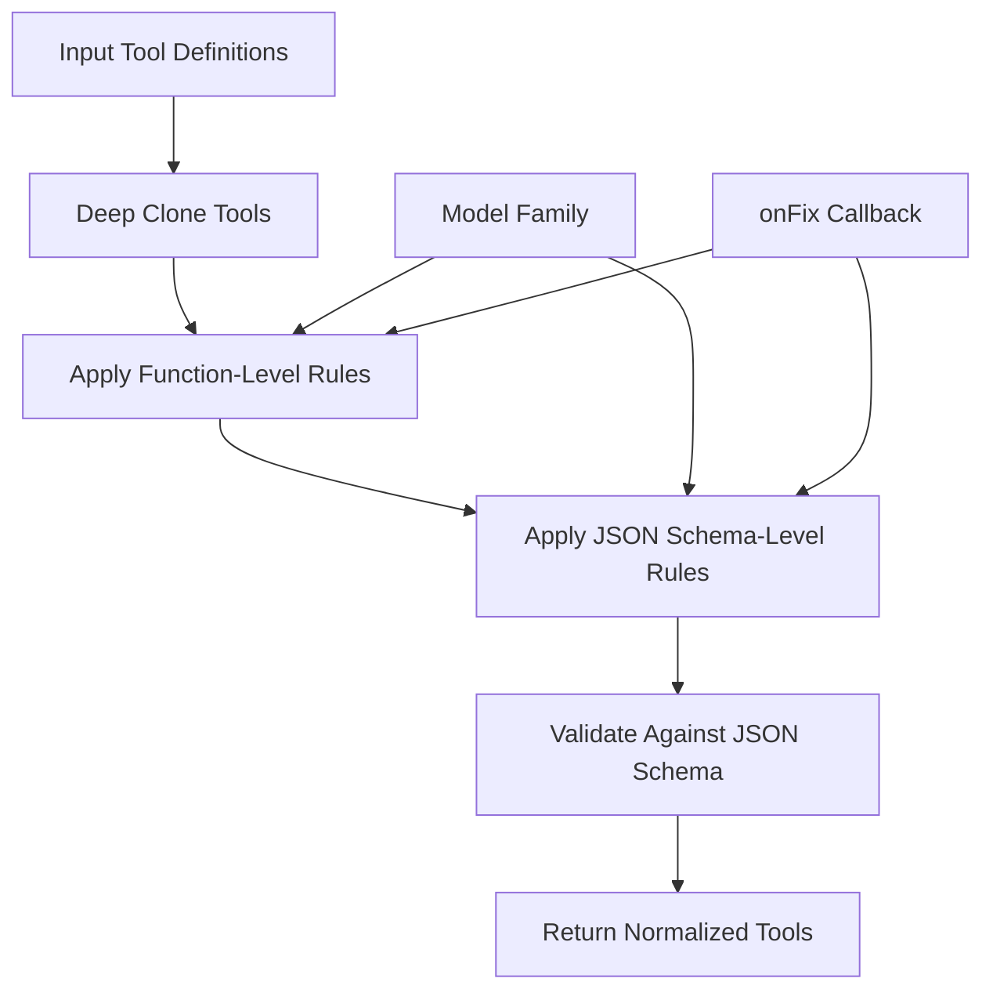
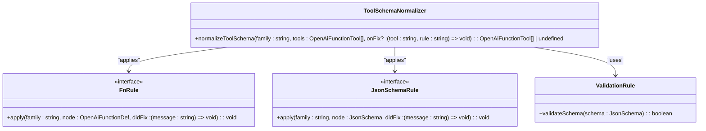
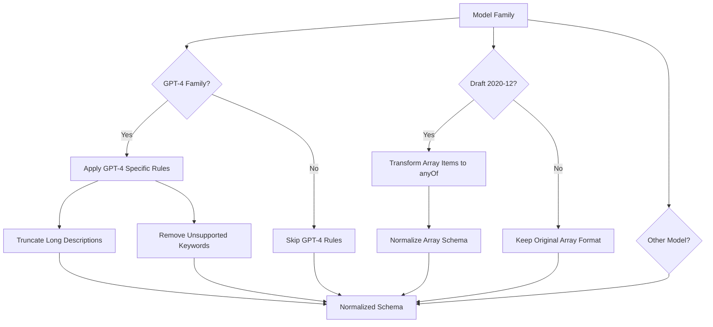
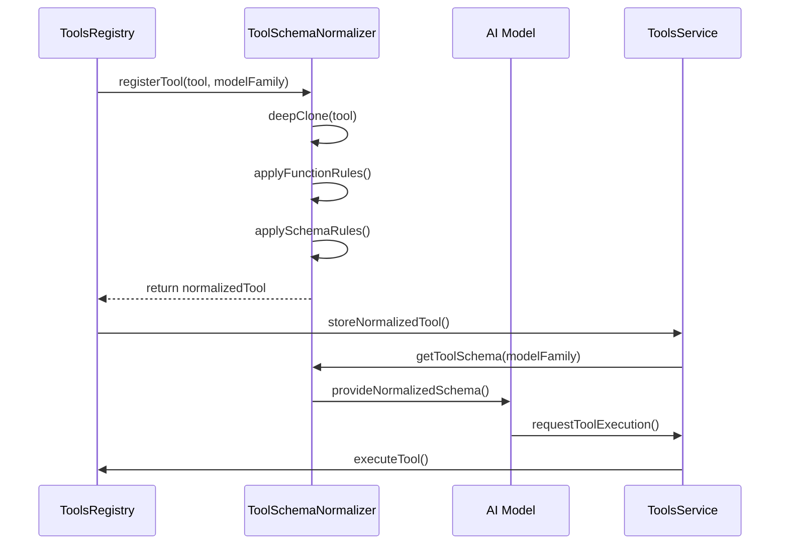
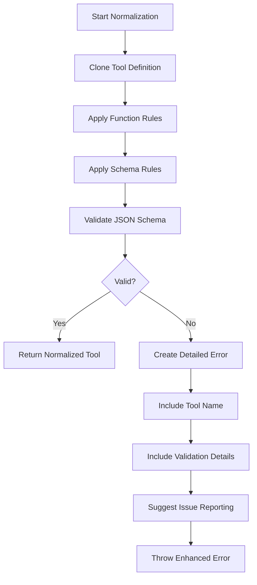
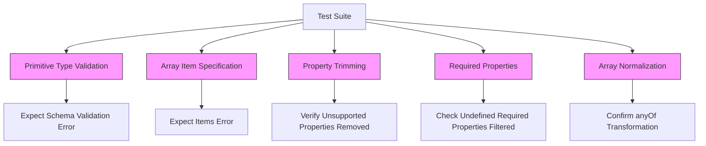
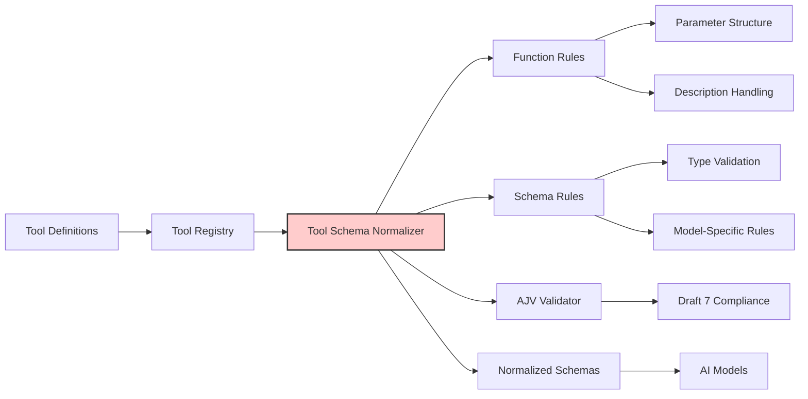
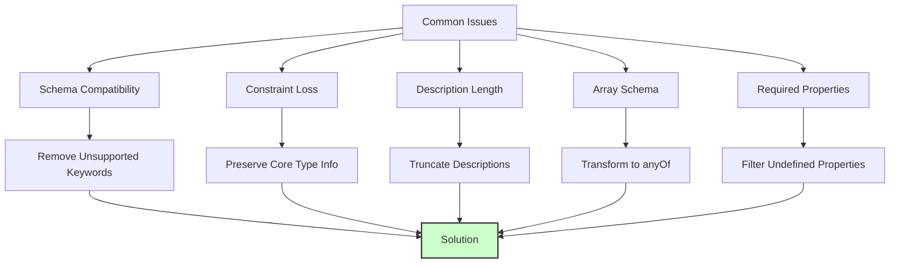

# Tool Schema Normalizer

<cite>
**Referenced Files in This Document**   
- [toolSchemaNormalizer.ts](file://src/extension/tools/common/toolSchemaNormalizer.ts)
- [toolSchemaNormalizer.spec.ts](file://src/extension/tools/test/common/toolSchemaNormalizer.spec.ts)
- [toolsRegistry.ts](file://src/extension/tools/common/toolsRegistry.ts)
- [toolsService.ts](file://src/extension/tools/common/toolsService.ts)
</cite>

## Table of Contents
1. [Introduction](#introduction)
2. [Core Functionality](#core-functionality)
3. [Normalization Rules](#normalization-rules)
4. [Model-Specific Adaptations](#model-specific-adaptations)
5. [Tool Registry Integration](#tool-registry-integration)
6. [Error Handling and Validation](#error-handling-and-validation)
7. [Testing and Verification](#testing-and-verification)
8. [Architecture Overview](#architecture-overview)
9. [Common Issues and Solutions](#common-issues-and-solutions)
10. [Conclusion](#conclusion)

## Introduction

The Tool Schema Normalizer is a critical component in GitHub Copilot Chat that ensures tool definitions are compatible with various AI language models. It acts as an adapter layer that transforms tool schemas into formats that different models can understand while preserving the semantic meaning of the tools. This normalization process is essential for maintaining interoperability across different AI providers such as OpenAI and Anthropic, each of which has specific requirements and limitations for tool schema definitions.

The normalizer addresses the challenge of schema compatibility by implementing a series of transformation rules that adapt tool definitions to meet the constraints of target models. This enables Copilot Chat to provide a consistent tool interface regardless of the underlying AI model, allowing developers to create tools without needing to understand the specific schema requirements of each model.

**Section sources**
- [toolSchemaNormalizer.ts](file://src/extension/tools/common/toolSchemaNormalizer.ts#L1-L53)

## Core Functionality

The Tool Schema Normalizer provides a centralized mechanism for transforming tool schemas to ensure compatibility with various AI models. The core function `normalizeToolSchema` takes a model family identifier, an array of tool definitions, and an optional callback for tracking fixes applied during normalization.

The normalization process operates on two levels: function-level rules and JSON schema-level rules. Function-level rules ensure that essential properties like parameters and descriptions are properly structured, while JSON schema-level rules address more complex structural requirements and model-specific limitations.

The normalizer creates a deep clone of each tool before applying transformations, ensuring that the original tool definitions remain unchanged. This approach allows for safe modification of schemas without affecting the source tool definitions in the registry.

**Diagram sources**
- [toolSchemaNormalizer.ts](file://src/extension/tools/common/toolSchemaNormalizer.ts#L22-L53)

**Section sources**
- [toolSchemaNormalizer.ts](file://src/extension/tools/common/toolSchemaNormalizer.ts#L22-L53)

## Normalization Rules

The Tool Schema Normalizer implements a comprehensive set of rules to ensure tool compatibility across different AI models. These rules are organized into two categories: function rules and JSON schema rules.

Function-level rules address basic structural requirements:
- Ensuring parameters are properly defined as objects with properties
- Providing default descriptions when none are specified

JSON schema rules handle more complex validation and transformation:
- Validating schema against JSON Schema Draft 7 specification
- Ensuring array types have properly defined items
- Processing model-specific constraints and limitations

The rules are applied sequentially to each tool, with the ability to report fixes through the optional `onFix` callback. This callback mechanism enables telemetry and debugging by recording which rules were applied and what changes were made to the schema.

**Diagram sources**
- [toolSchemaNormalizer.ts](file://src/extension/tools/common/toolSchemaNormalizer.ts#L56-L170)

**Section sources**
- [toolSchemaNormalizer.ts](file://src/extension/tools/common/toolSchemaNormalizer.ts#L56-L170)

## Model-Specific Adaptations

The Tool Schema Normalizer implements specific adaptations for different AI model families, recognizing that various models have distinct schema requirements and limitations. The system identifies model families through string prefixes, enabling targeted normalization strategies for GPT-4, Claude, and other model series.

For GPT-4 family models, the normalizer addresses several key limitations:
- Truncating descriptions that exceed the 1024-character limit
- Removing schema keywords that are not supported by GPT-4o
- Handling string length constraints in parameter descriptions

For models following JSON Schema Draft 2020-12 (including GPT-4, Claude, and o4 models), the normalizer transforms array items defined as arrays into the anyOf format, which is required by the newer schema specification.

The normalizer also handles top-level schema keywords that are unsupported across multiple models, such as oneOf, anyOf, allOf, not, if, then, and else, by removing these properties from the schema.

**Diagram sources**
- [toolSchemaNormalizer.ts](file://src/extension/tools/common/toolSchemaNormalizer.ts#L210-L240)

**Section sources**
- [toolSchemaNormalizer.ts](file://src/extension/tools/common/toolSchemaNormalizer.ts#L107-L169)

## Tool Registry Integration

The Tool Schema Normalizer integrates closely with the tools registry and service components to provide normalized schemas during tool invocation. When tools are registered in the system, their schemas pass through the normalizer before being made available to AI models.

The tools registry maintains the original tool definitions while the normalizer provides transformed versions appropriate for specific models. This separation ensures that tool authors can define schemas using standard JSON Schema syntax without needing to account for the limitations of individual AI providers.

During tool invocation, the system determines the target model family and applies the appropriate normalization rules. This process happens transparently to the end user, who experiences consistent tool behavior regardless of the underlying AI model.

The integration also supports telemetry reporting by capturing information about schema modifications through the onFix callback, which can be used to identify common compatibility issues and guide improvements to tool definitions.

**Diagram sources**
- [toolSchemaNormalizer.ts](file://src/extension/tools/common/toolSchemaNormalizer.ts#L22-L53)
- [toolsRegistry.ts](file://src/extension/tools/common/toolsRegistry.ts)
- [toolsService.ts](file://src/extension/tools/common/toolsService.ts)

**Section sources**
- [toolSchemaNormalizer.ts](file://src/extension/tools/common/toolSchemaNormalizer.ts#L22-L53)
- [toolsRegistry.ts](file://src/extension/tools/common/toolsRegistry.ts)
- [toolsService.ts](file://src/extension/tools/common/toolsService.ts)

## Error Handling and Validation

The Tool Schema Normalizer implements robust error handling and validation to ensure schema integrity throughout the normalization process. When validation fails, the system provides detailed error messages that help identify the specific issues with tool schemas.

The validation process uses AJV (Another JSON Schema Validator) to verify that tool parameters conform to the JSON Schema Draft 7 specification. This validation occurs after normalization rules are applied, ensuring that the final schema meets the required standards.

For array types, the normalizer specifically checks that items are properly defined, throwing an error if an array schema lacks an items property. This prevents common schema definition errors that could cause model invocation failures.

The error handling system wraps validation errors with additional context, including the tool name and a suggestion to report issues with the MCP server or extension that provides the tool. This approach helps users and developers identify and resolve schema issues more effectively.

**Diagram sources**
- [toolSchemaNormalizer.ts](file://src/extension/tools/common/toolSchemaNormalizer.ts#L94-L99)
- [toolSchemaNormalizer.ts](file://src/extension/tools/common/toolSchemaNormalizer.ts#L100-L106)

**Section sources**
- [toolSchemaNormalizer.ts](file://src/extension/tools/common/toolSchemaNormalizer.ts#L45-L48)
- [toolSchemaNormalizer.ts](file://src/extension/tools/common/toolSchemaNormalizer.ts#L94-L106)

## Testing and Verification

The Tool Schema Normalizer is supported by a comprehensive test suite that verifies its functionality across various scenarios and edge cases. The tests validate both the normalization behavior and error conditions to ensure reliable operation.

Key test scenarios include:
- Validation of primitive type errors
- Handling of arrays without item specifications
- Removal of unsupported schema properties
- Processing of undefined required properties
- Normalization of arrays for Draft 2020-12 compatibility

The test suite uses snapshot testing to capture the exact output of normalization operations, making it easy to detect unintended changes to the normalization behavior. This approach ensures that updates to the normalizer do not inadvertently break existing tool compatibility.

Tests also verify that the normalizer correctly handles edge cases such as tools with missing parameters, incorrect parameter types, and complex nested schemas. The comprehensive test coverage provides confidence that the normalizer will handle real-world tool definitions reliably.

**Diagram sources**
- [toolSchemaNormalizer.spec.ts](file://src/extension/tools/test/common/toolSchemaNormalizer.spec.ts)

**Section sources**
- [toolSchemaNormalizer.spec.ts](file://src/extension/tools/test/common/toolSchemaNormalizer.spec.ts)

## Architecture Overview

The Tool Schema Normalizer is designed as a modular component within the broader tools ecosystem of GitHub Copilot Chat. It operates as a transformation layer between the tool registry and AI models, ensuring that tool schemas are compatible with the requirements of different language models.

The architecture follows a rule-based approach, with separate rule sets for function-level and JSON schema-level transformations. This separation of concerns allows for clear organization of different types of normalization logic and makes it easier to extend the system with new rules as needed.

The normalizer leverages existing JSON Schema validation infrastructure through the AJV library, integrating it with custom transformation logic to provide comprehensive schema processing. The use of lazy initialization for the validator optimizes performance by creating the validator instance only when needed.

The system is designed to be extensible, allowing new normalization rules to be added to handle emerging model requirements or to address newly discovered compatibility issues.

**Diagram sources**
- [toolSchemaNormalizer.ts](file://src/extension/tools/common/toolSchemaNormalizer.ts)
- [toolsRegistry.ts](file://src/extension/tools/common/toolsRegistry.ts)

**Section sources**
- [toolSchemaNormalizer.ts](file://src/extension/tools/common/toolSchemaNormalizer.ts)
- [toolsRegistry.ts](file://src/extension/tools/common/toolsRegistry.ts)

## Common Issues and Solutions

The Tool Schema Normalizer addresses several common issues that arise when working with AI model tool schemas:

**Schema Compatibility Issues**: Different AI providers support different subsets of JSON Schema features. The normalizer resolves this by removing unsupported keywords and transforming schemas to meet model requirements.

**Parameter Constraint Loss**: When normalizing schemas, certain constraints like minLength, maxLength, and pattern may be lost. The normalizer handles this by stripping these unsupported properties while preserving the core type information.

**Description Length Limitations**: Some models have strict limits on description lengths. The normalizer truncates descriptions that exceed these limits, preserving as much information as possible within the constraints.

**Array Schema Incompatibilities**: Differences in how models handle array schemas, particularly regarding items specification, are resolved by transforming array items into the anyOf format required by Draft 2020-12 compliant models.

**Missing Required Properties**: The normalizer ensures that required properties are actually defined in the schema, filtering out references to undefined properties that could cause model errors.

These solutions enable reliable tool operation across different AI models while maintaining the semantic integrity of the original tool definitions.

**Diagram sources**
- [toolSchemaNormalizer.ts](file://src/extension/tools/common/toolSchemaNormalizer.ts#L217-L239)
- [toolSchemaNormalizer.ts](file://src/extension/tools/common/toolSchemaNormalizer.ts#L131-L137)

**Section sources**
- [toolSchemaNormalizer.ts](file://src/extension/tools/common/toolSchemaNormalizer.ts#L217-L239)
- [toolSchemaNormalizer.ts](file://src/extension/tools/common/toolSchemaNormalizer.ts#L131-L137)

## Conclusion

The Tool Schema Normalizer plays a vital role in enabling GitHub Copilot Chat to work seamlessly with multiple AI models by providing a robust schema adaptation layer. By normalizing tool definitions to meet the specific requirements of different language models, it ensures consistent tool behavior and reliability across the platform.

The system's rule-based architecture provides a clear and extensible framework for handling schema transformations, making it easier to support new models and address emerging compatibility challenges. The comprehensive validation and error handling ensure that tool schemas maintain integrity throughout the normalization process.

For developers implementing tools, the normalizer abstracts away the complexities of model-specific schema requirements, allowing them to focus on tool functionality rather than compatibility details. This abstraction lowers the barrier to entry for tool development while ensuring high-quality user experiences regardless of the underlying AI model.

The normalizer's integration with the tools registry and service components creates a cohesive ecosystem where tools can be easily registered, discovered, and invoked with confidence in their compatibility across different models.