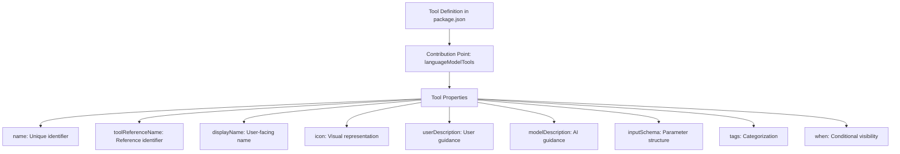
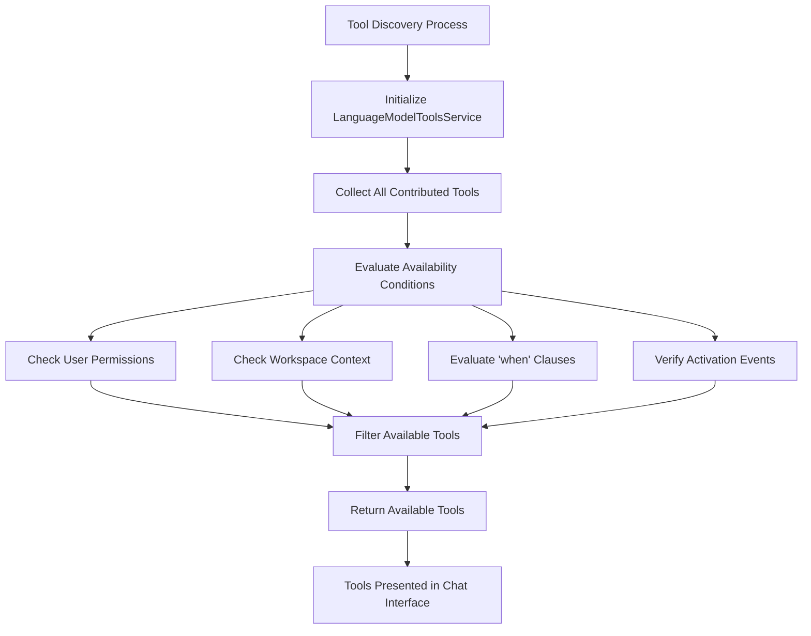
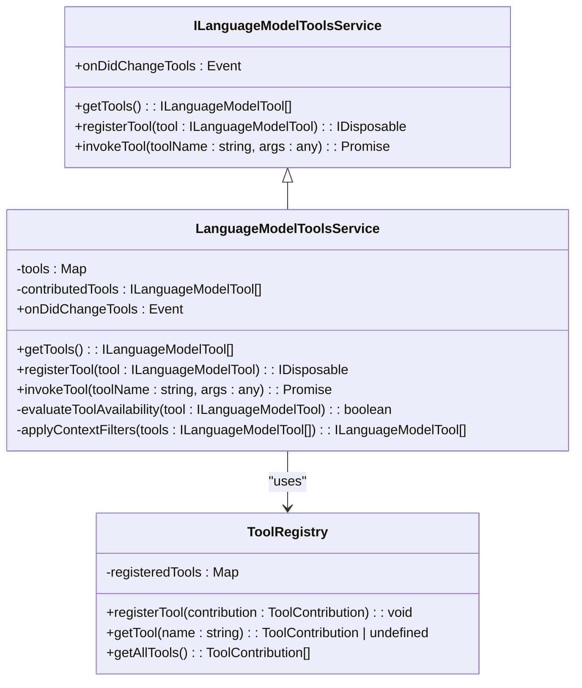
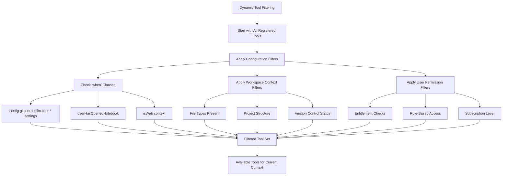
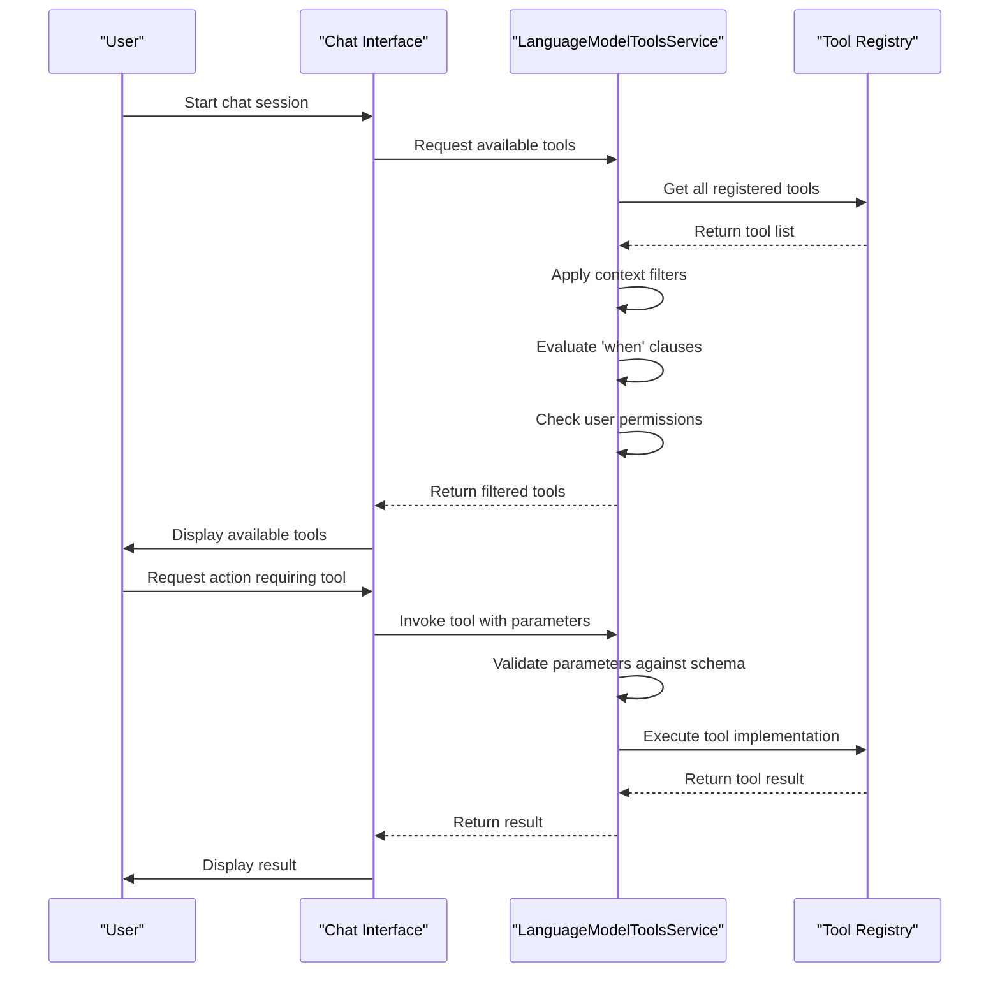

# Tools Registry

<cite>
**Referenced Files in This Document**   
- [package.json](file://package.json)
- [vscode.d.ts](file://src/vscode.d.ts)
- [languageModelToolsService.ts](file://src/platform/chat/common/languageModelToolsService.ts)
- [testToolsService.ts](file://src/extension/tools/node/test/testToolsService.ts)
- [chatSetup.ts](file://src/platform/parser/test/node/fixtures/chatSetup.ts)
</cite>

## Table of Contents
1. [Introduction](#introduction)
2. [Tool Registration Mechanism](#tool-registration-mechanism)
3. [Tool Discovery and Availability Management](#tool-discovery-and-availability-management)
4. [Tools Registry and Tools Service Relationship](#tools-registry-and-tools-service-relationship)
5. [Dynamic Tool Filtering](#dynamic-tool-filtering)
6. [Common Issues and Solutions](#common-issues-and-solutions)
7. [Conclusion](#conclusion)

## Introduction

The Tools Registry in GitHub Copilot Chat serves as a central management system for AI-powered tools that enhance developer productivity within the VS Code environment. This registry maintains a dynamic collection of available tools based on user permissions, workspace context, and activation events. The system enables seamless integration of various functionality such as code search, file operations, notebook management, and repository analysis through a well-defined contribution model. This documentation provides comprehensive insights into the implementation of tool registration, discovery, and availability management, offering both beginner-friendly explanations and technical depth for experienced developers.

## Tool Registration Mechanism

The tool registration mechanism in GitHub Copilot Chat follows a declarative approach through the `package.json` file, where tools are defined as contribution points under the `languageModelTools` section. Each tool is registered with essential metadata including name, display name, icon, user and model descriptions, input schema, and tags. The registration process allows extensions to contribute tools that can be discovered and invoked during chat sessions.

Tools are defined with specific properties that determine their behavior and availability. The `toolReferenceName` serves as a unique identifier for the tool, while the `inputSchema` defines the structure of parameters the tool accepts, using JSON Schema for validation. Tools can also include conditional visibility through the `when` clause, which evaluates context keys to determine availability.

**Diagram sources**
- [package.json](file://package.json#L140-L1085)

**Section sources**
- [package.json](file://package.json#L140-L1085)

## Tool Discovery and Availability Management

Tool discovery in the GitHub Copilot Chat system is implemented through the `ILanguageModelToolsService` interface, which provides methods for retrieving available tools based on current context. The service maintains a registry of all contributed tools and exposes them through the `getTools()` method, which returns tools that are currently available based on user permissions, workspace state, and activation conditions.

The availability management system evaluates multiple factors when determining which tools to present to users. This includes checking user entitlements, workspace configuration, file types present in the project, and specific activation events. For example, notebook-related tools like `copilot_runNotebookCell` and `copilot_editNotebook` are only available when notebook files are present in the workspace or when a notebook is currently open.

Tools can also be grouped into tool sets using the `languageModelToolSets` contribution point in package.json. These sets organize related tools into logical categories, making them easier to manage and discover. The system supports conditional tool availability through the `when` clause, which can reference configuration settings, workspace state, or other context variables.

**Diagram sources**
- [package.json](file://package.json#L1087-L1133)
- [vscode.d.ts](file://src/vscode.d.ts#L20597)
- [languageModelToolsService.ts](file://src/platform/chat/common/languageModelToolsService.ts)

**Section sources**
- [package.json](file://package.json#L1087-L1133)
- [vscode.d.ts](file://src/vscode.d.ts#L20597)

## Tools Registry and Tools Service Relationship

The relationship between the Tools Registry and the Tools Service is fundamental to the operation of GitHub Copilot Chat. The Tools Service acts as the interface between the chat system and the registered tools, providing methods for tool discovery, invocation, and lifecycle management. The registry maintains the collection of available tools, while the service handles the runtime aspects of tool execution and context management.

The `ILanguageModelToolsService` interface defines the contract for tool management, including methods like `getTools()` for retrieving available tools and event emitters like `onDidChangeTools` for responding to changes in tool availability. This service is injected into various components of the system through dependency injection, allowing different parts of the application to access and utilize registered tools.

When a chat session begins, the Tools Service provides the AI model with information about available tools, enabling the model to select appropriate tools for accomplishing user requests. The service also handles tool invocation, passing parameters from the model to the appropriate tool implementation and returning results back to the chat system.

**Diagram sources**
- [languageModelToolsService.ts](file://src/platform/chat/common/languageModelToolsService.ts)
- [vscode.d.ts](file://src/vscode.d.ts#L20597)

**Section sources**
- [languageModelToolsService.ts](file://src/platform/chat/common/languageModelToolsService.ts)
- [vscode.d.ts](file://src/vscode.d.ts#L20597)

## Dynamic Tool Filtering

Dynamic tool filtering in GitHub Copilot Chat ensures that only relevant tools are presented to users based on multiple contextual factors. The filtering system evaluates tools against criteria such as user permissions, workspace characteristics, file types, and specific activation events. This contextual awareness prevents overwhelming users with irrelevant options and enhances the overall user experience.

The filtering process occurs at multiple levels. First, tools are filtered based on the `when` clause in their definition, which can reference configuration settings like `config.github.copilot.chat.newWorkspaceCreation.enabled`. Second, tools are filtered based on workspace context, such as whether notebook files are present or if the user has opened specific file types. Third, user entitlements and permissions are considered, ensuring that premium or restricted tools are only available to authorized users.

For example, the `copilot_readNotebookCellOutput` tool includes the condition `when": "userHasOpenedNotebook"`, ensuring it only appears when a notebook is active. Similarly, tools related to workspace creation are gated behind configuration settings that control their availability.

**Diagram sources**
- [package.json](file://package.json#L727-L728)
- [package.json](file://package.json#L921)
- [package.json](file://package.json#L1184)

**Section sources**
- [package.json](file://package.json#L727-L728)
- [package.json](file://package.json#L921)
- [package.json](file://package.json#L1184)

## Common Issues and Solutions

The Tools Registry implementation addresses several common issues that arise in dynamic tool management systems. One primary challenge is race conditions during extension activation, where tools may not be immediately available when needed. The system mitigates this through event-driven architecture, with the `onDidChangeTools` event allowing components to respond to changes in tool availability.

Another issue is handling duplicate tool registrations, which could occur when multiple extensions contribute tools with the same name or reference name. The registry likely employs validation during the registration process to prevent duplicates, either by rejecting subsequent registrations or by implementing a priority system based on extension precedence.

The system also addresses the challenge of maintaining tool metadata caching during chat sessions. By providing a stable interface through the Tools Service, the system ensures that tool information remains consistent throughout a session, even if underlying conditions change. This caching mechanism improves performance and provides a more predictable user experience.

For testing and development, the system includes comprehensive test fixtures that validate tool registration and discovery. These tests verify that tools are properly registered from package.json contributions and that availability filters work as expected under various conditions.

**Diagram sources**
- [testToolsService.ts](file://src/extension/tools/node/test/testToolsService.ts)
- [chatSetup.ts](file://src/platform/parser/test/node/fixtures/chatSetup.ts)

**Section sources**
- [testToolsService.ts](file://src/extension/tools/node/test/testToolsService.ts)
- [chatSetup.ts](file://src/platform/parser/test/node/fixtures/chatSetup.ts)

## Conclusion

The Tools Registry in GitHub Copilot Chat provides a robust framework for managing AI-powered tools within the VS Code environment. Through a combination of declarative registration in package.json, dynamic filtering based on context, and a well-defined service interface, the system enables scalable tool discovery and management. The architecture supports complex scenarios including conditional tool availability, permission-based access control, and seamless integration with the chat interface. By addressing common challenges such as race conditions and duplicate registrations, the implementation provides a reliable foundation for extending the capabilities of GitHub Copilot Chat. This system exemplifies best practices in extensible IDE design, balancing flexibility with maintainability and user experience.