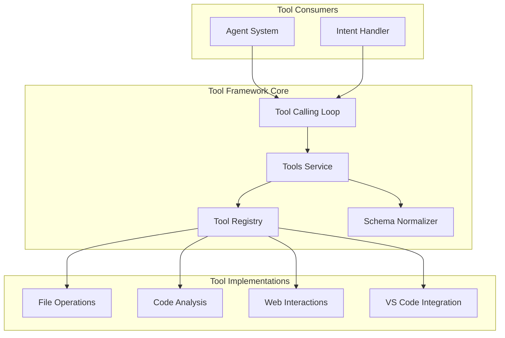
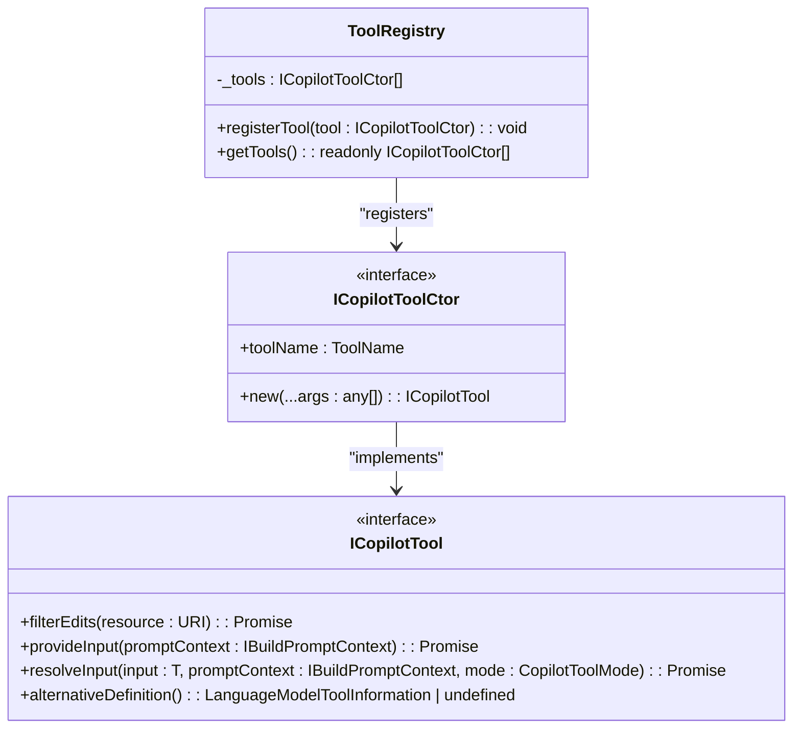
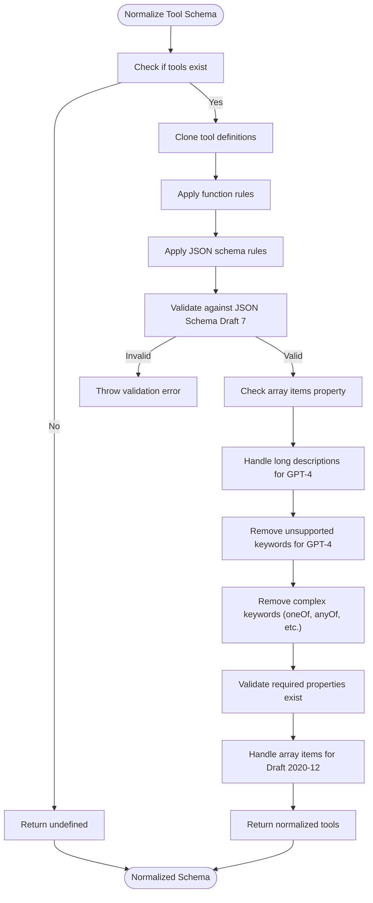
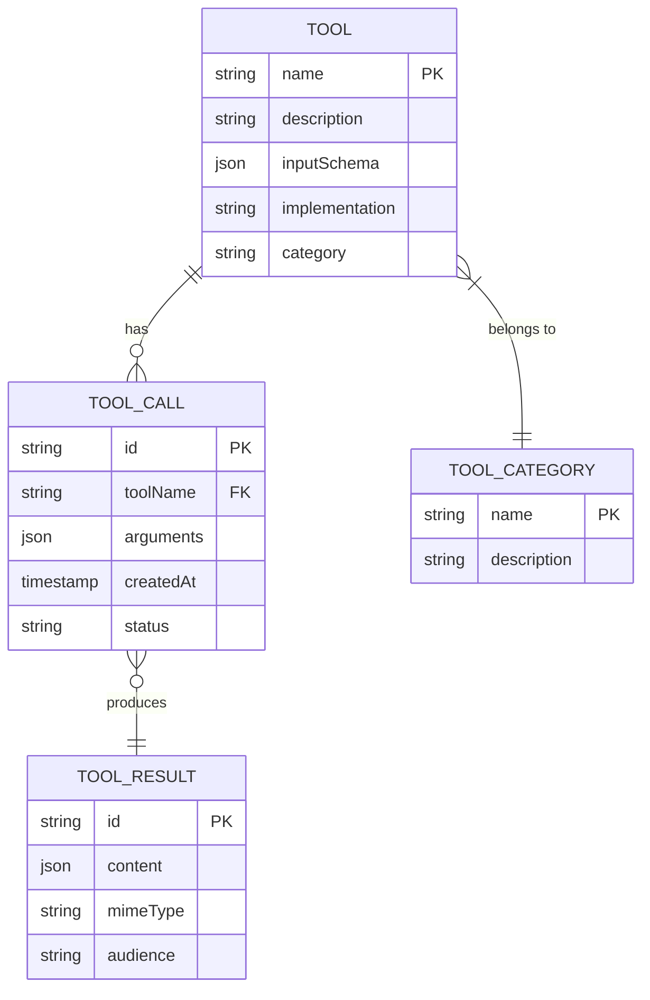
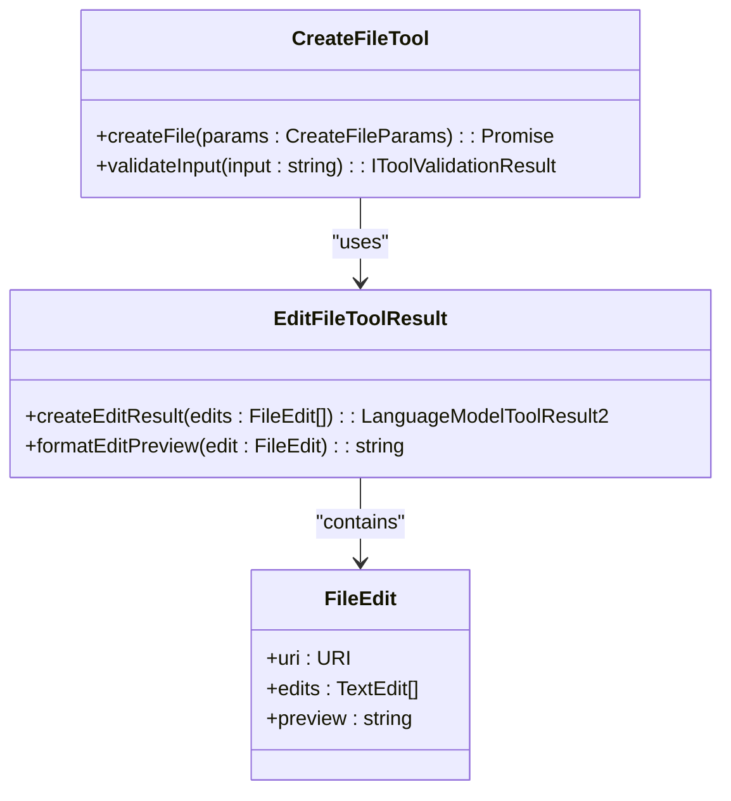
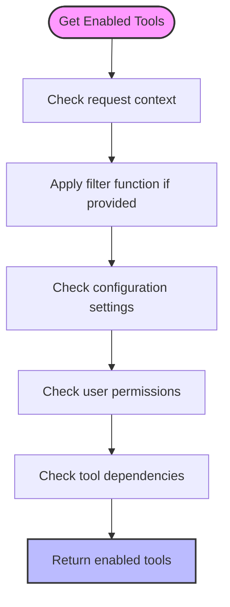

# Tool Framework

<cite>
**Referenced Files in This Document**   
- [toolsRegistry.ts](file://src/extension/tools/common/toolsRegistry.ts)
- [toolsService.ts](file://src/extension/tools/common/toolsService.ts)
- [toolSchemaNormalizer.ts](file://src/extension/tools/common/toolSchemaNormalizer.ts)
- [toolNames.ts](file://src/extension/tools/common/toolNames.ts)
- [createFileTool.tsx](file://src/extension/tools/node/createFileTool.tsx)
- [editFileToolResult.tsx](file://src/extension/tools/node/editFileToolResult.tsx)
- [toolGroupingService.ts](file://src/extension/tools/common/virtualTools/toolGroupingService.ts)
- [toolCallingLoop.ts](file://src/extension/intents/node/toolCallingLoop.ts)
</cite>

## Table of Contents
1. [Introduction](#introduction)
2. [Core Architecture](#core-architecture)
3. [Tool Registry and Lifecycle](#tool-registry-and-lifecycle)
4. [Schema Normalization and Validation](#schema-normalization-and-validation)
5. [Execution Pipeline](#execution-pipeline)
6. [Domain Model](#domain-model)
7. [Tool Implementation Patterns](#tool-implementation-patterns)
8. [Configuration and Availability](#configuration-and-availability)
9. [Integration with Agent System](#integration-with-agent-system)
10. [Security and Safety](#security-and-safety)
11. [Troubleshooting Guide](#troubleshooting-guide)

## Introduction

The Tool Framework in GitHub Copilot Chat provides a comprehensive system for secure code manipulation and tool composition. This framework enables the integration of various tools that can interact with the codebase, file system, and external services while maintaining strict security controls. The system is designed to be extensible, allowing both built-in and third-party tools to participate in the AI-assisted development workflow.

The framework follows a modular architecture with clear separation between tool registration, schema management, execution control, and result handling. It supports various tool types including file operations, code analysis, testing, and web interactions, all orchestrated through a centralized tool calling mechanism.

**Section sources**
- [toolsRegistry.ts](file://src/extension/tools/common/toolsRegistry.ts#L1-L76)
- [toolsService.ts](file://src/extension/tools/common/toolsService.ts#L1-L253)

## Core Architecture

The Tool Framework consists of several interconnected components that work together to provide a robust tool execution environment. At its core, the framework follows a service-oriented architecture where different components handle specific aspects of tool management and execution.

The architecture can be visualized as a layered system with the following components:



**Diagram sources**
- [toolCallingLoop.ts](file://src/extension/intents/node/toolCallingLoop.ts#L92-L703)
- [toolsService.ts](file://src/extension/tools/common/toolsService.ts#L154-L253)

## Tool Registry and Lifecycle

The tool registry system provides a centralized mechanism for managing tool implementations throughout their lifecycle. The `ToolRegistry` class serves as a singleton registry that maintains a collection of tool constructors, enabling dynamic registration and retrieval of tools.



**Diagram sources**
- [toolsRegistry.ts](file://src/extension/tools/common/toolsRegistry.ts#L28-L63)
- [toolsRegistry.ts](file://src/extension/tools/common/toolsRegistry.ts#L65-L75)

The tool lifecycle begins with registration through the `registerTool` method, where tool constructors are added to the internal collection. Each tool is identified by a unique `ToolName` enum value, which serves as its identifier throughout the system. The registry maintains a simple array of tool constructors, allowing for efficient enumeration and retrieval.

Tools are instantiated on-demand when needed for execution, rather than being pre-instantiated. This lazy instantiation approach conserves resources and allows for dependency injection through the service container. The registry pattern ensures that all tools are discoverable and accessible through a consistent interface, regardless of their specific implementation details.

**Section sources**
- [toolsRegistry.ts](file://src/extension/tools/common/toolsRegistry.ts#L65-L75)

## Schema Normalization and Validation

The schema normalization system ensures that tool definitions are compatible with various language models and their specific requirements. The `normalizeToolSchema` function processes tool schemas to address model-specific constraints and limitations.



**Diagram sources**
- [toolSchemaNormalizer.ts](file://src/extension/tools/common/toolSchemaNormalizer.ts#L22-L241)

The normalization process applies several rules to ensure compatibility:

1. **Function-level rules**: Ensure parameters are objects with properties, and descriptions are not empty
2. **JSON schema rules**: Validate against JSON Schema Draft 7, ensure array types have items, and handle model-specific limitations
3. **Model-specific adaptations**: Truncate long descriptions for GPT-4 models and remove unsupported keywords
4. **Draft 2020-12 compatibility**: Handle array items differently for models following this draft

The system uses Ajv (Another JSON Schema Validator) to validate schemas against the JSON Schema Draft 7 specification. It also implements a lazy-loaded validator to improve performance when processing multiple schemas.

**Section sources**
- [toolSchemaNormalizer.ts](file://src/extension/tools/common/toolSchemaNormalizer.ts#L22-L241)

## Execution Pipeline

The tool execution pipeline orchestrates the invocation of tools in response to user requests and agent decisions. The `ToolCallingLoop` class manages the iterative process of building prompts, invoking tools, and processing results.

```mermaid
sequenceDiagram
participant User as "User"
participant Agent as "Agent System"
participant Loop as "ToolCallingLoop"
participant Service as "ToolsService"
participant Tool as "Specific Tool"
User->>Agent : Submit request
Agent->>Loop : Initialize tool calling loop
Loop->>Loop : Build prompt with context
Loop->>Service : Get available tools
Service-->>Loop : Return tools
Loop->>Loop : Create prompt context
Loop->>Loop : Build prompt
Loop->>Loop : Fetch response from model
Loop->>Loop : Parse tool calls
Loop->>Service : Invoke tools
Service->>Tool : Execute tool
Tool-->>Service : Return result
Service-->>Loop : Return tool results
Loop->>Loop : Update conversation state
Loop->>Loop : Check tool call limit
alt More tool calls needed
Loop->>Loop : Continue loop
else Limit reached
Loop->>Agent : Return final result
Agent->>User : Display response
end
```

**Diagram sources**
- [toolCallingLoop.ts](file://src/extension/intents/node/toolCallingLoop.ts#L92-L703)

The pipeline follows these key steps:

1. **Prompt Building**: The system constructs a prompt that includes the user's request, conversation history, and available tools
2. **Tool Selection**: Based on the request and context, the system determines which tools are available and enabled
3. **Model Invocation**: The prompt is sent to the language model, which may generate tool calls
4. **Tool Execution**: Identified tools are invoked with the provided parameters
5. **Result Processing**: Tool results are collected and formatted for the model
6. **Iteration Control**: The loop continues until a final response is generated or the tool call limit is reached

The pipeline includes safety mechanisms such as cancellation handling, pause/resume functionality, and tool call limits to prevent infinite loops.

**Section sources**
- [toolCallingLoop.ts](file://src/extension/intents/node/toolCallingLoop.ts#L92-L703)

## Domain Model

The domain model for the tool system defines the key entities and their relationships. The model includes tool definitions, parameters, execution results, and metadata.



**Diagram sources**
- [toolNames.ts](file://src/extension/tools/common/toolNames.ts#L21-L250)
- [toolsService.ts](file://src/extension/tools/common/toolsService.ts#L18-L34)

The domain model includes several key components:

- **Tool Definitions**: Represented by the `LanguageModelToolInformation` interface, containing name, description, and input schema
- **Tool Parameters**: Defined using JSON Schema, with type validation and coercion
- **Execution Results**: Encapsulated in `LanguageModelToolResult2` objects with content parts of various MIME types
- **Tool Categories**: Organizational grouping of tools by functionality (e.g., Jupyter Notebook, Web Interaction)

The `ToolName` enum provides a type-safe way to reference tools throughout the system, while the `toolCategories` record maps each tool to its appropriate category for organizational purposes.

**Section sources**
- [toolNames.ts](file://src/extension/tools/common/toolNames.ts#L21-L250)
- [toolsService.ts](file://src/extension/tools/common/toolsService.ts#L18-L34)

## Tool Implementation Patterns

The framework supports various patterns for implementing tools, with specific examples demonstrating file manipulation operations.

### File Creation Tool

The `createFileTool.tsx` implements the file creation functionality, following the pattern of extending the base tool class with specific file system operations.



**Diagram sources**
- [createFileTool.tsx](file://src/extension/tools/node/createFileTool.tsx)
- [editFileToolResult.tsx](file://src/extension/tools/node/editFileToolResult.tsx)

The file creation tool follows these implementation patterns:

1. **Input Validation**: Uses JSON schema to validate parameters before execution
2. **File System Operations**: Integrates with VS Code's file system API for safe file creation
3. **Result Formatting**: Creates structured results that can be displayed in the chat interface
4. **Error Handling**: Provides meaningful error messages for various failure scenarios

The `editFileToolResult.tsx` component handles the formatting and presentation of file edit operations, providing preview functionality and structured results.

**Section sources**
- [createFileTool.tsx](file://src/extension/tools/node/createFileTool.tsx)
- [editFileToolResult.tsx](file://src/extension/tools/node/editFileToolResult.tsx)

## Configuration and Availability

The tool system provides configuration options to control tool availability and behavior. The `getEnabledTools` method in the `IToolsService` interface determines which tools should be available for a given request.



**Diagram sources**
- [toolsService.ts](file://src/extension/tools/common/toolsService.ts#L78-L79)

Configuration options include:

- **Tool-specific settings**: Enable/disable individual tools through configuration
- **Category-based control**: Enable/disable groups of tools by category
- **Context-aware availability**: Tools may be available only in specific contexts (e.g., when a workspace is open)
- **Permission-based access**: Certain tools require specific permissions to execute

The system also supports virtual tool grouping through the `ToolGroupingService`, which organizes tools into categories for better user experience.

**Section sources**
- [toolsService.ts](file://src/extension/tools/common/toolsService.ts#L78-L79)
- [toolGroupingService.ts](file://src/extension/tools/common/virtualTools/toolGroupingService.ts#L15-L42)

## Integration with Agent System

The tool framework integrates closely with the agent system, enabling autonomous agents to perform complex tasks through tool composition.

```mermaid
sequenceDiagram
participant Agent as "Agent"
participant Intent as "Intent Handler"
participant Loop as "ToolCallingLoop"
participant Tools as "ToolsService"
Agent->>Intent : Process user request
Intent->>Loop : Create tool calling loop
Loop->>Loop : Initialize with conversation
Loop->>Loop : Set tool call limit
Loop->>Loop : Add stream participants
Loop->>Loop : Run tool calling loop
Loop->>Tools : Get available tools
Tools-->>Loop : Return tools
Loop->>Loop : Build prompt
Loop->>Loop : Fetch model response
Loop->>Loop : Extract tool calls
Loop->>Tools : Invoke tools
Tools-->>Loop : Return results
Loop->>Loop : Update conversation
Loop->>Loop : Check completion
alt More steps needed
Loop->>Loop : Continue loop
else Task complete
Loop-->>Intent : Return final result
Intent-->>Agent : Return response
end
```

**Diagram sources**
- [toolCallingLoop.ts](file://src/extension/intents/node/toolCallingLoop.ts#L92-L703)

The integration enables agents to:

- **Chain tool calls**: Use the output of one tool as input to another
- **Handle errors**: Recover from tool execution failures
- **Manage state**: Maintain context across multiple tool invocations
- **Respect limits**: Adhere to tool call limits and resource constraints

The agent system can also request continuation when the tool call limit is reached, allowing for extended problem-solving sessions.

**Section sources**
- [toolCallingLoop.ts](file://src/extension/intents/node/toolCallingLoop.ts#L92-L703)

## Security and Safety

The tool framework implements several security measures to ensure safe code manipulation:

1. **Permission System**: Tools requiring file system access or other sensitive operations require explicit user permission
2. **Input Validation**: All tool inputs are validated against JSON schemas to prevent injection attacks
3. **Sandboxing**: File operations are restricted to the current workspace
4. **Confirmation Prompts**: Destructive operations require user confirmation
5. **Audit Logging**: All tool executions are logged for security review

The framework also includes safety features such as:

- **Tool call limits**: Prevent infinite loops and excessive resource usage
- **Cancellation support**: Allow users to cancel long-running operations
- **Error isolation**: Contain errors within individual tool executions
- **Result validation**: Verify tool results before incorporating them into the response

These measures ensure that the tool system can perform powerful code manipulations while maintaining the security and stability of the development environment.

**Section sources**
- [toolsService.ts](file://src/extension/tools/common/toolsService.ts#L62-L69)
- [toolCallingLoop.ts](file://src/extension/intents/node/toolCallingLoop.ts#L176-L178)

## Troubleshooting Guide

Common issues and their solutions:

**Tool Not Found**
- **Cause**: The tool name in the request doesn't match any registered tool
- **Solution**: Verify the tool name spelling and check if the tool is properly registered

**Invalid Input Parameters**
- **Cause**: Tool input doesn't match the expected schema
- **Solution**: Check the tool's input schema and ensure all required fields are provided with correct types

**Permission Denied**
- **Cause**: The tool requires permissions that haven't been granted
- **Solution**: Check the extension's permission settings and grant the necessary permissions

**Tool Execution Timeout**
- **Cause**: The tool is taking too long to execute
- **Solution**: Check for infinite loops in the tool logic or increase the timeout limit

**Authentication Required**
- **Cause**: The tool requires authentication to access external services
- **Solution**: Ensure proper authentication credentials are configured

The framework provides detailed error messages and logging to help diagnose and resolve issues. The `validateToolInput` method in `ToolsService` provides specific feedback on input validation errors, while the request logger captures tool execution details for debugging.

**Section sources**
- [toolsService.ts](file://src/extension/tools/common/toolsService.ts#L179-L216)
- [toolCallingLoop.ts](file://src/extension/intents/node/toolCallingLoop.ts#L472-L479)