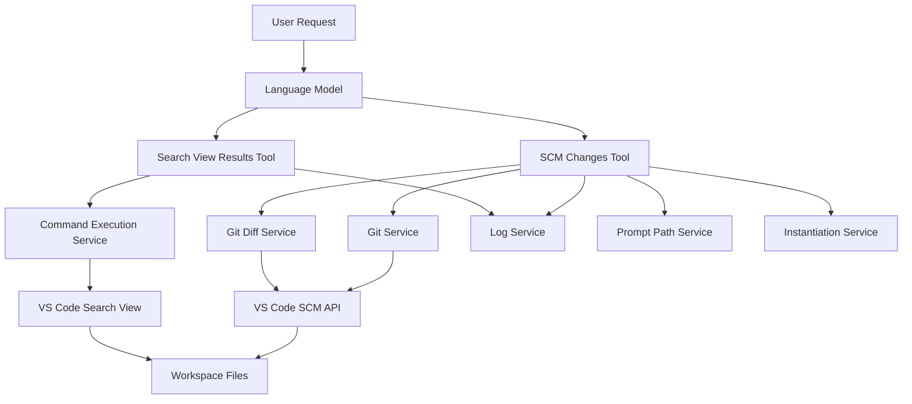
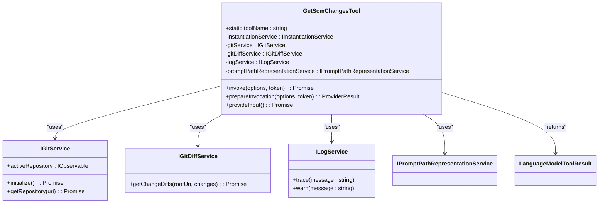
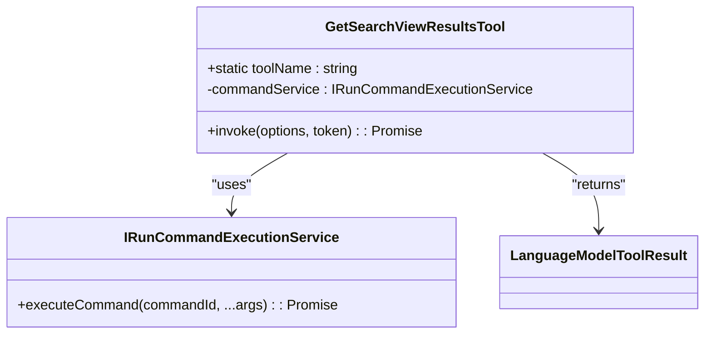
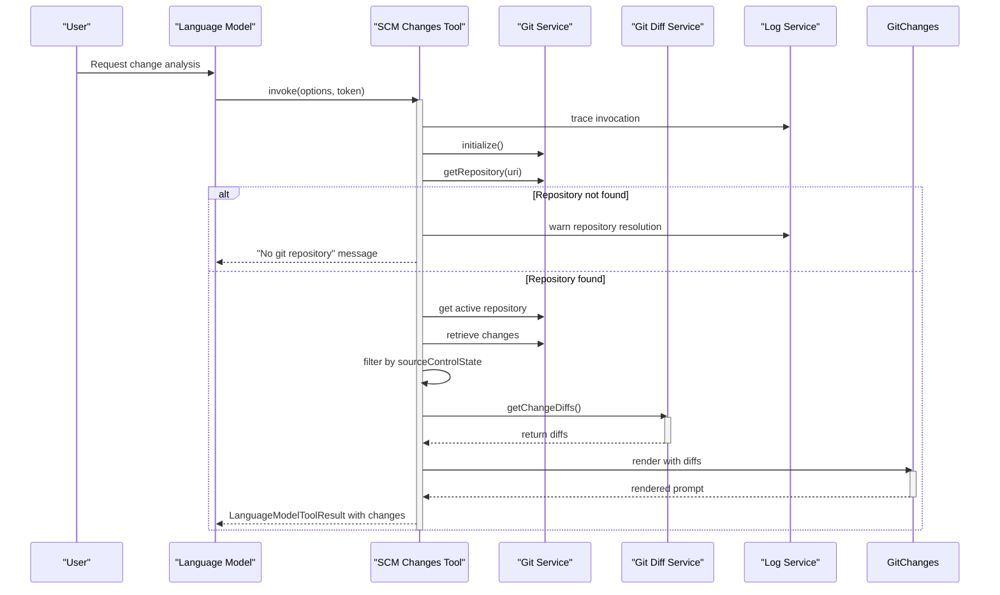
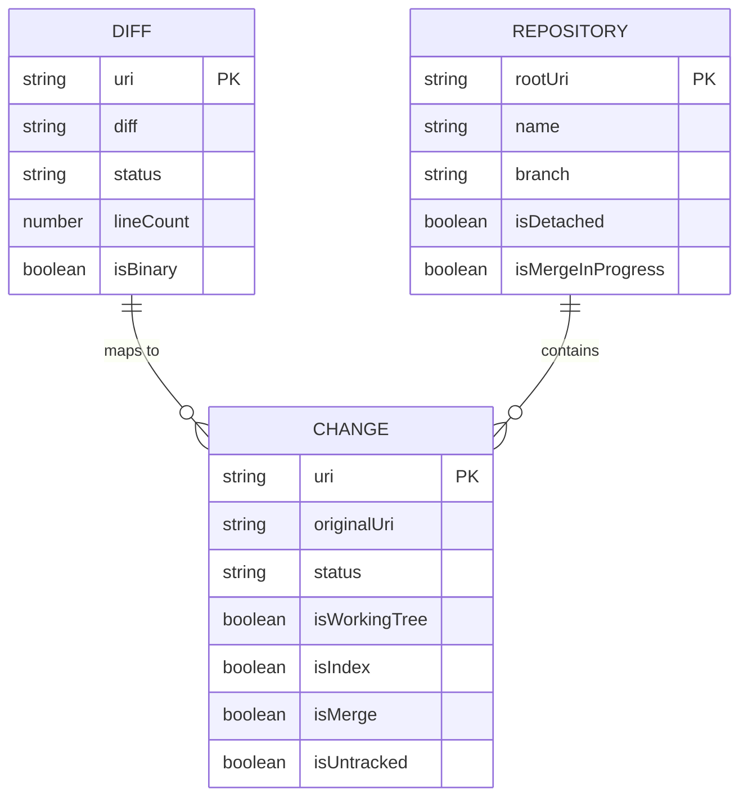
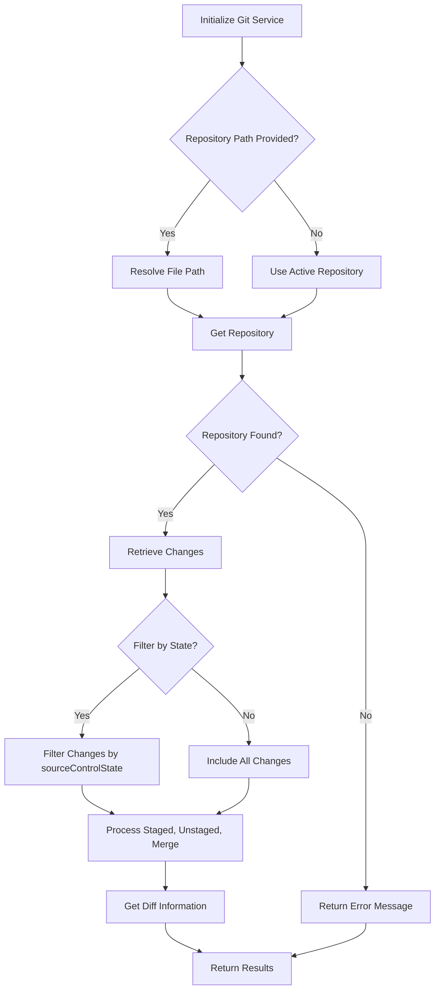
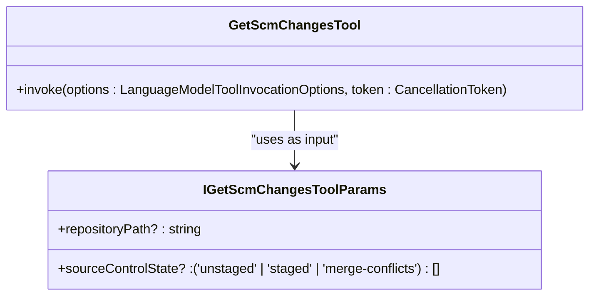
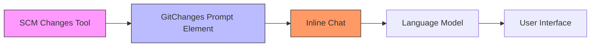
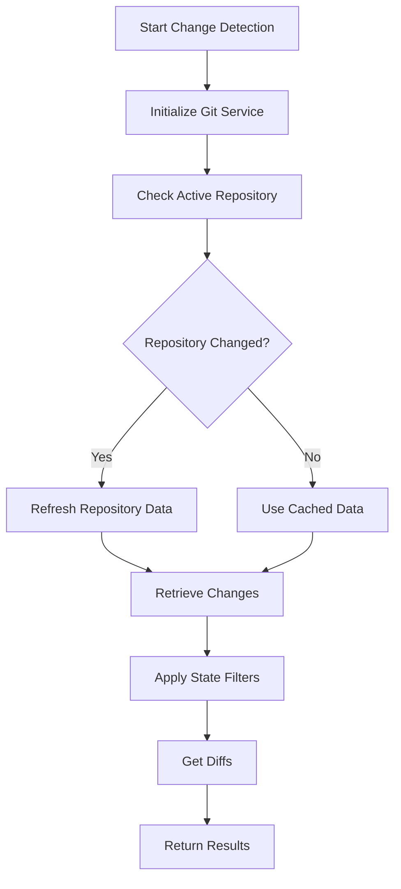

# Change Tracking Tool

<cite>
**Referenced Files in This Document**   
- [scmChangesTool.ts](file://src/extension/tools/node/scmChangesTool.ts)
- [getSearchViewResultsTool.tsx](file://src/extension/tools/node/getSearchViewResultsTool.tsx)
- [gitChanges.tsx](file://src/extension/prompts/node/git/gitChanges.tsx)
- [toolNames.ts](file://src/extension/tools/common/toolNames.ts)
- [toolsRegistry.ts](file://src/extension/tools/common/toolsRegistry.ts)
- [gitDiffService.ts](file://src/platform/git/common/gitDiffService.ts)
- [gitService.ts](file://src/platform/git/common/gitService.ts)
</cite>

## Table of Contents
1. [Introduction](#introduction)
2. [Core Components](#core-components)
3. [Architecture Overview](#architecture-overview)
4. [Detailed Component Analysis](#detailed-component-analysis)
5. [Domain Model for Change Tracking](#domain-model-for-change-tracking)
6. [Integration with VS Code SCM API](#integration-with-vs-code-scm-api)
7. [Configuration Options and Parameters](#configuration-options-and-parameters)
8. [Relationships with Other Components](#relationships-with-other-components)
9. [Performance Considerations](#performance-considerations)
10. [Troubleshooting Guide](#troubleshooting-guide)
11. [Conclusion](#conclusion)

## Introduction
The Change Tracking Tool in GitHub Copilot Chat provides intelligent workspace modification analysis by integrating with VS Code's Source Control Management (SCM) system. This tool enables AI-assisted understanding of code changes by detecting and categorizing file modifications, providing diff information, and maintaining commit context. The implementation centers around the `scmChangesTool.ts` component which works in conjunction with `getSearchViewResultsTool.tsx` to provide comprehensive change visualization and analysis capabilities.

**Section sources**
- [scmChangesTool.ts](file://src/extension/tools/node/scmChangesTool.ts#L1-L141)
- [getSearchViewResultsTool.tsx](file://src/extension/tools/node/getSearchViewResultsTool.tsx#L1-L39)

## Core Components

The Change Tracking Tool consists of two primary components: the SCM Changes Tool for detecting and processing workspace modifications, and the Search View Results Tool for visualizing and accessing search results. These components work together to provide a complete picture of code changes within the development environment.

The SCM Changes Tool implements the `ICopilotTool` interface and is registered in the Tool Registry under the name `GetScmChanges`. It leverages the Git service to access repository information and processes changes based on their state (staged, unstaged, or merge conflicts). The Search View Results Tool complements this functionality by retrieving search results from the VS Code search view, enabling cross-referencing between changes and search findings.

**Section sources**
- [scmChangesTool.ts](file://src/extension/tools/node/scmChangesTool.ts#L27-L140)
- [getSearchViewResultsTool.tsx](file://src/extension/tools/node/getSearchViewResultsTool.tsx#L13-L38)

## Architecture Overview



**Diagram sources**
- [scmChangesTool.ts](file://src/extension/tools/node/scmChangesTool.ts#L31-L140)
- [getSearchViewResultsTool.tsx](file://src/extension/tools/node/getSearchViewResultsTool.tsx#L16-L38)

## Detailed Component Analysis

### SCM Changes Tool Analysis

The SCM Changes Tool is responsible for detecting and processing workspace modifications through integration with Git repositories. It implements a comprehensive change tracking system that can filter changes by state and provide detailed diff information.

#### Implementation Details


**Diagram sources**
- [scmChangesTool.ts](file://src/extension/tools/node/scmChangesTool.ts#L31-L140)
- [gitService.ts](file://src/platform/git/common/gitService.ts)
- [gitDiffService.ts](file://src/platform/git/common/gitDiffService.ts)

**Section sources**
- [scmChangesTool.ts](file://src/extension/tools/node/scmChangesTool.ts#L27-L140)

### Search View Results Tool Analysis

The Search View Results Tool provides integration with VS Code's search functionality, allowing the AI system to access and analyze search results within the context of code changes.

#### Implementation Details


**Diagram sources**
- [getSearchViewResultsTool.tsx](file://src/extension/tools/node/getSearchViewResultsTool.tsx#L13-L38)
- [commands/common/runCommandExecutionService.ts](file://src/platform/commands/common/runCommandExecutionService.ts)

**Section sources**
- [getSearchViewResultsTool.tsx](file://src/extension/tools/node/getSearchViewResultsTool.tsx#L13-L38)

### Change Processing Flow

The process of detecting and presenting changes follows a well-defined sequence that ensures accurate and efficient change tracking.



**Diagram sources**
- [scmChangesTool.ts](file://src/extension/tools/node/scmChangesTool.ts#L39-L104)
- [gitChanges.tsx](file://src/extension/prompts/node/git/gitChanges.tsx#L15-L30)

## Domain Model for Change Tracking

The change tracking system implements a comprehensive domain model that represents various aspects of source control changes, including file status, diff information, and contextual metadata.



The domain model includes the following key entities:

- **Diff**: Represents the textual differences between file versions, including the URI of the changed file, the actual diff content, status information, and metadata about the change.
- **Change**: Represents a file modification in the repository with properties indicating its state (working tree, index, merge, or untracked).
- **Repository**: Represents the Git repository context with information about the root URI, current branch, and repository state.

**Diagram sources**
- [gitDiffService.ts](file://src/platform/git/common/gitDiffService.ts)
- [gitService.ts](file://src/platform/git/common/gitService.ts)
- [scmChangesTool.ts](file://src/extension/tools/node/scmChangesTool.ts)

**Section sources**
- [scmChangesTool.ts](file://src/extension/tools/node/scmChangesTool.ts#L8-L10)
- [gitDiffService.ts](file://src/platform/git/common/gitDiffService.ts)
- [gitService.ts](file://src/platform/git/common/gitService.ts)

## Integration with VS Code SCM API

The Change Tracking Tool integrates deeply with VS Code's Source Control Management (SCM) API to detect and categorize changes in the workspace. This integration enables the tool to access real-time information about file modifications across different states.

### Change Detection and Categorization

The tool categorizes changes into four distinct states:

1. **Unstaged Changes**: Modifications in the working directory that haven't been added to the staging area
2. **Staged Changes**: Changes that have been added to the staging area (index) but not yet committed
3. **Merge Conflicts**: Changes that conflict during a merge operation
4. **Untracked Files**: New files that are not yet under version control

The integration process follows these steps:



When no specific state filter is provided, the tool returns all changes including working tree modifications, index changes, merge conflicts, and untracked files. This comprehensive approach ensures that no modifications are overlooked during analysis.

**Section sources**
- [scmChangesTool.ts](file://src/extension/tools/node/scmChangesTool.ts#L65-L93)

## Configuration Options and Parameters

The Change Tracking Tool supports configurable parameters that allow for flexible change analysis based on specific requirements.

### Input Parameters

The tool accepts the following parameters through the `IGetScmChangesToolParams` interface:

- **repositoryPath**: Optional string specifying the path to the repository to analyze. If not provided, the active repository is used.
- **sourceControlState**: Optional array of strings specifying which types of changes to include. Valid values are 'unstaged', 'staged', and 'merge-conflicts'.



### Default Configuration

When no parameters are provided, the tool uses the following default configuration:

```typescript
{
    repositoryPath: this.gitService.activeRepository.get()?.rootUri.toString(),
    sourceControlState: ['unstaged', 'staged'],
}
```

This default configuration analyzes changes in the active repository, focusing on both unstaged and staged modifications, which represents the most common use case for change tracking.

**Section sources**
- [scmChangesTool.ts](file://src/extension/tools/node/scmChangesTool.ts#L22-L25)
- [scmChangesTool.ts](file://src/extension/tools/node/scmChangesTool.ts#L133-L136)

## Relationships with Other Components

The Change Tracking Tool integrates with several other components in the GitHub Copilot Chat ecosystem to provide enhanced functionality and context awareness.

### Integration with Git Extension

The tool leverages the Git extension for detailed commit information through the `IGitService` and `IGitDiffService` interfaces. This integration allows the tool to:

- Access repository metadata (branch, status, etc.)
- Retrieve detailed diff information for changed files
- Understand the context of changes within the commit history

### Interaction with Inline Chat

The change tracking results are formatted for consumption by the inline chat feature through the `GitChanges` prompt element. This component renders the changes in a format that can be easily understood and referenced by the language model:



The `GitChanges` component processes the diff information and presents it with appropriate formatting, including file references, basename display, and syntax-highlighted diff blocks.

**Section sources**
- [scmChangesTool.ts](file://src/extension/tools/node/scmChangesTool.ts#L101-L103)
- [gitChanges.tsx](file://src/extension/prompts/node/git/gitChanges.tsx#L15-L30)

## Performance Considerations

The Change Tracking Tool implements several performance optimizations to handle various scenarios efficiently, particularly during active development when numerous files may be modified.

### Large Diff Handling

The tool is designed to handle large diffs gracefully by:

- Processing changes incrementally
- Implementing cancellation token support to abort long-running operations
- Using efficient diff retrieval methods through the Git Diff Service

### Optimization During Active Development

During periods of active development with frequent file modifications, the tool optimizes performance by:

- Caching repository information
- Minimizing redundant Git operations
- Using observables for active repository tracking
- Implementing efficient change filtering

The tool also includes comprehensive logging through the `ILogService` to help diagnose performance issues and understand the execution flow.



**Section sources**
- [scmChangesTool.ts](file://src/extension/tools/node/scmChangesTool.ts#L41-L43)
- [scmChangesTool.ts](file://src/extension/tools/node/scmChangesTool.ts#L52-L54)
- [scmChangesTool.ts](file://src/extension/tools/node/scmChangesTool.ts#L100-L104)

## Troubleshooting Guide

This section addresses common issues encountered when using the Change Tracking Tool and provides solutions for resolving them.

### Repository Resolution Issues

**Problem**: The tool cannot resolve the repository path or active repository.

**Solution**: 
- Verify that the workspace contains a valid Git repository
- Ensure the repository path is correctly specified
- Check that the Git extension is properly initialized

The tool logs detailed warnings when repository resolution fails, which can be found in the log service output.

### Empty Change Results

**Problem**: The tool returns "No changed files found" even when modifications exist.

**Solution**:
- Verify the sourceControlState parameter includes the appropriate change types
- Check that files have actually been modified (not just opened)
- Ensure the Git index is up to date

### Performance Issues with Large Repositories

**Problem**: Slow response times when analyzing repositories with many changes.

**Solution**:
- Limit the sourceControlState to specific change types rather than retrieving all changes
- Use repositoryPath to focus on specific subdirectories
- Ensure the Git service is properly optimized for large repositories

**Section sources**
- [scmChangesTool.ts](file://src/extension/tools/node/scmChangesTool.ts#L55-L59)
- [scmChangesTool.ts](file://src/extension/tools/node/scmChangesTool.ts#L95-L96)
- [scmChangesTool.ts](file://src/extension/tools/node/scmChangesTool.ts#L102-L103)

## Conclusion

The Change Tracking Tool in GitHub Copilot Chat provides a robust solution for analyzing workspace modifications through deep integration with VS Code's SCM system. By leveraging the Git service and diff utilities, the tool can accurately detect, categorize, and present changes in a format that enhances AI-assisted development.

The implementation demonstrates a well-structured approach to change tracking with clear separation of concerns, comprehensive error handling, and performance optimizations. The integration with the search view and inline chat features creates a cohesive experience that helps developers understand and navigate code changes effectively.

For developers implementing similar functionality, the key takeaways include:
- Proper use of cancellation tokens for long-running operations
- Comprehensive logging for debugging and monitoring
- Flexible parameterization to support various use cases
- Efficient integration with existing VS Code services
- Thoughtful presentation of change information for AI consumption

The tool serves as an excellent example of how to build effective workspace analysis features that enhance developer productivity through intelligent change tracking.