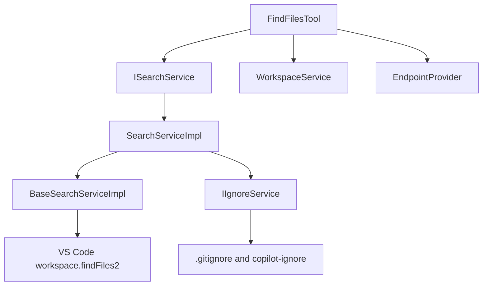
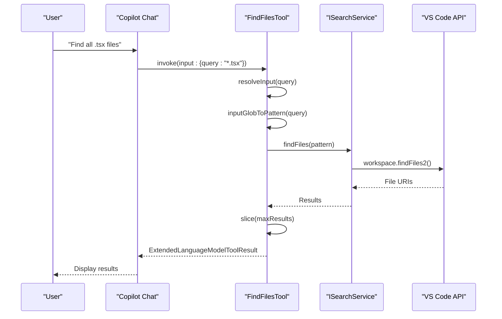
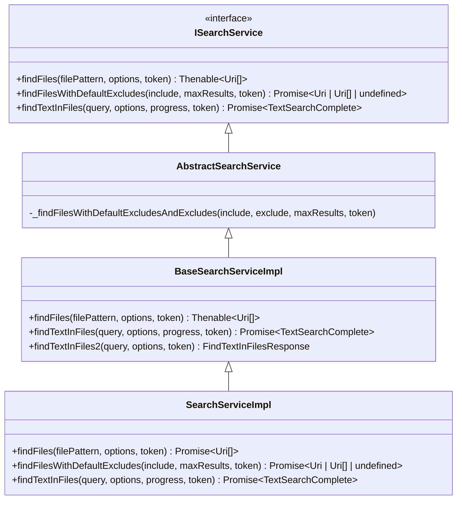
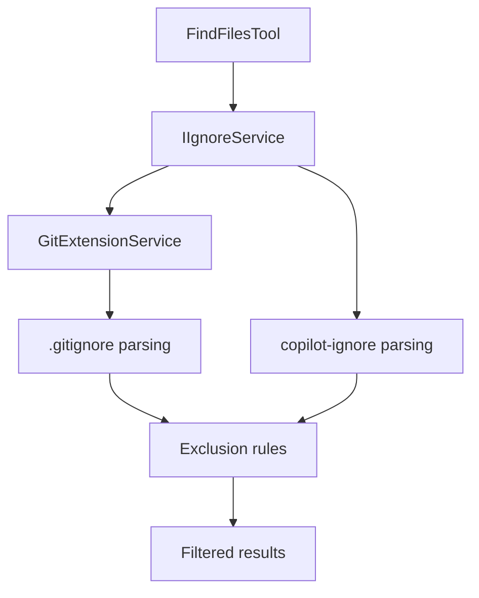

# File Search Tool

<cite>
**Referenced Files in This Document**   
- [findFilesTool.tsx](file://src/extension/tools/node/findFilesTool.tsx)
- [searchServiceImpl.ts](file://src/platform/search/vscode-node/searchServiceImpl.ts)
- [baseSearchServiceImpl.ts](file://src/platform/search/vscode/baseSearchServiceImpl.ts)
- [searchService.ts](file://src/platform/search/common/searchService.ts)
- [toolUtils.ts](file://src/extension/tools/node/toolUtils.ts)
- [ignoreService.ts](file://src/platform/ignore/common/ignoreService.ts)
- [workspaceService.ts](file://src/platform/workspace/common/workspaceService.ts)
- [findFilesTool.stest.ts](file://test/e2e/findFilesTool.stest.ts)
</cite>

## Table of Contents
1. [Introduction](#introduction)
2. [Core Components](#core-components)
3. [Architecture Overview](#architecture-overview)
4. [Detailed Component Analysis](#detailed-component-analysis)
5. [Domain Model for File Search Results](#domain-model-for-file-search-results)
6. [Configuration Options and Parameters](#configuration-options-and-parameters)
7. [Integration with Other Components](#integration-with-other-components)
8. [Performance Considerations and Common Issues](#performance-considerations-and-common-issues)
9. [Conclusion](#conclusion)

## Introduction
The File Search Tool in GitHub Copilot Chat provides a powerful mechanism for discovering files within a workspace using glob patterns. This document details the implementation of the `findFilesTool.tsx`, its integration with VS Code's file search API, and how it handles various search configurations. The tool is designed to support efficient file discovery operations while respecting user-defined exclusions such as `.gitignore` files. It plays a critical role in enabling AI-assisted development by allowing Copilot to locate relevant code files based on natural language queries.

**Section sources**
- [findFilesTool.tsx](file://src/extension/tools/node/findFilesTool.tsx)

## Core Components
The File Search Tool consists of several key components that work together to provide robust file discovery capabilities. At its core, the `FindFilesTool` class implements the `ICopilotTool` interface, enabling it to be invoked as part of Copilot's tool calling system. The tool integrates with VS Code's search service through the `ISearchService` interface, which abstracts the underlying file search functionality. Additional components include utility functions for pattern conversion, services for handling ignored files, and workspace services for resolving file paths.

**Section sources**
- [findFilesTool.tsx](file://src/extension/tools/node/findFilesTool.tsx)
- [searchService.ts](file://src/platform/search/common/searchService.ts)
- [toolUtils.ts](file://src/extension/tools/node/toolUtils.ts)

## Architecture Overview
The File Search Tool follows a layered architecture that separates concerns between tool invocation, search execution, and result processing. The tool receives queries from the Copilot system, processes them through a series of transformations, and delegates the actual search operation to VS Code's workspace search API. The architecture includes service abstractions that allow for dependency injection and testing, with concrete implementations provided for different environments.

**Diagram sources **
- [findFilesTool.tsx](file://src/extension/tools/node/findFilesTool.tsx)
- [searchServiceImpl.ts](file://src/platform/search/vscode-node/searchServiceImpl.ts)
- [baseSearchServiceImpl.ts](file://src/platform/search/vscode/baseSearchServiceImpl.ts)

## Detailed Component Analysis

### FindFilesTool Implementation
The `FindFilesTool` class is responsible for handling file search requests from the Copilot system. It implements the `ICopilotTool` interface, providing methods for invocation and input resolution. When invoked, the tool processes the search query, applies transformations to ensure proper glob pattern formatting, and delegates the search to the `ISearchService`.

**Diagram sources **
- [findFilesTool.tsx](file://src/extension/tools/node/findFilesTool.tsx)
- [toolUtils.ts](file://src/extension/tools/node/toolUtils.ts)

**Section sources**
- [findFilesTool.tsx](file://src/extension/tools/node/findFilesTool.tsx)

### Search Service Hierarchy
The search functionality is implemented through a hierarchy of services that provide abstraction over VS Code's native search capabilities. The `BaseSearchServiceImpl` provides the foundational implementation that directly calls VS Code's `findFiles2` API, while the `SearchServiceImpl` extends this with additional functionality for handling ignored files.

**Diagram sources **
- [searchService.ts](file://src/platform/search/common/searchService.ts)
- [baseSearchServiceImpl.ts](file://src/platform/search/vscode/baseSearchServiceImpl.ts)
- [searchServiceImpl.ts](file://src/platform/search/vscode-node/searchServiceImpl.ts)

**Section sources**
- [searchService.ts](file://src/platform/search/common/searchService.ts)
- [baseSearchServiceImpl.ts](file://src/platform/search/vscode/baseSearchServiceImpl.ts)
- [searchServiceImpl.ts](file://src/platform/search/vscode-node/searchServiceImpl.ts)

## Domain Model for File Search Results
The file search functionality returns results as an array of URI objects, which represent the locations of matching files within the workspace. The domain model includes metadata about the search operation itself, such as the total number of results and the portion of results returned (due to pagination or limits). The `ExtendedLanguageModelToolResult` class wraps the search results and provides additional context for the Copilot system, including a human-readable message about the search outcome.

The `FindFilesResult` component is responsible for rendering the search results in the Copilot interface. It displays the total number of matches and lists the file paths in a format that can be referenced in subsequent interactions. The component also indicates when results are truncated with an ellipsis indicator.

**Section sources**
- [findFilesTool.tsx](file://src/extension/tools/node/findFilesTool.tsx)

## Configuration Options and Parameters
The File Search Tool supports several configuration options that control its behavior:

### Input Parameters
- **query**: The glob pattern to search for files (required)
- **maxResults**: Maximum number of results to return (optional, defaults to 20)

### Search Scope and Filtering
The tool automatically modifies search patterns to ensure comprehensive results:
- Prepends `**/` to queries that don't start with it, ensuring searches across all subdirectories
- Appends `**` to directory queries ending with `/`, searching all files within the directory
- For the GPT-4.1 model family, adds an additional pattern with `/**` appended as a workaround for the model's limitations in pattern completion

### Exclusion Handling
The search respects multiple levels of file exclusions:
- **.gitignore files**: Files matching patterns in .gitignore are excluded by default
- **copilot-ignore files**: Additional files can be excluded through copilot-specific ignore rules
- **VS Code settings**: Workspace and user settings for file exclusions are respected

### Case Sensitivity
The search behavior inherits VS Code's default case sensitivity settings for file searches, which typically follows the case sensitivity of the underlying filesystem.

**Section sources**
- [findFilesTool.tsx](file://src/extension/tools/node/findFilesTool.tsx)
- [toolUtils.ts](file://src/extension/tools/node/toolUtils.ts)
- [searchServiceImpl.ts](file://src/platform/search/vscode-node/searchServiceImpl.ts)

## Integration with Other Components

### Git Integration
The File Search Tool integrates with the Git extension to respect version control exclusions. The `IIgnoreService` component works with the Git service to identify files that should be excluded from search results based on .gitignore rules and other Git-related configurations.

**Diagram sources **
- [ignoreService.ts](file://src/platform/ignore/common/ignoreService.ts)
- [searchServiceImpl.ts](file://src/platform/search/vscode-node/searchServiceImpl.ts)

### Chunking Service Integration
The file search results can be used as input to the chunking service for code analysis. When files are discovered through the search tool, they can be processed by the chunking service to extract meaningful code segments for context in AI responses. This integration enables Copilot to provide relevant code suggestions based on files matching specific patterns.

### Workspace Integration
The tool leverages the `IWorkspaceService` to resolve relative paths and determine workspace structure. This integration allows the tool to handle both absolute and relative file paths correctly, converting them to appropriate glob patterns for searching within the current workspace context.

**Section sources**
- [findFilesTool.tsx](file://src/extension/tools/node/findFilesTool.tsx)
- [workspaceService.ts](file://src/platform/workspace/common/workspaceService.ts)
- [ignoreService.ts](file://src/platform/ignore/common/ignoreService.ts)

## Performance Considerations and Common Issues

### Search Performance Optimization
The File Search Tool implements several strategies to ensure responsive performance:
- **Timeout handling**: Searches are limited to 20 seconds with appropriate error messaging if they time out
- **Result limiting**: Results are capped at a configurable maximum (default 20) to prevent overwhelming the system
- **Caching**: The underlying VS Code search API likely employs caching mechanisms for improved performance on repeated queries

### Handling Special Characters
The tool properly handles special characters in search queries through the use of VS Code's glob pattern syntax. Users can search for files containing special characters by escaping them appropriately in the query string. The `inputGlobToPattern` utility function helps normalize input to ensure proper pattern matching.

### Common Issues and Solutions
1. **No results returned**: This can occur when queries are too specific or when files are excluded by ignore rules. The solution is to use more general patterns or check exclusion configurations.
2. **Slow searches**: Large repositories may experience slow search performance. Using more specific patterns or limiting search scope can improve performance.
3. **Incorrect path resolution**: Issues with relative path resolution can be addressed by ensuring proper workspace configuration and using absolute paths when necessary.

The tool includes error handling for cancellation and timeout scenarios, providing clear feedback to users when searches cannot be completed.

**Section sources**
- [findFilesTool.tsx](file://src/extension/tools/node/findFilesTool.tsx)
- [toolUtils.ts](file://src/extension/tools/node/toolUtils.ts)
- [findFilesTool.stest.ts](file://test/e2e/findFilesTool.stest.ts)

## Conclusion
The File Search Tool in GitHub Copilot Chat provides a robust and flexible mechanism for discovering files within a development workspace. By leveraging VS Code's native search capabilities and extending them with AI-friendly interfaces, the tool enables natural language queries to be translated into effective file discovery operations. The architecture balances performance, usability, and integration with other system components, making it a critical part of the Copilot experience. Through careful handling of glob patterns, respect for exclusion rules, and integration with version control systems, the tool provides reliable file search functionality that supports efficient development workflows.