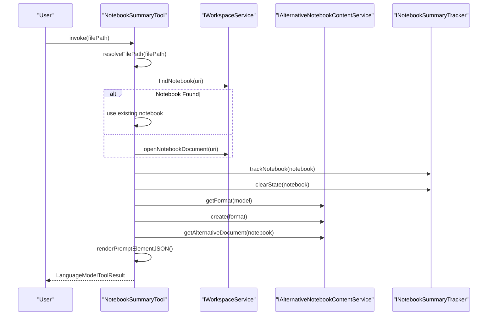
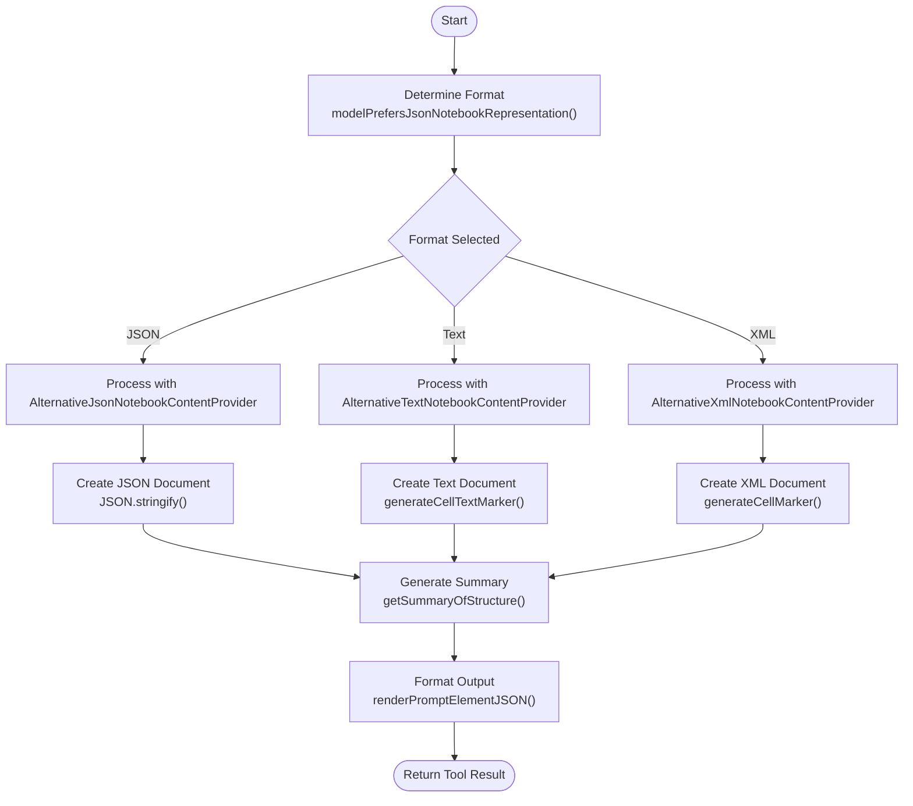
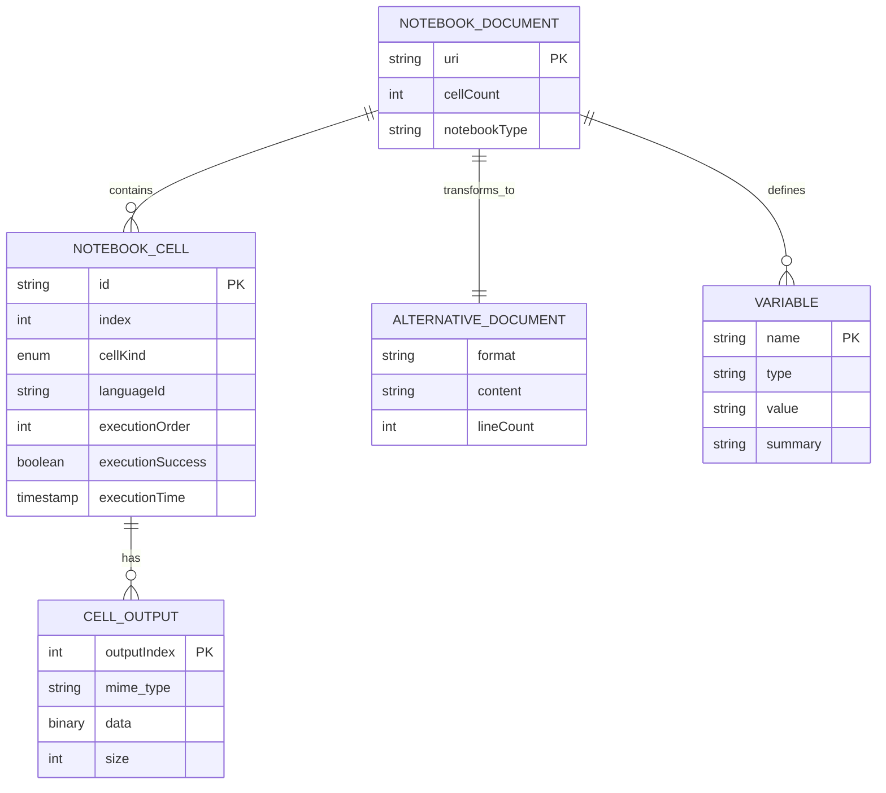

# Notebook Analysis Tool

<cite>
**Referenced Files in This Document**   
- [notebookSummaryTool.tsx](file://src/extension/tools/node/notebookSummaryTool.tsx)
- [alternativeContent.ts](file://src/platform/notebook/common/alternativeContent.ts)
- [alternativeContentProvider.ts](file://src/platform/notebook/common/alternativeContentProvider.ts)
- [alternativeContentProvider.json.ts](file://src/platform/notebook/common/alternativeContentProvider.json.ts)
- [alternativeContentProvider.text.ts](file://src/platform/notebook/common/alternativeContentProvider.text.ts)
- [alternativeContentProvider.xml.ts](file://src/platform/notebook/common/alternativeContentProvider.xml.ts)
- [notebookService.ts](file://src/platform/notebook/common/notebookService.ts)
- [notebooks.ts](file://src/util/common/notebooks.ts)
- [commonPrompts.tsx](file://src/extension/prompts/node/notebook/commonPrompts.tsx)
</cite>

## Table of Contents
1. [Introduction](#introduction)
2. [Core Components](#core-components)
3. [Architecture Overview](#architecture-overview)
4. [Detailed Component Analysis](#detailed-component-analysis)
5. [Domain Model for Notebook Analysis](#domain-model-for-notebook-analysis)
6. [Configuration and Parameters](#configuration-and-parameters)
7. [Integration with VS Code Features](#integration-with-vs-code-features)
8. [Performance and Optimization](#performance-and-optimization)
9. [Troubleshooting Guide](#troubleshooting-guide)
10. [Conclusion](#conclusion)

## Introduction

The Notebook Analysis Tool in GitHub Copilot Chat provides intelligent understanding and summarization of Jupyter notebooks and other notebook formats within VS Code. This tool enables AI-assisted development by extracting and processing notebook content, including cell types, execution metadata, and rich outputs, to generate meaningful summaries for contextual assistance. The system is designed to work seamlessly with VS Code's notebook API, providing developers with enhanced capabilities for understanding complex notebook structures and dependencies.

The tool serves as a bridge between the rich, interactive nature of notebooks and the AI-powered assistance provided by GitHub Copilot. By analyzing notebook content and structure, it enables the AI to understand the context of code execution, data flow, and computational dependencies within notebooks, facilitating more accurate and relevant suggestions and explanations.

**Section sources**
- [notebookSummaryTool.tsx](file://src/extension/tools/node/notebookSummaryTool.tsx#L1-L188)

## Core Components

The Notebook Analysis Tool consists of several core components that work together to extract, process, and summarize notebook content. The primary component is the `NotebookSummaryTool` class, which implements the `ICopilotTool` interface and serves as the entry point for notebook analysis operations. This tool coordinates with various services to retrieve notebook data, generate summaries, and format the output for AI consumption.

The tool leverages the `IAlternativeNotebookContentService` to create alternative representations of notebook content in formats optimized for language models. These alternative representations include XML, text, and JSON formats, each designed to preserve the structural integrity of the notebook while making it more accessible to AI processing. The tool also integrates with the `INotebookSummaryTracker` service to monitor and track notebook usage patterns and structure.

**Section sources**
- [notebookSummaryTool.tsx](file://src/extension/tools/node/notebookSummaryTool.tsx#L31-L188)
- [alternativeContent.ts](file://src/platform/notebook/common/alternativeContent.ts#L1-L90)

## Architecture Overview

```mermaid
graph TB
subgraph "VS Code Notebook API"
Notebook[NotebookDocument]
Cells[NotebookCell[]]
Outputs[Cell Outputs]
end
subgraph "Copilot Chat"
Tool[NotebookSummaryTool]
Tracker[INotebookSummaryTracker]
PathService[IPromptPathRepresentationService]
end
subgraph "Content Processing"
AltService[IAlternativeNotebookContentService]
JsonProvider[AlternativeJsonNotebookContentProvider]
TextProvider[AlternativeTextNotebookContentProvider]
XmlProvider[AlternativeXmlNotebookContentProvider]
end
subgraph "Data Flow"
Notebook --> Tool
Tool --> AltService
AltService --> JsonProvider
AltService --> TextProvider
AltService --> XmlProvider
JsonProvider --> Summary
TextProvider --> Summary
XmlProvider --> Summary
Summary --> AIContext
end
style Tool fill:#f9f,stroke:#333
style AltService fill:#bbf,stroke:#333
```

**Diagram sources**
- [notebookSummaryTool.tsx](file://src/extension/tools/node/notebookSummaryTool.tsx#L1-L188)
- [alternativeContent.ts](file://src/platform/notebook/common/alternativeContent.ts#L1-L90)
- [alternativeContentProvider.ts](file://src/platform/notebook/common/alternativeContentProvider.ts#L1-L42)

## Detailed Component Analysis

### Notebook Summary Tool Implementation

The `NotebookSummaryTool` class implements the core functionality for analyzing and summarizing notebook content. When invoked, it first validates the input file path and resolves it to a notebook URI. It then checks whether the target file is a valid notebook document, throwing an error if the file is not a notebook format.



**Diagram sources**
- [notebookSummaryTool.tsx](file://src/extension/tools/node/notebookSummaryTool.tsx#L45-L90)
- [notebooks.ts](file://src/util/common/notebooks.ts#L60-L62)

### Alternative Content Providers

The system implements three alternative content providers to handle different notebook representation formats: JSON, text, and XML. Each provider inherits from the `BaseAlternativeNotebookContentProvider` abstract class and implements the required methods for content processing.

```mermaid
classDiagram
class BaseAlternativeNotebookContentProvider {
<<abstract>>
+kind : 'xml' | 'text' | 'json'
+stripCellMarkers(text : string) : string
+getAlternativeDocument(notebook : NotebookDocument) : AlternativeNotebookDocument
+getSummaryOfStructure(notebook : NotebookDocument, cellsToInclude : NotebookCell[]) : string
+parseAlternateContent(notebookOrUri : NotebookDocument | Uri, inputStream : AsyncIterable~LineOfText~) : AsyncIterable~LineOfCellText~
}
class AlternativeJsonNotebookContentProvider {
+stripCellMarkers(text : string) : string
+getAlternativeDocument(notebook : NotebookDocument) : AlternativeNotebookDocument
+getSummaryOfStructure(notebook : NotebookDocument, cellsToInclude : NotebookCell[]) : string
+parseAlternateContent(notebookOrUri : NotebookDocument | Uri, inputStream : AsyncIterable~LineOfText~) : AsyncIterable~LineOfCellText~
}
class AlternativeTextNotebookContentProvider {
+stripCellMarkers(text : string) : string
+getAlternativeDocument(notebook : NotebookDocument) : AlternativeNotebookDocument
+getSummaryOfStructure(notebook : NotebookDocument, cellsToInclude : NotebookCell[]) : string
+parseAlternateContent(notebookOrUri : NotebookDocument | Uri, inputStream : AsyncIterable~LineOfText~) : AsyncIterable~LineOfCellText~
}
class AlternativeXmlNotebookContentProvider {
+stripCellMarkers(text : string) : string
+getAlternativeDocument(notebook : NotebookDocument) : AlternativeNotebookDocument
+getSummaryOfStructure(notebook : NotebookDocument, cellsToInclude : NotebookCell[]) : string
+parseAlternateContent(notebookOrUri : NotebookDocument | Uri, inputStream : AsyncIterable~LineOfText~) : AsyncIterable~LineOfCellText~
}
BaseAlternativeNotebookContentProvider <|-- AlternativeJsonNotebookContentProvider
BaseAlternativeNotebookContentProvider <|-- AlternativeTextNotebookContentProvider
BaseAlternativeNotebookContentProvider <|-- AlternativeXmlNotebookContentProvider
```



**Diagram sources**
- [alternativeContentProvider.ts](file://src/platform/notebook/common/alternativeContentProvider.ts#L12-L42)
- [alternativeContentProvider.json.ts](file://src/platform/notebook/common/alternativeContentProvider.json.ts#L54-L263)
- [alternativeContentProvider.text.ts](file://src/platform/notebook/common/alternativeContentProvider.text.ts#L54-L244)
- [alternativeContentProvider.xml.ts](file://src/platform/notebook/common/alternativeContentProvider.xml.ts#L59-L205)

### Content Processing Pipeline

The content processing pipeline transforms notebook data into AI-friendly representations through a series of coordinated operations. The pipeline begins with format detection, where the system determines the appropriate representation format based on the language model's capabilities and configuration settings.



**Diagram sources**
- [alternativeContent.ts](file://src/platform/notebook/common/alternativeContent.ts#L64-L75)
- [alternativeContentProvider.json.ts](file://src/platform/notebook/common/alternativeContentProvider.json.ts#L67-L86)
- [alternativeContentProvider.text.ts](file://src/platform/notebook/common/alternativeContentProvider.text.ts#L189-L202)
- [alternativeContentProvider.xml.ts](file://src/platform/notebook/common/alternativeContentProvider.xml.ts#L175-L187)

**Section sources**
- [alternativeContent.ts](file://src/platform/notebook/common/alternativeContent.ts#L1-L90)
- [alternativeContentProvider.json.ts](file://src/platform/notebook/common/alternativeContentProvider.json.ts#L1-L263)
- [alternativeContentProvider.text.ts](file://src/platform/notebook/common/alternativeContentProvider.text.ts#L1-L244)
- [alternativeContentProvider.xml.ts](file://src/platform/notebook/common/alternativeContentProvider.xml.ts#L1-L205)

## Domain Model for Notebook Analysis

The domain model for notebook analysis encompasses several key entities that represent the structure and content of notebooks. The primary entity is the `NotebookDocument`, which contains a collection of `NotebookCell` objects. Each cell has properties that define its type, content, execution metadata, and outputs.

The system also defines an `AlternativeNotebookDocument` class that represents a transformed version of the notebook optimized for AI processing. This class includes methods for converting between cell positions in the original notebook and positions in the alternative representation, enabling bidirectional navigation between the two formats.

The analysis results include information about cell types (code or markdown), execution order, output types, and dependencies between cells. The system tracks execution counts and timing information to determine the order in which cells were executed, which is crucial for understanding data flow and computational dependencies.



**Diagram sources**
- [notebookSummaryTool.tsx](file://src/extension/tools/node/notebookSummaryTool.tsx#L140-L187)
- [notebookService.ts](file://src/platform/notebook/common/notebookService.ts#L10-L27)
- [vscodeTypes.ts](file://src/vscodeTypes.ts)

**Section sources**
- [notebookSummaryTool.tsx](file://src/extension/tools/node/notebookSummaryTool.tsx#L140-L187)
- [notebookService.ts](file://src/platform/notebook/common/notebookService.ts#L10-L44)

## Configuration and Parameters

The Notebook Analysis Tool supports various configuration options that control its behavior and output. These configurations include content inclusion/exclusion rules, summary depth, and output formatting preferences. The tool also accepts parameters for query filtering and return value patterns that influence how notebook analysis results are generated.

The `INotebookSummaryToolParams` interface defines the input parameters for the tool, currently consisting of a `filePath` property that specifies the notebook to analyze. The tool uses tokenization options to control the amount of content included in the summary, with a default token budget of 1000 tokens and a simple character-based token counting function.

Configuration settings are managed through the `IConfigurationService` and can be influenced by experimentation flags via the `IExperimentationService`. The system determines the preferred alternative content format based on the language model's capabilities, with JSON format preferred for models that support advanced features like apply_patch operations.

**Section sources**
- [notebookSummaryTool.tsx](file://src/extension/tools/node/notebookSummaryTool.tsx#L27-L29)
- [alternativeContent.ts](file://src/platform/notebook/common/alternativeContent.ts#L50-L75)

## Integration with VS Code Features

The Notebook Analysis Tool integrates closely with various VS Code features to provide contextual assistance and enhance the development experience. It works with the chat panel to provide AI-powered explanations and suggestions based on notebook content, enabling users to ask questions about specific cells or the overall notebook structure.

The tool also interacts with the inline chat feature, allowing users to query specific cells directly from the notebook interface. This integration enables cell-specific queries and suggestions, making it easier to understand and modify individual components of a notebook without losing context.

The system tracks notebook usage through the `INotebookSummaryTracker` service, which monitors which notebooks are being analyzed and how frequently. This information can be used to optimize performance and prioritize resources for frequently accessed notebooks.

**Section sources**
- [notebookSummaryTool.tsx](file://src/extension/tools/node/notebookSummaryTool.tsx#L40-L41)
- [commonPrompts.tsx](file://src/extension/prompts/node/notebook/commonPrompts.tsx)

## Performance and Optimization

The Notebook Analysis Tool includes several performance optimizations to handle large notebooks and complex content efficiently. The system uses tokenization options to limit the amount of content processed, preventing excessive memory usage and processing time. The default token budget of 1000 tokens ensures that summaries remain concise while still providing meaningful context.

For large notebooks, the tool processes content incrementally rather than loading the entire notebook into memory at once. This approach reduces memory pressure and allows the tool to handle notebooks of arbitrary size. The alternative content providers are designed to generate representations on-demand, minimizing the overhead of content transformation.

The system also includes error handling and recovery mechanisms to deal with issues like missing files, corrupted notebook data, or network interruptions. When errors occur during notebook processing, the tool provides informative error messages that help users diagnose and resolve the underlying issues.

**Section sources**
- [notebookSummaryTool.tsx](file://src/extension/tools/node/notebookSummaryTool.tsx#L59-L64)
- [notebookSummaryTool.tsx](file://src/extension/tools/node/notebookSummaryTool.tsx#L82-L85)

## Troubleshooting Guide

Common issues with the Notebook Analysis Tool typically involve file access problems, format compatibility issues, or configuration errors. When the tool fails to open a notebook, the most common causes are invalid file paths, missing files, or insufficient permissions. The error message "Failed to open the notebook" indicates that the system was unable to access the specified file.

Another common issue is attempting to use the tool with non-notebook files. The tool validates that the target file is a notebook format before proceeding with analysis, throwing an error if the file is not a supported notebook type. Users should ensure they are targeting valid notebook files (typically with .ipynb extension for Jupyter notebooks).

Performance issues with large notebooks can be addressed by adjusting the tokenization options or by excluding markdown cells from the analysis. The system provides configuration options to control the alternative content format, which can impact processing speed and memory usage.

**Section sources**
- [notebookSummaryTool.tsx](file://src/extension/tools/node/notebookSummaryTool.tsx#L49-L58)
- [notebookSummaryTool.tsx](file://src/extension/tools/node/notebookSummaryTool.tsx#L61-L64)

## Conclusion

The Notebook Analysis Tool in GitHub Copilot Chat provides a sophisticated system for understanding and summarizing notebook content, enabling AI-assisted development within the VS Code environment. By leveraging the VS Code notebook API and implementing multiple alternative content representations, the tool can effectively process various notebook formats and provide meaningful context for AI operations.

The architecture demonstrates a well-designed separation of concerns, with distinct components for content processing, format transformation, and result generation. The system's flexibility in handling different representation formats (JSON, text, XML) ensures compatibility with various language models and use cases.

For developers, the tool offers valuable insights into notebook structure and execution flow, facilitating better understanding of complex computational workflows. The integration with VS Code's chat and inline chat features provides seamless access to AI-powered assistance, enhancing productivity and code quality in notebook-based development.