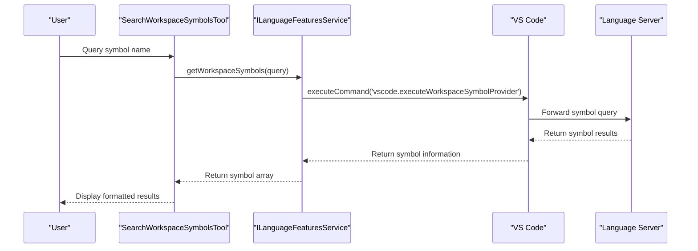
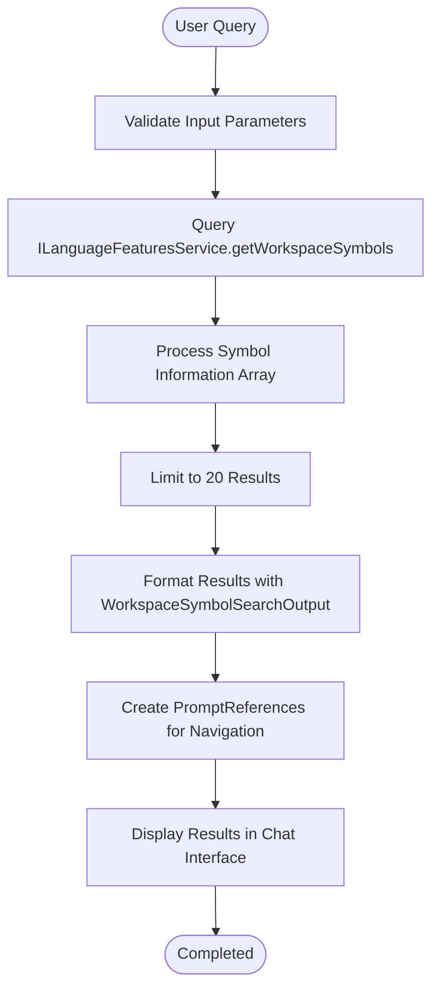

# Symbol Search Tool

<cite>
**Referenced Files in This Document**   
- [searchWorkspaceSymbolsTool.tsx](file://src/extension/tools/node/searchWorkspaceSymbolsTool.tsx)
- [languageFeaturesService.ts](file://src/platform/languages/common/languageFeaturesService.ts)
- [languageFeaturesServicesImpl.ts](file://src/platform/languages/vscode/languageFeaturesServicesImpl.ts)
- [toolNames.ts](file://src/extension/tools/common/toolNames.ts)
- [findSymbol.ts](file://src/extension/linkify/vscode-node/findSymbol.ts)
- [promptRenderer.ts](file://src/extension/prompts/node/base/promptRenderer.ts)
</cite>

## Table of Contents
1. [Introduction](#introduction)
2. [Core Implementation](#core-implementation)
3. [Invocation and Integration](#invocation-and-integration)
4. [Domain Model for Symbol Search Results](#domain-model-for-symbol-search-results)
5. [Query Processing and Result Handling](#query-processing-and-result-handling)
6. [Configuration and Filtering Options](#configuration-and-filtering-options)
7. [Integration with Other Components](#integration-with-other-components)
8. [Performance Considerations](#performance-considerations)
9. [Common Issues and Solutions](#common-issues-and-solutions)
10. [Conclusion](#conclusion)

## Introduction
The Symbol Search Tool in GitHub Copilot Chat provides developers with an efficient way to discover symbols across their workspace using natural language queries. This tool leverages VS Code's language server capabilities to perform comprehensive symbol searches, returning relevant results that include functions, classes, variables, and other code elements. The implementation is designed to integrate seamlessly with the Copilot Chat interface, providing contextual assistance and code navigation capabilities. The tool supports fuzzy matching, scope filtering, and handles large codebases efficiently, making it a powerful asset for developers working on complex projects.

## Core Implementation

The Symbol Search Tool is implemented as a language model tool that integrates with VS Code's workspace symbol provider API. The core implementation resides in `searchWorkspaceSymbolsTool.tsx`, where the `SearchWorkspaceSymbolsTool` class implements the `vscode.LanguageModelTool` interface. This tool is registered with the `ToolRegistry` and uses dependency injection to access the `ILanguageFeaturesService` for symbol queries. The implementation follows a clean separation of concerns, with the tool handling the invocation logic and a separate `WorkspaceSymbolSearchOutput` component responsible for rendering the results in a user-friendly format.

**Section sources**
- [searchWorkspaceSymbolsTool.tsx](file://src/extension/tools/node/searchWorkspaceSymbolsTool.tsx#L24-L58)

## Invocation and Integration

The Symbol Search Tool integrates with VS Code's symbol provider API through the `ILanguageFeaturesService` interface. When invoked, the tool calls the `getWorkspaceSymbols` method with the user's query string, which in turn executes the `vscode.executeWorkspaceSymbolProvider` command. This command delegates to the appropriate language server based on the file types in the workspace. The integration follows a dependency injection pattern, with the `LanguageFeaturesServiceImpl` providing the concrete implementation that bridges the Copilot tool with VS Code's native symbol search capabilities.

**Diagram sources**
- [searchWorkspaceSymbolsTool.tsx](file://src/extension/tools/node/searchWorkspaceSymbolsTool.tsx#L33-L34)
- [languageFeaturesServicesImpl.ts](file://src/platform/languages/vscode/languageFeaturesServicesImpl.ts#L27-L28)

## Domain Model for Symbol Search Results

The domain model for symbol search results is based on VS Code's `SymbolInformation` interface, which includes key properties such as symbol name, location, container name, and symbol kind. The `SymbolInformation` type provides comprehensive metadata about each symbol, including its name, kind (function, class, variable, etc.), location within the file, and the name of the container that holds the symbol (such as a class or namespace). The tool processes these results to extract the most relevant information for display, including the file path, line range, and hierarchical context of each symbol.

**Section sources**
- [searchWorkspaceSymbolsTool.tsx](file://src/extension/tools/node/searchWorkspaceSymbolsTool.tsx#L65-L66)
- [languageFeaturesService.ts](file://src/platform/languages/common/languageFeaturesService.ts#L16-L16)

## Query Processing and Result Handling

The Symbol Search Tool processes queries through a multi-step pipeline that begins with the user's input and ends with formatted results displayed in the chat interface. When a query is received, the tool first invokes the language features service to retrieve symbol information from the workspace. The results are then processed by the `WorkspaceSymbolSearchOutput` component, which formats them for display. The tool implements result limiting, showing a maximum of 20 results with an indication when additional results are omitted. The rendering process includes creating references to the symbol locations, allowing users to navigate directly to the code from the chat interface.

**Diagram sources**
- [searchWorkspaceSymbolsTool.tsx](file://src/extension/tools/node/searchWorkspaceSymbolsTool.tsx#L76-L92)

## Configuration and Filtering Options

The Symbol Search Tool supports various configuration options that allow users to refine their searches. While the core implementation focuses on symbol name queries, the underlying VS Code symbol provider supports additional filtering capabilities such as symbol kind filtering, case sensitivity, and search scope. The tool leverages VS Code's fuzzy search capabilities, allowing users to find symbols even with partial or approximate names. The `findSymbol.ts` utility demonstrates the fuzzy matching algorithm used in related components, which searches for symbol parts in order but allows for separation by layers in the symbol hierarchy.

**Section sources**
- [searchWorkspaceSymbolsTool.tsx](file://src/extension/tools/node/searchWorkspaceSymbolsTool.tsx#L20-L22)
- [findSymbol.ts](file://src/extension/linkify/vscode-node/findSymbol.ts#L56-L61)

## Integration with Other Components

The Symbol Search Tool integrates with several other components in the GitHub Copilot ecosystem. It works closely with the language context provider to understand the code structure and provide more relevant search results. The tool also interacts with the inline chat feature, allowing users to search for symbols directly from the editor context. The results are rendered using the prompt rendering system, which converts the symbol information into a format suitable for display in the chat interface. The integration with the `PromptRenderer` system allows for rich formatting of results, including clickable references that navigate to the symbol locations.

**Section sources**
- [searchWorkspaceSymbolsTool.tsx](file://src/extension/tools/node/searchWorkspaceSymbolsTool.tsx#L36-L37)
- [promptRenderer.ts](file://src/extension/prompts/node/base/promptRenderer.ts#L161-L223)

## Performance Considerations

The Symbol Search Tool is designed with performance in mind, particularly when handling large codebases. The implementation includes several optimization strategies to ensure responsive search results. The tool limits the number of displayed results to 20, preventing performance issues when searching large projects with thousands of symbols. The integration with VS Code's native symbol provider leverages the language server's indexing capabilities, which are optimized for fast symbol lookup. The tool also uses cancellation tokens to allow users to abort long-running searches, and implements efficient result processing to minimize rendering time.

**Section sources**
- [searchWorkspaceSymbolsTool.tsx](file://src/extension/tools/node/searchWorkspaceSymbolsTool.tsx#L81-L82)

## Common Issues and Solutions

Common issues with symbol search in large projects include slow response times, incomplete results, and difficulty finding symbols in specific contexts. The Symbol Search Tool addresses these issues through several mechanisms. For performance optimization, the tool limits result display and leverages VS Code's indexed search capabilities. To improve result relevance, the tool uses the container name information to provide context about where symbols are defined. For cases where symbols are not found, the fuzzy matching algorithm helps users locate symbols even with incomplete or approximate names. The integration with language servers ensures that symbols are found according to language-specific rules and scoping.

**Section sources**
- [searchWorkspaceSymbolsTool.tsx](file://src/extension/tools/node/searchWorkspaceSymbolsTool.tsx#L77-L78)
- [findSymbol.ts](file://src/extension/linkify/vscode-node/findSymbol.ts#L67-L70)

## Conclusion
The Symbol Search Tool in GitHub Copilot Chat provides a robust and efficient way to discover symbols across a codebase. By leveraging VS Code's language server capabilities and implementing thoughtful performance optimizations, the tool delivers fast and relevant results even in large projects. The clean separation of concerns in the implementation allows for easy maintenance and extension, while the integration with the chat interface provides a seamless user experience. The tool's support for fuzzy matching and contextual information makes it a valuable asset for developers navigating complex codebases, and its extensible design allows for future enhancements to meet evolving developer needs.