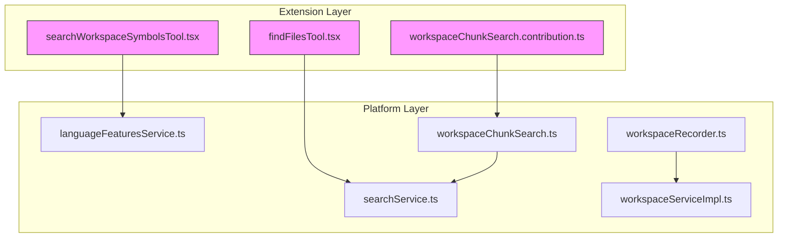
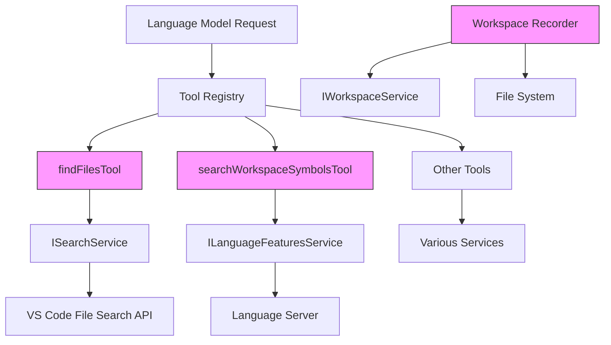
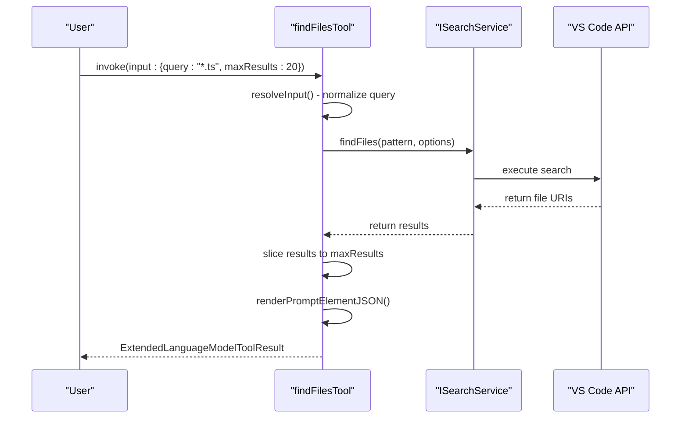
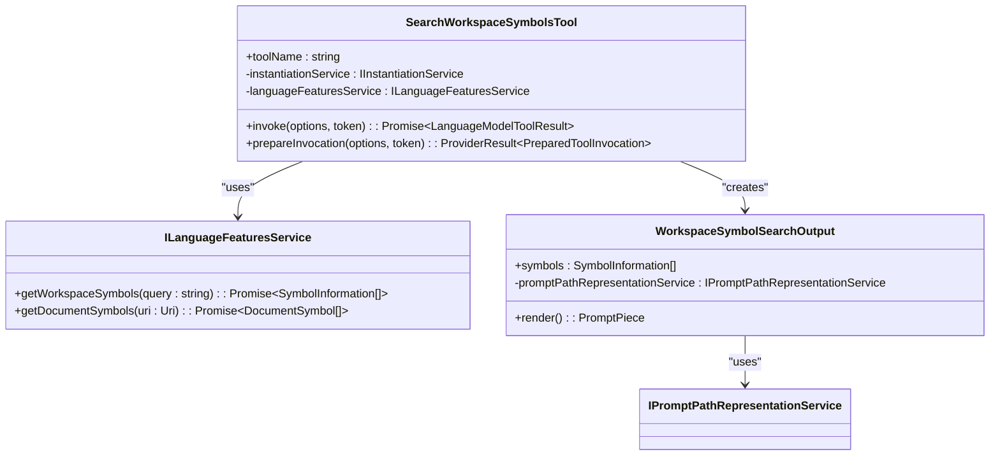
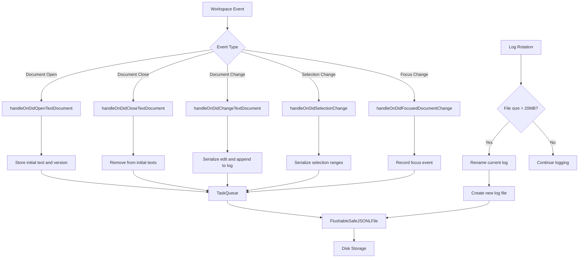
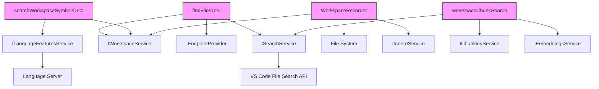

# Workspace Operations Tools

<cite>
**Referenced Files in This Document**   
- [findFilesTool.tsx](file://src/extension/tools/node/findFilesTool.tsx)
- [searchWorkspaceSymbolsTool.tsx](file://src/extension/tools/node/searchWorkspaceSymbolsTool.tsx)
- [workspaceServiceImpl.ts](file://src/platform/workspace/vscode/workspaceServiceImpl.ts)
- [workspaceChunkSearch.ts](file://src/platform/workspaceChunkSearch/common/workspaceChunkSearch.ts)
- [searchService.ts](file://src/platform/search/common/searchService.ts)
- [workspaceRecorder.ts](file://src/extension/workspaceRecorder/vscode-node/workspaceRecorder.ts)
- [toolUtils.ts](file://src/extension/tools/node/toolUtils.ts)
- [languageFeaturesService.ts](file://src/platform/languages/common/languageFeaturesService.ts)
- [workspaceChunkSearch.contribution.ts](file://src/extension/workspaceChunkSearch/vscode-node/workspaceChunkSearch.contribution.ts)
</cite>

## Table of Contents
1. [Introduction](#introduction)
2. [Project Structure](#project-structure)
3. [Core Components](#core-components)
4. [Architecture Overview](#architecture-overview)
5. [Detailed Component Analysis](#detailed-component-analysis)
6. [Dependency Analysis](#dependency-analysis)
7. [Performance Considerations](#performance-considerations)
8. [Troubleshooting Guide](#troubleshooting-guide)
9. [Conclusion](#conclusion)

## Introduction
The Workspace Operations Tools in GitHub Copilot Chat provide essential functionality for workspace search, symbol lookup, and change tracking. These tools enable developers to efficiently navigate and analyze codebases by integrating with VS Code's native search APIs and language servers. The implementation follows a modular architecture with clear separation between tool interfaces, search services, and workspace state management. This document explains the domain model, invocation relationships, and integration points of these workspace operations, providing both conceptual understanding and technical depth for developers implementing efficient workspace analysis operations.

## Project Structure
The workspace operations tools are organized in a layered architecture with clear separation of concerns. The core tools reside in the `src/extension/tools/node/` directory, while supporting services are distributed across platform-specific modules. The workspace search functionality is implemented through dedicated tool classes that interface with underlying search services, while change tracking is handled by the workspace recorder component. Configuration and contribution points are managed through the extension's contribution system.

**Diagram sources**
- [findFilesTool.tsx](file://src/extension/tools/node/findFilesTool.tsx)
- [searchWorkspaceSymbolsTool.tsx](file://src/extension/tools/node/searchWorkspaceSymbolsTool.tsx)
- [workspaceChunkSearch.contribution.ts](file://src/extension/workspaceChunkSearch/vscode-node/workspaceChunkSearch.contribution.ts)
- [searchService.ts](file://src/platform/search/common/searchService.ts)
- [languageFeaturesService.ts](file://src/platform/languages/common/languageFeaturesService.ts)
- [workspaceServiceImpl.ts](file://src/platform/workspace/vscode/workspaceServiceImpl.ts)
- [workspaceRecorder.ts](file://src/extension/workspaceRecorder/vscode-node/workspaceRecorder.ts)
- [workspaceChunkSearch.ts](file://src/platform/workspaceChunkSearch/common/workspaceChunkSearch.ts)

**Section sources**
- [findFilesTool.tsx](file://src/extension/tools/node/findFilesTool.tsx)
- [searchWorkspaceSymbolsTool.tsx](file://src/extension/tools/node/searchWorkspaceSymbolsTool.tsx)
- [workspaceChunkSearch.contribution.ts](file://src/extension/workspaceChunkSearch/vscode-node/workspaceChunkSearch.contribution.ts)

## Core Components
The workspace operations tools consist of three primary components: file search, symbol lookup, and workspace state tracking. The file search tool integrates with VS Code's file search API to locate files matching glob patterns, while the symbol lookup tool queries the language server for workspace symbols. The workspace recorder maintains a detailed log of user interactions and document changes, enabling comprehensive workspace state tracking. These components work together to provide a rich context for AI-assisted development, with each tool following a consistent interface pattern for invocation and result handling.

**Section sources**
- [findFilesTool.tsx](file://src/extension/tools/node/findFilesTool.tsx)
- [searchWorkspaceSymbolsTool.tsx](file://src/extension/tools/node/searchWorkspaceSymbolsTool.tsx)
- [workspaceRecorder.ts](file://src/extension/workspaceRecorder/vscode-node/workspaceRecorder.ts)

## Architecture Overview
The workspace operations architecture follows a service-oriented design with clear separation between tool interfaces and underlying implementation services. Tools are registered through a central registry and invoked through a standardized interface that handles parameter resolution, execution, and result formatting. The architecture leverages dependency injection to provide access to platform services such as search, language features, and workspace management. This design enables extensibility while maintaining consistency across different tool implementations.

**Diagram sources**
- [findFilesTool.tsx](file://src/extension/tools/node/findFilesTool.tsx)
- [searchWorkspaceSymbolsTool.tsx](file://src/extension/tools/node/searchWorkspaceSymbolsTool.tsx)
- [workspaceRecorder.ts](file://src/extension/workspaceRecorder/vscode-node/workspaceRecorder.ts)
- [searchService.ts](file://src/platform/search/common/searchService.ts)
- [languageFeaturesService.ts](file://src/platform/languages/common/languageFeaturesService.ts)
- [workspaceServiceImpl.ts](file://src/platform/workspace/vscode/workspaceServiceImpl.ts)

## Detailed Component Analysis

### File Search Tool Analysis
The file search tool provides workspace file search capabilities by integrating with VS Code's native file search functionality. It accepts a query pattern and optional maximum results parameter, then invokes the search service to locate matching files. The tool handles both simple filename queries and complex glob patterns, automatically resolving relative paths and applying workspace-specific exclusions. Results are formatted as a structured prompt element that includes file references and metadata.

**Diagram sources**
- [findFilesTool.tsx](file://src/extension/tools/node/findFilesTool.tsx)
- [searchService.ts](file://src/platform/search/common/searchService.ts)

**Section sources**
- [findFilesTool.tsx](file://src/extension/tools/node/findFilesTool.tsx)
- [toolUtils.ts](file://src/extension/tools/node/toolUtils.ts)

### Symbol Lookup Tool Analysis
The symbol lookup tool enables searching for symbols across the entire workspace by leveraging the language server's workspace symbol provider. It accepts a symbol name query and returns matching symbol information including location, container name, and range details. The tool integrates with the language features service to access symbol data, then formats results with contextual information such as file paths and line numbers. This enables precise navigation to symbol definitions and references.

**Diagram sources**
- [searchWorkspaceSymbolsTool.tsx](file://src/extension/tools/node/searchWorkspaceSymbolsTool.tsx)
- [languageFeaturesService.ts](file://src/platform/languages/common/languageFeaturesService.ts)

**Section sources**
- [searchWorkspaceSymbolsTool.tsx](file://src/extension/tools/node/searchWorkspaceSymbolsTool.tsx)
- [languageFeaturesService.ts](file://src/platform/languages/common/languageFeaturesService.ts)

### Workspace State Tracking Analysis
The workspace recorder component provides comprehensive change tracking by monitoring various workspace events including document opens, closes, changes, and selections. It maintains a detailed log of user interactions in a JSONL format, capturing timestamps, document states, and edit operations. The recorder implements a task queue to ensure thread-safe logging and includes mechanisms for log rotation when files exceed size limits. This detailed tracking enables replay and analysis of development workflows.

**Diagram sources**
- [workspaceRecorder.ts](file://src/extension/workspaceRecorder/vscode-node/workspaceRecorder.ts)

**Section sources**
- [workspaceRecorder.ts](file://src/extension/workspaceRecorder/vscode-node/workspaceRecorder.ts)

## Dependency Analysis
The workspace operations tools have well-defined dependencies on platform services and external APIs. The file search tool depends on the search service, which in turn interfaces with VS Code's file search API. The symbol lookup tool relies on the language features service to access language server capabilities. Both tools use the workspace service for path resolution and workspace context. The workspace recorder depends on the file system for log storage and the workspace service for document management. These dependencies are managed through dependency injection, ensuring loose coupling and testability.

**Diagram sources**
- [findFilesTool.tsx](file://src/extension/tools/node/findFilesTool.tsx)
- [searchWorkspaceSymbolsTool.tsx](file://src/extension/tools/node/searchWorkspaceSymbolsTool.tsx)
- [workspaceRecorder.ts](file://src/extension/workspaceRecorder/vscode-node/workspaceRecorder.ts)
- [workspaceChunkSearch.ts](file://src/platform/workspaceChunkSearch/common/workspaceChunkSearch.ts)
- [searchService.ts](file://src/platform/search/common/searchService.ts)
- [languageFeaturesService.ts](file://src/platform/languages/common/languageFeaturesService.ts)
- [workspaceServiceImpl.ts](file://src/platform/workspace/vscode/workspaceServiceImpl.ts)

**Section sources**
- [findFilesTool.tsx](file://src/extension/tools/node/findFilesTool.tsx)
- [searchWorkspaceSymbolsTool.tsx](file://src/extension/tools/node/searchWorkspaceSymbolsTool.tsx)
- [workspaceRecorder.ts](file://src/extension/workspaceRecorder/vscode-node/workspaceRecorder.ts)
- [workspaceChunkSearch.ts](file://src/platform/workspaceChunkSearch/common/workspaceChunkSearch.ts)

## Performance Considerations
The workspace operations tools implement several performance optimizations to handle large codebases efficiently. The file search tool includes timeout handling (20 seconds) and result limiting to prevent excessive resource usage. The symbol lookup tool limits displayed results to 20 items while indicating when additional results are available. The workspace recorder uses asynchronous logging with batched writes to minimize performance impact on the main thread. All tools support cancellation tokens to allow interruption of long-running operations. The chunk search service implements multiple strategies (embeddings, code search, TF-IDF) with adaptive selection based on query characteristics and performance requirements.

**Section sources**
- [findFilesTool.tsx](file://src/extension/tools/node/findFilesTool.tsx)
- [searchWorkspaceSymbolsTool.tsx](file://src/extension/tools/node/searchWorkspaceSymbolsTool.tsx)
- [workspaceRecorder.ts](file://src/extension/workspaceRecorder/vscode-node/workspaceRecorder.ts)
- [workspaceChunkSearch.ts](file://src/platform/workspaceChunkSearch/common/workspaceChunkSearch.ts)

## Troubleshooting Guide
Common issues with workspace operations typically involve permission errors, large result sets, or performance bottlenecks. For file search issues, verify that the query pattern is correctly formatted and that files are not excluded by workspace settings. When symbol lookup returns no results, ensure that the language server is active and properly configured for the project. For performance issues with large workspaces, consider narrowing search scope with more specific patterns or increasing timeout limits. The workspace recorder may encounter issues with disk space or file permissions, which can be resolved by checking log directory accessibility and available storage.

**Section sources**
- [findFilesTool.tsx](file://src/extension/tools/node/findFilesTool.tsx)
- [searchWorkspaceSymbolsTool.tsx](file://src/extension/tools/node/searchWorkspaceSymbolsTool.tsx)
- [workspaceRecorder.ts](file://src/extension/workspaceRecorder/vscode-node/workspaceRecorder.ts)
- [toolUtils.ts](file://src/extension/tools/node/toolUtils.ts)

## Conclusion
The Workspace Operations Tools in GitHub Copilot Chat provide a robust foundation for codebase navigation and analysis. By integrating with VS Code's native APIs and language servers, these tools offer efficient file search, symbol lookup, and workspace state tracking capabilities. The modular architecture with clear service boundaries enables extensibility while maintaining performance and reliability. Developers can leverage these tools to implement sophisticated workspace analysis operations, with proper consideration for performance optimization and error handling. The comprehensive documentation and well-defined interfaces make these tools accessible to both beginners and experienced developers.