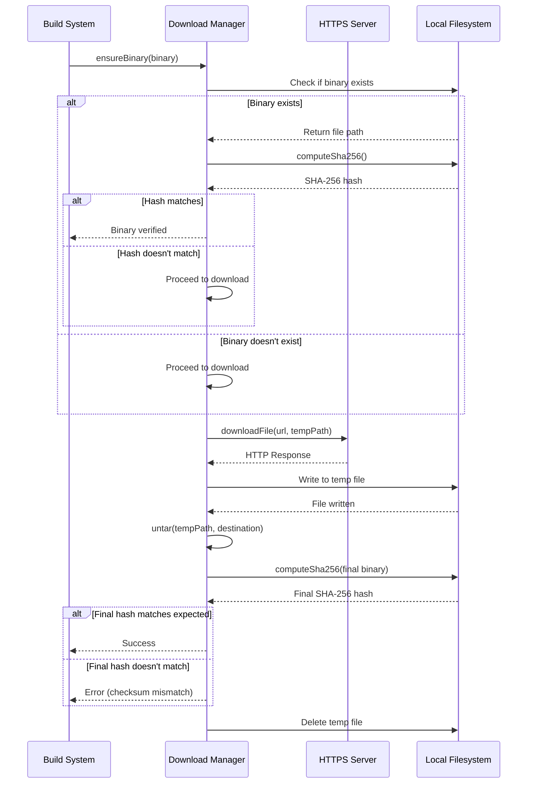
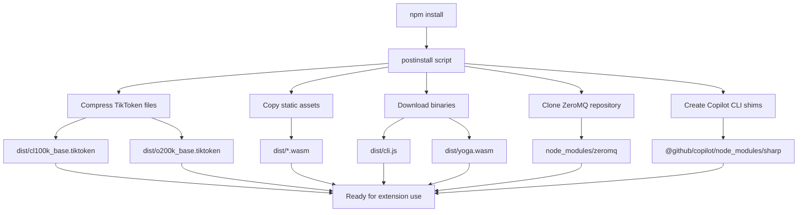

# Binary Dependency Management

<cite>
**Referenced Files in This Document**   
- [downloadBinary.ts](file://script/build/downloadBinary.ts)
- [postinstall.ts](file://script/postinstall.ts)
- [package.json](file://package.json)
</cite>

## Table of Contents
1. [Introduction](#introduction)
2. [Core Implementation](#core-implementation)
3. [Download Protocols and Integrity Verification](#download-protocols-and-integrity-verification)
4. [Version Management and Caching Strategy](#version-management-and-caching-strategy)
5. [Security Considerations](#security-considerations)
6. [Error Handling and Retry Mechanisms](#error-handling-and-retry-mechanisms)
7. [Integration with Package Configuration](#integration-with-package-configuration)
8. [Cross-Platform Compatibility](#cross-platform-compatibility)
9. [Dependency Resolution Examples](#dependency-resolution-examples)
10. [Consistent Binary Availability](#consistent-binary-availability)

## Introduction
The binary dependency management build step is a critical component of the GitHub Copilot Chat extension's build process, responsible for ensuring reliable and secure acquisition of external binary dependencies. This system handles the download, verification, and installation of essential binary components required for the extension's functionality. The implementation focuses on robustness, security, and cross-platform compatibility, ensuring that binary dependencies are consistently available across different deployment environments. The core functionality is implemented in the `downloadBinary.ts` module, which provides a comprehensive solution for managing binary dependencies with built-in integrity checks and error handling.

## Core Implementation
The binary dependency management system is implemented in the `downloadBinary.ts` file, which exports key functions for ensuring binary availability. The core interface `IBinary` defines the structure for binary specifications, including the download URL, SHA-256 checksum for integrity verification, and destination path within the repository. The primary function `ensureBinary()` orchestrates the entire download and verification process, first checking if the binary already exists at the specified destination. If the binary exists, it computes the SHA-256 hash and compares it with the expected value, re-downloading only if the checksum doesn't match. This approach optimizes build times by avoiding unnecessary downloads while ensuring integrity.

**Section sources**
- [downloadBinary.ts](file://script/build/downloadBinary.ts#L14-L44)

## Download Protocols and Integrity Verification
The download process utilizes HTTPS protocol for secure transmission of binary files, implemented through Node.js's built-in `https` module. The `downloadFile()` function handles the actual download operation, following redirects when encountered and properly handling HTTP error responses such as 404 Not Found. After downloading, the system performs integrity verification by computing the SHA-256 hash of the downloaded file using Node.js's `crypto` module. The `computeSha256()` function streams the file content to efficiently calculate the hash without loading the entire file into memory, making it suitable for large binary files. The verification process occurs both before and after extraction, ensuring that the final binary matches the expected checksum.

**Diagram sources**
- [downloadBinary.ts](file://script/build/downloadBinary.ts#L56-L78)
- [downloadBinary.ts](file://script/build/downloadBinary.ts#L46-L53)

## Version Management and Caching Strategy
The system implements a sophisticated version management approach through cryptographic checksum verification rather than traditional version numbers. Each binary is associated with a specific SHA-256 checksum, ensuring that only the exact expected version is accepted. The caching strategy is built into the `ensureBinary()` function, which first checks for the existence of the binary at the destination path before initiating a download. This prevents redundant downloads during subsequent builds, significantly improving build performance. Temporary files are used during the download process, with a randomly generated filename to avoid conflicts, and are automatically cleaned up in a `finally` block to prevent disk space leaks regardless of the operation's success or failure.

**Section sources**
- [downloadBinary.ts](file://script/build/downloadBinary.ts#L20-L43)
- [downloadBinary.ts](file://script/build/downloadBinary.ts#L33-L42)

## Security Considerations
Security is a primary concern in the binary dependency management process, with multiple layers of protection implemented. The system exclusively uses HTTPS for downloading binaries, preventing man-in-the-middle attacks and ensuring the authenticity of the download source. Cryptographic integrity verification through SHA-256 checksums ensures that downloaded binaries have not been tampered with during transmission or storage. The implementation follows the principle of least privilege by creating temporary files in a controlled manner and cleaning them up promptly. Additionally, the system validates HTTP responses, specifically checking for 404 errors, to prevent the processing of incomplete or corrupted downloads. The use of streaming operations for both download and hash computation minimizes memory exposure to potentially malicious content.

**Section sources**
- [downloadBinary.ts](file://script/build/downloadBinary.ts#L64-L66)
- [downloadBinary.ts](file://script/build/downloadBinary.ts#L38-L40)

## Error Handling and Retry Mechanisms
The implementation includes comprehensive error handling to ensure reliability in various network conditions. The `downloadFile()` function returns a Promise that rejects with appropriate error messages for different failure scenarios, including network errors and HTTP 404 responses. While the current implementation doesn't include automatic retry logic within the `downloadBinary.ts` module itself, it is designed to be resilient by cleaning up temporary files even when errors occur. The system's integration with the broader build process, as seen in `postinstall.ts`, suggests that retry mechanisms may be handled at a higher level or through external build tools. The error handling approach ensures that partial or corrupted downloads do not persist, maintaining the integrity of the build environment.

**Section sources**
- [downloadBinary.ts](file://script/build/downloadBinary.ts#L75-L77)
- [downloadBinary.ts](file://script/build/downloadBinary.ts#L64-L66)

## Integration with Package Configuration
The binary dependency management system is tightly integrated with the project's package configuration through the `postinstall.ts` script, which serves as the entry point for the build process. This script imports and utilizes the `downloadBinary` functionality alongside other build utilities, demonstrating how binary downloads are coordinated with other build steps. The `package.json` file defines the project's metadata and dependencies, with the build process triggered automatically after package installation. The integration is designed to be modular, allowing different components to specify their binary requirements through the `IBinary` interface, which can be consumed by the build system. This architecture enables various components of the extension to declare their binary dependencies in a standardized way.

**Diagram sources**
- [postinstall.ts](file://script/postinstall.ts#L170-L205)
- [package.json](file://package.json#L1-L80)

## Cross-Platform Compatibility
The binary dependency management system is designed with cross-platform compatibility in mind, though the current implementation in `downloadBinary.ts` focuses on the core download and verification logic that is platform-agnostic. The system's architecture allows for platform-specific binaries to be specified through the `IBinary` interface, with different URLs potentially pointing to platform-specific builds. The use of tar.gz format for distribution (evident from the `untar` function) is a cross-platform standard that works on Windows, macOS, and Linux. The path handling uses Node.js's `path` module, which automatically adapts to the platform's path separator conventions. While the current code doesn't explicitly handle different operating systems or architectures, the modular design allows for such logic to be implemented at a higher level, potentially in the code that constructs the `IBinary` objects passed to `ensureBinary()`.

**Section sources**
- [downloadBinary.ts](file://script/build/downloadBinary.ts#L8-L9)
- [downloadBinary.ts](file://script/build/downloadBinary.ts#L109-L131)

## Dependency Resolution Examples
The system resolves dependencies through explicit configuration rather than automated package management. In the `postinstall.ts` script, specific binaries are downloaded for tools like `@anthropic-ai/claude-code`, including `cli.js` and `yoga.wasm`. These dependencies are copied to the `dist` directory, making them available to the extension at runtime. The resolution process involves constructing `IBinary` objects with the appropriate URLs and checksums, though the exact checksums are not visible in the provided code. The system also handles dependencies that require compilation, such as the ZeroMQ library, which is cloned from a specific git commit and built as part of the process. This hybrid approach allows for both pre-compiled binaries and source-based dependencies to be managed within the same build framework.

**Section sources**
- [postinstall.ts](file://script/postinstall.ts#L198-L202)
- [postinstall.ts](file://script/postinstall.ts#L185-L187)

## Consistent Binary Availability
The binary dependency management system ensures consistent availability across different deployment environments through several mechanisms. The use of cryptographic checksums guarantees that the same binary content is deployed regardless of when or where the build occurs. The caching strategy ensures that once a binary is successfully downloaded and verified, it remains available for subsequent builds, reducing dependency on external servers. The modular design allows the same `ensureBinary()` function to be used across different parts of the build process, providing a consistent interface for binary acquisition. By integrating with the npm postinstall hook, the system ensures that all required binaries are available immediately after package installation, making the extension ready to use in any environment where the build process can be executed.

**Section sources**
- [downloadBinary.ts](file://script/build/downloadBinary.ts#L20-L44)
- [postinstall.ts](file://script/postinstall.ts#L170-L205)