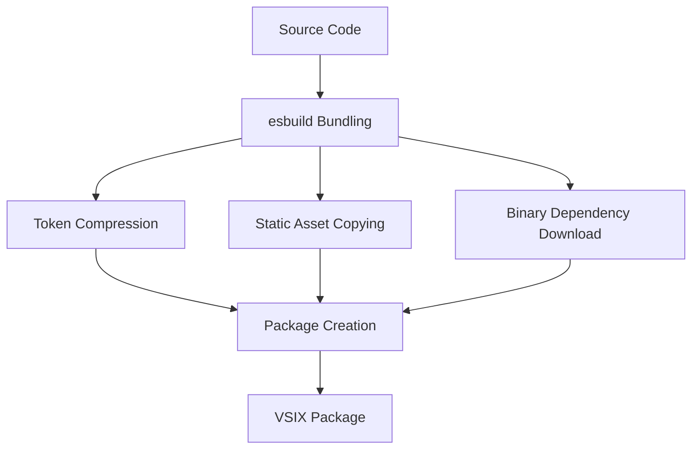
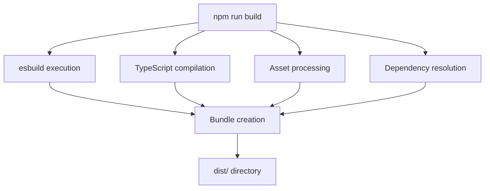

# Build Process

<cite>
**Referenced Files in This Document**   
- [compressTikToken.ts](file://script/build/compressTikToken.ts)
- [copyStaticAssets.ts](file://script/build/copyStaticAssets.ts)
- [downloadBinary.ts](file://script/build/downloadBinary.ts)
- [package.json](file://package.json)
- [.esbuild.ts](file://.esbuild.ts)
</cite>

## Table of Contents
1. [Introduction](#introduction)
2. [Build Pipeline Overview](#build-pipeline-overview)
3. [Core Build Scripts](#core-build-scripts)
4. [Package.json Scripts Orchestration](#packagejson-scripts-orchestration)
5. [Build Artifacts and Output Structure](#build-artifacts-and-output-structure)
6. [Optimization Techniques](#optimization-techniques)
7. [Integration with Development Workflows](#integration-with-development-workflows)
8. [Troubleshooting Common Build Issues](#troubleshooting-common-build-issues)
9. [Performance Considerations](#performance-considerations)
10. [Conclusion](#conclusion)

## Introduction
The GitHub Copilot Chat extension build process is a sophisticated pipeline that transforms source code into a packaged Visual Studio Code extension. This document provides a comprehensive analysis of the build workflow, focusing on the scripts in the `script/build/` directory that handle token compression, static asset management, and binary dependency handling. The build system leverages esbuild for efficient compilation and bundling, with specialized scripts to optimize various aspects of the extension before packaging.

**Section sources**
- [package.json](file://package.json#L4245-L4285)
- [.esbuild.ts](file://.esbuild.ts#L1-L382)

## Build Pipeline Overview
The build pipeline for GitHub Copilot Chat follows a structured workflow from source code to packaged extension. The process begins with TypeScript compilation and bundling using esbuild, followed by specialized build scripts that handle specific optimization tasks. The pipeline is orchestrated through npm scripts defined in package.json, which coordinate the execution of various build steps in the correct sequence.

The core build process uses esbuild for fast and efficient bundling of TypeScript code into JavaScript modules. The configuration in `.esbuild.ts` defines multiple build targets for different components of the extension, including the main extension host, web worker components, simulation tools, and TypeScript server plugins. After the initial bundling phase, specialized build scripts process specific assets and dependencies to optimize the final package size and performance.

**Diagram sources **
- [.esbuild.ts](file://.esbuild.ts#L18-L382)
- [package.json](file://package.json#L4250-L4251)

**Section sources**
- [.esbuild.ts](file://.esbuild.ts#L1-L382)
- [package.json](file://package.json#L4245-L4285)

## Core Build Scripts

### compressTikToken.ts
The `compressTikToken.ts` script implements a specialized compression algorithm for token files used by the extension's language processing components. The script converts `.tiktoken` files from their original text-based format into a more compact binary representation, significantly reducing file size while preserving all necessary information.

The compression algorithm takes advantage of the monotonic increase in term lengths with their index. Each term is represented by a Variable Length Quantity (VLQ)-encoded length followed by the term itself. This approach eliminates redundant information present in the original format, where each line contained both the base64-encoded term and its index. The script validates the input format, ensuring that indices are sequential and properly formatted before processing.

The implementation includes a verification step that parses the compressed binary output and compares it with the original data to ensure integrity. This validation is crucial for maintaining the reliability of the tokenization process in the extension. The compressed format is particularly beneficial for reducing the extension package size, which directly impacts download times and installation performance.

**Section sources**
- [compressTikToken.ts](file://script/build/compressTikToken.ts#L1-L77)

### copyStaticAssets.ts
The `copyStaticAssets.ts` script handles the management and copying of static assets required by the extension. This utility function efficiently copies specified files from their source locations to designated destination directories within the build output. The script is designed to handle multiple files in parallel, optimizing build performance.

The implementation uses Node.js's built-in file system operations with promises to ensure asynchronous execution. It creates necessary directory structures recursively before copying files, preventing errors related to missing parent directories. The script maintains the original file names during the copy process and preserves the relative path structure from the repository root.

This functionality is essential for including static resources such as icons, configuration files, and other assets that cannot be bundled with the main JavaScript code. By centralizing asset management in a dedicated script, the build process ensures consistency and reliability in handling static files across different build environments.

**Section sources**
- [copyStaticAssets.ts](file://script/build/copyStaticAssets.ts#L1-L19)

### downloadBinary.ts
The `downloadBinary.ts` script manages the acquisition and validation of binary dependencies required by the extension. This critical component ensures that external binary assets are downloaded, verified, and properly installed as part of the build process. The script implements robust error handling and validation to maintain the integrity of downloaded files.

The implementation includes several key features:
- SHA-256 checksum verification to ensure file integrity
- Automatic redownloading when checksums don't match
- Support for tar.gz archive extraction
- Recursive directory creation for destination paths
- HTTP redirect handling for download URLs

The script defines an interface for binary specifications that includes the download URL, expected SHA-256 checksum, and destination path. Before downloading, it checks if the file already exists and validates its checksum, avoiding unnecessary network operations. If the file exists but has an incorrect checksum, it is redownloaded to ensure consistency.

This functionality is particularly important for maintaining security and reliability in the build process, as it prevents the use of corrupted or tampered binary assets. The checksum validation provides a strong guarantee that the downloaded files match the expected versions.

**Section sources**
- [downloadBinary.ts](file://script/build/downloadBinary.ts#L1-L133)

## Package.json Scripts Orchestration
The build process is orchestrated through npm scripts defined in the package.json file, which coordinate the execution of various build steps. The scripts section in package.json serves as the central control point for the entire build pipeline, defining commands for development, testing, and production builds.

The primary build script `build` executes the esbuild configuration in `.esbuild.ts`, which handles the core bundling of TypeScript code into JavaScript modules. Additional scripts like `compile` provide development builds with source maps for debugging, while `watch` enables continuous rebuilding during development. The build process is further enhanced by post-install scripts that ensure proper environment setup.

The package.json scripts integrate with other tools in the ecosystem, such as ESLint for code quality checks, Vitest for unit testing, and VS Code's testing framework for extension-specific tests. This integration creates a comprehensive development workflow that ensures code quality and functionality throughout the development lifecycle.

**Diagram sources **
- [package.json](file://package.json#L4245-L4285)
- [.esbuild.ts](file://.esbuild.ts#L1-L382)

**Section sources**
- [package.json](file://package.json#L4245-L4285)

## Build Artifacts and Output Structure
The build process generates a structured output in the `dist/` directory, containing all the necessary components for the packaged extension. The output structure is organized to support both development and production environments, with different configurations for each use case.

The primary build artifacts include:
- Bundled JavaScript files for the extension host and worker components
- Source maps for debugging in development builds
- Compressed token files for language processing
- Copied static assets such as icons and configuration files
- Downloaded and verified binary dependencies

The esbuild configuration in `.esbuild.ts` defines multiple output paths for different components of the extension, including separate bundles for the main extension, web workers, simulation tools, and TypeScript server plugins. This modular approach allows for efficient loading and execution of different extension components based on their specific requirements.

The final package is created using the `vsce package` command, which bundles all build artifacts into a VSIX file according to the Visual Studio Code extension specification. The package.json file is modified during the build process to remove development-specific fields, ensuring that only necessary information is included in the final distribution.

**Section sources**
- [.esbuild.ts](file://.esbuild.ts#L18-L382)
- [package.json](file://package.json#L4282)

## Optimization Techniques
The build process incorporates several optimization techniques to improve the performance and efficiency of the final extension package. These optimizations target various aspects of the build, from code size reduction to dependency management and asset processing.

Code-level optimizations include tree shaking to eliminate unused code, minification to reduce file sizes, and bundling to minimize the number of HTTP requests. The esbuild configuration enables these optimizations in production builds while preserving readability and debuggability in development builds through source maps.

Asset-specific optimizations are implemented through the specialized build scripts. The `compressTikToken.ts` script significantly reduces the size of token files by converting them to a binary format, while `copyStaticAssets.ts` ensures efficient handling of static resources. Binary dependencies are optimized through checksum verification and conditional downloading, preventing unnecessary network operations.

The build process also includes environmental optimizations, such as parallel execution of independent build steps and efficient caching mechanisms. The watch mode implementation uses file system watchers to trigger rebuilds only when necessary, reducing CPU usage during development.

**Section sources**
- [.esbuild.ts](file://.esbuild.ts#L18-L382)
- [compressTikToken.ts](file://script/build/compressTikToken.ts#L1-L77)
- [downloadBinary.ts](file://script/build/downloadBinary.ts#L1-L133)

## Integration with Development Workflows
The build process is tightly integrated with development workflows, providing seamless support for both local development and continuous integration systems. The script configuration supports multiple development scenarios, from initial setup to testing and deployment.

For local development, the build system provides watch mode functionality that automatically rebuilds the extension when source files change. This enables rapid iteration and testing, as developers can immediately see the effects of their changes without manually triggering rebuilds. The development build includes source maps and preserves code structure for easier debugging.

The build process integrates with testing frameworks through dedicated scripts that compile and execute unit tests, integration tests, and end-to-end tests. These scripts ensure that code changes do not introduce regressions and maintain the overall quality of the extension. The testing infrastructure is designed to run efficiently in both local and CI environments.

Continuous integration systems can leverage the standardized build scripts to automate the build, test, and deployment pipeline. The build process is designed to be reproducible across different environments, ensuring consistent results regardless of the execution context. This reliability is crucial for maintaining quality in automated deployment workflows.

**Section sources**
- [package.json](file://package.json#L4245-L4285)
- [.esbuild.ts](file://.esbuild.ts#L1-L382)

## Troubleshooting Common Build Issues
Several common issues may arise during the build process, typically related to environment configuration, network connectivity, or file system permissions. Understanding these issues and their solutions is essential for maintaining a smooth development workflow.

One common issue is related to binary dependency downloads, where network connectivity problems or firewall restrictions may prevent successful downloads. The `downloadBinary.ts` script includes retry logic and detailed error messages to help diagnose these issues. Ensuring proper network access and verifying download URLs can resolve most connectivity problems.

Another frequent issue involves TypeScript compilation errors, which may occur due to version mismatches or configuration problems. The build process uses specific TypeScript versions defined in package.json to ensure consistency. Clear error messages from esbuild help identify the source of compilation problems, allowing for targeted fixes.

File system permission issues may occur when the build process cannot write to the output directory. Ensuring that the build environment has appropriate write permissions and that no files are locked by other processes can prevent these issues. The build scripts include error handling for file system operations to provide informative messages when problems occur.

**Section sources**
- [downloadBinary.ts](file://script/build/downloadBinary.ts#L1-L133)
- [.esbuild.ts](file://.esbuild.ts#L1-L382)

## Performance Considerations
The build process incorporates several performance considerations to optimize both build times and the runtime performance of the final extension. These considerations address various aspects of the development and deployment pipeline.

Build performance is optimized through parallel execution of independent build steps and efficient caching mechanisms. The esbuild tool is chosen for its fast compilation speed, significantly reducing build times compared to traditional bundlers. The watch mode implementation uses file system watchers to minimize unnecessary rebuilds, conserving system resources during development.

Runtime performance is enhanced through code optimization techniques such as tree shaking, minification, and efficient module loading. The compressed token format reduces memory usage and improves loading times for language processing components. Binary dependencies are optimized for size and performance, ensuring that they do not negatively impact the extension's overall responsiveness.

The build process also considers network performance, particularly for users downloading the extension. By minimizing the package size through various compression techniques, the build process reduces download times and bandwidth usage, improving the user experience, especially in low-bandwidth environments.

**Section sources**
- [.esbuild.ts](file://.esbuild.ts#L18-L382)
- [compressTikToken.ts](file://script/build/compressTikToken.ts#L1-L77)

## Conclusion
The GitHub Copilot Chat build process represents a sophisticated and well-structured pipeline that transforms source code into a high-performance Visual Studio Code extension. Through the coordinated use of esbuild for core bundling and specialized scripts for asset optimization, the build system efficiently handles the various components of the extension.

The integration of compression, asset management, and binary dependency handling into a unified build workflow ensures consistency and reliability across different environments. The thoughtful design of the build scripts, combined with comprehensive error handling and validation, creates a robust foundation for both development and production use.

By optimizing for both build performance and runtime efficiency, the build process supports rapid development cycles while delivering a high-quality user experience. The modular architecture and clear separation of concerns in the build system make it maintainable and extensible, allowing for future enhancements and adaptations as the extension evolves.