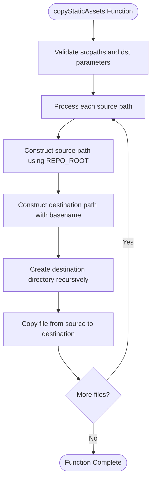
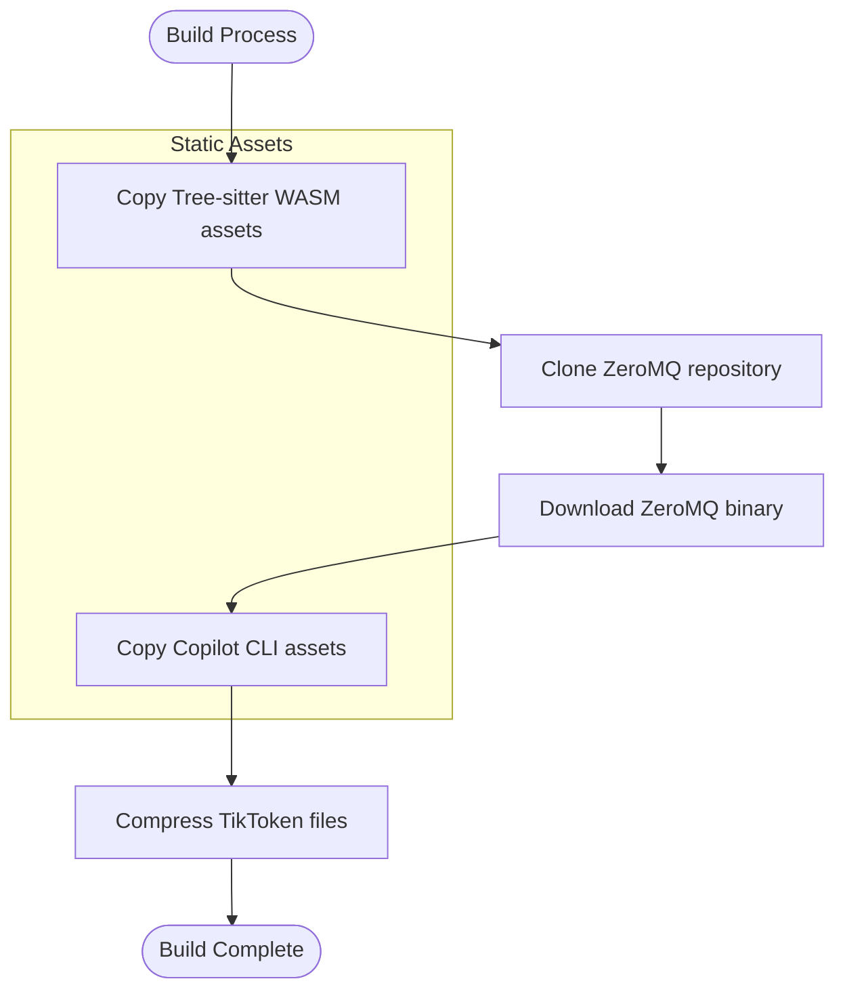

# Static Asset Management

<cite>
**Referenced Files in This Document**   
- [copyStaticAssets.ts](file://script/build/copyStaticAssets.ts)
- [postinstall.ts](file://script/postinstall.ts)
- [compressTikToken.ts](file://script/build/compressTikToken.ts)
</cite>

## Table of Contents
1. [Introduction](#introduction)
2. [Core Implementation](#core-implementation)
3. [Asset Copying Logic](#asset-copying-logic)
4. [Configuration and Usage Patterns](#configuration-and-usage-patterns)
5. [Performance Considerations](#performance-considerations)
6. [Error Handling](#error-handling)
7. [Build Process Integration](#build-process-integration)
8. [Conclusion](#conclusion)

## Introduction

The static asset management build step is a critical component of the extension packaging process, responsible for ensuring all necessary binary and static resources are properly copied to the distribution directory. This process is implemented through the `copyStaticAssets.ts` module, which handles the transfer of essential assets required for the extension's functionality. The build step ensures that third-party dependencies, binary files, and other static resources are available in the packaged extension, maintaining proper directory hierarchies and file integrity.

**Section sources**
- [copyStaticAssets.ts](file://script/build/copyStaticAssets.ts#L1-L19)

## Core Implementation

The static asset management system is implemented as a standalone module that provides a clean, reusable function for copying assets during the build process. The implementation focuses on reliability, simplicity, and performance when handling multiple files.

**Diagram sources**
- [copyStaticAssets.ts](file://script/build/copyStaticAssets.ts#L11-L18)

**Section sources**
- [copyStaticAssets.ts](file://script/build/copyStaticAssets.ts#L6-L18)

## Asset Copying Logic

The asset copying logic is designed to handle multiple files efficiently while maintaining the correct directory structure in the destination. The implementation uses Node.js's built-in file system promises for reliable file operations.

The `copyStaticAssets` function takes two parameters:
- `srcpaths`: An array of relative paths to source files
- `dst`: The destination directory path

For each source path, the function:
1. Resolves the absolute source path using the repository root
2. Constructs the destination path by joining the destination directory with the basename of the source file
3. Creates the necessary directory structure recursively
4. Copies the file to the destination

The implementation uses `Promise.all()` to process multiple files in parallel, improving performance when copying multiple assets simultaneously.

**Section sources**
- [copyStaticAssets.ts](file://script/build/copyStaticAssets.ts#L11-L18)

## Configuration and Usage Patterns

The static asset management system is configured through the build process in `postinstall.ts`, where specific assets are identified for copying based on their role in the extension's functionality.

**Diagram sources**
- [postinstall.ts](file://script/postinstall.ts#L178-L202)

The primary usage patterns include:

### Tree-sitter Grammar Assets
The build process copies WebAssembly (WASM) files for Tree-sitter grammars, which are used for syntax parsing and analysis. These include grammars for various programming languages such as C#, C++, Go, JavaScript, Python, Ruby, TypeScript, and others.

### Copilot CLI Assets
The build process also copies assets required by the Copilot CLI, including:
- CLI JavaScript file
- Yoga WebAssembly file for layout calculations

### Compressed Tokenizer Data
The build process handles binary tokenizer data files by compressing them using a custom compression algorithm before copying. The `compressTikToken` function converts `.tiktoken` files into a more compact binary format by:
1. Reading the base64-encoded terms from the input file
2. Validating the monotonic index sequence
3. Compressing each term with variable-length quantity encoding of its length
4. Concatenating the compressed data into the output file

**Section sources**
- [postinstall.ts](file://script/postinstall.ts#L178-L202)
- [compressTikToken.ts](file://script/build/compressTikToken.ts#L35-L64)

## Performance Considerations

The static asset management system incorporates several performance optimizations to handle large collections of assets efficiently:

1. **Parallel Processing**: The `copyStaticAssets` function uses `Promise.all()` to copy multiple files concurrently, maximizing I/O throughput.

2. **Efficient Binary Compression**: The tokenizer data files are compressed using a specialized algorithm that reduces file size while maintaining fast decompression. The compression format uses variable-length quantity encoding for term lengths, taking advantage of the monotonic increase in term length with index.

3. **Minimal Memory Footprint**: The implementation processes files in a streaming fashion where possible, avoiding loading entire large files into memory at once.

4. **Directory Structure Optimization**: The system creates destination directories recursively in a single operation, reducing the number of file system calls.

5. **Selective Asset Inclusion**: Only necessary assets are copied to the distribution directory, minimizing the final package size.

The performance characteristics are particularly important for the WASM files and tokenizer data, which can be relatively large and impact extension load times if not handled efficiently.

**Section sources**
- [copyStaticAssets.ts](file://script/build/copyStaticAssets.ts#L12-L17)
- [compressTikToken.ts](file://script/build/compressTikToken.ts#L57-L63)

## Error Handling

The static asset management system includes comprehensive error handling to ensure build reliability and provide meaningful feedback when issues occur.

For file copying operations, the system relies on Node.js's built-in error handling in the `fs.promises` API. If a source file is missing or cannot be read, or if the destination directory cannot be created, the corresponding promise will reject, causing the entire `copyStaticAssets` function to fail.

The tokenizer compression process includes specific validation:
- **Malformed Line Detection**: The system validates that each line in the input file has the expected format (base64 encoded term followed by index)
- **Index Validation**: It verifies that indices are numeric and follow a monotonic sequence
- **Integrity Verification**: After compression, the system verifies the output by parsing it back and comparing with the original data

The build process in `postinstall.ts` also includes error handling for external operations such as Git cloning, with appropriate error messages to help diagnose issues with network connectivity or repository access.

**Section sources**
- [copyStaticAssets.ts](file://script/build/copyStaticAssets.ts#L12-L17)
- [compressTikToken.ts](file://script/build/compressTikToken.ts#L45-L50)
- [postinstall.ts](file://script/postinstall.ts#L78-L113)

## Build Process Integration

The static asset management functionality is tightly integrated into the overall build process through the `postinstall.ts` script, which orchestrates multiple build steps including asset copying, binary downloads, and dependency management.

The integration follows a sequential workflow:
1. Create the build directory structure
2. Compress tokenizer data files
3. Copy static assets (WASM files and other binaries)
4. Clone and download external dependencies
5. Create shims for problematic native dependencies
6. Validate required cache files exist

This integration ensures that all necessary assets are available before the extension is packaged and distributed. The use of relative paths from the repository root (`REPO_ROOT`) ensures consistent behavior across different development environments.

The build process also handles special cases such as creating a shim for the Sharp module, which has native dependencies that are difficult to distribute. This demonstrates how the asset management system works in conjunction with other build steps to create a functional, distributable extension package.

**Section sources**
- [postinstall.ts](file://script/postinstall.ts#L170-L205)

## Conclusion

The static asset management build step plays a crucial role in ensuring the extension has all necessary resources available at runtime. Through the `copyStaticAssets.ts` module, the system provides a reliable, efficient mechanism for copying essential binary and static files to the distribution directory.

Key strengths of the implementation include:
- Simple, focused API for copying multiple files
- Parallel processing for improved performance
- Integration with other build steps like binary compression
- Comprehensive error handling and validation
- Proper directory structure management

The system effectively handles various asset types including WebAssembly modules, compressed tokenizer data, and CLI components, ensuring they are properly packaged and available when the extension is installed. This robust asset management process contributes to the overall reliability and performance of the extension in production environments.