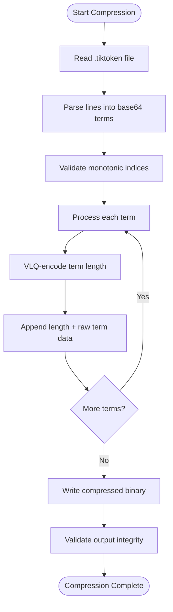
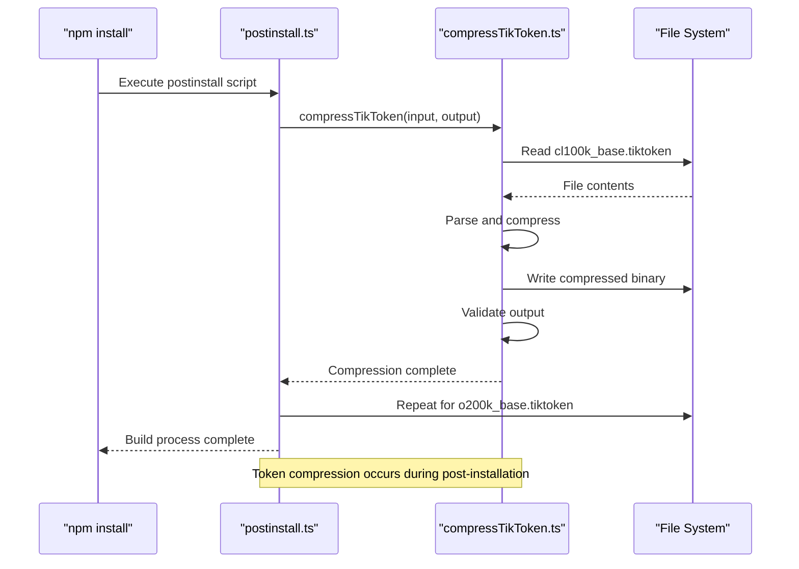
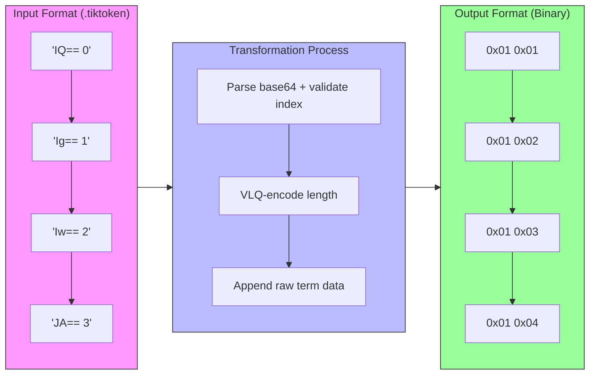

# Token Compression

<cite>
**Referenced Files in This Document**   
- [compressTikToken.ts](file://script/build/compressTikToken.ts)
- [parseTikTokens.ts](file://src/platform/tokenizer/node/parseTikTokens.ts)
- [variableLengthQuantity.ts](file://src/util/common/variableLengthQuantity.ts)
- [postinstall.ts](file://script/postinstall.ts)
- [extractChatLib.ts](file://script/build/extractChatLib.ts)
</cite>

## Table of Contents
1. [Introduction](#introduction)
2. [Compression Algorithm](#compression-algorithm)
3. [Build Pipeline Integration](#build-pipeline-integration)
4. [Performance and Impact](#performance-and-impact)
5. [Input/Output Transformation Examples](#inputoutput-transformation-examples)
6. [Troubleshooting Guide](#troubleshooting-guide)

## Introduction

The token compression build step is a critical optimization process in the GitHub Copilot Chat extension that significantly reduces the size of tokenizer vocabulary files. This process converts human-readable `.tiktoken` files into a compact binary format, improving both the extension's load time and overall performance. The compression is implemented in the `compressTikToken.ts` script, which processes tokenizer files containing base64-encoded terms used for natural language processing and code understanding.

The compression process is essential for maintaining a lightweight extension while preserving the comprehensive vocabulary needed for accurate tokenization of code and natural language. By converting the verbose text-based format into an optimized binary representation, the build system achieves substantial size reductions without losing any information. This optimization is particularly important for the Copilot Chat extension, which must balance rich functionality with fast startup times and minimal resource consumption.

**Section sources**
- [compressTikToken.ts](file://script/build/compressTikToken.ts#L1-L77)

## Compression Algorithm

The token compression algorithm implemented in `compressTikToken.ts` leverages the monotonic nature of term lengths in the tokenizer vocabulary to achieve efficient compression. The algorithm takes advantage of the observation that term lengths increase monotonically with their index in the vocabulary, allowing for a compact representation that stores only the length differences rather than repeating full term information.

The core of the compression algorithm uses Variable Length Quantity (VLQ) encoding to represent term lengths efficiently. VLQ is a universal code that uses a variable number of bytes to represent integers, with smaller numbers requiring fewer bytes. This is particularly effective for token lengths, as most tokens in programming languages and natural language tend to be relatively short. Each term in the compressed format consists of a VLQ-encoded length followed by the raw term data.

The algorithm processes the input `.tiktoken` file by first parsing each line, which contains a base64-encoded term followed by its index. It validates that the indices are monotonic (incrementing by exactly one) and then converts each base64 string to a binary buffer. During compression, only the term length is VLQ-encoded, while the term data itself is stored in its raw binary form. This approach achieves significant compression ratios while maintaining fast decompression performance.



**Diagram sources **
- [compressTikToken.ts](file://script/build/compressTikToken.ts#L35-L65)
- [variableLengthQuantity.ts](file://src/util/common/variableLengthQuantity.ts#L8-L41)

**Section sources**
- [compressTikToken.ts](file://script/build/compressTikToken.ts#L12-L65)
- [variableLengthQuantity.ts](file://src/util/common/variableLengthQuantity.ts#L8-L41)

## Build Pipeline Integration

The token compression process is seamlessly integrated into the build pipeline through multiple entry points, ensuring that tokenizer files are compressed at appropriate stages of the development and deployment workflow. The primary integration occurs in the `postinstall.ts` script, which is executed after npm package installation, making it an ideal location for build-time optimizations.

During the post-installation phase, the script specifically targets two tokenizer vocabulary files: `cl100k_base.tiktoken` and `o200k_base.tiktoken`. These files are compressed and placed in the `dist` directory, where they become part of the packaged extension. The integration is implemented through a simple loop that calls the `compressTikToken` function for each vocabulary file, specifying the input path and the desired output location.

Additionally, the build system includes a separate process in `extractChatLib.ts` that copies `.tiktoken` files as part of creating a standalone chat library module. This ensures that the tokenizer files are properly included in different distribution formats of the extension. The build pipeline's modular design allows the compression functionality to be reused across different build scenarios while maintaining a single source of truth for the compression algorithm.



**Diagram sources **
- [postinstall.ts](file://script/postinstall.ts#L170-L177)
- [compressTikToken.ts](file://script/build/compressTikToken.ts#L35-L65)

**Section sources**
- [postinstall.ts](file://script/postinstall.ts#L170-L177)
- [extractChatLib.ts](file://script/build/extractChatLib.ts#L388-L404)

## Performance and Impact

The token compression build step delivers significant performance improvements and size reductions for the GitHub Copilot Chat extension. By converting human-readable `.tiktoken` files into a compact binary format, the process achieves substantial compression ratios that directly translate to faster extension loading times and reduced memory footprint.

The impact on extension size is particularly noteworthy, as tokenizer vocabulary files can be quite large in their original text format. The binary compression reduces file sizes by eliminating redundant information such as index numbers and whitespace, while the VLQ encoding efficiently represents term lengths using minimal bytes. This size reduction is crucial for the extension's overall package size, especially considering that these vocabulary files are essential for the core functionality of code understanding and natural language processing.

In terms of runtime performance, the compressed format enables faster loading of tokenizer data, as the binary format can be read and parsed more efficiently than the original text format. The decompression process implemented in `parseTikTokenBinary.ts` is optimized for speed, allowing the extension to quickly reconstruct the vocabulary map when needed. This balance between compression ratio and decompression speed ensures that the optimization benefits are realized without introducing significant overhead during extension startup or operation.

The compression process also includes built-in validation through the `assertOk` function, which verifies the integrity of the compressed output by comparing it against the original data. This quality assurance step ensures that the compression is lossless and that no information is lost during the transformation, maintaining the accuracy and reliability of the tokenizer functionality.

**Section sources**
- [compressTikToken.ts](file://script/build/compressTikToken.ts#L67-L75)
- [parseTikTokens.ts](file://src/platform/tokenizer/node/parseTikTokens.ts#L11-L23)

## Input/Output Transformation Examples

The token compression process transforms `.tiktoken` files from a verbose text format to a compact binary representation. The input format consists of lines containing base64-encoded terms followed by their index, while the output is a binary stream where each term is represented by a VLQ-encoded length followed by the raw term data.

For example, consider an input `.tiktoken` file with the following content:
```
IQ== 0
Ig== 1
Iw== 2
JA== 3
JQ== 4
```

This represents five terms with base64-encoded values. During compression, each line is parsed to extract the base64 term and validate the monotonic index. The first term "IQ==" decodes to a single byte (0x01), so its length (1) is VLQ-encoded as a single byte (0x01) followed by the raw byte (0x01). The second term "Ig==" also decodes to a single byte (0x02), so its representation is identical in structure: length byte (0x01) followed by data byte (0x02).

The transformation process eliminates the human-readable aspects of the original format, such as the space separator and decimal index representation, resulting in a much more compact binary stream. The output binary would begin with bytes representing the sequence: [0x01, 0x01, 0x01, 0x02, 0x01, 0x03, ...], where each pair consists of a length indicator and the corresponding term data.

This transformation preserves all the information from the original file while reducing overhead. The decompression process reverses this transformation by reading VLQ-encoded lengths and extracting the corresponding number of bytes for each term, reconstructing the original vocabulary mapping with perfect fidelity.



**Diagram sources **
- [compressTikToken.ts](file://script/build/compressTikToken.ts#L15-L30)
- [variableLengthQuantity.ts](file://src/util/common/variableLengthQuantity.ts#L24-L40)

**Section sources**
- [compressTikToken.ts](file://script/build/compressTikToken.ts#L15-L30)

## Troubleshooting Guide

When issues arise with the token compression process, they typically manifest as build failures or runtime errors related to tokenizer functionality. The most common issues include malformed input files, validation failures, and file system errors during the compression process.

Compression failures often occur due to malformed `.tiktoken` files that violate the expected format. The most frequent cause is non-monotonic indices, where the index values do not increment by exactly one for each subsequent line. This triggers the validation error "non-monotonic index" in the compression script. To resolve this issue, verify that the input file has consecutive integer indices starting from zero, with no gaps or duplicates.

Another common error is "malformed line" which occurs when a line cannot be properly split into base64 content and index. This typically happens when there are missing spaces, invalid characters, or incomplete base64 encoding. To troubleshoot this issue, examine the problematic line in the input file and ensure it follows the format "base64_string index" with a single space separator.

File system issues may occur during the compression process, particularly when writing to the output directory. Ensure that the target directory exists and has appropriate write permissions. The compression script attempts to create the necessary directory structure with `{ recursive: true }`, but permission issues can still prevent file creation.

Runtime issues may arise if the compressed files become corrupted or if there's a mismatch between compression and decompression implementations. The built-in validation in the `assertOk` function helps catch such issues during the build process. If validation fails, compare the original and decompressed data to identify discrepancies and verify that both the compression and decompression functions are using compatible implementations.

**Section sources**
- [compressTikToken.ts](file://script/build/compressTikToken.ts#L45-L50)
- [compressTikToken.ts](file://script/build/compressTikToken.ts#L67-L75)
- [parseTikTokens.ts](file://src/platform/tokenizer/node/parseTikTokens.ts#L11-L23)