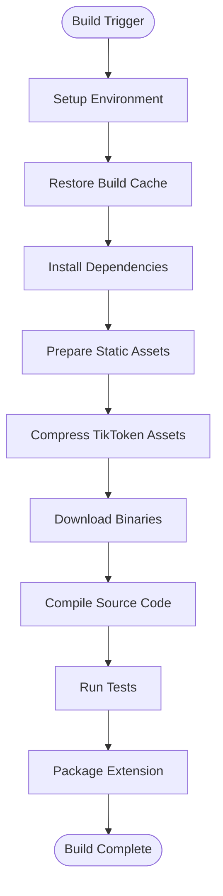
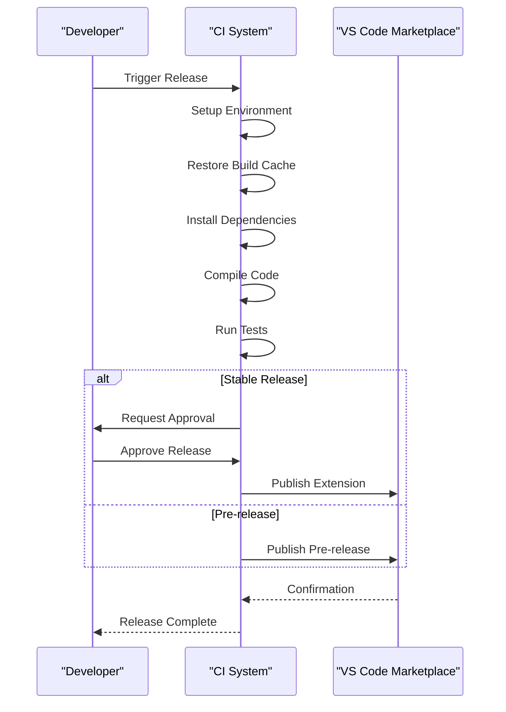

# Deployment and Release

<cite>
**Referenced Files in This Document**   
- [package.json](file://package.json)
- [cgmanifest.json](file://cgmanifest.json)
- [SECURITY.md](file://SECURITY.md)
- [CODE_OF_CONDUCT.md](file://CODE_OF_CONDUCT.md)
- [build/release.yml](file://build/release.yml)
- [build/pre-release.yml](file://build/pre-release.yml)
- [build/npm-package.yml](file://build/npm-package.yml)
- [build/update-assets.yml](file://build/update-assets.yml)
- [script/build/compressTikToken.ts](file://script/build/compressTikToken.ts)
- [script/build/downloadBinary.ts](file://script/build/downloadBinary.ts)
- [script/build/copyStaticAssets.ts](file://script/build/copyStaticAssets.ts)
- [build/setup-emsdk.sh](file://build/setup-emsdk.sh)
</cite>

## Table of Contents
1. [Introduction](#introduction)
2. [Build Pipeline](#build-pipeline)
3. [Versioning Strategy](#versioning-strategy)
4. [Release Process](#release-process)
5. [Quality Assurance and Security](#quality-assurance-and-security)
6. [Update Mechanism](#update-mechanism)
7. [Component Governance](#component-governance)
8. [Release Branching and Rollback](#release-branching-and-rollback)
9. [Infrastructure Requirements](#infrastructure-requirements)
10. [Best Practices](#best-practices)

## Introduction
This document provides a comprehensive overview of the deployment and release process for GitHub Copilot Chat. It covers the complete lifecycle from build automation to release management, including quality assurance, security reviews, and compliance requirements. The documentation details the build pipeline, versioning strategy, release procedures, and infrastructure requirements necessary to maintain release stability while delivering new features.

## Build Pipeline

The build pipeline for GitHub Copilot Chat is a multi-stage process that prepares the extension package for distribution. The pipeline consists of several key components that handle asset compression, binary downloads, and static asset preparation.

The build process begins with the execution of build scripts located in the `script/build/` directory. These scripts are responsible for various preparation tasks before the final package is created. The pipeline is orchestrated through Azure Pipelines configuration files that define the build steps, test execution, and deployment procedures.



**Diagram sources**
- [build/release.yml](file://build/release.yml#L40-L115)
- [script/build/compressTikToken.ts](file://script/build/compressTikToken.ts#L35-L63)
- [script/build/downloadBinary.ts](file://script/build/downloadBinary.ts#L20-L43)

### Asset Compression
The build pipeline includes a specialized script for compressing TikToken assets, which are used for tokenization in the AI models. The `compressTikToken.ts` script converts `.tiktoken` files into a more compact binary format by taking advantage of the monotonic increase in term lengths with their index. Each term is represented by a Variable Length Quantity (VLQ)-encoded length followed by the term itself, resulting in significant size reduction.

### Binary Downloads
The build process downloads required binaries from external sources using the `downloadBinary.ts` script. This script ensures the integrity of downloaded binaries by verifying their SHA-256 checksums against expected values. If a binary already exists but has a different checksum, it is re-downloaded to ensure consistency. The download process handles HTTP redirects and uses HTTPS for secure transfers.

### Static Asset Preparation
Static assets are copied to their destination directories using the `copyStaticAssets.ts` script. This process ensures that all necessary assets, such as icons and walkthrough videos, are included in the final package. The script handles the creation of destination directories and copies files from specified source paths.

**Section sources**
- [script/build/compressTikToken.ts](file://script/build/compressTikToken.ts#L1-L77)
- [script/build/downloadBinary.ts](file://script/build/downloadBinary.ts#L1-L133)
- [script/build/copyStaticAssets.ts](file://script/build/copyStaticAssets.ts#L1-L19)

## Versioning Strategy

The versioning strategy for GitHub Copilot Chat is managed through the `package.json` file, which contains the version information for the extension. The version follows semantic versioning principles with a three-part version number (major.minor.patch) and includes additional build metadata.

The current version of the extension is specified in the `version` field of `package.json`. The build process also includes a `build` field that tracks the build number, allowing for multiple builds of the same version. This approach enables the team to release multiple builds with bug fixes or performance improvements without changing the functional version.

```json
{
  "name": "copilot-chat",
  "version": "0.33.0",
  "build": "1",
  "completionsCoreVersion": "1.378.1799"
}
```

The versioning strategy supports both stable releases and pre-releases. Pre-releases are identified by the `prerelease` flag in the build configuration, which triggers different publishing workflows. The versioning system is integrated with the Azure Pipelines configuration, allowing for automated version bumps based on the release type (major, minor, patch, or prerelease).

The `completionsCoreVersion` field tracks the version of the completions core component, which is a critical dependency for the extension's functionality. This allows the team to manage updates to the core AI components independently from the extension UI and infrastructure.

**Section sources**
- [package.json](file://package.json#L1-L800)

## Release Process

The release process for GitHub Copilot Chat is automated through Azure Pipelines and consists of multiple workflows for different release types. The process is designed to ensure consistent, reliable, and secure releases while maintaining high quality standards.

### Release Workflows
The repository contains several YAML configuration files that define different release workflows:

- `release.yml`: Manages stable releases to the public marketplace
- `pre-release.yml`: Handles pre-release builds for testing and validation
- `npm-package.yml`: Controls npm package publishing
- `update-assets.yml`: Manages the deployment of static assets

The stable release workflow (`release.yml`) is triggered manually and requires approval before publishing to the marketplace. This ensures that only thoroughly tested and validated builds are released to end users. The pre-release workflow runs on a nightly schedule (Monday-Friday at 4:00 AM), providing regular builds for internal testing and early access users.

### Release Automation
The release process is highly automated, with scripts handling various aspects of the build and deployment:

1. Environment setup with Node.js 22.14.x
2. Authentication configuration for GitHub repositories
3. Build cache management to improve performance
4. Compilation and packaging of the extension
5. Automated testing across multiple platforms
6. Publishing to the marketplace (when approved)

The build process includes a mixin step that integrates code from the `vscode-capi` repository, ensuring that the extension has access to the latest VS Code APIs and capabilities.



**Diagram sources**
- [build/release.yml](file://build/release.yml#L1-L236)
- [build/pre-release.yml](file://build/pre-release.yml#L1-L233)

**Section sources**
- [build/release.yml](file://build/release.yml#L1-L236)
- [build/pre-release.yml](file://build/pre-release.yml#L1-L233)

## Quality Assurance and Security

The quality assurance and security processes for GitHub Copilot Chat are comprehensive and multi-layered, ensuring that the extension meets high standards for reliability, performance, and security.

### Quality Assurance Steps
The build pipeline includes multiple testing phases to validate the extension's functionality:

1. **Unit Tests**: Vitest unit tests verify individual components and functions
2. **Simulation Tests**: Comprehensive simulation tests validate complex workflows
3. **Extension Tests**: Tests run within VS Code to validate integration
4. **Completions Core Tests**: Tests for the AI model integration and prompt handling
5. **Sanity Tests**: Final validation tests to ensure basic functionality

The test process runs on multiple platforms (Linux, macOS, and Windows) to ensure cross-platform compatibility. The tests are executed in a headless environment using xvfb-run, which provides a virtual display for UI testing.

### Security Reviews
Security is a critical aspect of the release process, with dedicated documentation and procedures:

The `SECURITY.md` file contains important security information, directing users to Microsoft's security policies and reporting procedures. The document emphasizes that security vulnerabilities should not be reported through public GitHub issues, but through Microsoft's designated security channels.

The build process includes security measures such as:
- Azure Key Vault integration for secure secret management
- HTTPS for all external downloads
- SHA-256 checksum verification for downloaded binaries
- Secure authentication for GitHub repositories

### Compliance Requirements
The project adheres to Microsoft's open source policies and guidelines, as documented in the `CODE_OF_CONDUCT.md` file. The code of conduct outlines expected behavior for contributors and maintainers, promoting a respectful and inclusive community.

The project also follows Microsoft's trademark and brand guidelines, ensuring proper use of trademarks and logos. The license information is clearly documented, with the project licensed under the MIT license.

**Section sources**
- [SECURITY.md](file://SECURITY.md#L1-L14)
- [CODE_OF_CONDUCT.md](file://CODE_OF_CONDUCT.md#L1-L10)
- [build/release.yml](file://build/release.yml#L125-L225)

## Update Mechanism

The update mechanism for GitHub Copilot Chat is integrated with the VS Code extension marketplace, providing seamless updates for users. The extension automatically checks for updates and notifies users when new versions are available.

The update process is managed through the versioning system in `package.json`, with the marketplace using the version number to determine when updates are available. Users can configure their update preferences in VS Code, choosing between automatic updates or manual updates.

For enterprise deployments, the extension can be distributed through private extension galleries or package managers, allowing organizations to control the rollout of new versions.

The update mechanism includes safeguards to prevent breaking changes:
- Version compatibility requirements with VS Code
- Thorough testing before release
- Gradual rollout for major updates
- Rollback procedures for critical issues

The extension's deep integration with VS Code means that updates are coordinated with VS Code releases, ensuring compatibility and stability.

**Section sources**
- [package.json](file://package.json#L1-L800)
- [README.md](file://README.md#L48-L53)

## Component Governance

Component governance for GitHub Copilot Chat is managed through the `cgmanifest.json` file, which documents the project's dependencies and components. This file is crucial for maintaining transparency and compliance with open source licensing requirements.

The `cgmanifest.json` file follows the Component Detection Manifest schema and includes information about the project's dependencies, including:

- Component type (git)
- Repository URL
- Commit hash
- Development dependency status

```json
{
  "$schema": "https://json.schemastore.org/component-detection-manifest.json",
  "Registrations": [
    {
      "Component": {
        "Type": "git",
        "git": {
          "Name": "codex",
          "RepositoryUrl": "https://github.com/openai/codex",
          "CommitHash": "acc4acc81eea0339ad46d1c6f8459f58eaee6211"
        },
        "DevelopmentDependency": false
      }
    }
  ]
}
```

The component governance process ensures that all dependencies are properly documented and tracked. This includes both direct dependencies and transitive dependencies, providing a complete picture of the project's component inventory.

The `cgIgnoreDirectories` parameter in the build configuration specifies directories to exclude from component detection, such as the `script` directory which contains build scripts that are not part of the final package.

**Section sources**
- [cgmanifest.json](file://cgmanifest.json#L1-L17)
- [build/release.yml](file://build/release.yml#L34-L38)

## Release Branching and Rollback

The release branching strategy for GitHub Copilot Chat is based on a trunk-based development model, with the `main` branch serving as the primary development branch. This approach enables continuous integration and frequent releases while maintaining stability.

### Release Branching
The repository uses the following branching strategy:
- `main` branch: Primary development branch for all changes
- No long-lived feature branches: Features are developed in short-lived branches and merged frequently
- Release branches: Created only for critical hotfixes or emergency patches

The build pipelines are configured to trigger on the `main` branch, with different workflows for stable releases and pre-releases. This allows the team to maintain a rapid development pace while ensuring that stable releases are thoroughly tested.

### Hotfixes
Hotfixes are handled through a streamlined process:
1. Create a hotfix branch from the latest stable release
2. Implement and test the fix
3. Merge the fix into both the hotfix branch and the `main` branch
4. Trigger a hotfix release through the stable release pipeline

The hotfix process includes expedited testing to ensure that the fix resolves the issue without introducing new problems.

### Rollback Procedures
Rollback procedures are in place to address critical issues in released versions:
1. Identify the problematic version and the nature of the issue
2. Revert the problematic changes in the `main` branch
3. Create a new hotfix release with the reverted changes
4. Communicate the rollback to users through release notes and notifications

The versioning system supports rollbacks by maintaining a clear history of changes, allowing the team to quickly identify and revert problematic updates.

**Section sources**
- [build/release.yml](file://build/release.yml#L3-L7)
- [build/pre-release.yml](file://build/pre-release.yml#L1-L11)

## Infrastructure Requirements

The deployment infrastructure for GitHub Copilot Chat is built on Azure Pipelines and includes several components that support the build, test, and release processes.

### Build Infrastructure
The build infrastructure requirements include:
- Node.js 22.14.x for running the build scripts
- Python and dotnet CLI for specific build tasks
- emsdk for WebAssembly compilation
- Azure Key Vault for secure secret management
- Multiple platform agents (Linux, macOS, Windows) for cross-platform testing

The build process uses caching to improve performance, with build artifacts stored between runs to reduce download and compilation time.

### Pre-release Validation
Pre-release validation steps include:
1. Code compilation and type checking
2. Linting to ensure code quality standards
3. Unit tests to verify individual components
4. Simulation tests to validate complex workflows
5. Extension tests to verify VS Code integration
6. Completions Core tests to validate AI model integration
7. Sanity tests to ensure basic functionality

The validation process runs in a headless environment using xvfb-run, which provides a virtual display for UI testing. This ensures that the extension works correctly across different operating systems and display configurations.

### Asset Deployment
Static assets, such as walkthrough videos, are deployed separately from the extension package through the `update-assets.yml` workflow. This workflow uploads assets to Azure Blob Storage, making them available for download by the extension.

The asset deployment process includes:
- Preparation of asset packages
- Upload to Azure Blob Storage
- Verification of uploaded assets
- Integration with the extension's asset loading mechanism

**Section sources**
- [build/release.yml](file://build/release.yml#L40-L225)
- [build/update-assets.yml](file://build/update-assets.yml#L1-L58)
- [build/setup-emsdk.sh](file://build/setup-emsdk.sh)

## Best Practices

The deployment and release process for GitHub Copilot Chat follows several best practices to maintain release stability while delivering new features.

### Stability and Reliability
Key practices for maintaining stability include:
- Comprehensive automated testing across multiple platforms
- Gradual rollout of new features to monitor performance
- Thorough regression testing before releases
- Monitoring of user feedback and telemetry data
- Rapid response to critical issues through hotfixes

### Feature Delivery
Practices for efficient feature delivery include:
- Trunk-based development with frequent merges
- Short-lived feature branches
- Continuous integration and automated builds
- Regular pre-releases for early feedback
- Clear versioning and release notes

### Security and Compliance
Security and compliance best practices include:
- Secure handling of secrets through Azure Key Vault
- Verification of downloaded binaries through checksums
- Regular security reviews and vulnerability scanning
- Compliance with open source licensing requirements
- Transparent documentation of dependencies

### Performance Optimization
Performance optimization practices include:
- Build caching to reduce compilation time
- Asset compression to reduce package size
- Efficient testing to minimize build duration
- Parallel execution of independent build steps
- Monitoring of build performance metrics

These best practices ensure that GitHub Copilot Chat maintains a high level of quality and reliability while delivering new features and improvements to users.

**Section sources**
- [build/release.yml](file://build/release.yml)
- [build/pre-release.yml](file://build/pre-release.yml)
- [build/npm-package.yml](file://build/npm-package.yml)