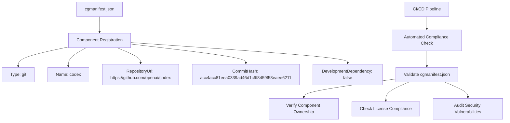
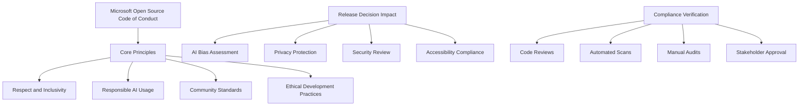
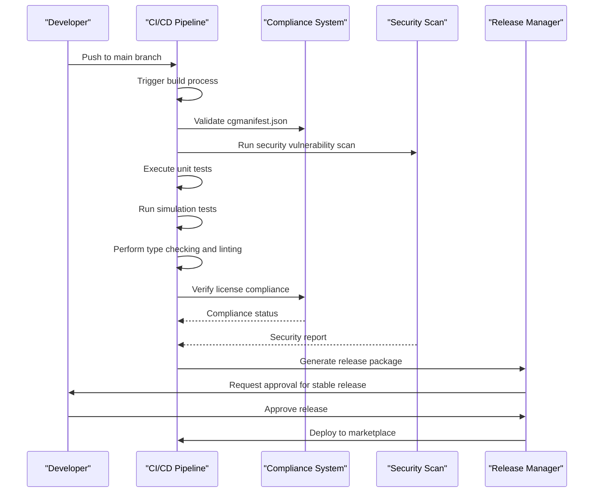
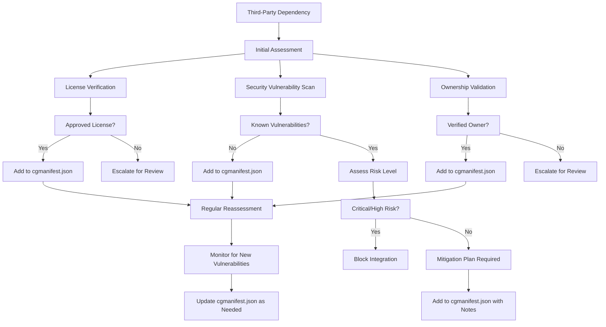
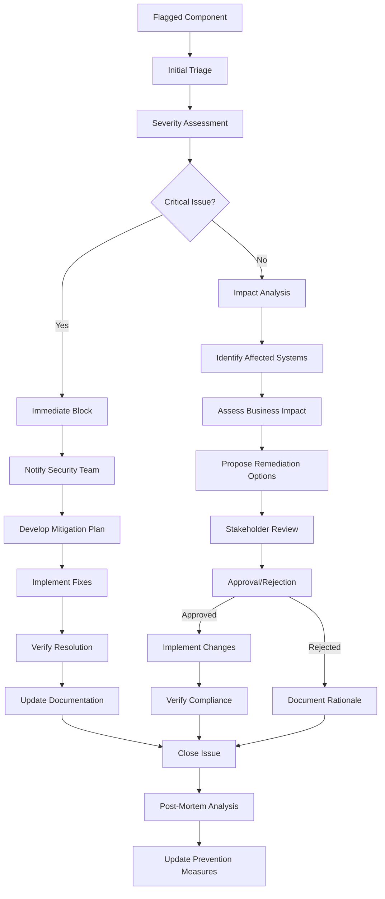
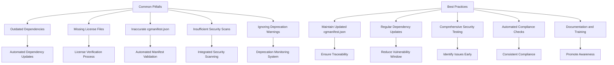

# Compliance and Governance

<cite>
**Referenced Files in This Document**   
- [cgmanifest.json](file://cgmanifest.json)
- [CODE_OF_CONDUCT.md](file://CODE_OF_CONDUCT.md)
- [SECURITY.md](file://SECURITY.md)
- [build/release.yml](file://build/release.yml)
- [build/pre-release.yml](file://build/pre-release.yml)
- [build/npm-package.yml](file://build/npm-package.yml)
- [package.json](file://package.json)
</cite>

## Table of Contents
1. [Introduction](#introduction)
2. [Component Governance with cgmanifest.json](#component-governance-with-cgmanifestjson)
3. [Code of Conduct and Ethical Guidelines](#code-of-conduct-and-ethical-guidelines)
4. [Release Process and CI/CD Pipeline](#release-process-and-cicd-pipeline)
5. [Dependency Audit and Security Assessment](#dependency-audit-and-security-assessment)
6. [Compliance Workflow and Escalation Procedures](#compliance-workflow-and-escalation-procedures)
7. [Common Compliance Pitfalls and Best Practices](#common-compliance-pitfalls-and-best-practices)
8. [Conclusion](#conclusion)

## Introduction
This document provides a comprehensive overview of the compliance and governance framework for GitHub Copilot Chat's release process. It details the mechanisms used to ensure component ownership tracking, license compliance, ethical AI usage, and security standards throughout the software development lifecycle. The governance model combines automated checks in CI/CD pipelines with manual review processes and adherence to Microsoft's open source policies. This framework ensures that all releases meet legal, security, and ethical requirements before deployment to users.

## Component Governance with cgmanifest.json
The cgmanifest.json file serves as the central component governance document for GitHub Copilot Chat, tracking all third-party components and their metadata. This manifest follows the Component Detection Manifest schema and provides a structured approach to dependency management and compliance tracking.

**Diagram sources**
- [cgmanifest.json](file://cgmanifest.json)

**Section sources**
- [cgmanifest.json](file://cgmanifest.json)

The cgmanifest.json file contains a single component registration for the OpenAI Codex model, which is a core dependency of GitHub Copilot Chat. This component is registered as a git type with a specific repository URL and commit hash, ensuring reproducible builds and traceability. The manifest explicitly marks this component as a production dependency rather than a development dependency, reflecting its critical role in the functionality of the extension. This structured approach enables automated tools to verify component ownership, validate license compliance, and audit for security vulnerabilities before any release.

## Code of Conduct and Ethical Guidelines
GitHub Copilot Chat adheres to the Microsoft Open Source Code of Conduct, which establishes the ethical framework and community standards that guide development and release decisions. This code of conduct emphasizes responsible AI usage, inclusivity, and respect within the development community.

**Diagram sources**
- [CODE_OF_CONDUCT.md](file://CODE_OF_CONDUCT.md)

**Section sources**
- [CODE_OF_CONDUCT.md](file://CODE_OF_CONDUCT.md)

The code of conduct establishes clear guidelines for ethical AI usage, requiring that all features and releases undergo assessment for potential bias, privacy implications, and security risks. Before any release, the team must verify that the functionality aligns with Microsoft's Responsible AI principles, including fairness, reliability, safety, privacy, and inclusiveness. The code of conduct also provides clear reporting mechanisms for any concerns, with dedicated contact points for both external contributors and Microsoft employees. This framework ensures that release decisions consider not only technical requirements but also ethical implications and community impact.

## Release Process and CI/CD Pipeline
The release process for GitHub Copilot Chat is governed by a comprehensive CI/CD pipeline that automates compliance checks and ensures consistent quality across releases. The pipeline configuration files define the workflow for both pre-release and stable releases, incorporating multiple validation stages.

**Diagram sources**
- [build/release.yml](file://build/release.yml)
- [build/pre-release.yml](file://build/pre-release.yml)
- [build/npm-package.yml](file://build/npm-package.yml)

**Section sources**
- [build/release.yml](file://build/release.yml)
- [build/pre-release.yml](file://build/pre-release.yml)
- [build/npm-package.yml](file://build/npm-package.yml)

The CI/CD pipeline is configured through YAML files that define the build, test, and release workflows. The release.yml file orchestrates the stable release process, including steps for building the extension, running comprehensive tests, and publishing to the marketplace. The pre-release.yml file manages nightly builds and pre-release versions, ensuring that new features are thoroughly tested before stable release. The npm-package.yml file handles the packaging and distribution of the extension as an npm package. All pipeline configurations include compliance checks that validate the cgmanifest.json file, verify license compliance, and scan for security vulnerabilities. The pipeline also incorporates automated testing, including unit tests, integration tests, and simulation tests that validate functionality across different scenarios.

## Dependency Audit and Security Assessment
The dependency governance process for GitHub Copilot Chat includes rigorous audit procedures and security assessments to ensure the integrity and safety of all components. This process combines automated scanning with manual review to identify and mitigate potential risks.

**Diagram sources**
- [SECURITY.md](file://SECURITY.md)
- [cgmanifest.json](file://cgmanifest.json)

**Section sources**
- [SECURITY.md](file://SECURITY.md)
- [cgmanifest.json](file://cgmanifest.json)

The security assessment process begins with automated scanning of all dependencies for known vulnerabilities using industry-standard tools and databases. Each dependency is checked against the National Vulnerability Database (NVD) and other security advisories to identify any reported issues. Dependencies with critical or high-severity vulnerabilities are blocked from integration unless a mitigation plan is approved by the security team. The audit process also verifies component ownership by confirming that the repository URL in cgmanifest.json points to an official source maintained by the original developers. Regular reassessment is performed to monitor for newly discovered vulnerabilities, and the cgmanifest.json file is updated accordingly. For any flagged components, a detailed risk assessment is conducted to determine whether the dependency can be used with appropriate safeguards or must be replaced.

## Compliance Workflow and Escalation Procedures
The compliance workflow for GitHub Copilot Chat includes defined procedures for handling flagged components and escalating compliance issues. This structured approach ensures that potential problems are addressed promptly and consistently.

**Diagram sources**
- [SECURITY.md](file://SECURITY.md)
- [CODE_OF_CONDUCT.md](file://CODE_OF_CONDUCT.md)

**Section sources**
- [SECURITY.md](file://SECURITY.md)
- [CODE_OF_CONDUCT.md](file://CODE_OF_CONDUCT.md)

When a component is flagged during the compliance check, it undergoes an initial triage to assess the severity of the issue. Critical issues, such as severe security vulnerabilities or license violations, trigger an immediate block on the release and notification to the security team. For less severe issues, an impact analysis is conducted to identify affected systems and assess business implications. The remediation process involves developing and implementing fixes, verifying resolution, and updating documentation. All decisions are reviewed by stakeholders, and rejected proposals are documented with clear rationale. After resolution, a post-mortem analysis is conducted to identify root causes and update prevention measures. The escalation path includes clear contact points for reporting concerns, with dedicated channels for both external contributors and Microsoft employees.

## Common Compliance Pitfalls and Best Practices
The release process for GitHub Copilot Chat has identified several common compliance pitfalls and established best practices to maintain governance standards across releases. These lessons learned help prevent recurring issues and ensure consistent quality.

**Diagram sources**
- [cgmanifest.json](file://cgmanifest.json)
- [package.json](file://package.json)
- [build/release.yml](file://build/release.yml)

**Section sources**
- [cgmanifest.json](file://cgmanifest.json)
- [package.json](file://package.json)
- [build/release.yml](file://build/release.yml)

Common compliance pitfalls include using outdated dependencies that may contain known vulnerabilities, missing license files that create legal risks, inaccurate cgmanifest.json entries that compromise traceability, insufficient security scans that fail to detect vulnerabilities, and ignoring deprecation warnings that can lead to future compatibility issues. To address these pitfalls, the team follows several best practices: maintaining an updated cgmanifest.json file to ensure component traceability, performing regular dependency updates to reduce the vulnerability window, conducting comprehensive security testing to identify issues early, implementing automated compliance checks to ensure consistency, and providing documentation and training to promote awareness. The CI/CD pipeline incorporates automated checks that validate the cgmanifest.json file, verify license compliance, and scan for security vulnerabilities, ensuring that these best practices are consistently applied across all releases.

## Conclusion
The compliance and governance framework for GitHub Copilot Chat provides a robust foundation for ensuring the integrity, security, and ethical use of the extension. By combining automated checks in the CI/CD pipeline with manual review processes and adherence to Microsoft's open source policies, the team maintains high standards across all releases. The cgmanifest.json file serves as a critical tool for component governance, enabling traceability and compliance verification. The adherence to the Microsoft Open Source Code of Conduct ensures that ethical considerations guide development and release decisions. The comprehensive dependency audit and security assessment processes protect users from potential risks, while the defined compliance workflow and escalation procedures ensure that issues are addressed promptly and consistently. By following established best practices and learning from common pitfalls, the team continues to improve the governance framework, delivering a reliable and trustworthy AI-powered coding assistant to users worldwide.