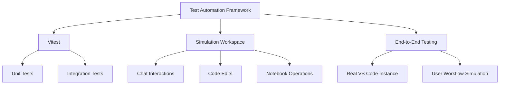
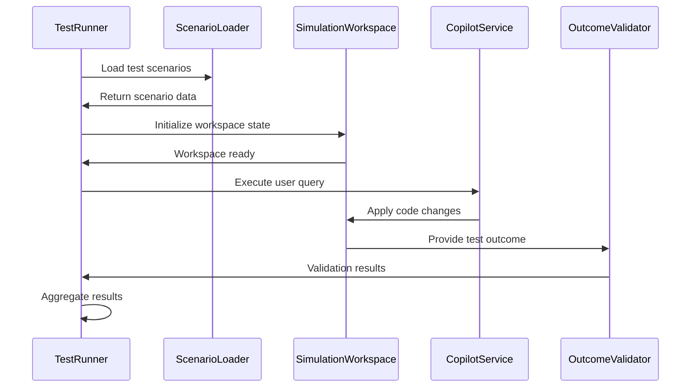

# Quality Assurance and Testing

<cite>
**Referenced Files in This Document**   
- [package.json](file://package.json)
- [test/e2e/scenarioLoader.ts](file://test/e2e/scenarioLoader.ts)
- [test/e2e/testHelper.ts](file://test/e2e/testHelper.ts)
- [test/simulation/simulationTestProvider.ts](file://test/simulation/simulationTestProvider.ts)
- [test/simulation/outcomeValidators.ts](file://test/simulation/outcomeValidators.ts)
- [test/simulation/testSnapshot.ts](file://test/simulation/testSnapshot.ts)
- [test/simulation/types.ts](file://test/simulation/types.ts)
- [chat-lib/vitest.config.ts](file://chat-lib/vitest.config.ts)
</cite>

## Table of Contents
1. [Introduction](#introduction)
2. [Test Automation Framework](#test-automation-framework)
3. [Test Types and Execution](#test-types-and-execution)
4. [Test Directory Structure](#test-directory-structure)
5. [Test Coverage and Quality Gates](#test-coverage-and-quality-gates)
6. [Manual Testing Procedures](#manual-testing-procedures)
7. [Performance and Regression Testing](#performance-and-regression-testing)
8. [Test Results Aggregation](#test-results-aggregation)
9. [Handling Test Failures](#handling-test-failures)
10. [Test Environment Configuration](#test-environment-configuration)

## Introduction
The GitHub Copilot Chat extension employs a comprehensive quality assurance and testing strategy to ensure reliability, performance, and functionality across various scenarios. The testing infrastructure is designed to validate both the AI-powered features and the underlying extension functionality through automated and manual testing methodologies. This document details the test automation framework, execution processes, coverage requirements, and quality assurance protocols that govern the release process for GitHub Copilot Chat.

## Test Automation Framework
The GitHub Copilot Chat testing framework is built on Vitest, a modern testing framework optimized for Vite-based projects. The framework supports multiple testing types including unit, integration, and end-to-end tests, with a particular emphasis on simulation-based testing to validate AI interactions. The test infrastructure is configured through the vitest.config.ts file in the chat-lib directory, which defines the testing environment, reporters, and coverage settings.

The framework leverages a simulation workspace environment that mimics the VS Code editor experience, allowing tests to validate chat interactions, code completions, and editing operations in a controlled environment. This simulation approach enables comprehensive testing of AI-generated responses and their impact on code without requiring a full VS Code instance.



**Diagram sources**
- [chat-lib/vitest.config.ts](file://chat-lib/vitest.config.ts)
- [test/simulation/types.ts](file://test/simulation/types.ts)

**Section sources**
- [package.json](file://package.json)
- [chat-lib/vitest.config.ts](file://chat-lib/vitest.config.ts)

## Test Types and Execution
The GitHub Copilot Chat testing strategy encompasses multiple test types to ensure comprehensive validation of functionality:

### Unit Tests
Unit tests focus on individual components and functions within the extension, validating their behavior in isolation. These tests are typically located in test directories adjacent to the source files they validate and use Vitest for execution. The unit tests verify the correctness of utility functions, service implementations, and data processing logic.

### Integration Tests
Integration tests validate the interaction between multiple components within the extension. These tests ensure that different parts of the system work together as expected, particularly focusing on the integration between AI services, VS Code APIs, and user interface components.

### End-to-End Tests
End-to-end tests simulate real user interactions with the Copilot Chat feature, validating complete workflows from user input to AI response and code modification. The e2e directory contains tests that validate various scenarios including code explanation, bug fixing, and feature implementation.

The end-to-end tests use a scenario-based approach, where test cases are defined in JSON files within the scenarios directory. Each scenario includes the initial workspace state, user query, and expected outcome. The scenarioLoader.ts file provides utilities for loading and processing these test scenarios.



**Diagram sources**
- [test/e2e/scenarioLoader.ts](file://test/e2e/scenarioLoader.ts)
- [test/simulation/types.ts](file://test/simulation/types.ts)

**Section sources**
- [test/e2e/scenarioLoader.ts](file://test/e2e/scenarioLoader.ts)
- [test/simulation/types.ts](file://test/simulation/types.ts)

## Test Directory Structure
The test directory in the GitHub Copilot Chat repository is organized to support multiple testing methodologies and scenarios:

- **base/**: Contains foundational testing utilities, caching mechanisms, and shared test infrastructure
- **e2e/**: Houses end-to-end tests that validate complete user workflows and scenarios
- **inline/**: Contains tests specifically focused on inline chat interactions and code suggestions
- **intent/**: Includes tests for intent recognition and classification
- **outcome/**: Stores expected outcome data for various test scenarios
- **prompts/**: Contains tests for prompt generation and handling
- **scenarios/**: Includes comprehensive test scenarios with workspace states and conversation histories
- **simulation/**: Contains simulation-specific test infrastructure, diagnostic providers, and fixtures

The simulation directory is particularly important as it provides the infrastructure for creating realistic test environments that mimic the VS Code editor. This includes simulation workspace implementations, diagnostic providers for various languages, and tools for validating test outcomes.

## Test Coverage and Quality Gates
Test coverage is enforced through quality gates defined in the package.json scripts. The test automation framework includes coverage reporting to ensure that critical functionality is adequately tested before release. The quality gates prevent releases when tests don't pass or when coverage thresholds are not met.

The coverage requirements focus on core functionality including chat interactions, code editing operations, and AI response handling. The framework tracks coverage metrics for both the extension code and the AI integration points, ensuring that all critical paths are tested.

The package.json file defines npm scripts that execute the test suite and validate coverage:

```json
"scripts": {
  "test": "vitest",
  "test:coverage": "vitest run --coverage",
  "test:e2e": "node test/simulationTests.js",
  "test:simulation": "node test/testVisualizationRunner.js"
}
```

These scripts are integrated into the release pipeline, serving as quality gates that must pass before a release can proceed. The coverage requirements are particularly stringent for code that handles user data, AI interactions, and security-sensitive operations.

**Section sources**
- [package.json](file://package.json)

## Manual Testing Procedures
In addition to automated testing, GitHub Copilot Chat undergoes rigorous manual testing procedures to validate functionality that is difficult to automate:

### Exploratory Testing
Exploratory testing sessions are conducted to identify edge cases and unexpected behaviors in the AI interactions. Testers use the extension in various scenarios, focusing on complex codebases and unusual user queries to evaluate the robustness of the AI responses.

### User Acceptance Testing
User acceptance testing follows a structured protocol where designated users validate new features against predefined acceptance criteria. This testing phase focuses on usability, relevance of AI suggestions, and overall user experience.

The manual testing process includes:
- Validation of AI-generated code for correctness and idiomatic style
- Assessment of response relevance and accuracy
- Evaluation of performance in large codebases
- Testing with various programming languages and frameworks
- Verification of accessibility features

## Performance and Regression Testing
Performance benchmarking is an integral part of the testing process for GitHub Copilot Chat. The framework includes specific tests to measure:

- Response time for AI queries
- Memory usage during extended sessions
- Latency in code suggestion delivery
- Performance with large codebases

Memory leak detection is performed through automated tests that monitor memory usage over extended periods of operation. The tests create scenarios that simulate prolonged use of the extension and measure memory consumption to identify potential leaks.

Regression testing is automated through the comprehensive test suite, which is executed for every code change. The regression tests include:
- Historical test cases that cover previously identified bugs
- Critical functionality tests that validate core features
- Performance benchmarks that track changes over time

The simulation framework allows for consistent reproduction of test scenarios, ensuring that regression tests provide reliable results across different environments.

## Test Results Aggregation
Test results are aggregated and reported through the release pipeline using multiple mechanisms:

- **Console output**: Detailed test results are displayed in the console during test execution
- **Coverage reports**: HTML and text coverage reports are generated to visualize test coverage
- **CI/CD integration**: Test results are integrated into the continuous integration pipeline
- **Snapshot testing**: Visual and structural snapshots are used to detect unintended changes

The testSnapshot.ts file implements snapshot testing functionality that compares current test outcomes with previously recorded snapshots. This approach helps detect unintended changes in AI responses and code generation patterns.

The aggregation process includes:
- Compilation of test results from all test types
- Generation of coverage reports
- Identification of flaky tests
- Reporting of performance metrics
- Documentation of test outcomes for release approval

**Section sources**
- [test/simulation/testSnapshot.ts](file://test/simulation/testSnapshot.ts)

## Handling Test Failures
The testing framework includes specific procedures for handling test failures:

### Flaky Tests
Flaky tests are identified through repeated execution and statistical analysis. Tests that fail intermittently are flagged for investigation and either fixed or temporarily disabled with appropriate documentation.

### Failure Analysis
When tests fail, the framework provides detailed information to aid in debugging:
- Expected vs. actual outcomes
- Workspace state at the time of failure
- AI response content
- Error messages and stack traces

The outcomeValidators.ts file contains utilities for validating test outcomes and providing meaningful error messages when assertions fail. These validators check for various conditions including code correctness, absence of diagnostics, and proper formatting.

### Test Isolation
Failed tests are isolated to prevent cascading failures. Each test runs in a clean simulation environment to ensure that failures in one test do not affect others.

## Test Environment Configuration
The test environment is configured to provide a consistent and reproducible testing experience:

- **Simulation workspace**: A virtual workspace that mimics VS Code's file system and editor features
- **Diagnostic providers**: Simulated diagnostic services for various languages (TypeScript, Python, C++, etc.)
- **Network mocking**: Interception of network requests to external AI services
- **Configuration management**: Test-specific configuration settings

The simulationTestProvider.ts file implements a test provider that can simulate test failures and results, allowing for comprehensive testing of the test result display functionality.

The environment configuration ensures that tests are isolated from external factors and can be reliably executed across different systems. This consistency is crucial for maintaining the integrity of the test results throughout the release process.

**Section sources**
- [test/simulation/simulationTestProvider.ts](file://test/simulation/simulationTestProvider.ts)
- [test/simulation/outcomeValidators.ts](file://test/simulation/outcomeValidators.ts)