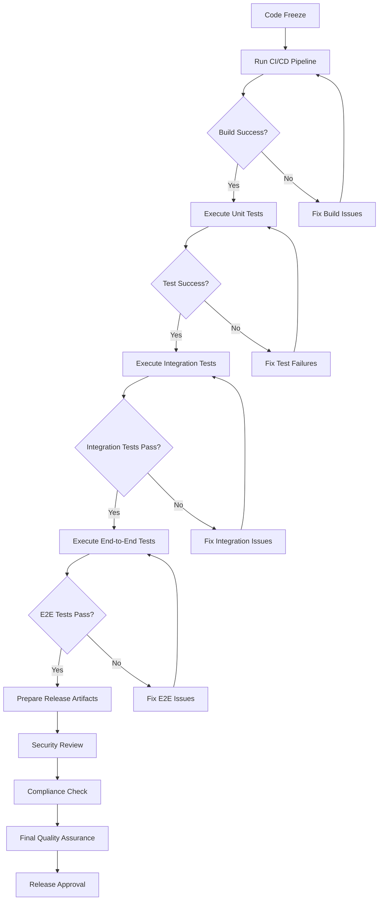
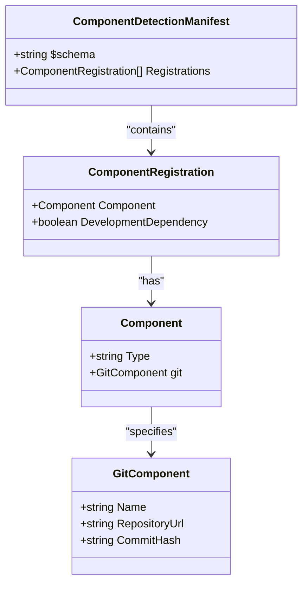
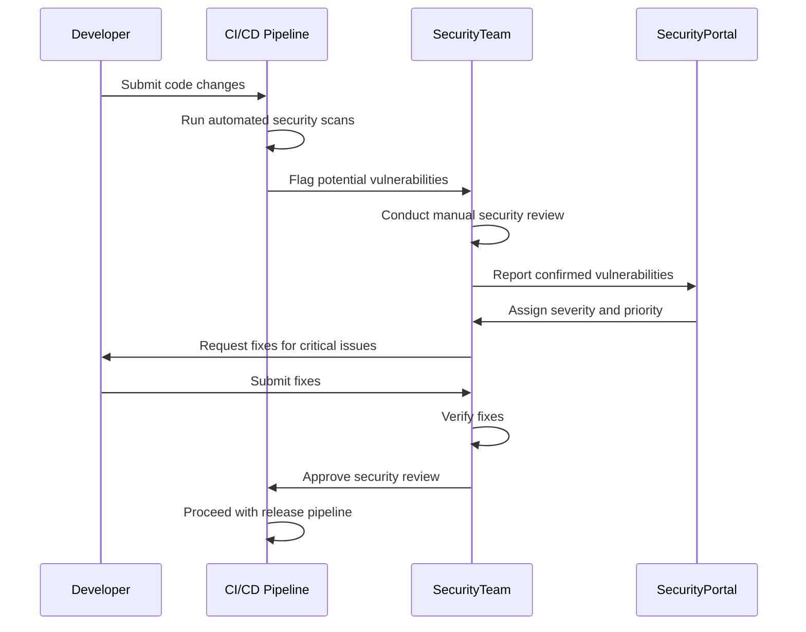
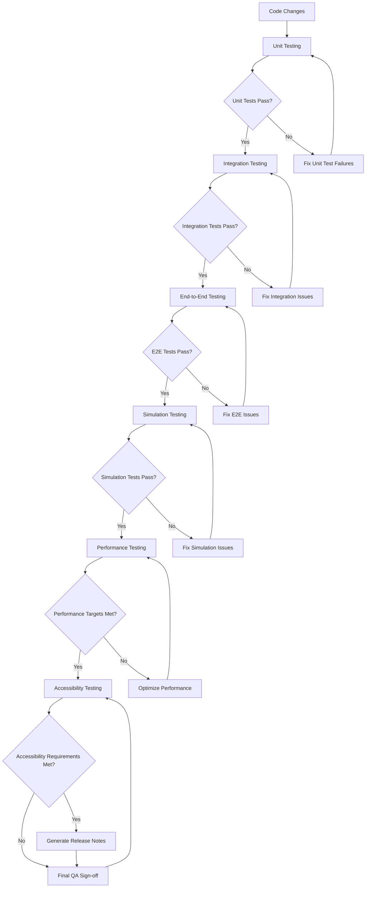
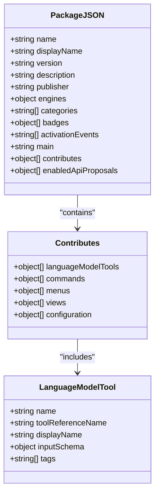

# Release Process

<cite>
**Referenced Files in This Document**   
- [package.json](file://package.json)
- [cgmanifest.json](file://cgmanifest.json)
- [SECURITY.md](file://SECURITY.md)
- [CODE_OF_CONDUCT.md](file://CODE_OF_CONDUCT.md)
- [build/release.yml](file://build/release.yml)
- [build/pre-release.yml](file://build/pre-release.yml)
- [build/npm-package.yml](file://build/npm-package.yml)
- [CHANGELOG.md](file://CHANGELOG.md)
</cite>

## Table of Contents
1. [Introduction](#introduction)
2. [Release Preparation](#release-preparation)
3. [Component Governance with cgmanifest.json](#component-governance-with-cgmanifestjson)
4. [Security Review Procedures](#security-review-procedures)
5. [Compliance Requirements](#compliance-requirements)
6. [Quality Assurance and Testing](#quality-assurance-and-testing)
7. [Release Branching and Versioning](#release-branching-and-versioning)
8. [Release Metadata Management](#release-metadata-management)
9. [Publication and Marketplace Deployment](#publication-and-marketplace-deployment)
10. [Hotfix and Rollback Procedures](#hotfix-and-rollback-procedures)
11. [Best Practices for Release Stability](#best-practices-for-release-stability)

## Introduction

The GitHub Copilot Chat release process is a comprehensive workflow that ensures the delivery of high-quality, secure, and compliant software to users through the Visual Studio Code marketplace. This document outlines the end-to-end release process from preparation to publication, covering critical aspects such as component governance, security reviews, compliance requirements, quality assurance, and release management. The process is designed to maintain release stability while enabling the delivery of new features and improvements to users.

**Section sources**
- [package.json](file://package.json#L1-L80)
- [README.md](file://README.md#L1-L84)

## Release Preparation

The release preparation phase involves several key steps to ensure that the codebase is ready for release. The process begins with code freeze, where new features are locked down and only critical bug fixes are accepted. This is followed by comprehensive testing, including unit tests, integration tests, and end-to-end tests, which are executed through the CI/CD pipeline defined in the build configuration files.

The release process is automated through Azure Pipelines, with separate workflows for stable releases and pre-releases. The stable release pipeline (`build/release.yml`) is triggered on the main branch and includes build, test, and publish stages. The pre-release pipeline (`build/pre-release.yml`) runs on a nightly schedule (Monday-Friday at 4 AM) to provide regular pre-release builds for testing and validation.

Before release, all dependencies are verified and updated as necessary. The build process includes caching mechanisms to improve efficiency, with build caches stored and restored based on changes to key files like `package-lock.json` and build scripts. The pipeline also integrates with external services like Azure Key Vault to securely manage secrets required for the build process.

**Diagram sources**
- [build/release.yml](file://build/release.yml#L1-L236)
- [build/pre-release.yml](file://build/pre-release.yml#L1-L233)

**Section sources**
- [build/release.yml](file://build/release.yml#L1-L236)
- [build/pre-release.yml](file://build/pre-release.yml#L1-L233)

## Component Governance with cgmanifest.json

The `cgmanifest.json` file plays a critical role in component governance and compliance tracking for the GitHub Copilot Chat extension. This file serves as a component detection manifest that documents all third-party components and dependencies used in the project, enabling comprehensive tracking and management of external code.

The manifest follows the Component Detection Manifest schema and contains a registrations array that lists all components. In the current configuration, it registers the "codex" component from the OpenAI repository, specifying the repository URL and the exact commit hash used. This precise version pinning ensures reproducible builds and enables security teams to track specific versions of dependencies for vulnerability assessment.

The component governance process requires that all third-party components be documented in the cgmanifest.json file before they can be included in the codebase. This includes not only direct dependencies but also any transitive dependencies that are directly utilized by the code. The manifest is reviewed during the security review process to ensure that all components comply with Microsoft's security and licensing requirements.

**Diagram sources**
- [cgmanifest.json](file://cgmanifest.json#L1-L17)

**Section sources**
- [cgmanifest.json](file://cgmanifest.json#L1-L17)

## Security Review Procedures

The security review procedures for GitHub Copilot Chat are governed by Microsoft's security policies and practices, as outlined in the SECURITY.md file. The security process emphasizes responsible disclosure and follows Microsoft's established guidelines for handling security vulnerabilities in source code repositories.

The security review is an integral part of the release pipeline and occurs before final approval for publication. The process begins with automated security scanning using tools like CodeQL, which is configured in the CodeQL.yml file. This static analysis identifies potential security vulnerabilities in the codebase, including injection flaws, authentication issues, and other common security weaknesses.

In addition to automated scanning, the release undergoes manual security review by the security team. This review focuses on several key areas: authentication and authorization mechanisms, data handling and privacy protections, input validation and output encoding, and secure communication protocols. The review also examines the extension's interaction with external services and APIs to ensure that sensitive information is properly protected.

The security review process explicitly prohibits reporting vulnerabilities through public GitHub issues. Instead, security researchers and team members are directed to follow Microsoft's official security reporting guidance at aka.ms/SECURITY.md. This ensures that vulnerabilities are handled confidentially and responsibly, with proper coordination for remediation before public disclosure.

**Diagram sources**
- [SECURITY.md](file://SECURITY.md#L1-L14)
- [CodeQL.yml](file://CodeQL.yml#L1-L6)

**Section sources**
- [SECURITY.md](file://SECURITY.md#L1-L14)

## Compliance Requirements

The compliance requirements for GitHub Copilot Chat are defined in the CODE_OF_CONDUCT.md file and are aligned with Microsoft's open source policies. The project adheres to the Microsoft Open Source Code of Conduct, which establishes standards for community interactions and project governance.

The compliance process ensures that all contributions to the project follow established guidelines for code quality, licensing, and intellectual property. Before a release, the compliance team verifies that all code contributions have appropriate licensing and that third-party components comply with Microsoft's open source policies. This includes ensuring that all dependencies have compatible licenses and that proper attribution is provided.

The compliance review also examines the extension's adherence to Microsoft's trademark and brand guidelines. This is particularly important for the GitHub Copilot Chat extension, which uses Microsoft and GitHub trademarks. The review ensures that trademark usage is authorized and follows established branding guidelines, preventing confusion or implied sponsorship.

The compliance process is integrated into the release pipeline through automated checks and manual review. Automated tools scan for license compliance and potential intellectual property issues, while the compliance team conducts a final review before release approval. This multi-layered approach ensures that the extension meets all legal and policy requirements before publication to the marketplace.

**Section sources**
- [CODE_OF_CONDUCT.md](file://CODE_OF_CONDUCT.md#L1-L10)

## Quality Assurance and Testing

The quality assurance process for GitHub Copilot Chat is comprehensive and multi-layered, encompassing various types of testing to ensure the reliability and performance of the extension. The testing strategy includes unit tests, integration tests, end-to-end tests, and simulation tests, all of which are executed as part of the CI/CD pipeline.

Unit tests, located in various test directories throughout the codebase, verify the correctness of individual functions and components. These tests are written using the Vitest framework and are executed with the `npm run test:unit` command. Integration tests validate the interaction between different components and services, ensuring that the extension functions correctly as a whole.

End-to-end tests simulate real user scenarios and validate the complete workflow of the extension. These tests are executed using VS Code's testing infrastructure with the `xvfb-run -a npm run test:extension` command, which runs the tests in a virtual display environment. The tests cover key user journeys such as chat interactions, code suggestions, and agent mode functionality.

Simulation tests, located in the test/simulation directory, provide an additional layer of validation by simulating complex user scenarios and edge cases. These tests are particularly important for validating the AI-powered features of the extension, ensuring that the chat and code suggestion functionalities work correctly across different contexts and programming languages.

The quality assurance process also includes release notes generation, which is automated based on the commit history and pull request descriptions. The CHANGELOG.md file is updated with each release, documenting new features, improvements, and bug fixes in a structured format that helps users understand the changes in each version.

**Diagram sources**
- [build/release.yml](file://build/release.yml#L209-L225)
- [test/simulation](file://test/simulation)

**Section sources**
- [build/release.yml](file://build/release.yml#L209-L225)
- [CHANGELOG.md](file://CHANGELOG.md#L1-L800)

## Release Branching and Versioning

The release branching strategy for GitHub Copilot Chat follows a streamlined approach focused on the main branch, with pre-release builds generated from the same branch on a regular schedule. Unlike traditional branching models that use separate release branches, this project relies on the main branch for both development and release, with versioning managed through semantic versioning in the package.json file.

The versioning scheme follows semantic versioning principles (MAJOR.MINOR.PATCH), with the current version specified in the package.json file. Major versions indicate significant changes that may include breaking changes, minor versions represent new features and improvements, and patch versions indicate bug fixes and minor updates.

Pre-release builds are generated automatically on a nightly schedule (Monday-Friday at 4 AM) from the main branch, allowing for regular testing and validation of the latest changes. These pre-releases are published to a separate distribution channel, enabling early adopters and internal testers to evaluate new features and identify potential issues before the stable release.

Stable releases are triggered manually from the main branch when the codebase meets the release criteria, including passing all tests, completing security and compliance reviews, and obtaining stakeholder approval. The release pipeline automatically increments the version number based on the release type (major, minor, or patch) and updates the package.json file accordingly.

This branching and versioning strategy enables rapid iteration and frequent releases while maintaining stability for end users. The close alignment between development and release branches reduces complexity and ensures that fixes and improvements are delivered to users quickly.

**Section sources**
- [package.json](file://package.json#L5)
- [build/pre-release.yml](file://build/pre-release.yml#L6-L11)
- [build/release.yml](file://build/release.yml#L3-L7)

## Release Metadata Management

Release metadata management is a critical aspect of the GitHub Copilot Chat release process, ensuring that all necessary information is accurately captured and maintained in the package.json file. This file serves as the central repository for release metadata, including version information, dependencies, contribution points, and extension configuration.

The package.json file contains several key metadata fields that are updated and validated before each release. The version field is updated according to semantic versioning rules, with the build number incremented for each release. The completionsCoreVersion field tracks the version of the core completions engine, ensuring compatibility between the chat extension and the underlying AI services.

The contribution points in the package.json file define the extension's integration with VS Code, including activation events, language model tools, and UI elements. These contributions are carefully reviewed during the release process to ensure that they follow best practices and provide a seamless user experience. The enabledApiProposals field specifies which proposed VS Code APIs are used by the extension, allowing for access to cutting-edge features while maintaining compatibility.

Before publication, the release metadata is validated through automated checks in the CI/CD pipeline. These checks verify that all required fields are present and correctly formatted, that dependencies are up to date, and that contribution points are properly configured. The validation process also ensures that the extension's icons, badges, and marketplace listing information are complete and accurate.

**Diagram sources**
- [package.json](file://package.json#L1-L800)

**Section sources**
- [package.json](file://package.json#L1-L800)

## Publication and Marketplace Deployment

The publication process for GitHub Copilot Chat is automated through the Azure Pipelines release workflow, which handles the packaging, validation, and deployment of the extension to the Visual Studio Code marketplace. The process begins with the creation of a VSIX package, which is a standardized format for VS Code extensions that contains all the necessary files and metadata.

The release pipeline, defined in build/release.yml, includes a publishExtension parameter that controls whether the extension is published to the marketplace. When this parameter is set to true, the pipeline executes the publication steps after all tests and reviews have been successfully completed. The publication process is integrated with the VS Code extension management system, ensuring that the extension is properly registered and indexed in the marketplace.

Before publication, the extension undergoes final validation to ensure compliance with marketplace requirements. This includes verifying that all required assets (icons, screenshots, documentation) are present and correctly formatted, that the extension's metadata is complete and accurate, and that the code meets security and performance standards.

The publication process also includes generation of release notes, which are automatically created from the changelog and commit history. These release notes are displayed in the marketplace and provide users with information about new features, improvements, and bug fixes in the current version.

For pre-release versions, the publication process follows a similar workflow but targets a separate pre-release channel. This allows users to opt into receiving early versions of the extension for testing and feedback, while maintaining a stable version for general users.

**Section sources**
- [build/release.yml](file://build/release.yml#L233-L236)
- [build/pre-release.yml](file://build/pre-release.yml#L232-L233)

## Hotfix and Rollback Procedures

The hotfix and rollback procedures for GitHub Copilot Chat are designed to quickly address critical issues that may arise after release. The process enables rapid response to security vulnerabilities, critical bugs, or compatibility issues that impact users.

For hotfixes, the team follows an expedited release process that bypasses the normal pre-release cycle. A hotfix branch is created from the latest stable release tag, and the necessary fixes are implemented and tested. The hotfix undergoes accelerated security and compliance reviews before being published as a patch release to the marketplace.

The rollback mechanism allows for quick reversion to a previous stable version if a release introduces critical issues. This is achieved by maintaining the previous version's VSIX package and quickly republishing it to the marketplace with an incremented build number. The rollback process is coordinated with the marketplace team to ensure minimal disruption to users.

Monitoring and telemetry data are used to detect issues that may require a hotfix or rollback. The extension collects usage data and error reports (with user consent) that help identify patterns of failures or performance issues. When a critical issue is detected, the team initiates the hotfix process and communicates with users through the marketplace listing and GitHub repository.

The hotfix and rollback procedures are regularly tested and refined to ensure their effectiveness. Post-mortem analyses are conducted after each incident to identify areas for improvement in the release process and prevent similar issues in the future.

**Section sources**
- [build/release.yml](file://build/release.yml#L233-L236)
- [SECURITY.md](file://SECURITY.md#L1-L14)

## Best Practices for Release Stability

Maintaining release stability while delivering new features is a key challenge in the GitHub Copilot Chat release process. Several best practices have been established to balance innovation with reliability and ensure a positive user experience.

One key practice is the use of feature flags to gradually roll out new functionality. This allows the team to enable features for a subset of users, monitor their performance and impact, and address any issues before a full release. Feature flags also enable quick disablement of problematic features without requiring a full rollback.

Comprehensive testing is another critical practice, with multiple layers of automated and manual testing throughout the development and release process. The team maintains a high test coverage threshold and continuously improves the test suite to catch regressions and edge cases. Performance testing is conducted regularly to ensure that new features do not degrade the extension's responsiveness or resource usage.

Monitoring and telemetry play a vital role in maintaining release stability. The extension collects anonymized usage data and error reports that help identify issues in production. This data is analyzed to detect patterns of failures, performance bottlenecks, and usability issues, enabling proactive fixes and improvements.

The team also follows a disciplined approach to dependency management, carefully evaluating and testing third-party libraries before integration. Dependencies are kept up to date to benefit from security patches and performance improvements, but changes are made cautiously to avoid introducing regressions.

Finally, the release process emphasizes communication and collaboration across teams. Regular syncs between development, testing, security, and compliance teams ensure that all aspects of release quality are addressed. User feedback is actively solicited and incorporated into the development process, helping to prioritize features and improvements that provide the most value to users.

**Section sources**
- [package.json](file://package.json#L1-L800)
- [build/release.yml](file://build/release.yml#L1-L236)
- [SECURITY.md](file://SECURITY.md#L1-L14)
- [CODE_OF_CONDUCT.md](file://CODE_OF_CONDUCT.md#L1-L10)