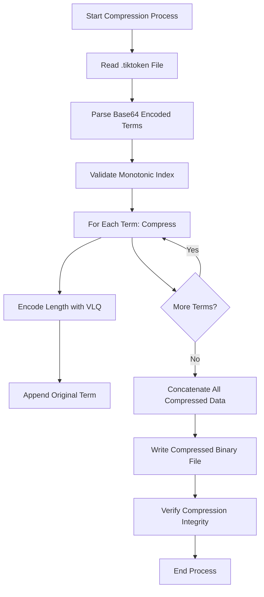
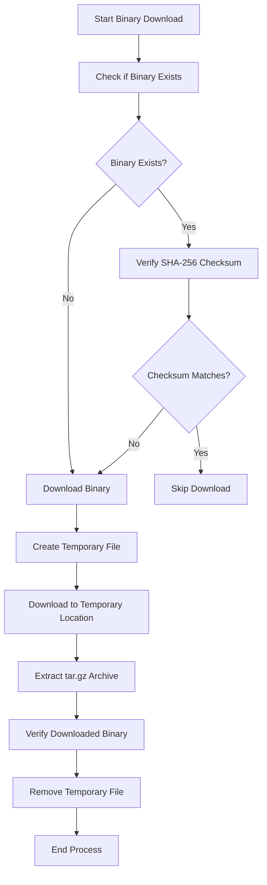
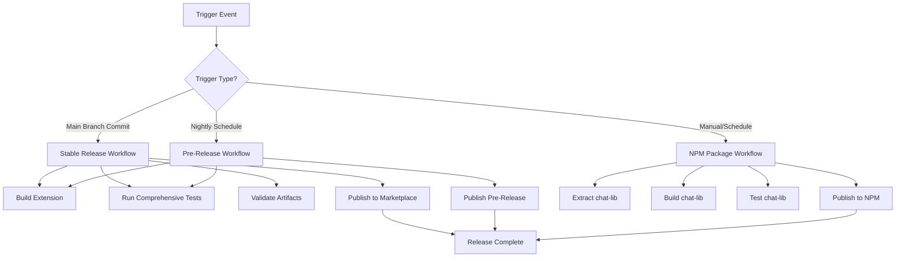

# Release Publication and Deployment

<cite>
**Referenced Files in This Document**   
- [package.json](file://package.json)
- [package-lock.json](file://package-lock.json)
- [compressTikToken.ts](file://script/build/compressTikToken.ts)
- [copyStaticAssets.ts](file://script/build/copyStaticAssets.ts)
- [downloadBinary.ts](file://script/build/downloadBinary.ts)
- [release.yml](file://build/release.yml)
- [pre-release.yml](file://build/pre-release.yml)
- [npm-package.yml](file://build/npm-package.yml)
- [update-assets.yml](file://build/update-assets.yml)
</cite>

## Table of Contents
1. [Introduction](#introduction)
2. [Build Automation and Asset Preparation](#build-automation-and-asset-preparation)
3. [Version Management and Validation](#version-management-and-validation)
4. [Packaging and Digital Signature Requirements](#packaging-and-digital-signature-requirements)
5. [Marketplace Submission Workflow](#marketplace-submission-workflow)
6. [Release Branching Strategy](#release-branching-strategy)
7. [Post-Publication Monitoring and User Feedback](#post-publication-monitoring-and-user-feedback)
8. [Hotfix Deployment and Emergency Patch Processes](#hotfix-deployment-and-emergency-patch-processes)
9. [Rollback Mechanisms](#rollback-mechanisms)
10. [Release Notes Generation](#release-notes-generation)

## Introduction
This document details the comprehensive release publication and deployment process for GitHub Copilot Chat, a VS Code extension that provides AI-powered chat features. The process encompasses build automation, version management, packaging, marketplace submission, release branching, post-publication monitoring, and emergency response procedures. The system is designed to ensure reliable, secure, and efficient delivery of new features and updates to users while maintaining high quality standards through automated testing and validation.

**Section sources**
- [package.json](file://package.json#L1-L800)
- [release.yml](file://build/release.yml#L1-L236)

## Build Automation and Asset Preparation
The build automation process for GitHub Copilot Chat is centered around the scripts in the `script/build/` directory, which handle asset compression, static file copying, and binary downloads. These scripts ensure that all necessary assets are properly prepared and optimized before packaging.

The `compressTikToken.ts` script compresses `.tiktoken` files into a more compact binary format by taking advantage of the monotonic increase in term lengths with their index. Each term is represented by a Variable Length Quantity (VLQ)-encoded length followed by the term itself. This compression reduces file size while maintaining the integrity of the tokenization data used by the AI models.

**Diagram sources**
- [compressTikToken.ts](file://script/build/compressTikToken.ts#L1-L77)

The `copyStaticAssets.ts` script handles the copying of static assets from source locations to the destination directory. It ensures that all necessary static files are properly transferred during the build process, maintaining the required directory structure for the extension.

The `downloadBinary.ts` script manages the downloading and verification of external binaries required by the extension. It includes functionality to:
- Download binaries from specified URLs
- Verify SHA-256 checksums to ensure integrity
- Extract tar.gz archives
- Compute and validate file hashes

**Diagram sources**
- [downloadBinary.ts](file://script/build/downloadBinary.ts#L1-L133)

These build scripts are integrated into the CI/CD pipeline through the Azure Pipelines configuration files, ensuring consistent execution across different environments.

**Section sources**
- [compressTikToken.ts](file://script/build/compressTikToken.ts#L1-L77)
- [copyStaticAssets.ts](file://script/build/copyStaticAssets.ts#L1-L19)
- [downloadBinary.ts](file://script/build/downloadBinary.ts#L1-L133)

## Version Management and Validation
Version management for GitHub Copilot Chat is handled through the `package.json` and `package-lock.json` files, which maintain synchronized version information across the project. The current version is defined in the `version` field of `package.json`, with the current release being 0.33.0.

The versioning system follows semantic versioning principles, with major, minor, and patch numbers indicating the significance of changes. The build process includes validation steps to ensure version consistency and integrity before release. The CI/CD pipeline automatically validates version numbers during the build process, preventing releases with inconsistent or invalid version information.

Version updates are typically performed through automated processes that modify both `package.json` and `package-lock.json` simultaneously to maintain consistency. The pipeline includes checks to verify that version numbers are properly formatted and that dependencies are compatible with the new version.

The version validation process includes:
- Checking for proper semantic versioning format
- Verifying consistency between `package.json` and `package-lock.json`
- Ensuring compatibility with specified engine requirements
- Validating that version increments follow established patterns

This comprehensive validation ensures that only properly versioned packages are released to the marketplace.

**Section sources**
- [package.json](file://package.json#L1-L800)
- [package-lock.json](file://package-lock.json#L1-L800)

## Packaging and Digital Signature Requirements
The packaging process for GitHub Copilot Chat is integrated into the Azure Pipelines CI/CD workflow, specifically in the `release.yml` and `pre-release.yml` configuration files. The process begins with dependency installation using `npm ci`, followed by a series of build steps that prepare the extension for packaging.

The build process includes several critical steps:
- Installing Node.js version 22.14.x as specified in the pipeline configuration
- Setting up authentication for GitHub distribution
- Restoring build cache to improve performance
- Setting up emsdk for WebAssembly compilation
- Running the mixin process to integrate external components
- Executing `npm run build` to compile the extension

Digital signature requirements are addressed through the use of secure authentication mechanisms and checksum verification. The pipeline uses Azure Key Vault to securely store and retrieve secrets, including the GitHub distribution password. Binary downloads are verified using SHA-256 checksums to ensure integrity and prevent tampering.

The packaging process also includes suppression of false positive strings in the built artifacts, specifically addressing strings from the ora package that might otherwise trigger security warnings. This is accomplished through the `vscePackageArgs: '--allow-package-secrets sendgrid'` parameter in the pipeline configuration.

The final package is created in the VSIX format, which is the standard packaging format for VS Code extensions. The package includes all necessary assets, compiled code, and metadata required for installation and execution within VS Code.

**Section sources**
- [release.yml](file://build/release.yml#L1-L236)
- [pre-release.yml](file://build/pre-release.yml#L1-L233)

## Marketplace Submission Workflow
The marketplace submission workflow for GitHub Copilot Chat is automated through Azure Pipelines, with different workflows for stable releases, pre-releases, and npm package publishing. The primary submission workflows are defined in `release.yml`, `pre-release.yml`, and `npm-package.yml`.

The stable release workflow (`release.yml`) is triggered by commits to the main branch and includes comprehensive testing and validation before publication. The workflow can be manually triggered with the "Publish Stable Extension" parameter to initiate a marketplace submission. Key steps in this workflow include:
- Building the extension with all necessary assets
- Running unit tests with `npm run test:unit`
- Executing simulation tests with `npm run simulate-ci`
- Running extension tests in VS Code using `xvfb-run -a npm run test:extension`
- Executing completions core tests
- Running sanity tests

The pre-release workflow (`pre-release.yml`) runs on a nightly schedule (Monday-Friday at 4:00 AM) and is designed to publish pre-release versions for testing and validation. This workflow is similar to the stable release but includes the `--prerelease` flag in the build command and is configured for standardized versioning.

The npm package workflow (`npm-package.yml`) handles the publication of the chat-lib component to npm. This workflow is triggered either by a schedule (daily at 7:00 AM) or manually with a specified version increment. It extracts the chat-lib component, builds it separately, and publishes it to npm with appropriate tagging.

All workflows include TSA (Team System Architecture) integration for service tree mapping and area path configuration, ensuring proper tracking and ownership within the development organization.

**Diagram sources**
- [release.yml](file://build/release.yml#L1-L236)
- [pre-release.yml](file://build/pre-release.yml#L1-L233)
- [npm-package.yml](file://build/npm-package.yml#L1-L88)

**Section sources**
- [release.yml](file://build/release.yml#L1-L236)
- [pre-release.yml](file://build/pre-release.yml#L1-L233)
- [npm-package.yml](file://build/npm-package.yml#L1-L88)

## Release Branching Strategy
The release branching strategy for GitHub Copilot Chat follows a trunk-based development model with the main branch serving as the primary development line. The strategy is designed to balance rapid development with stable releases, using automated workflows to manage the release process.

The main branch is protected with strict rules to ensure code quality and stability:
- All changes must be submitted through pull requests
- Pull requests require approval from designated reviewers
- Automated tests must pass before merging
- CI/CD pipelines must complete successfully

Release candidates are created automatically through the pre-release workflow, which runs nightly on weekdays. These pre-releases serve as release candidates that can be tested and validated before promoting to stable release. The pre-release workflow generates versions with prerelease identifiers, allowing users to opt into early access versions while maintaining a stable production version.

The branching strategy does not use long-lived feature branches or release branches. Instead, all development occurs directly on the main branch, with features being developed behind feature flags when necessary. This approach enables continuous integration and reduces merge conflicts.

Hotfixes follow the same process as regular development, with fixes being committed directly to the main branch and released through the automated pre-release and stable release workflows. This ensures that fixes are delivered quickly while maintaining the integrity of the release process.

The strategy emphasizes automation and continuous delivery, with the goal of reducing the time between code completion and user availability while maintaining high quality standards.

**Section sources**
- [release.yml](file://build/release.yml#L1-L236)
- [pre-release.yml](file://build/pre-release.yml#L1-L233)

## Post-Publication Monitoring and User Feedback
Post-publication monitoring for GitHub Copilot Chat is integrated into the development and operations workflow, leveraging both automated systems and user feedback mechanisms. The monitoring process begins immediately after publication and continues throughout the lifecycle of each release.

Automated monitoring is implemented through the TSA (Team System Architecture) integration in the CI/CD pipelines, which tracks service health and performance metrics. The area path "Visual Studio Code Copilot Extensions" and service tree ID are configured in the pipeline to ensure proper telemetry collection and alerting.

User feedback is collected through multiple channels:
- In-product feedback mechanisms within the VS Code extension
- GitHub issues and discussions
- Direct user reports and support requests
- Usage telemetry and error reporting

The feedback collection process is designed to identify both functional issues and user experience improvements. Critical errors and crashes are automatically reported and prioritized for immediate attention. Feature requests and usability feedback are collected and analyzed to inform future development priorities.

Monitoring also includes tracking of installation rates, activation rates, and usage patterns to understand how users are engaging with the extension. This data helps identify potential issues with the release and provides insights into feature adoption.

The post-publication monitoring process is supported by comprehensive logging and diagnostics, including:
- Application insights for performance monitoring
- Error reporting for exception tracking
- Usage telemetry for feature adoption analysis
- Diagnostic logs for troubleshooting

This multi-faceted approach ensures that issues are identified quickly and that user feedback is incorporated into the development process.

**Section sources**
- [release.yml](file://build/release.yml#L1-L236)
- [pre-release.yml](file://build/pre-release.yml#L1-L233)

## Hotfix Deployment and Emergency Patch Processes
The hotfix deployment and emergency patch processes for GitHub Copilot Chat are designed to enable rapid response to critical issues while maintaining the integrity of the release process. The system leverages the existing CI/CD infrastructure to ensure consistent and reliable deployment of fixes.

Hotfixes follow the same development workflow as regular changes, with fixes being committed directly to the main branch. The key difference is in the prioritization and expedited review process for critical issues. When a critical issue is identified, the development team can:
- Bypass normal review queues for immediate attention
- Expedite testing and validation
- Trigger immediate pre-release publication for validation
- Accelerate the promotion to stable release

The emergency patch process is activated for severe issues that require immediate resolution, such as security vulnerabilities or critical functionality failures. This process includes:
- Immediate notification of the development team
- Rapid development and testing of the fix
- Expedited review and approval
- Immediate deployment through the pre-release workflow
- Rapid validation and promotion to stable release

The process is supported by the automated testing infrastructure, which ensures that hotfixes do not introduce new issues. All hotfixes undergo the same unit, integration, and simulation tests as regular releases, with additional targeted testing for the specific issue being addressed.

The emergency patch process also includes communication protocols to inform users of the issue and the availability of the fix. This may include:
- Release notes highlighting the critical fix
- In-product notifications
- Documentation updates
- Support team alerts

This approach balances the need for rapid response with the requirement for quality and stability, ensuring that fixes are delivered quickly without compromising the overall reliability of the extension.

**Section sources**
- [release.yml](file://build/release.yml#L1-L236)
- [pre-release.yml](file://build/pre-release.yml#L1-L233)

## Rollback Mechanisms
The rollback mechanisms for GitHub Copilot Chat are designed to provide recovery options in case of critical issues with a release. While the primary strategy is to deploy fixes rather than roll back, rollback options are available when necessary.

The rollback process leverages the versioning system and marketplace infrastructure to allow users to revert to previous versions if needed. Key components of the rollback mechanism include:

1. **Version Retention**: Previous versions of the extension are retained in the marketplace, allowing users to manually install older versions if necessary.

2. **Automated Downgrade Prevention**: The system is designed to prevent automatic downgrades, ensuring that users are not unexpectedly reverted to older versions.

3. **Emergency Rollback Procedure**: In extreme cases where a release must be withdrawn, the team can:
   - Temporarily unpublish the problematic version from the marketplace
   - Communicate the issue and rollback instructions to users
   - Deploy a fixed version as quickly as possible
   - Republish the fixed version to the marketplace

4. **User-Controlled Rollback**: Users can manually install previous versions through the VS Code extensions marketplace interface, providing a self-service option for rollback.

The rollback strategy prioritizes deploying fixes over rolling back, as rolling back can disrupt users who have already adapted to new features. However, the option to rollback is maintained as a safety measure for critical issues that cannot be quickly resolved with a patch.

The effectiveness of the rollback mechanisms is regularly tested through disaster recovery exercises, ensuring that the team can execute a rollback if necessary.

**Section sources**
- [package.json](file://package.json#L1-L800)
- [release.yml](file://build/release.yml#L1-L236)

## Release Notes Generation
Release notes for GitHub Copilot Chat are generated from commit messages and verified before publication. The process is integrated into the CI/CD workflow, ensuring that release notes are accurate and comprehensive.

The release notes generation process includes:
1. **Commit Message Analysis**: The system analyzes commit messages from the changes included in the release, extracting key information about new features, improvements, and bug fixes.

2. **Categorization**: Changes are categorized into appropriate sections such as "New Features," "Improvements," and "Bug Fixes" based on commit message content and metadata.

3. **Verification**: The generated release notes are verified by the development team to ensure accuracy and completeness. This includes:
   - Confirming that all significant changes are included
   - Ensuring that technical details are correctly represented
   - Verifying that user-facing impacts are clearly explained
   - Checking for consistency in style and formatting

4. **Publication**: Verified release notes are published alongside the extension in the marketplace, providing users with clear information about the changes in each release.

The process is designed to be automated while maintaining human oversight to ensure quality. The release notes serve as an important communication tool, helping users understand the value of each update and how it may affect their workflow.

For pre-releases, release notes are generated in the same way but may include additional information about experimental features or known issues. This transparency helps users understand the nature of pre-release versions and manage their expectations accordingly.

**Section sources**
- [release.yml](file://build/release.yml#L1-L236)
- [pre-release.yml](file://build/pre-release.yml#L1-L233)