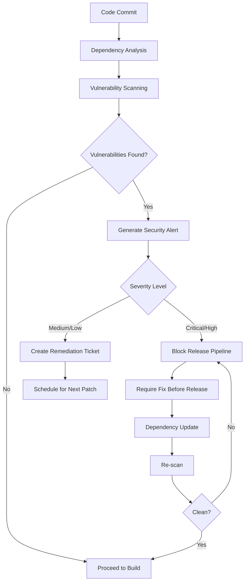
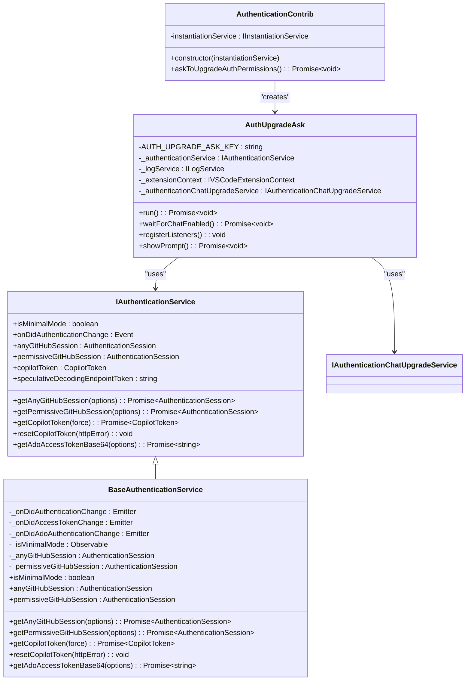

# Security Review Process

<cite>
**Referenced Files in This Document**   
- [SECURITY.md](file://SECURITY.md)
- [package.json](file://package.json)
- [package-lock.json](file://package-lock.json)
- [src/extension/authentication/vscode-node/authentication.contribution.ts](file://src/extension/authentication/vscode-node/authentication.contribution.ts)
- [src/platform/authentication/common/authentication.ts](file://src/platform/authentication/common/authentication.ts)
- [src/platform/authentication/common/copilotTokenStore.ts](file://src/platform/authentication/common/copilotTokenStore.ts)
</cite>

## Table of Contents
1. [Introduction](#introduction)
2. [Security Policies and Vulnerability Disclosure](#security-policies-and-vulnerability-disclosure)
3. [Security Testing and Penetration Testing](#security-testing-and-penetration-testing)
4. [Dependency Management and Vulnerability Scanning](#dependency-management-and-vulnerability-scanning)
5. [Authentication Mechanism Review](#authentication-mechanism-review)
6. [Data Privacy and Secure Coding Practices](#data-privacy-and-secure-coding-practices)
7. [Security Approval Workflow](#security-approval-workflow)
8. [Incident Response and Security Patch Management](#incident-response-and-security-patch-management)

## Introduction
This document outlines the comprehensive security review process for GitHub Copilot Chat releases. The security framework integrates multiple layers of protection, including vulnerability management, dependency monitoring, authentication controls, and secure development practices. The process ensures that each release meets Microsoft's stringent security standards before deployment to users. The security review is integrated throughout the development lifecycle, from initial design to final release, with specific checkpoints and validation requirements at each stage.

## Security Policies and Vulnerability Disclosure
The GitHub Copilot Chat project adheres to Microsoft's security policies as outlined in the SECURITY.md file. The policy emphasizes responsible vulnerability disclosure and provides clear guidance for reporting security issues. Public GitHub issues are explicitly prohibited for security vulnerability reporting to prevent exposure of potential security weaknesses.

The security policy directs researchers and users to Microsoft's centralized security reporting system at [https://aka.ms/SECURITY.md](https://aka.ms/SECURITY.md) for all security-related concerns. This centralized approach ensures that vulnerability reports are handled by dedicated security personnel with appropriate expertise and follow established incident response protocols. The policy applies to all source code repositories within Microsoft's GitHub organizations, establishing a consistent security posture across projects.

**Section sources**
- [SECURITY.md](file://SECURITY.md#L1-L14)

## Security Testing and Penetration Testing
Before major releases, GitHub Copilot Chat undergoes rigorous security testing procedures to identify and remediate potential vulnerabilities. The testing framework includes both automated and manual testing methodologies, with a particular focus on penetration testing for critical functionality.

The security testing process includes comprehensive code reviews with emphasis on secure coding practices, input validation, and error handling. Automated security scanning tools are integrated into the development pipeline to detect common vulnerabilities such as injection flaws, cross-site scripting, and insecure direct object references. Penetration testing is conducted by security specialists who simulate real-world attack scenarios to evaluate the resilience of the application against sophisticated threats.

Testing specifically targets the AI-powered features of Copilot Chat, examining potential prompt injection vulnerabilities, data leakage risks, and unauthorized access to sensitive information. The testing methodology also evaluates the security of the communication channels between the extension and backend services, ensuring encryption and proper authentication mechanisms are in place.

**Section sources**
- [src/extension/authentication/vscode-node/authentication.contribution.ts](file://src/extension/authentication/vscode-node/authentication.contribution.ts#L1-L110)
- [src/platform/authentication/common/authentication.ts](file://src/platform/authentication/common/authentication.ts#L1-L200)

## Dependency Management and Vulnerability Scanning
The project maintains strict controls over dependencies through the package.json and package-lock.json files, which define both direct and transitive dependencies. The dependency management process includes automated scanning for known vulnerabilities using industry-standard tools integrated into the continuous integration pipeline.

The package.json file lists essential dependencies including authentication libraries, AI SDKs, and development tools, while the package-lock.json file provides a detailed snapshot of all installed packages with their exact versions and integrity checksums. This deterministic dependency resolution prevents supply chain attacks through dependency confusion or version drift.

Automated vulnerability scanning runs on every code commit, checking dependencies against public vulnerability databases such as the National Vulnerability Database (NVD). When vulnerabilities are detected, the system generates alerts and blocks the release pipeline until the issues are resolved. Critical and high-severity vulnerabilities require immediate attention and must be addressed before any release can proceed.

The project follows a regular dependency update schedule, with security patches prioritized over feature updates. Dependencies are reviewed quarterly to ensure they are actively maintained and continue to meet security requirements. Outdated or abandoned libraries are replaced with more secure alternatives when possible.

**Diagram sources**
- [package.json](file://package.json#L1-L800)
- [package-lock.json](file://package-lock.json#L1-L200)

**Section sources**
- [package.json](file://package.json#L1-L800)
- [package-lock.json](file://package-lock.json#L1-L200)

## Authentication Mechanism Review
The authentication system for GitHub Copilot Chat implements a multi-layered approach to ensure secure access to the service. The architecture is designed around OAuth 2.0 principles, with careful management of authentication scopes and token lifecycles.

The authentication process begins with the AuthenticationContrib class, which serves as the main entry point for authentication functionality. This component manages the authentication lifecycle, including token acquisition, renewal, and permission upgrades. The system distinguishes between minimal and permissive authentication modes, with the latter required for full chat functionality.

Key security features of the authentication system include:
- Scope-based permissions with GITHUB_SCOPE_ALIGNED providing read:user, user:email, repo, and workflow access
- Token validation and refresh mechanisms to prevent expired token usage
- Event-driven authentication change detection to respond immediately to security events
- Permissive session management for elevated privileges when needed

The system implements a permission upgrade workflow that prompts users to grant additional scopes when required for specific functionality. This ensures least-privilege access while maintaining usability. Authentication sessions are monitored for changes, and the system responds to logout events or token revocation by clearing cached credentials and notifying dependent components.

**Diagram sources**
- [src/extension/authentication/vscode-node/authentication.contribution.ts](file://src/extension/authentication/vscode-node/authentication.contribution.ts#L1-L110)
- [src/platform/authentication/common/authentication.ts](file://src/platform/authentication/common/authentication.ts#L1-L200)

**Section sources**
- [src/extension/authentication/vscode-node/authentication.contribution.ts](file://src/extension/authentication/vscode-node/authentication.contribution.ts#L1-L110)
- [src/platform/authentication/common/authentication.ts](file://src/platform/authentication/common/authentication.ts#L1-L200)

## Data Privacy and Secure Coding Practices
GitHub Copilot Chat implements comprehensive data privacy protections and adheres to secure coding practices throughout its codebase. The extension respects user privacy by minimizing data collection and ensuring that code snippets are not used to train models for other users.

The secure coding practices include:
- Input validation and sanitization for all user-provided data
- Proper error handling that avoids information leakage
- Secure storage of authentication tokens and sensitive information
- Protection against common web vulnerabilities such as XSS and CSRF
- Code signing and integrity verification for all distributed components

Data privacy controls are implemented at multiple levels, from the user interface to backend services. The extension clearly communicates what data is collected and how it is used, complying with Microsoft's privacy statement. User consent is obtained before collecting any usage data, and users can disable telemetry reporting through VS Code settings.

The codebase follows TypeScript best practices with strict type checking and null safety to prevent common programming errors that could lead to security vulnerabilities. Security-critical functions are thoroughly documented and reviewed, with particular attention to authentication, authorization, and data handling logic.

**Section sources**
- [README.md](file://README.md#L54-L59)

## Security Approval Workflow
The security approval workflow for GitHub Copilot Chat releases involves multiple stakeholders and validation steps before a release can be approved. The process ensures that all security requirements are met and that any identified issues have been properly addressed.

The workflow begins with automated security checks in the CI/CD pipeline, including static code analysis, dependency scanning, and security testing. These automated checks serve as the first gate, preventing releases with known vulnerabilities from progressing.

For major releases, a formal security review is conducted by the security team, which examines the changes, test results, and risk assessment. The review includes verification of penetration testing results, validation of security fixes, and confirmation that all security requirements have been met.

Required sign-offs from security stakeholders are documented in the release process, with each approver verifying specific aspects of the security posture. The approval process is tracked in the project management system, providing an audit trail of all security decisions and validations.

The workflow also includes a final security checklist that confirms:
- All critical and high-severity vulnerabilities have been resolved
- Security testing has been completed and documented
- Authentication and authorization controls are functioning correctly
- Data privacy protections are in place
- Incident response procedures are updated for the new release

**Section sources**
- [SECURITY.md](file://SECURITY.md#L1-L14)
- [package.json](file://package.json#L1-L800)

## Incident Response and Security Patch Management
The incident response preparation for GitHub Copilot Chat includes comprehensive procedures for detecting, responding to, and recovering from security incidents. These procedures are validated before each release to ensure readiness for potential security events.

The incident response plan includes:
- 24/7 monitoring of security alerts and anomaly detection
- Clear escalation paths and communication protocols
- Forensic investigation procedures for security breaches
- User notification processes for data incidents
- Coordination with Microsoft's central security response team

Security patches are prioritized in the release schedule based on severity and potential impact. Critical vulnerabilities receive immediate attention with emergency patch releases as needed. The patch management process includes:
- Rapid assessment of vulnerability severity and exploitability
- Development and testing of fixes in isolated environments
- Coordinated disclosure with affected parties
- Deployment through the standard update mechanism
- Post-mortem analysis and prevention measures

The system is designed for rapid patch deployment, with security updates distributed through VS Code's extension marketplace. Users are encouraged to keep the extension updated to ensure they have the latest security fixes, as stated in the README documentation.

**Section sources**
- [README.md](file://README.md#L60-L61)
- [SECURITY.md](file://SECURITY.md#L1-L14)