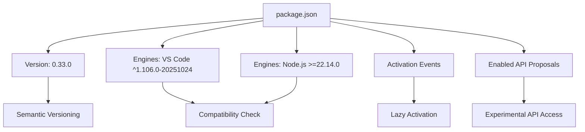
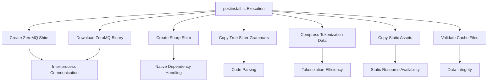
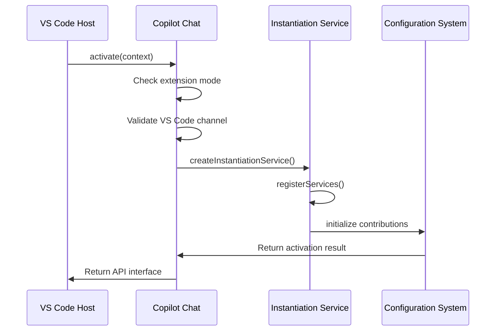
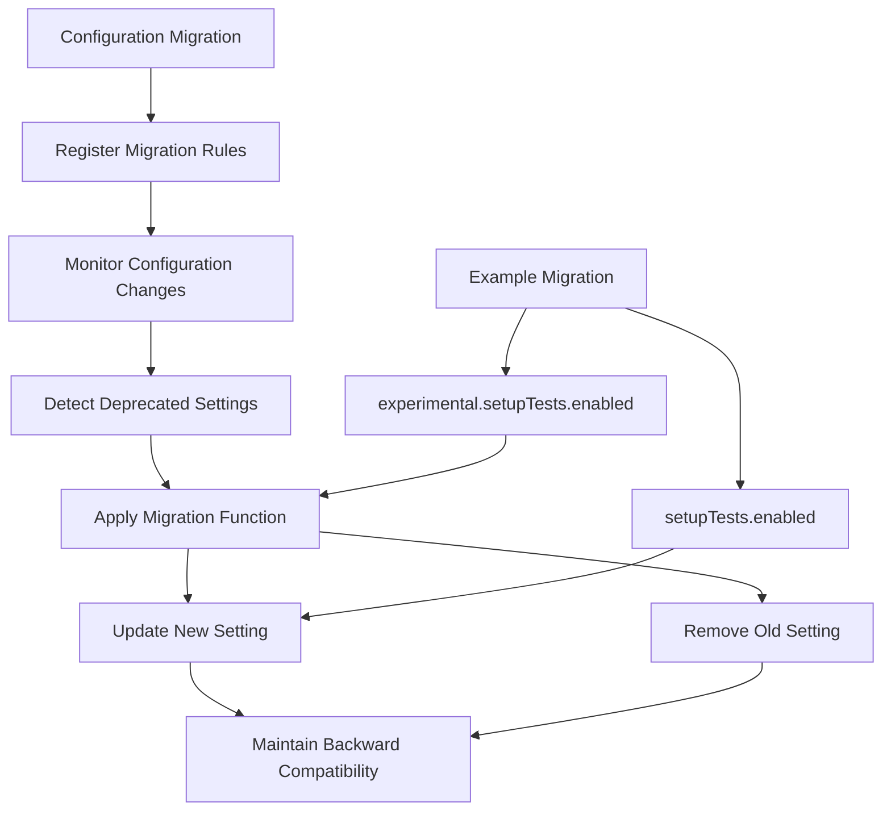

# Update Mechanism

<cite>
**Referenced Files in This Document**   
- [package.json](file://package.json)
- [script/postinstall.ts](file://script/postinstall.ts)
- [src/extension/configuration/vscode-node/configurationMigration.ts](file://src/extension/configuration/vscode-node/configurationMigration.ts)
- [src/extension/extension/vscode/extension.ts](file://src/extension/extension/vscode/extension.ts)
- [src/extension/extension/vscode-node/extension.ts](file://src/extension/extension/vscode-node/extension.ts)
- [src/platform/telemetry/common/telemetry.ts](file://src/platform/telemetry/common/telemetry.ts)
</cite>

## Table of Contents
1. [Introduction](#introduction)
2. [Update Distribution via VS Code Marketplace](#update-distribution-via-vs-code-marketplace)
3. [Update Metadata in package.json](#update-metadata-in-packagejson)
4. [Post-Installation Setup with postinstall.ts](#post-installation-setup-with-postinstallts)
5. [Extension Activation and Initialization](#extension-activation-and-initialization)
6. [Configuration Migration and Backward Compatibility](#configuration-migration-and-backward-compatibility)
7. [Telemetry Collection for Update Experience](#telemetry-collection-for-update-experience)
8. [Best Practices for Update Management](#best-practices-for-update-management)
9. [Troubleshooting Update Failures](#troubleshooting-update-failures)

## Introduction
The GitHub Copilot Chat extension employs a comprehensive update mechanism that ensures seamless delivery of new features, bug fixes, and improvements to users through the VS Code marketplace. This document details the complete update lifecycle, from distribution and installation to post-update configuration management and telemetry collection. The system is designed to maintain backward compatibility while enabling smooth transitions between versions, with robust mechanisms for configuration migration, deprecation handling, and user experience optimization.

## Update Distribution via VS Code Marketplace
GitHub Copilot Chat updates are distributed through the official VS Code marketplace, following Microsoft's standard extension update workflow. When a new version is published, VS Code automatically detects the update and prompts users to install it. The update process is managed by VS Code's extension host, which handles downloading the new extension package, validating its integrity, and replacing the previous version. Users can also manually check for updates through the Extensions view in VS Code, where they can see release notes and update history. The marketplace integration ensures that all users receive updates securely and consistently, with automatic rollback capabilities in case of installation failures.

**Section sources**
- [package.json](file://package.json)

## Update Metadata in package.json
The package.json file contains critical metadata that defines update behavior and compatibility requirements for the GitHub Copilot Chat extension. Key fields include the version number (e.g., "0.33.0"), which follows semantic versioning to indicate the nature of changes (major, minor, or patch). The engines field specifies the minimum required VS Code version ("^1.106.0-20251024") and Node.js runtime (">=22.14.0"), ensuring compatibility with the host environment. The activationEvents array defines when the extension should be activated, optimizing performance by loading only when needed. Additionally, the enabledApiProposals field lists experimental VS Code APIs that the extension depends on, allowing for forward compatibility with upcoming VS Code features while maintaining stability.

**Diagram sources**
- [package.json](file://package.json#L1-L800)

**Section sources**
- [package.json](file://package.json#L1-L800)

## Post-Installation Setup with postinstall.ts
The postinstall.ts script executes critical setup tasks after extension installation or update, ensuring proper configuration and dependency initialization. This script performs several key operations: it downloads and configures ZeroMQ for inter-process communication, creates shims for native dependencies like Sharp to avoid distribution issues, and copies static assets such as Tree Sitter grammar files to the distribution directory. The script also validates the presence of essential cache files and handles the compression of tokenization data. These post-installation steps are crucial for maintaining the extension's functionality across different operating systems and ensuring that all required components are properly initialized before the extension becomes active.

**Diagram sources**
- [script/postinstall.ts](file://script/postinstall.ts#L1-L206)

**Section sources**
- [script/postinstall.ts](file://script/postinstall.ts#L1-L206)

## Extension Activation and Initialization
The extension activation process is designed to handle version transitions gracefully while ensuring proper initialization of all components. The baseActivate function in extension.ts serves as the central entry point, coordinating the setup of services, contributions, and configuration. During activation, the system checks whether the extension is running in a pre-release version of VS Code and prevents activation if there's a mismatch with the stable channel. The instantiation service creates and initializes all required components, including telemetry, logging, and experimentation services. Configuration is handled through a modular system that allows for dynamic registration of contributions, ensuring that new features can be added without disrupting existing functionality. This structured activation process enables smooth version transitions and maintains system stability during updates.

**Diagram sources**
- [src/extension/extension/vscode/extension.ts](file://src/extension/extension/vscode/extension.ts#L1-L113)
- [src/extension/extension/vscode-node/extension.ts](file://src/extension/extension/vscode-node/extension.ts#L1-L44)

**Section sources**
- [src/extension/extension/vscode/extension.ts](file://src/extension/extension/vscode/extension.ts#L1-L113)
- [src/extension/extension/vscode-node/extension.ts](file://src/extension/extension/vscode-node/extension.ts#L1-L44)

## Configuration Migration and Backward Compatibility
The configuration migration system ensures backward compatibility when updating the extension by automatically handling changes to configuration settings. The configurationMigration.ts file implements a registry-based system that defines migration rules for deprecated or renamed settings. When the extension activates, it checks for existing configuration values and applies the appropriate transformations, such as moving settings from experimental namespaces to stable ones. For example, settings under "github.copilot.chat.experimental" are migrated to their non-experimental counterparts while the old values are removed. This approach allows the development team to refactor configuration schemas without breaking existing user setups. The system also supports asynchronous migration functions, enabling complex transformations that may require external data or user input.

**Diagram sources**
- [src/extension/configuration/vscode-node/configurationMigration.ts](file://src/extension/configuration/vscode-node/configurationMigration.ts#L1-L206)

**Section sources**
- [src/extension/configuration/vscode-node/configurationMigration.ts](file://src/extension/configuration/vscode-node/configurationMigration.ts#L1-L206)

## Telemetry Collection for Update Experience
The extension collects comprehensive telemetry data to monitor and improve the update experience. The telemetry system tracks key metrics such as installation success rates, activation times, and error occurrences during the update process. This data is used to identify common failure points, measure the impact of changes, and prioritize improvements. The system also collects information about user interactions with update notifications and release notes, helping the team understand how users engage with new features. All telemetry data is anonymized and aggregated to protect user privacy while providing valuable insights into the real-world performance of the update mechanism. This feedback loop enables continuous optimization of the update process based on actual usage patterns and issues encountered by users.

**Section sources**
- [src/platform/telemetry/common/telemetry.ts](file://src/platform/telemetry/common/telemetry.ts)

## Best Practices for Update Management
To ensure optimal performance and reliability, users should follow several best practices for managing GitHub Copilot Chat updates. First, keep VS Code updated to the latest stable version to maintain compatibility with the extension. Regularly check for updates and install them promptly to benefit from the latest features and security fixes. Before updating, ensure that your development environment meets the minimum requirements specified in the release notes. After updates, restart VS Code to ensure all components are properly initialized. For enterprise deployments, consider testing updates in a staging environment before rolling them out to production. Finally, monitor the extension's status indicator to verify that it's functioning correctly after updates.

## Troubleshooting Update Failures
When update failures occur, several diagnostic steps can help resolve the issue. First, check the VS Code developer console for error messages related to the extension installation. Verify that your network connection allows downloads from the VS Code marketplace and associated CDNs. Clear the VS Code extension cache if the installation appears corrupted. Check that your system meets the minimum requirements for Node.js and other dependencies. If the postinstall script fails, ensure that command-line tools like git are available in your PATH. For persistent issues, temporarily disable other extensions to rule out conflicts, and consult the extension's GitHub repository for known issues and workarounds. The telemetry system automatically reports installation failures, helping the development team address common problems in future updates.